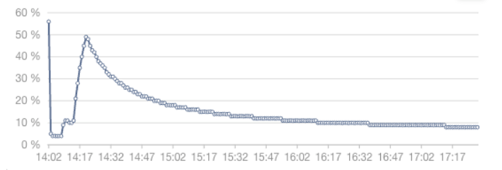
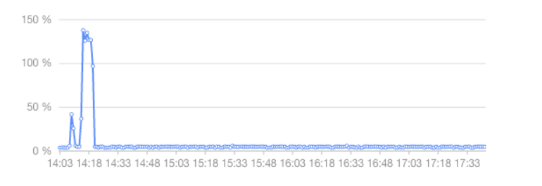

## 简介

在 Linux 命令行使用 `top` 命令可以动态看到该服务器上一些硬件指标，包括 CPU，一般可以通过查看某个进程的 cpu 利用率分析服务。cpu 利用率以百分比的形式展现，可以比较直观地看出服务 cpu 的使用情况。

在容器、K8S 环境下，一般以 cpu 使用量来计量，比如一台服务器是 16 核，那么可以分配 4 核给该容器或者 pod，这个 4 核就是 cpu 使用量。

cpu 使用率和 cpu 使用量可以通过换算得出，下面详细阐述这两者的区别以及计算原理。

## CPU 使用率

### 实验分析

现通过一个简单的示例，看看 cpu 使用率是如何计算的

> 当前服务器有 8 核 CPU
>

```go
package main

import (
	"runtime"
)

func infiniteLoop() {
	for {
		// 空操作
	}
}

func main() {
	// 设置使用的最大 CPU 核数为系统的核数
	runtime.GOMAXPROCS(runtime.NumCPU())

	// 启动 8 个 Goroutine
	for i := 0; i < 8; i++ {
		go infiniteLoop()
	}

	// 防止主 Goroutine 退出
	select {}
}
```

该 Go 程序开启 8 个协程都执行一个死循环，执行后通过 `top` 命令查看：

```go
   PID USER      PR  NI    VIRT    RES    SHR S  %CPU %MEM     TIME+ COMMAND                                                                                              
775089 root      20   0  710324    704    324 R 767.4  0.0  15:38.05 test-cpu
```

可以发现 **test-cpu** 程序 cpu 利用率接近 `800%`，再在 `top` 命令基础上输入 `1` 查看每个核心的使用率：

```go
top - 13:22:50 up 33 days, 20:45,  2 users,  load average: 14.04, 8.19, 4.19
Tasks: 386 total,   3 running, 383 sleeping,   0 stopped,   0 zombie
%Cpu0  : 97.7 us,  2.0 sy,  0.0 ni,  0.0 id,  0.0 wa,  0.0 hi,  0.3 si,  0.0 st
%Cpu1  : 98.0 us,  1.7 sy,  0.0 ni,  0.0 id,  0.0 wa,  0.0 hi,  0.3 si,  0.0 st
%Cpu2  : 98.3 us,  1.7 sy,  0.0 ni,  0.0 id,  0.0 wa,  0.0 hi,  0.0 si,  0.0 st
%Cpu3  : 98.0 us,  1.3 sy,  0.0 ni,  0.3 id,  0.0 wa,  0.0 hi,  0.0 si,  0.3 st
%Cpu4  : 98.7 us,  1.0 sy,  0.0 ni,  0.0 id,  0.0 wa,  0.0 hi,  0.3 si,  0.0 st
%Cpu5  : 98.0 us,  2.0 sy,  0.0 ni,  0.0 id,  0.0 wa,  0.0 hi,  0.0 si,  0.0 st
%Cpu6  : 98.3 us,  1.7 sy,  0.0 ni,  0.0 id,  0.0 wa,  0.0 hi,  0.0 si,  0.0 st
%Cpu7  : 99.7 us,  0.3 sy,  0.0 ni,  0.0 id,  0.0 wa,  0.0 hi,  0.0 si,  0.0 st
```

同样 8 个核心都被占满，所以当 cpu 利用率超过 100% 的时候有的时候并不是不正常的现象，只是该程序使用了多核 cpu。

也就是说利用率达到 800%，说明该程序这段时间使用了 8 核 cpu，且每核都占满。

接下来我们调整上述 Go 程序，开启 9 个协程并运行程序，通过 `top` 命令查看：

```go
   PID USER      PR  NI    VIRT    RES    SHR S  %CPU %MEM     TIME+ COMMAND                                                                                              
786713 root      20   0  710324    700    324 R 762.6  0.0   7:58.83 test-cpu    
```

同样发现只占用了 800%，因为该服务器只有 8 核 cpu，说明 CPU 申请是可以超分的。

### 如何计算 CPU 使用率

以下摘录自 `man top` 命令中对于 CPU 使用率的定义，总结来说某个进程的 CPU 使用率就是这个进程在一段时间内占用的 CPU 时间占总的 CPU 时间的百分比。

比如某个开启多线程的进程 1s 内占用了 CPU0 0.6s，CPU1 0.9s，那么它的占用率是 150%。这样也对应了上述实验占用 800% 的现象，也就是 1s 内，该进程占用 8 个 CPU 1s。

```
 %CPU  --  CPU Usage
           The task's share of the elapsed CPU time since the last screen update, expressed as a percentage of total CPU time.

           In a true SMP environment, if a process is multi-threaded and top is not operating in Threads mode, amounts greater than 100% may be reported.  You toggle     
           Threads mode with the `H' interactive command.

           Also  for multi-processor environments, if Irix mode is Off, top will operate in Solaris mode where a task's cpu usage will be divided by the total number     
           of CPUs.  You toggle Irix/Solaris modes with the `I' interactive command.
```

CPU 运行程序是通过 linux 调度器不断分配**时间片**给程序使用，要计算 CPU 使用率，首先得获取程序占用 CPU 的时间片以及 CPU 总时间片。

这些指标保存在 linux 的 `/proc/<pid>/stat` 文件下，该文件下的值有 Linux 内核维护，并且每次时钟中断中都会更新该文件数据。

> 某进程 cpu 使用率 = 该进程 cpu 时间 / 总 cpu 时间
>

```bash
$ cat /proc/775089/stat
775089 (test-cpu) R 755220 873742 755220 34816 873742 4202496 357 0 0 0 21689 24 0 0 20 0 9 0 293018282 727371776 178 18446744073709551615 4194304 4557397 140721608129776 824633783168 4557280 0 0 0 2143420159 18446744073709551615 0 0 17 7 0 0 0 0 0 4980736 4994144 37756928 140721608136267 140721608136278 140721608136278 140721608138733 0 
```

第 14 项代表 `utime` 和第 15 项代表 `stime` 分别表示 **test-cpu** 进程自启动起来，执行**用户代码态**占用的时间和**执行内核态代码**占用的时间，单位是**clock tick**，**clock tick** 是时间单位。

以下摘录于 `man proc` 命令：

```bash
utime %lu   (14) Amount of time that this process has been scheduled in user mode, measured in clock  ticks  (divide  by  sysconf(_SC_CLK_TCK)).   This     
                          includes  guest  time,  guest_time (time spent running a virtual CPU, see below), so that applications that are not aware of the guest time     
                          field do not lose that time from their calculations.

stime %lu   (15) Amount of time that this process has been scheduled in kernel mode, measured in clock ticks (divide by sysconf(_SC_CLK_TCK)).
```

`utime` 和 `stime` 都已 **clock tick** 作为时间单位，那么每个 **clock tick** 占用多少时间呢？通过 `sysconf(_SC_CLK_TCK)` 获取 1 秒内有多少个 **clock tick**（通常是100）。也就是说 `1 clock tick` 为 `1 / 100` 秒。

可以通过每隔周期时间来读取 `/proc/775089/stat`，解析其中的 `utime，stime`，并求和 ( `utime + stime` )，减去上一次采样时这两项的和 ( `last_utime + last_stime` )，这就是这个周期内该进程占用 CPU 的时间，单位为 **clock tick**。

然后 CPU 总时间为 `period * sysconf(_SC_CLK_TCK)` ，单位为 **clock tick，period** 表示一个采样周期，单位为 **s**。

那么 CPU 使用率详细公式即如下：

```bash
某进程cpu使用率 = ((utime+stime) - (last_utime + last_stime)) / (period * sysconf(_SC_CLK_TCK))
```

所以说要计算进程的 CPU 利用率，就需要一段时间内的数据，然而 `/proc/<pid/stat` 文件下存的是该进程自启动以来所使用 CPU 占用时间数据，呈递增趋势。`top` 命令默认 **3s** 返回一次数据，也就是通过 `top` 命令默认查看到的 CPU 利用率是执行 `top` 命令时刻到前 3s 的使用率。

> `top` 命令默认会将一个周期前的历史数据保存在内存中，为了下个周期计算
>

通过该公式计算上述实验 **test-cpu** 进程 CPU 使用率

分别获取 **test-cpu** 3s 内的初始数据和结束数据：

```bash
$ cat /proc/980412/stat; echo "wait 3s.....";sleep 3 ; cat /proc/980412/stat
# 初始数据
980412 (test-cpu) R 755220 980412 755220 34816 980412 4202496 362 0 0 0 140116 177 0 0 20 0 9 0 293495521 727109632 175 18446744073709551615 4194304 4557397 140722015494448 824633783168 4557280 0 0 0 2143420159 18446744073709551615 0 0 17 6 0 0 0 0 0 4980736 4994144 34099200 140722015495755 140722015495766 140722015495766 140722015498221 
0
wait 3s.....
# 结束数据
980412 (test-cpu) R 755220 980412 755220 34816 980412 4202496 362 0 0 0 142396 180 0 0 20 0 9 0 293495521 727109632 175 18446744073709551615 4194304 4557397 140722015494448 824633783168 4557280 0 0 0 2143420159 18446744073709551615 0 0 17 6 0 0 0 0 0 4980736 4994144 34099200 140722015495755 140722015495766 140722015495766 140722015498221 
0
```

已知 **period = 3s，clock tick = 100**，根据上述数据得到以下数据：

**utime：142396**

**stime：180**

**last_utime：140116**

**last_stime：177**

以上数据单位都是 **clock tick**

```bash

cpu_util(test-cpu) = ((142.396+ 0.180) - (140.116+ 0.177)) / (3 * 100) = 7.61 = 761%
```

可以发现计算后的 CPU 利用率与 `top` 命令展示的数据几乎一致。

到这里基本就把 CPU 利用率的计算原理以及 top 原理阐述清楚了。

## top 与 ps

### 计算原理

`top` 命令默认每 **3s** 刷新一次数据，也就是说 `top` 命令是采样最近 3s 的数据再计算，可以通过 `-d` 来控制间隔；

同样 `ps aux` 命令是立即返回数据，通过 `ps aux | grep pid` 获取进程的数据

```bash
$ ps aux | grep 980412
USER       PID   %CPU %MEM  VSZ    RSS TTY      STAT START  TIME   COMMAND
root     980412  759  0.0 710068   700 pts/0    Rl+  15:53 406:09 ./test-cpu
```

可以发现 `ps aux` 返回的 CPU 利用率几乎和 `top` 返回一致，但是这两种监控工具计算原理和使用场景是有区别的。

这两个工具的差异来自于各自运行方式的不同：

`top` 只能持续运行一段时间，而 `ps` 是立刻返回的。这个差异体现在运行 `top` 和 `ps aux` 时，`top` 是延迟后返回的，而 `ps` 是立刻返回的。这两种不同的运行方式就会反映在两个工具的统计算法上。

Linux 的 CPU 时间是按照 **clock tick** 统计的，考虑到效率问题，Linux 只会统计总值，不会记录历史数据。对于 `ps` 来说，由于只能统计到瞬时值，这个瞬时值的统计算法就必然拿不到实时的 CPU 占用率，因为实时的占用率需要通过 `(current_cpu_time - last_cpu_time) / time_duration` 来得到，`ps`  只能统计一次，所以 `time_duration` 为 `0`，也就无法计算这个占用率。

实际上，`ps` 统计的是整个进程运行周期内的 CPU 占用率，也就是每次执行 `ps` 命令都从 `/proc/pid/stat` 文件下获取最新的值计算：

```bash
(total_cpu_time / total_process_uptime)
```

### 使用场景

计算方式不同同样使用场景也有异同，对于测试程序这种短时间的占用率上升，刚开始的时候 `ps` 能够统计到近似准确的平均 CPU 占用率，但是 cpu 占用恢复后，`ps` 的统计值并不会立刻下降，而是会随着进程运行时间 `total_process_uptime` 的增加缓慢下降。

`top` 命令不同， `top` 是通过持续运行来更新 CPU 占用率统计的。`-n 1` 这个参数指定 `top` 运行一个迭代后退出，`top` 命令就可以通过这个延迟来可以完成一个迭代内的 CPU 占用率统计。

下图是一个 ps 命令监控的进程 CPU 使用率图表，可以看到，CPU 占用率会以一个曲线上升，在任务结束后会缓慢下降。



下图是一个 top 命令监控进程 CPU 使用率图表，可以看到，CPU 使用率是根据进程实时状态来计算的。



总结以上得出，要想监控进程的运行周期内**平均 CPU 使用率**使用类似 `ps` 命令原来的监控工具，如果获取进程**实时 CPU 占用率**，使用类似 `top` 命令原理的工具。

## CPU 使用量

上面阐述了 CPU 使用率，那么 CPU 使用量其实就是将 CPU 利用率转化为 cpu 核心数，更能直观地展现进程的 cpu 使用情况，因为大部分人不太了解 CPU 使用率百分比后的计算原理，通过查看进程使用的 cpu 核心数更直观。

### 计算原理

> **CPU 使用量(单位为m，毫核) = CPU 使用率 * 1000毫核 ( 1cpu = 1000m)**
>

假如 CPU 使用率是 200% 的话，以一分钟计算的话，因为一分钟只有 60秒，200% 就是占用了 120秒，一个 cpu 肯定只有 60秒的时间，所以200%，就是用了两个 cpu。

根据上面 **test-cpu** 实验，该进程 CPU 使用率为 `761%`，根据上述转换公式，可以得出该进程 `CPU 使用量 = 761% * 1000m = 7610m = 7.61c`，也就是用了 `7.61核心`。

同样也可以通过 CPU 使用量计算得到 CPU 使用率。

CPU 使用量在 K8S 环境中大量使用，在创建 Pod 时申请该 Pod 的 cpu 资源就是填 cpu 核心数也就是 CPU 使用量。

## 总结

CPU 利用率和 CPU 使用量是分析进程的重要工具，了解其背后的计算原理以及不同工具的使用场景，才能更好地监控服务以及分析服务。