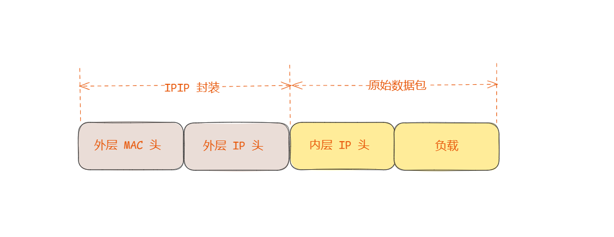
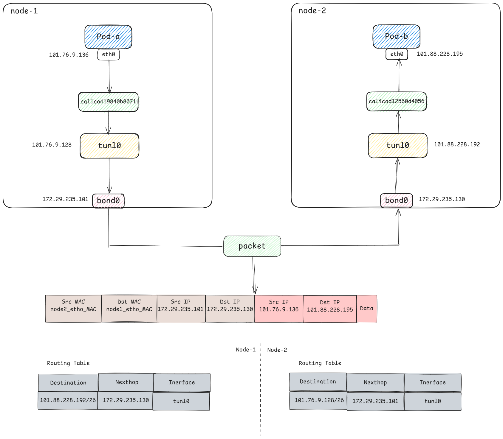
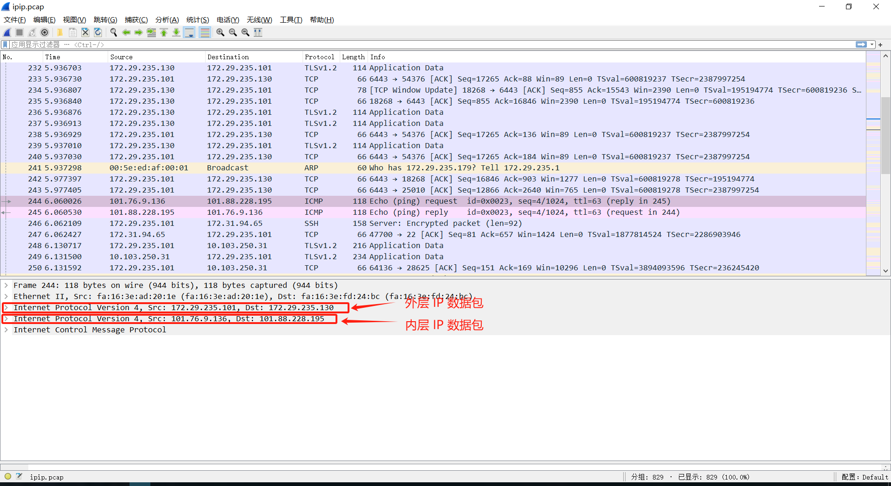

上一篇  [CNI 之 Calico VXLAN 模式原理](https://sfeng1996.github.io/calico-vxlan/) 详细讲解了 K8S 通过 VXLAN 模式实现跨节点通信，本篇继续讲解跨节点通信另一种那个模式，即 IPIP 模式。

Calico 同样提供了 IPIP 模式，下面同样基于 Calico 组件讲解。

## 系统环境

本篇文章实验环境如下：

**系统**：`Centos7.9`

**内核**：`4.19.90-24.4.v2101`

**Kubernetes**：`v1.28.8`

**Calico**：`v3.27.3`

## IPIP 简介

IP-in-IP 就是把一个 IP 数据包又套在一个 IP 包里，即把 IP 层封装到 IP 层的一个 tunnel 。它的作用其实基本上就相当于一个基于 IP 层的网桥！一般来说，普通的网桥是基于 mac 层的，根本不需 IP，而这个 ipip 则是通过两端的路由做一个 tunnel，把两个本来不通的网络通过点对点连接起来。

IPIP 报文格式如下：

- **外层 IP 头**：在外层新增 IP 头，源地址是当前节点物理网卡 IP，目的地址是对端节点物理网卡 IP
- **内层 IP 头**：即 Pod IP



## 实验分析

接下来依然通过实验说明，pod-a ip 为 `101.76.9.136`，运行在 `node-172-29-235-101` 节点上；pod-b ip 为 `101.88.228.195` ，运行在 `node-172-29-235-130` 节点上。

```bash
$ kubectl get pods -o wide
NAME                     READY   STATUS    RESTARTS   AGE     IP               NODE                    NOMINATED NODE   READINESS GATES
pod-a-685586bd54-k4chf   1/1     Running   0          2m38s   101.76.9.136     node-172-29-235-101   <none>           <none>
pod-b-697b6775b4-jz2d2   1/1     Running   0          2m18s   101.88.228.195   node-172-29-235-130     <none>           <none>
```

进入 pod-a 容器内去 ping pod-b，可以 ping 通，网络没有问题。

```bash
$ kubectl exec -it pod-a-685586bd54-k4chf -- sh
/ # ping 101.88.228.195
PING 101.88.228.195 (101.88.228.195): 56 data bytes
64 bytes from 101.88.228.195: seq=0 ttl=62 time=1.519 ms
64 bytes from 101.88.228.195: seq=1 ttl=62 time=0.738 ms
64 bytes from 101.88.228.195: seq=2 ttl=62 time=1.652 ms
```

查看 pod-a 内的路由，依然是只有两条路由。无论多节点、还是单结点，Pod 的流量都是需要经过该 Pod 所在的主机节点，才能转发到下一跳。所以多节点下的 Pod 内路由和单节点 Pod 路由是一样的。在 Pod 内所有流量都会匹配第一条默认路由，从 eth0 网卡到达网关 `169.254.1.1`，进而到达主机节点。

```bash
/ # route -n
Kernel IP routing table
Destination     Gateway         Genmask         Flags Metric Ref    Use Iface
0.0.0.0         169.254.1.1     0.0.0.0         UG    0      0        0 eth0
169.254.1.1     0.0.0.0         255.255.255.255 UH    0      0        0 eth0
```

从 Pod 内到达主机的过程和单结点 Pod 间通信原理一致，可见上一篇文章  [CNI 之 Calico 同节点 Pod 间通信](https://sfeng1996.github.io/calico-onenode-network/)

报文到达 `node-172-29-235-130` 主机后，即匹配主机路由，下面查看主机路由表：

```bash
$ route -n
Kernel IP routing table
Destination     Gateway         Genmask         Flags Metric Ref    Use Iface
101.88.228.192  172.29.235.130  255.255.255.192 UG    0      0        0 tunl0
```

> Calico 会根据配置为每个 K8S 节点上分配一个子网段，每个节点上的 Pod ip 都在该子网里，所以说每个节点上都会存在到其他节点的子网路由。
如果集群中有 n 个节点，那么每个节点都会有 n-1 个类似上述的路由
>

因为该集群就两个节点，所以节点 `node-172-29-235-101` 上只有一个到 `node-172-29-235-130` Pod 网段的路由。根据上述路由可知，节点 `node-172-29-235-130` 被分配的 Pod 网段为
`101.88.228.0/26`，很明显 pod-b ip `101.88.228.195` 属于该网段。

报文到达主机节点后，匹配到了该路由，网关是 `172.29.235.130`，该网关也就是 `node-172-29-235-130` 物理网卡的 ip。

> 这里和 VXLAN 模式有区别，VXLAN 模式下路由网关是 vxlan.calico 网卡的地址
>

```bash
enp1s0: flags=4163<UP,BROADCAST,RUNNING,MULTICAST>  mtu 1500
        inet 172.29.235.130  netmask 255.255.255.0  broadcast 172.29.235.255
        inet6 fe80::f816:3eff:fefd:24bc  prefixlen 64  scopeid 0x20<link>
        ether fa:16:3e:fd:24:bc  txqueuelen 1000  (Ethernet)
        RX packets 154496192  bytes 61826205079 (57.5 GiB)
        RX errors 0  dropped 0  overruns 0  frame 0
        TX packets 47641550  bytes 26825764937 (24.9 GiB)
        TX errors 0  dropped 0 overruns 0  carrier 0  collisions 0
```

但是 IPIP 模式下同样也会在主机上创建一个 IPIP 设备，默认是 `tunl0` ，tunl0 网卡 IP 地址与本机 Pod ip 属于同一个网段。

```bash
tunl0: flags=193<UP,RUNNING,NOARP>  mtu 1480
        inet 101.76.9.128  netmask 255.255.255.255
        tunnel   txqueuelen 1000  (IPIP Tunnel)
        RX packets 524  bytes 492896 (481.3 KiB)
        RX errors 0  dropped 0  overruns 0  frame 0
        TX packets 565  bytes 55427 (54.1 KiB)
        TX errors 0  dropped 0 overruns 0  carrier 0  collisions 0
```

**tunl0** 是 Linux 支持的隧道设备接口，当有这个接口时，出这个主机的 IP 包就会本封装成 IPIP 报文。同样的，当有数据进来时也会通过该接口解封 IPIP 报文。

报文根据路由到达 **tunl0** 网卡时，原始数据包会作为 IPIP 数据包的**负载**，同时设置外层 IP 报文：

由于现在报文的源 IP 地址、目的 IP 地址都是主机的物理机网卡地址，所以只要两个主机节点能够通信，报文即可传输到对端节点。

由于网关是对端节点的物理网卡，所以报文会直接到达该物理网卡，解封报文，发现内层目的 IP 是 `101.88.228.0/26` 网段，也就是 `node-172-29-235-130`  和 tunl0 同网段。所以报文到达 tunl0 设备，匹配节点上存在对应 Pod IP 的**静态路由**：

```bash
$ route -n
Destination     Gateway         Genmask         Flags Metric Ref    Use Iface
101.88.228.195  0.0.0.0         255.255.255.255 UH    0      0        0 califf66d1cee04
```

该路由目的 IP `101.88.228.195` 也就是 pod-b 的 IP，出口设备为 `califf66d1cee04` 是该 Pod **veth-pair** 在主机节点上的一端。最后报文经过 **veth-pair** 到达 Pod 内。

## 抓包分析

大致概括一下整个过程：

- **发送端**：在 Node-1 Pod-a 中发起 ping Pod-b ，`ICMP` 报文经过 **veth-pair** 后交由 tunl0 设备处理。 tunl0 设备是一个 IPIP 类型的设备，负责 IPIP封包解包。 因此，在发送端，tunl0 将原始 IP 报文封装成 IPIP 报文，然后从物理网卡 bond0 发送。
- **接收端**：Node2 收到 IPIP 报文，发现是一个 IPIP 类型报文，交由 tunl0 进行解包。根据解包后得到的原始报文中的目的 IP，将原始报文经由 **veth-pair** 网桥发送给 Pod-b。



通过在 node-1 上的物理网卡抓包：

```bash
$ tcpdump -nnn -i bond0 -w ipip.pcap
```

通过 wireshark 打开报文，可以发现 IPIP 报文的整体结构如下：



其中外层 IP 即为物理节点网卡的 IP 地址；内层 MAC 即为 vxlan.calico 的 MAC 地址，内层 IP 为 pod IP 地址


## 总结

IPIP 网络模式与 VXLAN 都属于 Overlay 网络，即需要结合 Linux 内核技术对原始报文进行封包、解包。

IPIP 相较 VXLAN 其数据包更小，但是一般需要底层网络允许 IPIP 协议；对于 VXLAN 即需要底层网络允许 UDP 流量。