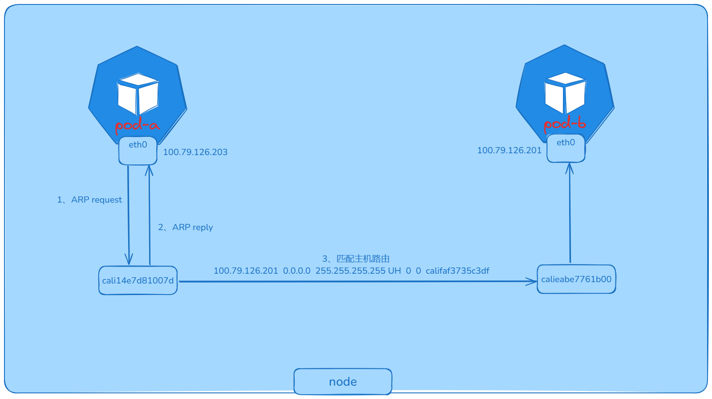

Kubernetes 作为分布式调度平台本身不提供集群网络方案，只提出 CNI ( container network interface ) 标准，任何个人开发者或者网络厂商按照改标准实现，即可实现 Kubernetes 网络通信。[Calico](https://www.tigera.io/project-calico/)  是 Kubernetes 生态系统中一种流行的网络选择，Calico 以其性能、灵活性而闻名。Calico 自身支持多种网络模式，例如 IPIP、VXLAN 等 Overlay 模式，还有 BGP 三层路由模式，都有成熟的实现，可根据环境和需求选择任一即可。本篇详细讲解 Calico IPIP 模式的原理。

## 什么是 Kubernetes 网络

本篇文章会涉及到一些 Linux 底层虚拟网络的知识，建议先阅读 [容器网络](https://sfeng1996.github.io/container-network/) 来了解 Linux 虚拟网络和容器网络的实现。Kubernetes 是一个分布式调度平台，主要存在以下网络通信场景：

- 同节点 pod 与 pod 如何通信；
- 跨节点 pod 与 pod 如何通信；
- pod 如何访问外网；
- 外网如何访问 pod；

下面带着以上四个问题来看看 Caico IPIP 是如何解决的。

## 系统环境

本篇文章实验环境如下：

**系统**：`Centos7.9`

**内核**：`4.19.90-24.4.v2101`

**Kubernetes**：`v1.22.17`

**Calico**：`v3.26.1`

## 同节点 pod 通信

pod-a、pod-b 都运行在 `node-172-31-186-250`，其中 pod-a ip 为 `100.79.126.203`，pod-b ip 为 `100.79.126.201`

```bash
$ kubectl get pods -o wide
NAME                     READY   STATUS    RESTARTS   AGE     IP               NODE                  NOMINATED NODE   READINESS GATES
pod-a-68c8f9cccd-sgtvg   1/1     Running   0          7m8s    100.79.126.203   node-172-31-186-250   <none>           <none>
pod-b-68c8f9cccd-gr4hw   1/1     Running   0          6m53s   100.79.126.201   node-172-31-186-250   <none>           <none>
```

进入 pod-a 容器内去 ping pod-b，可以 ping 通，网络没有问题

```bash
/ # ping 100.79.126.201
PING 100.79.126.201 (100.79.126.201): 56 data bytes
64 bytes from 100.79.126.201: seq=0 ttl=63 time=0.103 ms
```

再查看 pod-a 内的路由，这有这两条路由，同样查看其他 pod，发现都是只有这两条路由。

```bash
/ # route -n
Kernel IP routing table
Destination     Gateway         Genmask         Flags Metric Ref    Use Iface
0.0.0.0         169.254.1.1     0.0.0.0         UG    0      0        0 eth0
169.254.1.1     0.0.0.0         255.255.255.255 UH    0      0        0 eth0
```

根据上述路由表，在 pod 内所有流量都会匹配第一条默认路由，从 eth0 网卡到达网关 `169.254.1.1`，但是主机上并没有任何一张网卡 ip 是 `169.254.1.1`。

> 在网络通信时，涉及到三层网络就会先匹配路由，从路由表查到网关后，首先会通过 ARP 获取网关的 MAC 地址，将报文中目标 MAC 地址改为网关的 MAC，但是网关的 IP 地址不会封装到网络任一报文中。也就是说这个网关 IP 地址是什么无所谓，只要能找到对应 MAC 地址即可，也就是有网卡能响应 ARP 请求即可。
>

在 pod-a 查看 pod 内 ARP 缓存：

```bash
/ # ip neigh
169.254.1.1 dev eth0 lladdr ee:ee:ee:ee:ee:ee used 0/0/0 probes 1 STALE
```

可以发现网关 169.254.1.1 的 MAC 地址是 `ee:ee:ee:ee:ee:ee`，那么这个 MAC 地址是哪个网关的呢？

无论是容器网络还是 K8S 网络，都是基于 Linux veth-pair 技术实现 Network namespace 间通信，所以在 pod-a 和主机节点上使用一对 veth-pair 连接。

在 pod 内 eth0@xxxx 是 veth-pair 的一端，pod-a 内的网卡名是 `eth0@if331`

```bash
/ # ip addr show dev eth0
3: eth0@if331: <BROADCAST,MULTICAST,UP,LOWER_UP,M-DOWN> mtu 1450 qdisc noqueue state UP qlen 1000
    link/ether 5a:8a:10:57:e2:03 brd ff:ff:ff:ff:ff:ff
    inet 100.79.126.203/32 scope global eth0
       valid_lft forever preferred_lft forever
```

另一端则在物理主机节点上，在物理节点上有很多个以 `calicoxxxxx@xx` 命令的网卡，这些都是每个 pod veth-pair 的一端。每 pair 的接口均有相同的 inteface index，pod-a 是 331，所以直接在节点上查看：

```bash
$ ip link show | egrep '^331:' -A 1
331: cali14e7d81007d@if3:  mtu 1450 qdisc noqueue state UP mode DEFAULT group default qlen 1000
    link/ether ee:ee:ee:ee:ee:ee brd ff:ff:ff:ff:ff:ff link-netnsid 32
```

即 `cali14e7d81007d` 和 pod-a 中的 `eth0` 是一个 veth-pair，也就说明 pod-a eth0 与 主机的 `cali14e7d81007d` 在一个广播域，所以 pod-a 向网关 169.254.1.1 发起的 ARP 请求会被 `cali14e7d81007d` 接收，但是 `cali14e7d81007d`  上也没有配置 169.254.1.1 地址，为什么可以回复 ARP 请求？这里涉及到一个 Linux proxy_arp 知识：

> 将 `/proc/sys/net/ipv4/conf/<interface-dev>/proxy_arp` 置为1，该网卡就会看起来像一个网关，会响应所有的ARP请求，并将自己的MAC地址告诉客户端。
>

下面查看节点上 `cali14e7d81007d` 的 proxy_arp 是否开启

```bash
$ cat /proc/sys/net/ipv4/conf/cali14e7d81007d/proxy_arp
1
```

确实开启了，所以说当 `cali14e7d81007d` 网卡收到 pod 内发出的 ARP 请求，就会回复 ARP，将自己的 MAC 地址返回给 pod-a。

当 pod-a 拿到网关 MAC 地址后，进行封包，报文发送到网关，也就是主机上的  `cali14e7d81007d` 。

报文到达主机后，即匹配主机路由，下面查看主机路由表：

```bash
$ route -n 
Destination     Gateway         Genmask         Flags   MSS Window  irtt Iface
100.79.126.201  0.0.0.0         255.255.255.255 UH        0 0          0 calieabe7761b00
```

可以发现发往 100.79.126.201( pod-b ip ) 的报文直接通过 calieabe7761b00 网卡出去，calieabe7761b00 网卡也就是 pod-b veth-pair 在主机上的一端，

进而报文通过 pod-b veth-pair 进入 pod-b 内。

以上就是同节点 pod 间通信的全过程，下面通过抓包来分析验证。

以下是同节点 Pod 间通信的报文流转图



## 抓包验证

在 pod-a ping pod-b，同时主机 pod-a veth-pair 对端网卡即 `cali14e7d81007d` 抓包

在抓包之前，先通过 `ip neigh flush dev eth0` 命令清理 pod-a 的 arp 缓存，否则可能抓不到 ARP 报文

```bash
$ tcpdump -nn -i cali14e7d81007d -e
dropped privs to tcpdump
tcpdump: verbose output suppressed, use -v or -vv for full protocol decode
listening on cali14e7d81007d, link-type EN10MB (Ethernet), capture size 262144 bytes
# pod-a 发起广播, 获取网关 MAC 地址
16:22:59.584235 aa:64:43:69:fd:8d > ff:ff:ff:ff:ff:ff, ethertype ARP (0x0806), length 42: Request who-has 169.254.1.1 tell 100.79.126.235, length 28
# pod-a 对端网卡回复 ARP 请求
16:22:59.584286 ee:ee:ee:ee:ee:ee > aa:64:43:69:fd:8d, ethertype ARP (0x0806), length 42: Reply 169.254.1.1 is-at ee:ee:ee:ee:ee:ee, length 28
# 使用对端网卡的 MAC 地址进行报文封装
16:22:59.584290 aa:64:43:69:fd:8d > ee:ee:ee:ee:ee:ee, ethertype IPv4 (0x0800), length 98: 100.79.126.235 > 100.79.126.201: ICMP echo request, id 15, seq 0, length 64    
16:22:59.584372 ee:ee:ee:ee:ee:ee > aa:64:43:69:fd:8d, ethertype IPv4 (0x0800), length 98: 100.79.126.201 > 100.79.126.235: ICMP echo reply, id 15, seq 0, length 64      
16:23:00.584456 aa:64:43:69:fd:8d > ee:ee:ee:ee:ee:ee, ethertype IPv4 (0x0800), length 98: 100.79.126.235 > 100.79.126.201: ICMP echo request, id 15, seq 1, length 64
16:23:00.584526 ee:ee:ee:ee:ee:ee > aa:64:43:69:fd:8d, ethertype IPv4 (0x0800), length 98: 100.79.126.201 > 100.79.126.235: ICMP echo reply, id 15, seq 1, length 64   
```

可以发现 pod-a 先发起 ARP 请求，获取网关 169.254.1.1 的 MAC 地址，由对端网卡 `cali14e7d81007d` 回复其 MAC 地址。

## 总结

同节点的 Pod 之间通信实际上还是利用的 Linux veth-pair 技术以及网络路由，并没有使用到 Calico 的核心网络模式，例如 IPIP、VXLAN、BGP。

下一篇介绍跨界点的 Pod 通信，即会使用 Calico 的网络模式。