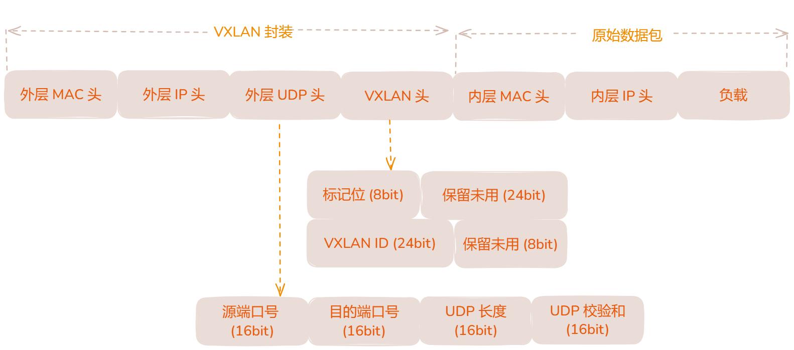
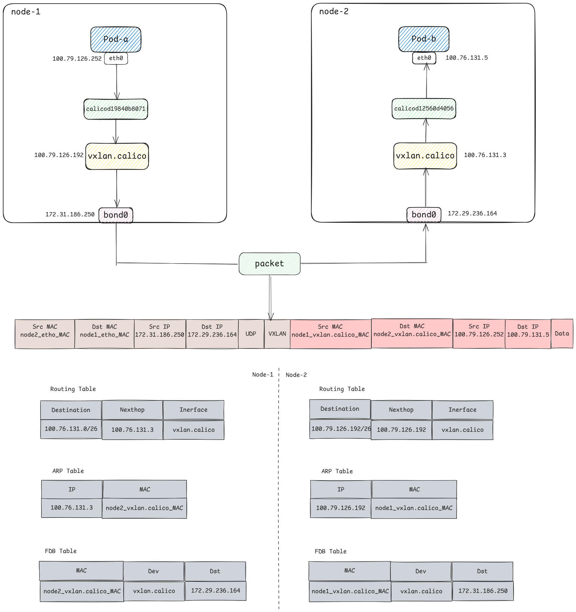
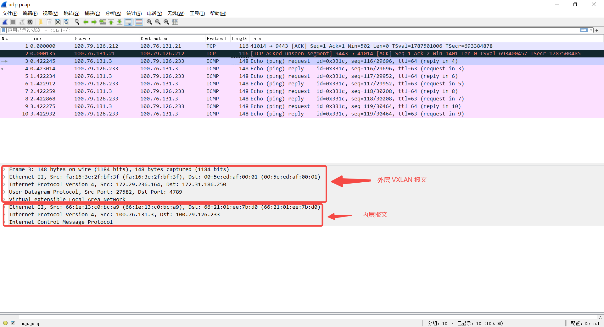
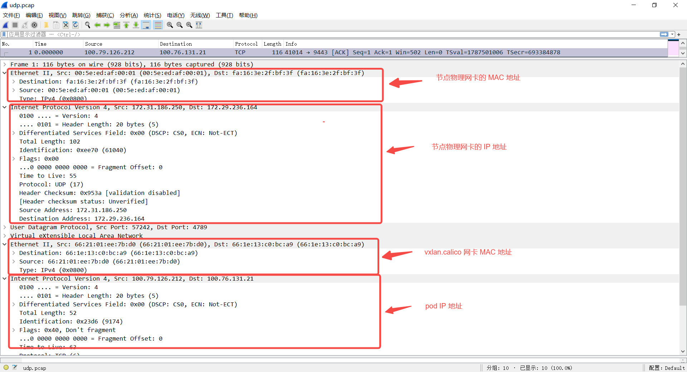

上一篇 [CNI 之 Calico 同节点 Pod 间通信](https://sfeng1996.github.io/calico-onenode-network/) 详细讲解了 K8S 同节点的 Pod 是如何通信的，解下来接着讲解基于 Calico 组件 K8S 多节点的 Pod 是如何通信的。

Calico 提供基于 Underlay 网络的 **BGP** 网络模式，以及基于 Overlay 网络的 **IPIP、VXLAN** 模式，实现跨节点 Pod 通信。本篇讲解 VXLAN 模式的原理。

## Underlay 与 Overlay

Underlay 网络是底层的物理网络基础设施，使用纯三层路由解决端到端的互联，例如 Calico 的 BGP 模式，在 Pod 与 Pod 之间建立 BGP 路由，实现网络互通。

而 Overlay 网络是在底层网络之上创建的虚拟网络，例如 Calico 的 IPIP 、VXLAN 模式，都是基于主机路由报文建立隧道或者再封装实现一个虚拟网络。

## 系统环境

本篇文章实验环境如下：

**系统**：`Centos7.9`

**内核**：`4.19.90-24.4.v2101`

**Kubernetes**：`v1.22.17`

**Calico**：`v3.26.1`

## VXLAN 简介

VXLAN（Virtual eXtensible Local Area Network，虚拟扩展局域网）是一种网络虚拟化技术，旨在解决大型云数据中心和多租户环境中传统 VLAN（虚拟局域网）技术的局限性。VXLAN 通过在 UDP（User Datagram Protocol）之上封装第二层以太网帧，实现在第三层（IP）网络上的二层网络扩展，从而允许创建多达 1600 万个隔离的虚拟网络，远超 VLAN 的 4096 个网络限制。VXLAN 报文格式如下：

- **VXLAN 标识头**：VXLAN header 这里只需要关注一个字段，那就是VNI，前文简单提到过, 在目标 node 上的 flannel.1 上会对这个VNI字段进行 check，看是否与自己的 VNI 一致，一致的话才会进行处理。
- **UDP 头**：在外层新增 UDP 头，默认目的端口号是 4789
- **IP 头**：在外层新增 IP 头，源地址是当前节点物理网卡 IP，目的地址是对端节点物理网卡 IP
- **MAC 头**：源 MAC 是当前节点物理网卡 MAC 地址，目的 MAC 是对端节点物理网卡 MAC 地址



## 实验分析

接下来依然通过实验说明，pod-a ip 为 `100.79.126.252`，运行在 `node-172-31-186-250` 节点上；pod-b ip 为 `100.76.131.5` ，运行在 `node-172-29-236-164` 节点上。

```bash
$ kubectl get pods -o wide
NAME                     READY   STATUS    RESTARTS   AGE   IP               NODE                  NOMINATED NODE   READINESS GATES
pod-a-68c8f9cccd-4zg6d   1/1     Running   0          28s   100.79.126.252   node-172-31-186-250   <none>           <none>
pod-b-646756645c-4qhss   1/1     Running   0          25s   100.76.131.5     node-172-29-236-164   <none>           <none>
```

进入 pod-a 容器内去 ping pod-b，可以 ping 通，网络没有问题。

```bash
$ kubectl exec -it pod-a-68c8f9cccd-4zg6d -- sh
/ # ping 100.76.131.5
PING 100.76.131.5 (100.76.131.5): 56 data bytes
64 bytes from 100.76.131.5: seq=0 ttl=62 time=1.691 ms
64 bytes from 100.76.131.5: seq=1 ttl=62 time=1.023 ms
```

查看 pod-a 内的路由，依然是只有两条路由。无论多节点、还是单结点，Pod 的流量都是需要经过该 Pod 所在的主机节点，才能转发到下一跳。所以多节点下的 Pod 内路由和单节点 Pod 路由是一样的。在 Pod 内所有流量都会匹配第一条默认路由，从 eth0 网卡到达网关 `169.254.1.1`，进而到达主机节点。

```bash
/ # route -n
Kernel IP routing table
Destination     Gateway         Genmask         Flags Metric Ref    Use Iface
0.0.0.0         169.254.1.1     0.0.0.0         UG    0      0        0 eth0
169.254.1.1     0.0.0.0         255.255.255.255 UH    0      0        0 eth0
```

从 Pod 内到达主机的过程和单结点 Pod 间通信原理一致，可见上一篇文章  [CNI 之 Calico 同节点 Pod 间通信](https://sfeng1996.github.io/calico-onenode-network/)

报文到达 `node-172-31-186-250` 主机后，即匹配主机路由，下面查看主机路由表：

```bash
$ route -n
Kernel IP routing table
Destination     Gateway         Genmask         Flags Metric Ref    Use Iface
100.76.131.0    100.76.131.3    255.255.255.192 UG    0      0        0 vxlan.calico
```

> Calico 会根据配置为每个 K8S 节点上分配一个子网段，每个节点上的 Pod ip 都在该子网里，所以说每个节点上都会存在到其他节点的子网路由。
如果集群中有 n 个节点，那么每个节点都会有 n-1 个类似上述的路由
>

因为该集群就两个节点，所以节点 `node-172-31-186-250` 上只有一个到 `node-172-29-236-164` Pod 网段的路由。根据上述路由可知，节点 `node-172-29-236-164` 被分配的 Pod 网段为 `100.76.131.0/26`，很明显 pod-b ip `100.76.131.5` 属于该网段。

报文到达主机节点后，匹配到了该路由，网关是 `100.76.131.3`，该网关也就是 `node-172-29-236-164` **vxlan.calico** 网卡的 ip。

```bash
vxlan.calico: flags=4163<UP,BROADCAST,RUNNING,MULTICAST>  mtu 1450
        inet 100.76.131.3  netmask 255.255.255.255  broadcast 0.0.0.0
        inet6 fe80::641e:13ff:fec0:bca9  prefixlen 64  scopeid 0x20<link>
        ether 66:1e:13:c0:bc:a9  txqueuelen 1000  (Ethernet)
        RX packets 11494911  bytes 2227028260 (2.0 GiB)
        RX errors 0  dropped 0  overruns 0  frame 0
        TX packets 16354392  bytes 11020812300 (10.2 GiB)
        TX errors 0  dropped 7 overruns 0  carrier 0  collisions 0
```

**任何一个 VXLAN 设备创建时都会指定一个三层物理网络设备作为VTEP**, Calico 也不例外, 可通过以下命令进行查看：

```bash
$ ip -d link show vxlan.calico
14: vxlan.calico: <BROADCAST,MULTICAST,UP,LOWER_UP> mtu 1450 qdisc noqueue state UNKNOWN mode DEFAULT group default qlen 1000
    link/ether 66:4f:25:fb:e3:4f brd ff:ff:ff:ff:ff:ff promiscuity 0 minmtu 68 maxmtu 65535 
    vxlan id 4096 local 172.30.209.42 dev **bond0** srcport 0 0 dstport 4789 nolearning ttl auto ageing 300 udpcsum noudp6zerocsumtx noudp6zerocsumrx addrgenmode eui64 numtxqueues 1 numrxqueues 1 gso_max_size 65536 gso_max_segs 65535
```

> VXLAN 为 `overlay` 的容器网络，是个**大二层**互通的解决方案， 但最终网络包还是要借助物理网卡出去。
该 vxlan.calico 也是基于物理网卡 **bond0** 创建的，所以说该网卡上的报文依然基于 **bond0** 转发
>

Calico 会为每个节点都创建一个 **vxlan.calico** 的网卡，作为 VXLAN 报文的网关设备。报文根据路由到达该网卡时，原始数据包会作为 VXLAN 数据包的**负载**，同时设置 **VXLAN 标识头、UDP 头、IP 头、MAC 头，**报文如下：

- **负载**：包含内层源/目 IP，内层源/目 MAC，以及对应报文负载
    - 内层源/目 IP：即为 Pod-a，Pod-b IP 地址
    - 内层源/目 MAC：因为报文在 vxlan.calico 网卡上封装，所以源 MAC 为该节点上 vxlan.calico 的 MAC；目的 MAC 即为对端节点的 vxlan.calico MAC，目的 MAC 并不是通过发送 ARP 请求获取，而是 calico 预先为每个节点设置好的，由 calico 负责维护，没有过期时间。

        ```bash
        # 查看ARP表
        $ ip n | grep vxlan
        100.76.131.3 dev vxlan.calico lladdr 66:1e:13:c0:bc:a9 PERMANENT
        ```

- **外层 IP**：为源/目节点的物理网卡 IP 地址，源 IP 为当前节点物理网卡 IP 地址，目的 IP 通过 fdb 表查询

    ```bash
    # 查询 fdb 表
    $ bridge fdb show | grep vxlan.calico
    66:1e:13:c0:bc:a9 dev vxlan.calico dst 172.29.236.164 self permanent
    ```

- **外层 MAC**：源/目节点物理网卡对应的 MAC 地址

由于现在报文的源 IP 地址、目的 IP 地址都是主机的物理机网卡地址，所以只要两个主机节点能够通信，报文即可传输到对端节点。

当上述报文到达对端结点后，内核根据 VXLAN 报文标识将报文传输到对应 vxlan 设备上，也就是 `node-172-29-236-164` 的 **vxlan.calico** 网卡，将报文的**外层 MAC、外层 IP、外层 UDP、VXLAN 头**都去掉，匹配节点上存在对应 Pod IP 的**静态路由**：

```bash
$ route -n
Destination     Gateway         Genmask         Flags Metric Ref    Use Iface
100.76.131.5    0.0.0.0         255.255.255.255 UH    0      0        0 cali8275753c4ea
```

该路由目的 IP `100.76.131.5` 也就是 pod-b 的 IP，出口设备为 `cali8275753c4ea` 是该 Pod **veth-pair** 在主机节点上的一端。最后报文经过 **veth-pair** 到达 Pod 内。

## 抓包分析

大致概括一下整个过程：

- **发送端**：在 Node-1 Pod-a 中发起 ping Pod-b ，`ICMP` 报文经过 **veth-pair** 后交由 vxlan.calico 设备处理。 vxlan.calico 设备是一个VXLAN类型的设备，负责VXLAN 封包解包。 因此，在发送端，vxlan.calico 将原始 L2 报文封装成 VXLAN UDP 报文，然后从 bond0 发送。
- **接收端**：Node2 收到 UDP 报文，发现是一个 VXLAN 类型报文，交由 vxlan.calico 进行解包。根据解包后得到的原始报文中的目的 IP，将原始报文经由 **veth-pair** 网桥发送给 Pod-b。



通过在 node-1 上的物理网卡抓包：

```bash
$ tcpdump -nnn -i bond0 -e udp -w vxlan.pcap
```

通过 wireshark 打开报文，可以发现 VXLAN 报文的整体结构如下：



其中外层 MAC 即为物理节点网卡的 MAC 地址，外层 IP 即为物理节点网卡的 IP 地址；内层 MAC 即为 vxlan.calico 的 MAC 地址，内层 IP 为 pod IP 地址



## 总结

Calico VXLAN 网络模式的优势体现在采用 VXLAN 技术能够实现 1600 万虚拟网络，远超传统 4096 VLAN 限制，适合大规模 K8S 集群。

因为 VXLAN 中使用 VNI 标记报文，通过 UDP 封装报文，所以在传输过程中，底层网络设备只能看到外层的 IP 和 UDP 头部，无法解析内部的二层帧，从而确保不同虚拟网络的流量不会相互干扰。每个 VTEP 只处理与其关联的 VNI 流量，确保不同虚拟网络的流量在 VTEP 处得到隔离。

另外 VXLAN 作为 Overlay 技术，允许跨三层网络进行通信，解决了传统 VLAN 只能在同子网内通信的限制。也就是说即使 K8S Node 跨子网，不属于同一 VLAN，跨节点的 Pod 也可以正常通信，因为 VXLAN 报文通过封装后，最终从物理网卡传输。

下一篇文章分析 Calico IPIP 网络模式~