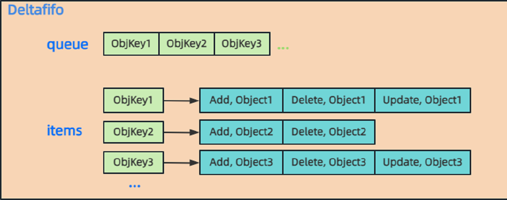
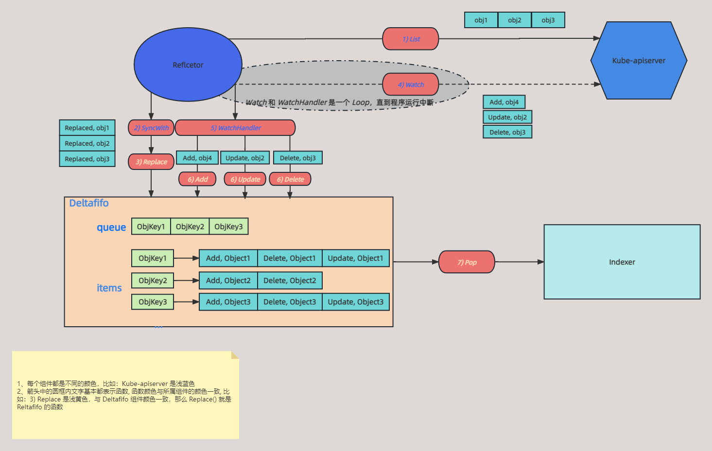

## 简介

上一篇介绍了 Reflector 的原理，发现 Reflector 从 Kube-apiserver 获取到的数据最终都是流向 Deltafifo。

Deltafifo: delta first in first out，从字面意思上看是一个先进先出的队列，Delta 表示变化的资源，包含操作资源对象的类型和数据。

下面就详细解释下 Deltafifo 是如何存储数据的，以及实现原理。从 Client-go 架构可以看出 Reflector 是 Deltafifo 的生产者。

## Deltafifo 源码解析

本篇基于 [k8s.io/client-go](http://k8s.io/client-go) v0.23.4 源码讲解

### 结构体定义

先通过 Deltafifo 结构体定义来大概看看作用和其字段的作用，在看结构体定义之前，通过下图先看看 Deltafifo 通过什么数据结构来存储数据的



从上图可以看出，*`queue`* 是一个切片，存放资源对象的 key；*`Items`* 是一个 map，key 为 queue 的元素，value 为一个事件的切片，且切片内的对象是同一个，只是事件类型不同。

```go
// k8s.io/client-go/tools/cache/delta_fifo.go:
type DeltaFIFO struct {
	// lock/cond 保护 items 的并发访问
	lock sync.RWMutex
	cond sync.Cond

	// items 存储数据, map 的 value 是 Deltas，Deltas 是一个 Delta 切片
	// 说明一个资源会存在多个事件，Add/Update/Delete/Sync
	// 对应上图的 items
	items map[string]Deltas

	// queue 存放的是 items 的key，且该 key 在 queue 中有顺序且唯一
	// 对应上图的 queue
	queue []string

	// Delete/Add/Update/AddIfNotPresent 被调用，或者 Reflector 第一次全量 List 时调用 Replace() 时设置为 true
	// populated 用于判断 DletaFIFO 是否为初始化状态（即没有处理过任何对象）
	populated bool
	// Reflector 第一次全量 List 时调用 Replace() 时插入的 items 数
	initialPopulationCount int

	// 用于创建 queue 中的 key 函数
	keyFunc KeyFunc

	// knownObjects 从缓存里获取数据的接口, 其实就是对应上图的 indexer
	knownObjects KeyListerGetter

	// 用于表示队列是否被关闭了，当队列为空时，可以退出
	closed bool

	// emitDeltaTypeReplaced是发出Replaced还是Sync
	emitDeltaTypeReplaced bool
}

// Deltas 是一个 Delta 切片
// 说明一个资源会存在多个事件，Add/Update/Delete/Sync
type Delta struct {
	// 事件类型
	Type   DeltaType
	// 具体资源
	Object interface{}
}

type Deltas []Delta
```

再来看看 Deltafifo 的初始化是如何实现的。

主要逻辑：

- informer 启动函数会调用 *`NewReflector()`* 初始化 Reflector
- Reflector 初始化调用 *`NewDeltaFIFOWithOptions()`* 初始化 Deltafifo，并赋值于 *`Store`*，*`Store`* 其实就是 Deltafifo

Deltafifo 初始化只需要传入 *`KeyFunc`* ，*`KeyListerGetter`*  两个入参，分别是获取 queue 的 key 的函数以及获取具体数据的接口。

```go
// k8s.io/client-go/tools/cache/delta_fifo.go:209

func NewDeltaFIFO(keyFunc KeyFunc, knownObjects KeyListerGetter) *DeltaFIFO {
	return NewDeltaFIFOWithOptions(DeltaFIFOOptions{
		KeyFunction:  keyFunc,
		KnownObjects: knownObjects,
	})
}

func NewDeltaFIFOWithOptions(opts DeltaFIFOOptions) *DeltaFIFO {
	if opts.KeyFunction == nil {
		opts.KeyFunction = MetaNamespaceKeyFunc
	}

	f := &DeltaFIFO{
		items:        map[string]Deltas{},
		queue:        []string{},
		keyFunc:      opts.KeyFunction,
		knownObjects: opts.KnownObjects,

		emitDeltaTypeReplaced: opts.EmitDeltaTypeReplaced,
	}
	f.cond.L = &f.lock
	return f
}
```

上一篇 Relfector 中讲到，Reflector 结构体中有个字段是 *`Store` ，*该 *`Store`  在* Client-go 架构中就是 Deltafifo，所以 Deltafifo 的初始化就是 Reflector 调用的。

```go
// k8s.io/client-go/tools/cache/controller.go:127

func (c *controller) Run(stopCh <-chan struct{}) {
	defer utilruntime.HandleCrash()
	go func() {
		<-stopCh
		c.config.Queue.Close()
	}()
	// 初始化 Reflector
	r := NewReflector(
		c.config.ListerWatcher,
		c.config.ObjectType,
		c.config.Queue,
		c.config.FullResyncPeriod,
	)
	r.ShouldResync = c.config.ShouldResync
	r.WatchListPageSize = c.config.WatchListPageSize
	r.clock = c.clock
	if c.config.WatchErrorHandler != nil {
		r.watchErrorHandler = c.config.WatchErrorHandler
	}

	c.reflectorMutex.Lock()
	c.reflector = r
	c.reflectorMutex.Unlock()

	var wg wait.Group

	wg.StartWithChannel(stopCh, r.Run)

	wait.Until(c.processLoop, time.Second, stopCh)
	wg.Wait()
}
```

上面 *`Run`* 方法是 informer 的启动函数，里面有个 *`NewReflector`* 会初始化 Reflector，其函数入参 *`c.config.Queue`* 就是 Deltafifo。

那么 *`c.config.Queue`* 是怎么初始化的？

```go
// k8s.io/client-go/tools/cache/controller.go:127:423

func newInformer(
	lw ListerWatcher,
	objType runtime.Object,
	resyncPeriod time.Duration,
	h ResourceEventHandler,
	clientState Store,
	transformer TransformFunc,
) Controller {
	// 初始化 Deltafifo，并设置 *KeyListerGetter，可以发现并没有传 keyFunc*
	fifo := NewDeltaFIFOWithOptions(DeltaFIFOOptions{
		KnownObjects:          clientState,
		EmitDeltaTypeReplaced: true,
	})
	// 用上面的 fifo 初始化 Queue
	cfg := &Config{
		Queue:            fifo,
		ListerWatcher:    lw,
		ObjectType:       objType,
		FullResyncPeriod: resyncPeriod,
		RetryOnError:     false,

		...
	return New(cfg)
}
```

到这基本就知道 Deltafifo 是如何初始化的了，下面看看 *`NewDeltaFIFO`* 函数两个入参 ** *`KeyFunc`* 和 *`KeyListerGetter`* 是如何实现的

### **KeyFunc**

*`keyFunc`* 用于计算资源的 key，存放到 Deltafifo 的 *`queue`* 中，以及作为 *`items`* 的 key

主要逻辑：

- 如果没有指定自定义 *`keyFunc`*，则调用 *`MetaNamespaceKeyFunc`* 生成默认 *`keyFunc`*
- 如果资源有 namespace，则拼接 *`namespace + "/" + name`* 作为 key
- 如果资源没有 namespace，则直接返回 *`name`* 作为 key

```go
// k8s.io/client-go/tools/cache/delta_fifo.go:218

func NewDeltaFIFOWithOptions(opts DeltaFIFOOptions) *DeltaFIFO {
	// 如果没有自定义 KeyFunc，则使用MetaNamespaceKeyFunc 
	if opts.KeyFunction == nil {
		opts.KeyFunction = MetaNamespaceKeyFunc
	}

	f := &DeltaFIFO{
		items:        map[string]Deltas{},
		queue:        []string{},
		keyFunc:      opts.KeyFunction,
		knownObjects: opts.KnownObjects,

		emitDeltaTypeReplaced: opts.EmitDeltaTypeReplaced,
	}
	f.cond.L = &f.lock
	return f
}

// k8s.io/client-go/tools/cache/store.go:104

func MetaNamespaceKeyFunc(obj interface{}) (string, error) {
	if key, ok := obj.(ExplicitKey); ok {
		return string(key), nil
	}
	meta, err := meta.Accessor(obj)
	if err != nil {
		return "", fmt.Errorf("object has no meta: %v", err)
	}
	// 如果资源有 namespace，则拼接 namespace + "/" + name
	if len(meta.GetNamespace()) > 0 {
		return meta.GetNamespace() + "/" + meta.GetName(), nil
	}
	// 如果资源没有 namespace，则直接返回 name
	return meta.GetName(), nil
}
```

### KeyListerGetter

*`KeyListerGetter`* 是在 *`newInformer()`* 传入的，对应着函数参数 *`clientState` ,* 其实就是 indexer，用于从缓存获取具体数据

```go
// k8s.io/client-go/tools/cache/controller.go:316

func NewInformer(
	lw ListerWatcher,
	objType runtime.Object,
	resyncPeriod time.Duration,
	h ResourceEventHandler,
) (Store, Controller) {
	// 初始化 ClientState
	clientState := NewStore(DeletionHandlingMetaNamespaceKeyFunc)

	return clientState, newInformer(lw, objType, resyncPeriod, h, clientState, nil)
}

// k8s.io/client-go/tools/cache/store.go:258

func NewStore(keyFunc KeyFunc) Store {
	return &cache{
		// 初始化 Indexer
		cacheStorage: NewThreadSafeStore(Indexers{}, Indices{}),
		keyFunc:      keyFunc,
	}
}
```

可以看出来 *`KeyListerGetter`* 就是 *`Indexer`*

到这基本就知道 Deltafifo 初始化的过程了，以及重要参数的作用。

## Deltafifo 操作

上面讲 Dletafifo 初始化的时候，知道 *`c.config.Queue`* 就是 Deltafifo，这个 Queue 是一个接口

上一篇讲解 Reflector 原理时，第一次 *`List`* 全量数据时调用 *`SyncWith()`* 来同步数据到 Deltafifo，最终调用就是 Deltafifo 的 *`Resync()`* 方法；

后面 *`Watch`* 监听的数据都是根据数据类型来调用 Deltafifo 的 *`Add()`*、*`Update()`*、*`Delete()`* 实现同步。

```go
// k8s.io/client-go/tools/cache/fifo.go:52

type Queue interface {
	// Store 是一个 fifo 的接口，包含 fifo 的基本操作
	Store

	// Pop 一直阻塞，直到至少有一个key要处理或队列被关闭，队列被关闭会返回一个错误。
  // 在前面的情况下 Pop 原子性地选择一个 key 进行处理，从 Store 中删除关联（key、accumulator）的数据,
  // 并处理 accumulator。Pop 会返回被处理的 accumulator 和处理的结果。
	
	// PopProcessFunc 函数可以返回一个 ErrRequeue{inner}，在这种情况下，Pop 将
  //（a）把那个（key，accumulator）关联作为原子处理的一部分返回到 Queue 中
  // (b) 从 Pop 返回内部错误。
	Pop(PopProcessFunc) (interface{}, error)

	// 如果元素不存在，则添加到队列中
	AddIfNotPresent(interface{}) error

	// 如果第一批元素都被 pop 了，设置为 true
	HasSynced() bool

	// 关闭队列
	Close()
}

// k8s.io/client-go/tools/cache/store.go:39

type Store interface {

	// 将给定元素添加到队列中
	Add(obj interface{}) error

	// 更新元素
	Update(obj interface{}) error

	// 删除元素
	Delete(obj interface{}) error

	// 获取元素列表
	List() []interface{}

	// 获取元素 key 的列表
	ListKeys() []string

	// 查看给定元素
	Get(obj interface{}) (item interface{}, exists bool, err error)

	// 通过 key 查看给定元素
	GetByKey(key string) (item interface{}, exists bool, err error)

	// 替换元素
	Replace([]interface{}, string) error

	// 重新同步
	Resync() error
}

```

下面具体看看这些方法，Deltafifo 是如何实现的。先把简单的几个方法说完，比较复杂的放在后面

### List

*`List()`* 用于获取每个资源最新的数据，并通过列表来返回

主要逻辑：

- 加锁
- 调用 listLocked() 获取数据，遍历 Deltafifo 的 items，将每个 key 的最新 delta 追加到切片返回
- 解锁

```go
// k8s.io/client-go/tools/cache/delta_fifo.go:442

func (f *DeltaFIFO) List() []interface{} {
	// 读锁
	f.lock.RLock()
	defer f.lock.RUnlock()
	return f.listLocked()
}

func (f *DeltaFIFO) listLocked() []interface{} {
	list := make([]interface{}, 0, len(f.items))
	// 遍历 items，将每个资源的最新数据添加到切片中返回
	for _, item := range f.items {
		list = append(list, item.Newest().Object)
	}
	return list
}

// 获取切片最后一个元素
// 因为切片 append 从尾部添加，所以倒数第一个就是最新的数据
func (d Deltas) Newest() *Delta {
	if n := len(d); n > 0 {
		return &d[n-1]
	}
	return nil
}
```

### ListKeys

*`ListKeys()`* 用于获取 Deltafifo 中所有元素的 key

主要逻辑：

- 加锁
- 遍历 Deltafifo 的 *`queue` ,* 将 *`queue`* 中的元素放到一个切片中返回
- 释放锁

```go
// k8s.io/client-go/tools/cache/delta_fifo.go:458

func (f *DeltaFIFO) ListKeys() []string {
	f.lock.RLock()
	defer f.lock.RUnlock()
	list := make([]string, 0, len(f.queue))
	// 将 queue 中所有元素添加到切片中返回
	for _, key := range f.queue {
		list = append(list, key)
	}
	return list
}
```

### Get、GetByKey

*`Get()`* 通过一个对象返回该对象所有事件，*`GetByKey()`* 通过对象的 Key 返回该对象所有事件

```go
// k8s.io/client-go/tools/cache/delta_fifo.go:471

func (f *DeltaFIFO) Get(obj interface{}) (item interface{}, exists bool, err error) {
	// 获得当前资源的 key, namespace/name
	key, err := f.KeyOf(obj)
	if err != nil {
		return nil, false, KeyError{obj, err}
	}
	return f.GetByKey(key)
}

func (f *DeltaFIFO) GetByKey(key string) (item interface{}, exists bool, err error) {
	f.lock.RLock()
	defer f.lock.RUnlock()
	// 从 items 获取 Deltas
	d, exists := f.items[key]
	// 如果存在，拷贝 Deltas 返回，防止被更新影响其他调用者
	if exists {
		d = copyDeltas(d)
	}
	return d, exists, nil
}
```

可以发现 *`Get()`* 最终还是调用 *`GetByKey()`* 来实现的。

### AddIfNotPresent

*`addIfNotPresent()`* 将不存在 Deltafifo 的事件添加进来

主要逻辑：

- 如果当前资源已存在 Deltafifo，则忽略
- 将当前资源计算出的 *`key`* 添加到 *`queue`*
- 将当前资源 *`key`* 和 具体对象保存到 *`items`*

```go
// k8s.io/client-go/tools/cache/delta_fifo.go:357

func (f *DeltaFIFO) addIfNotPresent(id string, deltas Deltas) {
	f.populated = true
	// 如果该元素已存在于 Deltafifo 中，则直接退出
	if _, exists := f.items[id]; exists {
		return
	}
	// 添加元素 key 到 queue
	f.queue = append(f.queue, id)
	// 添加数据到 items
	f.items[id] = deltas
	f.cond.Broadcast()
}
```

### HasSynced

*`hasSynced()`* 判断 Deltafifo 是否已经同步完成

主要逻辑：

- 判断 Deltafifo 是否已经存在事件且 Reflector 第一次 List 全量数据是否都已经被 pop 完了
- *`initialPopulationCount`* 字段在 *`Replace()`* 会加，在 *`Pop()`* 会减，所以根据这个字段来判断第一次 *`List`* 的数据是否全部消费完，消费完则说明已经 cache 完成

```go
// k8s.io/client-go/tools/cache/delta_fifo.go:271

func (f *DeltaFIFO) HasSynced() bool {
	f.lock.Lock()
	defer f.lock.Unlock()
	// populated 为 true 以及 initialPopulationCount = 0 表示第一全量 List 数据都被 pop 完了
	
	return f.populated && f.initialPopulationCount == 0
}
```

### Close

*`Close()`* 作用是关闭 Deltafifo，将 Deltafifo 的 *`closed`* 字段设置为 true

```go
// k8s.io/client-go/tools/cache/delta_fifo.go:247

func (f *DeltaFIFO) Close() {
	f.lock.Lock()
	defer f.lock.Unlock()
	// 设置 Closed 字段为 true
	f.closed = true
	// 唤醒所有协程
	f.cond.Broadcast()
}
```

以上几个方法主要是一些辅助性的方法，比较容易理解，下面这几个就是 Deltafifo 的核心功能了。

### Add、Update、Delete

*`Add()`* 的作用就是将元素添加到队列到中，*`Update()`* 的作用就是更新元素 ，*`Delete()`* 的作用删除元素

主要逻辑：

- 加锁
- 将 polulated 设置为 true，表明 Deltafifo 已经不是初始化状态了，已经存在事件了
- 调用 *`queueActionLocked()`* 完成事件添加
- 释放锁

```go
// k8s.io/client-go/tools/cache/delta_fifo.go:279

func (f *DeltaFIFO) Add(obj interface{}) error {
	// 添加元素，需要上锁
	f.lock.Lock()
	defer f.lock.Unlock()
	f.populated = true
	return f.queueActionLocked(Added, obj)
}

// 更新元素
func (f *DeltaFIFO) Update(obj interface{}) error {
	f.lock.Lock()
	defer f.lock.Unlock()
	f.populated = true
	return f.queueActionLocked(Updated, obj)
}

// 删除事件
func (f *DeltaFIFO) Delete(obj interface{}) error {
	id, err := f.KeyOf(obj)
	if err != nil {
		return KeyError{obj, err}
	}
	f.lock.Lock()
	defer f.lock.Unlock()
	f.populated = true
	if f.knownObjects == nil {
		// 如果 knownObjects(indexer) 为空且事件已被删除，则直接返回
		if _, exists := f.items[id]; !exists {
			return nil
		}
	} else {
		// 如果存在 indexer 且数据不存在，则直接返回
		_, exists, err := f.knownObjects.GetByKey(id)
		_, itemsExist := f.items[id]
		if err == nil && !exists && !itemsExist {
			return nil
		}
	}

	// 调用 queueActionLocked 将删除事件添加到 Deltafifo 中
	return f.queueActionLocked(Deleted, obj)
}
```

发现 *`Add()`*、*`Update()`* 、*`Delete()`* 逻辑都一样，最终都是根据不同事件类型调用 *`queueActionLocked()`* 

*`queueActionLocked`* 主要逻辑：

- 获取当前事件的 key，调用前面讲的 keyFunc
- 将 Deleted 事件进行去重
- 将事件的 key 追加到 queue
- 将事件保存到 items
- 唤醒消费者

```go
// k8s.io/client-go/tools/cache/delta_fifo.go:409

func (f *DeltaFIFO) queueActionLocked(actionType DeltaType, obj interface{}) error {
	// 先获取元素的 key，这里就会调用前面的 keyFunc 来生成 key
	id, err := f.KeyOf(obj)
	if err != nil {
		return KeyError{obj, err}
	}
	// 如果是 Add 类型，oldDeltas 为 nil，如果是 Update 类型，oldDeltas 不为 nil
	oldDeltas := f.items[id]
	// 将当前 Delta 添加到 oldDeltas 
	newDeltas := append(oldDeltas, Delta{actionType, obj})
	// 去重
	newDeltas = dedupDeltas(newDeltas)

	if len(newDeltas) > 0 {
		// 如果元素不存在，则将 key 添加到队列中
		// 对于更新事件，则不需要添加到队列中了，因为队列中已存在该 key，这样就保证了队列中的 key 是唯一的
		if _, exists := f.items[id]; !exists {
			f.queue = append(f.queue, id)
		}
		// Add 事件直接添加到 items 中
		// Update 事件则更新当前 key 的 value
		f.items[id] = newDeltas
		// 唤醒正在的 wait 的 goroutine
		f.cond.Broadcast()
	} else {
		// This never happens, because dedupDeltas never returns an empty list
		// when given a non-empty list (as it is here).
		// If somehow it happens anyway, deal with it but complain.
		if oldDeltas == nil {
			klog.Errorf("Impossible dedupDeltas for id=%q: oldDeltas=%#+v, obj=%#+v; ignoring", id, oldDeltas, obj)
			return nil
		}
		klog.Errorf("Impossible dedupDeltas for id=%q: oldDeltas=%#+v, obj=%#+v; breaking invariant by storing empty Deltas", id, oldDeltas, obj)
		f.items[id] = newDeltas
		return fmt.Errorf("Impossible dedupDeltas for id=%q: oldDeltas=%#+v, obj=%#+v; broke DeltaFIFO invariant by storing empty Deltas", id, oldDeltas, obj)
	}
	return nil
}

// 去重 Delta
func dedupDeltas(deltas Deltas) Deltas {
	n := len(deltas)
	// 如果 Delta 切小于两个元素，则不需要去重
	if n < 2 {
		return deltas
	}
	// 因为 append 从切片尾部添加的，所以比较最后两个元素是否重复即可
	a := &deltas[n-1]
	b := &deltas[n-2]
	if out := isDup(a, b); out != nil {
		deltas[n-2] = *out
		return deltas[:n-1]
	}
	return deltas
}

// 目前只支持 Delete 类型的去重
func isDup(a, b *Delta) *Delta {
	if out := isDeletionDup(a, b); out != nil {
		return out
	}
	// TODO: Detect other duplicate situations? Are there any?
	return nil
}

// 判断两个是否都是 delete 类型, 都是 delete 类型肯定是有重复，只需返回一个
func isDeletionDup(a, b *Delta) *Delta {
	if b.Type != Deleted || a.Type != Deleted {
		return nil
	}
	// Do more sophisticated checks, or is this sufficient?
	if _, ok := b.Object.(DeletedFinalStateUnknown); ok {
		return a
	}
	return b
}
```

### Replace

*`Replace()`* 作用是全量更新 Deltafifo 数据，这个方法在 Reflector 第一次 *`List`* 时调用，以及后续 *`Watch`* 出现于 kube-apiserver 连接中断了，导致 Reflector 重新 *`List`* 也会调用 Deltafifo 的 *`Replace()`*

主要逻辑：

- 将 list 的数据的 key 保存到一个 set 中，并同步这些 list 事件到 Deltafifo
- 如果没有 indexer 缓存，只需将 Deltafifo 中存在，但 List 不存在的事件标记为删除事件，同步到 Deltafifo，将 initialPopulationCount  加一
- 如果有 indexer 缓存，需要判断 indexer 存在，list 不存在的事件标记为删除事件，同步到 Deltafifo，将 initialPopulationCount  加一
- *`Replace`* 事件类型为 *`Replaced`*

```go
// k8s.io/client-go/tools/cache/delta_fifo.go:575

func (f *DeltaFIFO) Replace(list []interface{}, _ string) error {
	f.lock.Lock()
	defer f.lock.Unlock()
	keys := make(sets.String, len(list))

	// 第一次全量同步类型是 Replaced
	// 以前版本是 Sync，这里做了兼容
	action := Sync
	if f.emitDeltaTypeReplaced {
		action = Replaced
	}

	// 之前的版本是 sync
	// 将传进来的数据赋予类型(sync/replaced)保存到 Deltafifo 中
	for _, item := range list {
		key, err := f.KeyOf(item)
		if err != nil {
			return KeyError{item, err}
		}
		// 将 key 插入一个 set 中
		keys.Insert(key)
		// 同步事件
		if err := f.queueActionLocked(action, item); err != nil {
			return fmt.Errorf("couldn't enqueue object: %v", err)
		}
	}
	// 如果没有 indexer 缓存，就对自身队列的元素进行检查，检查自身队列中是否有不在全量 List 的事件，如果有就标记为删除事件
	if f.knownObjects == nil {
		queuedDeletions := 0
		for k, oldItem := range f.items {
			// 如果自身队列已存在输入的 key，则忽略
			if keys.Has(k) {
				continue
			}
			// 如果自身队列不存在，则删除
			var deletedObj interface{}
			if n := oldItem.Newest(); n != nil {
				deletedObj = n.Object
			}
			// 将待删除元素数量加一
			queuedDeletions++
			// 将该资源封装成 DeletedFinalStateUnknown 删除事件同步到 Deltafifo
			// 
			if err := f.queueActionLocked(Deleted, DeletedFinalStateUnknown{k, deletedObj}); err != nil {
				return err
			}
		}

		if !f.populated {
			// 如果 populated 为 false，说明还没有设置
			f.populated = true
			// 设置 initialPopulationCount 等于 List 数据量总量加上队列已存在的删除事件
			f.initialPopulationCount = keys.Len() + queuedDeletions
		}

		return nil
	}

	// 检测 indexer 中存在，但是全量 list 不存在的 key，说明这个 key 需要被删除
	// 从 indexer 获取资源 key
	knownKeys := f.knownObjects.ListKeys()
	queuedDeletions := 0
	for _, k := range knownKeys {
		// 如果 indexer 中的 key 存在于输入的 list，则忽略
		if keys.Has(k) {
			continue
		}
		// 如果不存在于 List，从 indexer 获取当前 key 的具体资源
		deletedObj, exists, err := f.knownObjects.GetByKey(k)
		if err != nil {
			deletedObj = nil
			klog.Errorf("Unexpected error %v during lookup of key %v, placing DeleteFinalStateUnknown marker without object", err, k)
		} else if !exists {
			deletedObj = nil
			klog.Infof("Key %v does not exist in known objects store, placing DeleteFinalStateUnknown marker without object", k)
		}
		queuedDeletions++
		// 同步当前 key 的删除事件
		if err := f.queueActionLocked(Deleted, DeletedFinalStateUnknown{k, deletedObj}); err != nil {
			return err
		}
	}

	if !f.populated {
		// 如果 populated 为 false，说明还没有设置
		f.populated = true
		// 设置 initialPopulationCount 等于 List 数据量总量加上队列已存在的删除事件
		f.initialPopulationCount = keys.Len() + queuedDeletions
	}

	return nil
}
```

 *`Replace`*（client-go/tools/cache/delta_fifo.go）函数来对 DeltaFIFO 进行全量更新：

- Sync 所有 DeltaFIFO 中的对象，将输入对象全部加入到 DeltaFIFO
- 如果 knowObjects 为空，则删除 DeltaFIFO 中不存在于 *`list`* 的对象，使 DeltaFIFO 中的有效对象（非 DeletedFinalStateUnknown）等同于输入对象
- 如果 knownObjects 非空，获取 knowObjects 中不存在于 *`list`* 的对象，并在 DeltaFIFO 中删除这些对象

第2步好理解，knownObjects 为空，只需要更新 DeltaFIFO 即可。第3步中，当 knownObjects 非空时，需要以 knowObjects 为基准进行对象的删除，否则会造成 indexer 中的数据与 apiserver 的数据不一致，举个例子，比如 knownObjects 中的对象为 {obj1, obj2, obj3}，而 DeltaFIFO中待处理的对象为 {obj2, obj3,obj4}，如果仅按照2步骤进行处理，会导致 knownObjects 中残留 obj1，因此需要在 DeltaFIFO 中添加删除 obj1 的变更消息。从下面 ShareInformer 的图中可以看出，knownObjects（即Indexer）的数据只能通过 DeltaFIFO 变更。

### Resync

*`resync()`* 从 knownObject(indexer) 中同步全量元素到 Deltafifo，*`Resync()`* 会被定期调用，用于保证一些处理失败的事件能够被重新执行

下面代码说的“*缓存*”都指的 indexer，下一篇会详细讲解

主要逻辑：

- 如果没有 indexer，就不存在 resync，直接退出
- 如果有 indexer，就从 indexer 获取所有数据的 key，以 *`Sync`* 类型同步到 Deltafifo

```go
// k8s.io/client-go/tools/cache/delta_fifo.go:661
func (f *DeltaFIFO) Resync() error {
	f.lock.Lock()
	defer f.lock.Unlock()
	// 如果没有后端缓存(indexer)，直接退出
	if f.knownObjects == nil {
		return nil
	}
	// 从缓存中获取所有数据的 key
	keys := f.knownObjects.ListKeys()
	for _, k := range keys {
		// 同步每个元素
		if err := f.syncKeyLocked(k); err != nil {
			return err
		}
	}
	return nil
}

func (f *DeltaFIFO) syncKeyLocked(key string) error {
	// 先查看该元素是否在缓存中
	obj, exists, err := f.knownObjects.GetByKey(key)
	if err != nil {
		klog.Errorf("Unexpected error %v during lookup of key %v, unable to queue object for sync", err, key)
		return nil
	} else if !exists {
		klog.Infof("Key %v does not exist in known objects store, unable to queue object for sync", key)
		return nil
	}

	// 获取元素的 key
	id, err := f.KeyOf(obj)
	if err != nil {
		return KeyError{obj, err}
	}
	// 当前对象已存在 Deltafifo 中，无需同步
	if len(f.items[id]) > 0 {
		return nil
	}
	//  
	if err := f.queueActionLocked(Sync, obj); err != nil {
		return fmt.Errorf("couldn't queue object: %v", err)
	}
	return nil
}
```

Resync() 主要有以下几个作用：

- 保证事件处理失败了能够被重新处理
- 假如一直没有事件进来，则 *`Watch`* 会超时，所以 *`resync`* 保证 relector *`Watch`* 的正常运行

### Pop

*`Pop()`* 用于获取 Deltafifo 中第一个元素，即最先入队的元素，然后调用 *`process`* 函数处理该元素

主要逻辑：

- 获取 queue 中第一个元素，并将剩下的元素作为新的 queue
- 将 initialPopulationCount  减一
- 从 queue 中删除对应的 key，从 items 删除对应具体资源
- 调用 process 处理该事件

```go
// k8s.io/client-go/tools/cache/delta_fifo.go:515

func (f *DeltaFIFO) Pop(process PopProcessFunc) (interface{}, error) {
	f.lock.Lock()
	defer f.lock.Unlock()
	for {
		for len(f.queue) == 0 {
			// 如果 Deltafifo 已关闭，则退出
			if f.closed {
				return nil, ErrFIFOClosed
			}
			// 队列为空，则一直等待生产者生产元素
			f.cond.Wait()
		}
		// 获取第一个元素的 key
		id := f.queue[0]
		// 将剩下元素的作为新的队列
		f.queue = f.queue[1:]
		depth := len(f.queue)
		// 每次 pod 完一个元素，都要将 initialPopulationCount 减一，该字段表示 Reflector 表示第一次全量 List 的数据个数 
		// 该字段在 Replace 时设置
		if f.initialPopulationCount > 0 {
			f.initialPopulationCount--
		}
		// 从 queue 中获取的 key，理论上 items 都存在
		item, ok := f.items[id]
		if !ok {
			// This should never happen
			klog.Errorf("Inconceivable! %q was in f.queue but not f.items; ignoring.", id)
			continue
		}
		// 从 items 删除数据
		delete(f.items, id)
		// 只有当 queue 的长度大于 10, 才会开启日志追踪
		if depth > 10 {
			trace := utiltrace.New("DeltaFIFO Pop Process",
				utiltrace.Field{Key: "ID", Value: id},
				utiltrace.Field{Key: "Depth", Value: depth},
				utiltrace.Field{Key: "Reason", Value: "slow event handlers blocking the queue"})
			defer trace.LogIfLong(100 * time.Millisecond)
		}
		// 调用 proccess 处理该元素
		err := process(item)
		if e, ok := err.(ErrRequeue); ok {
			// 如果处理失败，则重新添加到 Deltafifo 
			f.addIfNotPresent(id, item)
			err = e.Err
		}

		return item, err
	}
}
```

上面 *`Pop()`* 在获取一个元素时，就直接调用 *`process()`* 来处理这个元素了，这个 process() 是 *`Pop()`* 的入参，说明是调用者实现的，下面这个 *`process()`* 具体做了什么。

在 `sharedIndexInformer` 的 Run 函数中就初始化了 DeltaFIFO，也配置了用于 Pop 回调处理的函数：

```go
// k8s.io/client-go/tools/cache/shared_informer.go:368

func (s *sharedIndexInformer) Run(stopCh <-chan struct{}) {
	defer utilruntime.HandleCrash()
  // 初始化 DeltaFIFO，这里就可以看出来 KnownObjects 就是一个 Indexer
	fifo := NewDeltaFIFOWithOptions(DeltaFIFOOptions{
		KnownObjects:          s.indexer,
		EmitDeltaTypeReplaced: true,
	})

	cfg := &Config{
		Queue:            fifo,
		ListerWatcher:    s.listerWatcher,
		ObjectType:       s.objectType,
		FullResyncPeriod: s.resyncCheckPeriod,
		RetryOnError:     false,
		ShouldResync:     s.processor.shouldResync,

		Process: s.HandleDeltas,  // 指定 Pop 函数的回调处理函数
	}
	......
}

// 真正的 Pop 回调处理函数
func (s *sharedIndexInformer) HandleDeltas(obj interface{}) error {
	s.blockDeltas.Lock()
	defer s.blockDeltas.Unlock()

	// from oldest to newest
	for _, d := range obj.(Deltas) {
		switch d.Type {
		case Sync, Replaced, Added, Updated:
			s.cacheMutationDetector.AddObject(d.Object)
			if old, exists, err := s.indexer.Get(d.Object); err == nil && exists {
				......
			} else {
        // 将对象添加到 Indexer 中
				if err := s.indexer.Add(d.Object); err != nil {
					return err
				}
				......
			}
		case Deleted:
      // 删除 Indexer 中的对象
			if err := s.indexer.Delete(d.Object); err != nil {
				return err
			}
			......
		}
	}
	return nil
}
```

从上面可以看出 DeltaFIFO 中的元素被 *`Pop()`* 后被同步到了 Indexer 存储中，而在 DeltaFIFO 中的 `KnownObjects` 也就是这个指定的 Indexer。

## **思考**

1、为什么 *`queueActionLocked()`* 中只有 Delete 类型需要去重，Add/Update 类型不需要去重？

2、为什么 *`Replace()`* 需要添加删除事件逻辑？

3、*`Replace`* 与 *`Resync`* 的区别？

## 总结

思考题会等到 Client-go 全部组件讲解完再解答比较合适，因为会涉及到组件之间的关系，以及特殊情况的举例，可能现在不大好理解。

至此我们可以在上一篇 Reflector 原理的图中增加一些 Deltafifo 的细节了



主要流程：

- Reflector 用 *`List()`* 从 Kube-apiserver 获取全量对应资源对象
- Reflector 调用 Deltafifo 的 *`Replace()`* 将 *`list`* 对象同步到 Detafifo，这里所有对象事件类型都是 *`Replaced`*
- Reflector 调用 *`Watch()`* 监听 Kube-apiserver 的资源对象事件
- Reflector 根据事件类型(*`Add/Update/Delete`*) 调用 Deltafifo 的 *`Add()/Update()/Delete()`* 来同步当前事件
- Informer 调用 Reflector 的 *`Pop()`* 处理事件，当事件类型为 *`Add/Update/Delete/Sync/Replaced`* 时先添加到 Indexer，当事件类型为 *`Delete`* 时，将当前资源对象从 indexer 删除
- 这里的 *`Sync`* 类型事件到 Indexer 讲解

经过上面的分析，可以直到从 Reflector List() 和 Watch() 的数据都会流入 Deltafifo，Deltafifo 保存了数据的类型和具体资源，通过 Pop() 弹出每个元素最终同步到了 Indexer 中。下面就详解讲解 Indexer 的原理。