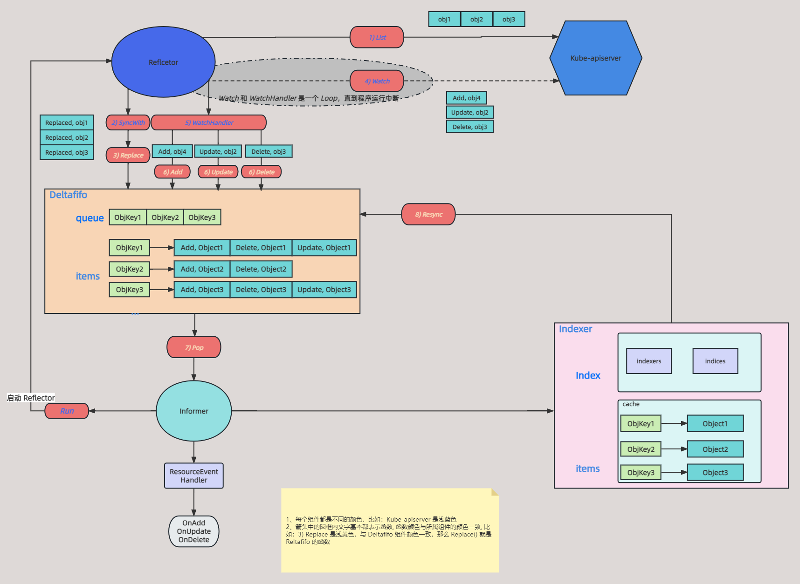

# SharedInformer 原理

## 简介

上一篇详细讲解了 Client-go 中 Indexer 的原理，对于 Reflector、Deltafifo、Indexer 这三个组件的作用都已详细分析，但是如何让这三个组件协同运转起来，就涉及到一个机制，即 Informer。Informer 可以理解为 Client-go 中的大脑，使得 Reflector、Deltafifo、Indexer 协调运转起来。下面通过走读源码的形式来了解 Informer 的原理，本篇基于 [k8s.io/client-go](http://k8s.io/client-go) v0.23.4 源码讲解

## SharedInformer

一般介绍某个组件时，基本都根据其 interface 和该 interface 的具体实现来讲解

### SharedInformer interface

`sharedIndormer` 是一个 Interface

```go
// k8s.io/client-go/tools/cache/shared_informer.go:133
type SharedInformer interface {
    // 添加资源事件处理器，当有资源变化时就会通过回调通知使用者
    AddEventHandler(handler ResourceEventHandler)
    // 需要周期同步的资源事件处理器
    AddEventHandlerWithResyncPeriod(handler ResourceEventHandler, resyncPeriod time.Duration)
    
    // 获取一个 Store 对象，前面我们讲解了很多实现 Store 的结构
    GetStore() Store
    // 获取一个 Controller，下面会详细介绍，主要是用来将 Reflector 和 DeltaFIFO 组合到一起工作
    GetController() Controller

    // SharedInformer 的核心实现，启动并运行这个 SharedInformer
    // 当 stopCh 关闭时候，informer 才会退出
    Run(stopCh <-chan struct{})
    
    // 告诉使用者全量的对象是否已经同步到了本地存储中
    HasSynced() bool
    // 最新同步资源的版本
    LastSyncResourceVersion() string
}

// 在 SharedInformer 基础上扩展了添加和获取 Indexers 的能力
type SharedIndexInformer interface {
    SharedInformer
    // 在启动之前添加 indexers 到 informer 中
    AddIndexers(indexers Indexers) error
    GetIndexer() Indexer
}
```

上面 `SharedInformer` interface 里有个方法是 `AddEventHandler(handler ResourceEventHandler)`，该方法用于注册事件处理器，其参数也是个接口，实现了该接口就能注册资源对象了。

针对三种不同事件类型进行处理

```go
// k8s.io/client-go/tools/cache/controller.go:212

type ResourceEventHandler interface {
	OnAdd(obj interface{})
	OnUpdate(oldObj, newObj interface{})
	OnDelete(obj interface{})
}
```

### sharedIndexInformer

`sharedIndexInformer` 是 上面说的 `SharedInformer` 的一个实现，`sharedIndexInformer` 是一个 struct

```go
// k8s.io/client-go/tools/cache/shared_informer.go:287

type sharedIndexInformer struct {
	// indexer 就是上一篇说的 Indexer
	indexer    Indexer

	// controller 协调 Reflector、Deltafifo、Indexer 的组件
	controller Controller

	// 处理 Deltafifo 的事件处理器
	processor             *sharedProcessor

	// 监控对象在一个时间窗口内是否发生了变化
	cacheMutationDetector MutationDetector

	// listterWatcher 用于 Reflector 执行 List/Watch
	listerWatcher ListerWatcher

	// informer 处理的对象
	objectType runtime.Object

	// 同步周期，就是从 indexer 同步事件到 deltafifo 这个过程
	resyncCheckPeriod time.Duration

	// 任何通过 AddEventHandler 添加的处理程序的默认重新同步的周期
	defaultEventHandlerResyncPeriod time.Duration
	// clock allows for testability
	clock clock.Clock

	started, stopped bool
	startedLock      sync.Mutex

	blockDeltas sync.Mutex

	// 错误处理函数
	watchErrorHandler WatchErrorHandler
}
```

可以知道上面 `sharedIndexInformer` 里很多属性都是前几篇文章介绍过的，比如 indexer、listerWatcher。所以说 Informer 就是协调运行这几个组件的大脑。

下面就看看 Informer 是如何协调运行和工作的

### sharedIndexInformer 初始化

下面看看 `SharedIndexInformer` 初始化

```go
// k8s.io/client-go/tools/cache/shared_informer.go:210

func NewSharedIndexInformer(lw ListerWatcher, exampleObject runtime.Object, defaultEventHandlerResyncPeriod time.Duration, indexers Indexers) SharedIndexInformer {
	realClock := &clock.RealClock{}
	// 设置 sharedIndexInformer 的参数
	sharedIndexInformer := &sharedIndexInformer{
		// processor 用于处理事件
		processor:                       &sharedProcessor{clock: realClock},
		// 初始化 indxer
		indexer:                         NewIndexer(DeletionHandlingMetaNamespaceKeyFunc, indexers),
		// 初始化 listerWatcher，用于 Relfector
		listerWatcher:                   lw,
		objectType:                      exampleObject,
		resyncCheckPeriod:               defaultEventHandlerResyncPeriod,
		defaultEventHandlerResyncPeriod: defaultEventHandlerResyncPeriod,
		cacheMutationDetector:           NewCacheMutationDetector(fmt.Sprintf("%T", exampleObject)),
		clock:                           realClock,
	}
	return sharedIndexInformer
}
```

### sharedIndexInformer 启动

`sharedIndexInformer` 初始化完成，就是启动了

主要逻辑：

- 如果 `sharedIndexInformer` 已经启动则退出，避免多个 Informer 启动
- 初始化 `config`，即上面说的 `sharedIndexInformer` 里的 `config` 字段
- 初始化 `controller`，并设置启动标志
- 协程启动 `processor.run`，用于启动 `processor`
- 启动 `controller`

```go
// k8s.io/client-go/tools/cache/shared_informer.go:368

func (s *sharedIndexInformer) Run(stopCh <-chan struct{}) {
	// 错误捕获并处理
	defer utilruntime.HandleCrash()
	// infromer 已经启动则退出
	if s.HasStarted() {
		klog.Warningf("The sharedIndexInformer has started, run more than once is not allowed")
		return
	}
	// 初始化 Deltafifo 的配置
	fifo := NewDeltaFIFOWithOptions(DeltaFIFOOptions{
		KnownObjects:          s.indexer,
		EmitDeltaTypeReplaced: true,
	})

	// 初始化 sharedInformer.Config
	cfg := &Config{
		Queue:            fifo,
		ListerWatcher:    s.listerWatcher,
		ObjectType:       s.objectType,
		FullResyncPeriod: s.resyncCheckPeriod,
		RetryOnError:     false,
		ShouldResync:     s.processor.shouldResync,
		// s.HanleDeltas 即处理从 Deltafifo Pop 出的数据
		Process:           s.HandleDeltas,
		WatchErrorHandler: s.watchErrorHandler,
	}

	func() {
		s.startedLock.Lock()
		defer s.startedLock.Unlock()
		// 初始化 controller
		s.controller = New(cfg)
		s.controller.(*controller).clock = s.clock
		// 设置 informer 启动标志
		s.started = true
	}()

	processorStopCh := make(chan struct{})
	var wg wait.Group
	defer wg.Wait()              
	defer close(processorStopCh)
	wg.StartWithChannel(processorStopCh, s.cacheMutationDetector.Run)
	// 协程启动 processor.run
	wg.StartWithChannel(processorStopCh, s.processor.run)

	defer func() {
		s.startedLock.Lock()
		defer s.startedLock.Unlock()
		s.stopped = true // 设置 stop 标志
	}()
	// 启动 controller
	s.controller.Run(stopCh)
}
```

所以说，`sharedIndexInformer` 启动主要是启动 `processor` 和 `controller`，下面具体看看这两个的实现。

## Controller

先看 `controller`

### Controller interface

上面 `sharedIndexInformer` 定义中有个重要的字段：`controller`，`controller` 的作用就是把 Deltafifo、Reflector、Indexer 这些组件组合起来，协同运行起来。

`Controller` 是一个 Interface:

```go
// k8s.io/client-go/tools/cache/controller.go:98

type Controller interface {
	// 启动 controller
	Run(stopCh <-chan struct{})

	// 是否资源同步到 Deltafifo 中
	HasSynced() bool

	// 最新的资源版本
	LastSyncResourceVersion() string
}
```

### controller struct

`controller`  struct 是 `Controller` 的一个具体实现

```go

// /k8s.io/client-go/tools/cache/controller.go:89
type controller struct {
	// controller 的配置
	config         Config

	// 前面所说的 reflector
	reflector      *Reflector
	reflectorMutex sync.RWMutex
	clock          clock.Clock
}
```

`controller` 中 `config` 字段里面有比较重要的配置，`config` 里有 Reflector、Deltafifo 所需要的。

看看 `controller` 的 `config` 字段具体定义：

```go
// k8s.io/client-go/tools/cache/controller.go:39
type Config struct {
	// 这里的 Queue 是一个 interface，Deltafifo 实现了这个接口
	Queue

	// Reflector 所需要的 listerWatcher
	ListerWatcher

	// DeltaFIFO 队列 Pop 的时候回调函数，用于处理弹出的对象
	Process ProcessFunc

	// 对象类型，也就是 Reflector 中使用的
	ObjectType runtime.Object

	// 同步周期，与上面的 sharedInformer 定义的 resyncPeriod 一样
	FullResyncPeriod time.Duration

	// Reflector 中是否需要 Resync 操作
	ShouldResync ShouldResyncFunc

	// 出现错误是否需要重试
	RetryOnError bool

	// 错误处理函数
	WatchErrorHandler WatchErrorHandler

	// 分页
	WatchListPageSize int64
}
```

### controller 实现

根据上面介绍，`controller` struct 是 `Controller` Interface 的一个具体实现，所以 `controller` 具有 `Run()` 函数，也就是上面 `sharedIndexInformer` 最终启动 `controller` 调用的函数。

具体逻辑：

- 用 `config` 里的参数初始化 Reflector
- 启动 Reflector，所以 Reflector 是通过 Informer 启动的
- 周期调用 `processLoop()` 处理事件

```go
// k8s.io/client-go/tools/cache/controller.go:127
func (c *controller) Run(stopCh <-chan struct{}) {
	defer utilruntime.HandleCrash()
	// 新建一个协程，如果收到系统退出的信号就关闭队列
	go func() {
		<-stopCh
		c.config.Queue.Close()
	}()

	// 初始化 Reflector
	// 可以发现用到了 config 的 listerWatcher，Queue 等
	r := NewReflector(
		c.config.ListerWatcher,
		c.config.ObjectType,
		c.config.Queue,
		c.config.FullResyncPeriod,
	)
	r.ShouldResync = c.config.ShouldResync
	r.WatchListPageSize = c.config.WatchListPageSize
	r.clock = c.clock
	if c.config.WatchErrorHandler != nil {
		r.watchErrorHandler = c.config.WatchErrorHandler
	}

	c.reflectorMutex.Lock()
	c.reflector = r
	c.reflectorMutex.Unlock()

	var wg wait.Group

	// 启动 Reflector，接收到 stopCh 信号才会退出协程
	// r.Run 就是 Reflector 的启动
	wg.StartWithChannel(stopCh, r.Run)
	
	// wait.Unitl() 就是周期性的调用 c.processLoop() 操作处理弹出的对象
	wait.Until(c.processLoop, time.Second, stopCh)
	wg.Wait()
}
```

上面的 `controller.Run` 里有两个重要调用：

- `r.Run`  就是 Reflector 的 `Run()`，主要就是向 Kube-apiserver 发起 ListWatch，具体可见以前的文章 [<< Reflector 原理>>](https://www.sfernetes.com/client-go-reflector/)
- `c.processLoop` 用于处理事件的，主要就是不断从 Deltafifo 中 Pop 出事件然后处理事件。下面具体看看

```go
// k8s.io/client-go/tools/cache/controller.go:181
// 处理队列弹出的对象
func (c *controller) processLoop() {
  // 死循环，不断从队列中弹出对象来处理
	for {
    // 从队列中弹出一个对象，然后处理这个对象
    // 真正处理的是通过 Config 传递进来的 Process 函数
		obj, err := c.config.Queue.Pop(PopProcessFunc(c.config.Process))
		if err != nil {
      // 如果队列关闭了那就直接退出了
			if err == ErrFIFOClosed {
				return
			}
      // 如果配置的是错误后允许重试
			if c.config.RetryOnError {
				// 如果错误可以再重试那么将弹出的对象重新入队列进行处理
				c.config.Queue.AddIfNotPresent(obj)
			}
		}
	}
}
```

可以发现从 Deltafifo Pop 出来的事件通过 `c.config.Process` 来处理，这个函数是 `sharedIndexInformer` 初始化的时候传的。

下面具体看看  `c.config.Process` 接口的实现，这个接口 由 `HandleDeltas` 来实现的

主要逻辑：

- 根据事件类型做出相应操作
- 对于 同步、替换、添加、更新类型，如果 Indexer 中有这个对象，那么直接更新；如果 Indexer 不存在就新增
- 对于删除类型，直接从 Indexer 删除对象
- 同时把事件通知给处理器，这里的处理器主要是拿这些事件做一些业务处理

```go
// k8s.io/client-go/tools/cache/shared_informer.go:537
func (s *sharedIndexInformer) HandleDeltas(obj interface{}) error {
	s.blockDeltas.Lock()
	defer s.blockDeltas.Unlock()

	// Deltas 是一个列表，一个对象会存在多个事件
	for _, d := range obj.(Deltas) {
		// 根据事件类型
		switch d.Type {
		// 同步、替换、新增、更新类型
		case Sync, Replaced, Added, Updated:
			s.cacheMutationDetector.AddObject(d.Object)
			// 如果 indexer 存在该对象，就更新
			if old, exists, err := s.indexer.Get(d.Object); err == nil && exists {
				if err := s.indexer.Update(d.Object); err != nil {
					return err
				}

				isSync := false
				switch {
				case d.Type == Sync:
					// 同步类型的事件
					isSync = true
				// 替换类型的事件
				case d.Type == Replaced:
					if accessor, err := meta.Accessor(d.Object); err == nil {
						if oldAccessor, err := meta.Accessor(old); err == nil {
							isSync = accessor.GetResourceVersion() == oldAccessor.GetResourceVersion()
						}
					}
				}
				// 通知处理器处理事件
				s.processor.distribute(updateNotification{oldObj: old, newObj: d.Object}, isSync)
			} else {
				// 不存在则新增
				if err := s.indexer.Add(d.Object); err != nil {
					return err
				}
				s.processor.distribute(addNotification{newObj: d.Object}, false)
			}
		// 删除类型则直接将数据从 Indexer 删除
		case Deleted:
			if err := s.indexer.Delete(d.Object); err != nil {
				return err
			}
			s.processor.distribute(deleteNotification{oldObj: d.Object}, false)
		}
	}
	return nil
}
```

根据上面 `HandleDeltas` 函数的实现，知道了从 Deltafifo Pop 出的数据，`SharedIndexInformer` 会根据事件类型对 Indxer 进行操作，然后再通知处理器来处理事件。

也就是 `s.processor.distribute` 的实现，下面看看这个函数的具体实现。这个函数的主要逻辑就是将事件添加到一个 channel 中

```go
// k8s.io/client-go/tools/cache/shared_informer.go:613
func (p *sharedProcessor) distribute(obj interface{}, sync bool) {
	p.listenersLock.RLock()
	defer p.listenersLock.RUnlock()

	if sync {
		for _, listener := range p.syncingListeners {
			// 将事件添加到 channel
			listener.add(obj)
		}
	} else {
		for _, listener := range p.listeners {
			// 将事件添加到 channel
			listener.add(obj)
		}
	}
}

// k8s.io/client-go/tools/cache/shared_informer.go:714
func (p *processorListener) add(notification interface{}) {
	p.addCh <- notification
}
```

可以知道事件通过处理器添加到一个 channel 中，所以肯定还有个消费者来消费 channel 里的数据。

这个消费者就是 `SharedProcessor` 里的 `processorListener`，下面具体看看

## SharedProcessor

`SharedProcessor` 就是事件处理器的实现者，根据上面 `SharedIndexInformer` 结构体定义知道它是 `SharedIndexInformer` 结构体里的一个重要属性。先看看其定义：

```go
// k8s.io/client-go/tools/cache/shared_informer.go:588
type sharedProcessor struct {
	// 标志所有处理器是否已经启动成功
	listenersStarted bool

	// 读写锁
	listenersLock    sync.RWMutex

	// 处理器列表
	listeners        []*processorListener

	// 定时处理器列表
	syncingListeners []*processorListener
	clock            clock.Clock

	// 协程同步
	wg               wait.Group
}

// k8s.io/client-go/tools/cache/shared_informer.go:690
type processorListener struct {
	nextCh chan interface{}

	// 无缓存 channel，上面说的 add 函数就是把事件添加到这个 channel 中
	addCh  chan interface{}

	// 处理器接口
	handler ResourceEventHandler
	
	// 缓存事件
	pendingNotifications buffer.RingGrowing

	requestedResyncPeriod time.Duration

	resyncPeriod time.Duration

	nextResync time.Time

	resyncLock sync.Mutex
}
```

### sharedProcessor 启动

主要逻辑：

- 遍历事件处理器列表，分别启动两个协程来运行 `listener.run()`，`listener.pop()`。这两个函数就是协调消费上面 `controller` 生产的数据
- 设置每个事件处理器的启动标志

```go
// k8s.io/client-go/tools/cache/shared_informer.go:628

func (p *sharedProcessor) run(stopCh <-chan struct{}) {
	func() {
		p.listenersLock.RLock()
		defer p.listenersLock.RUnlock()
		// 遍历所有处理器
		for _, listener := range p.listeners {
			// 协程启动 listenr.run
			// 协程启动 listenr.pop
			p.wg.Start(listener.run)
			p.wg.Start(listener.pop)
		}
		// 设置处理器启动标志
		p.listenersStarted = true
	}()
	// 等待退出
	<-stopCh
	p.listenersLock.RLock()
	defer p.listenersLock.RUnlock()
	for _, listener := range p.listeners {
		// 关闭 addCh
		close(listener.addCh) 
	}
	// 等待协程执行完毕
	p.wg.Wait()
}
```

`pop()` 和 `run()` 都是 `sharedProcessor` 中 `processorListener` 字段的方法

### processorListener

`processorListener` 的 `pop()` 用来从 `addCh` 中消费数据

主要逻辑：

- 死循环从 `addCh` channel 获取数据，`addCh` 的数据就是上面 controller 生产出来的
- 如果获取失败，直接返回
- 获取成功则添加到 `nextch` channel 中

```go
// k8s.io/client-go/tools/cache/shared_informer.go:745

func (p *processorListener) pop() {
	// 错误处理
	defer utilruntime.HandleCrash()
	// 通知 run() 关闭
	defer close(p.nextCh) 

	var nextCh chan<- interface{}
	var notification interface{}
	// 死循环
	for {
		select {
		// 这里一开始会阻塞，因为 nexhCh 还没初始化
		case nextCh <- notification:
			// 如果添加成功，从缓存中取一个事件
			var ok bool
			notification, ok = p.pendingNotifications.ReadOne()
			// 没有事件被 Pop, 设置 nextCh 为 nil
			if !ok { 
				// nextCh 为 nil，则会关闭这个 sealect case
				nextCh = nil
			}
		// 从 p.addCh 通道中读取一个事件，消费 addCh 通道
		case notificationToAdd, ok := <-p.addCh:
			// 如果读取失败，直接返回
			if !ok {
				return
			}
			// 如果 notification 为空，则还没有事件分发器来分发事件
			if notification == nil { 
				// 把事件添加到 nextCh channel 中
				notification = notificationToAdd
				nextCh = p.nextCh
			} else { 
					// notification 不为空则添加到缓存中
					p.pendingNotifications.WriteOne(notificationToAdd)
			}
		}
	}
}
```

可以知道 `pop()` 函数从 `addCh` 读取数据然后再添加到 `nextCh` 中。所以肯定还会有消费者从 `nextCh` 中消费数据

`processorListener.run()` 实现了从 `nextCh` 读取数据，然后真正的根据事件类型去处理事件

主要逻辑：

- 周期执行消费 `nextCh` 函数
- 根据事件类型再做出具体动作

```go
// k8s.io/client-go/tools/cache/shared_informer.go:775

func (p *processorListener) run() {
	stopCh := make(chan struct{})
	// 一秒钟执行一次
	wait.Until(func() {
		// 从 nextCh 读取数据
		for next := range p.nextCh {
			// 判断事件类型
			switch notification := next.(type) {
			// 更新事件则调用 OnUpdate 执行
			case updateNotification:
				p.handler.OnUpdate(notification.oldObj, notification.newObj)
			// 新增事件则调用 OnAdd 执行
			case addNotification:
				p.handler.OnAdd(notification.newObj)
			// 删除事件则调用 OnDelete 执行
			case deleteNotification:
				p.handler.OnDelete(notification.oldObj)
			default:
				utilruntime.HandleError(fmt.Errorf("unrecognized notification: %T", next))
			}
		}
		// 当 p.nextCh 是空的且是关闭的时候才能到达这里，关闭 stopCh
		close(stopCh)
	}, 1*time.Second, stopCh)
}
```

到这里就摸清楚了事件处理器是如何消费数据的了，整个生产、消费数据都已经币换了。

最终都是到 `processorListener.Handler`，这个 `Handler` 是怎么传入的，以及它的作用是什么。

## 注册事件处理器

`Handler` 是一个接口类型

```go
// k8s.io/client-go/tools/cache/controller.go:212

type ResourceEventHandler interface {
	OnAdd(obj interface{})
	OnUpdate(oldObj, newObj interface{})
	OnDelete(obj interface{})
}
```

实现了这个接口即可处理事件，在 client-go 一般都是使用 workqueue 中实现的类型，用于将事件先写入队列中，然后再去异步消费，而不是直接拿到数据进行处理，这个后面 workqueue 一篇会详解。

看看注册处理器的逻辑。

主要逻辑：

- 如果 Informer 已经停止了，则直接返回
- 协调同步周期
- 注册事件处理器

```go
// k8s.io/client-go/tools/cache/shared_informer.go:487

func (s *sharedIndexInformer) AddEventHandlerWithResyncPeriod(handler ResourceEventHandler, resyncPeriod time.Duration) {
	s.startedLock.Lock()
	defer s.startedLock.Unlock()

	// informer 已经停止则退出
	if s.stopped {
		klog.V(2).Infof("Handler %v was not added to shared informer because it has stopped already", handler)
		return
	}
	// 如果同步周期大于 0
	if resyncPeriod > 0 {
		// 如果同步周期小于最小时间，则设置同步周期为最小时间
		if resyncPeriod < minimumResyncPeriod {
			klog.Warningf("resyncPeriod %v is too small. Changing it to the minimum allowed value of %v", resyncPeriod, minimumResyncPeriod)
			resyncPeriod = minimumResyncPeriod
		}
		// 如果同步周期小于同步检查周期
		if resyncPeriod < s.resyncCheckPeriod {
			// 如果 informer 已经启动，则设置同步周期为同步检查周期
			if s.started {
				klog.Warningf("resyncPeriod %v is smaller than resyncCheckPeriod %v and the informer has already started. Changing it to %v", resyncPeriod, s.resyncCheckPeriod, s.resyncCheckPeriod)
				resyncPeriod = s.resyncCheckPeriod
			} else {
				// 如果事件处理器的同步周期小于当前的 resyncCheckPeriod 且还没启动
        // 则更新 resyncCheckPeriod 为 resyncPeriod
        // 并相应调整所有监听器的同步周期
				s.resyncCheckPeriod = resyncPeriod
				s.processor.resyncCheckPeriodChanged(resyncPeriod)
			}
		}
	}

	// 新建事件处理器，handler 就是上面所需要调用的
	listener := newProcessListener(handler, resyncPeriod, determineResyncPeriod(resyncPeriod, s.resyncCheckPeriod), s.clock.Now(), initialBufferSize)
	// 如果 informer 没有启动，将事件处理器添加到列表中
	if !s.started {
		s.processor.addListener(listener)
		return
	}

	s.blockDeltas.Lock()
	defer s.blockDeltas.Unlock()
	// 添加处理器
	s.processor.addListener(listener)

  // 这里遍历 indexer 中的所有对象去通知新添加的处理器
	for _, item := range s.indexer.List() {
		listener.add(addNotification{newObj: item})
	}
}
```

上面有个注册事件处理器的逻辑，即 `s.processor.addListener` 

```go
// k8s.io/client-go/tools/cache/shared_informer.go:597

func (p *sharedProcessor) addListener(listener *processorListener) {
	p.listenersLock.Lock()
	defer p.listenersLock.Unlock()
	// 注册事件处理器
	p.addListenerLocked(listener)
	// 如果当前处理器已经启动，则直接启动 run() 和 pop() 
	if p.listenersStarted {
		p.wg.Start(listener.run)
		p.wg.Start(listener.pop)
	}
}

func (p *sharedProcessor) addListenerLocked(listener *processorListener) {
	// 将处理器添加到处理器列表中
	p.listeners = append(p.listeners, listener)
	p.syncingListeners = append(p.syncingListeners, listener)
}
```

## 总结

sharedIndexInformer 大致流程如下：

- 启动 sharedIndexInformer 中会启动 Reflector
- Reflector 流程前面文章已经说过，就是从 Kube-apiserver 获取数据然后写入 Deltafifo 中
- sharedIndexInformer 从 Deltafifo 中消费数据，然后会有以下两个处理步骤：
    - 根据数据类型操做 Indexer 数据
    - 通知事件处理器处理该事件

到这里有可以在之前画的 Client-go 架构图中加上 Informer 的模块了



最终这个事件该如何处理，是开发者需要关心的事，开发者只需实现 `ResourceEventHandler` 接口就行，但是一般 client-go 会用 workqueue 做异步处理，下一篇就详细讲解 workqueue 的原理和作用。