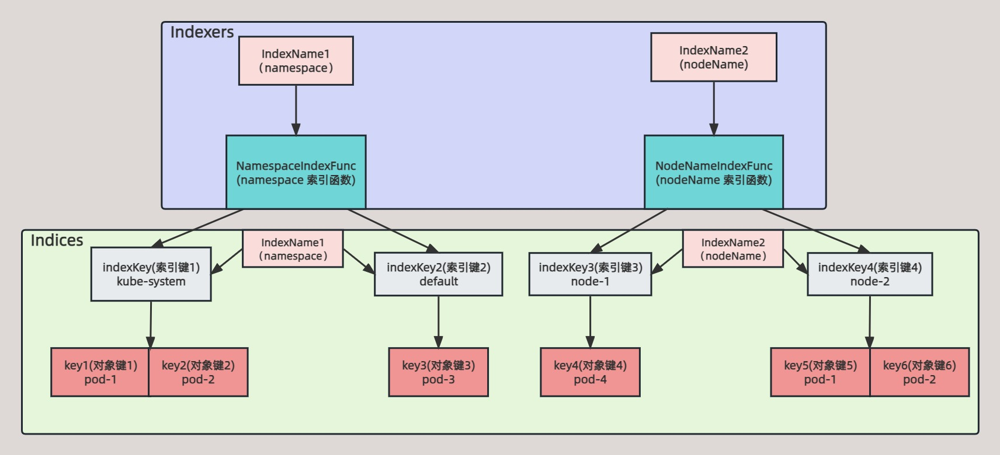
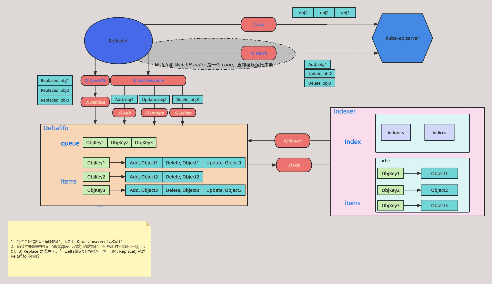

# Indexer 原理

## 简介

上一篇详细讲解了 Deltafifo 的原理，`Pop()` 获取 Deltafifo 的事件进行处理时，最终都是在操作 Indexer。

Indexer 是一个索引缓存，用于缓存 Reflector 从 Kube-apiserver `List/Watch` 到的资源对象，可以理解是一个带索引查询的内存型存储。

下面通过走读源码的形式来了解 Indexer 的原理，本篇基于 [k8s.io/client-go](http://k8s.io/client-go) v0.23.4 源码讲解

## Indexer 理解

Indexer 是一个内存存储组件，但是除了存储功能，还包含索引查询的功能，所以涉及到几个比较难理解的关键词，在介绍 Indexer 之前先讲解这几个关键词的功能和区别。

```go
// Indexers包含了所有索引器(索引分类)及其索引器函数IndexFunc，IndexFunc为计算某个索引键下的所有对象键列表的方法
type Indexers map[string]IndexFunc

// 计算索引键
type IndexFunc func(obj interface{}) ([]string, error)

// Indices包含了所有索引器(索引分类)及其所有的索引数据Index；而Index则包含了索引键以及索引键下的所有对象键的列表；
type Indices map[string]Index

// Index 存储一个索引键的所有对象
type Index map[string]sets.String
```

上面有几个比较难以理解的名词：**Indexers**、**IndexFunc**、**Indices**、**Index**，这四个名词都是关于索引功能的，下面通过例子来阐述。

### Indexers、IndexFunc

Indexers 包含了所有**索引器**(索引分类)及其**索引器函数** IndexFunc，IndexFunc 为计算某个**索引键**下的所有**对象键**列表的方法；

Indexers：**索引器**

IndexFunc：**索引器函数**

```json
Indexers: {  
  "索引器1": 索引函数1,
  "索引器2": 索引函数2,
}
```

示例：

```json
Indexers: {  
  "namespace": MetaNamespaceIndexFunc,
  "nodeName": NodeNameIndexFunc,
}
```

*`MetaNamespaceIndexFunc`* 获取对象的 namespace，该 namespace 作为**索引键**

*`NodeNameIndexFunc`* 获取对象的 nodeName，该 nodeName 作为**索引键**

```go
func MetaNamespaceIndexFunc(obj interface{}) ([]string, error) {
	meta, err := meta.Accessor(obj)
	if err != nil {
		return []string{""}, fmt.Errorf("object has no meta: %v", err)
	}
	return []string{meta.GetNamespace()}, nil
}

func NodeNameIndexFunc(obj interface{}) ([]string, error) {
	pod, ok := obj.(*v1.Pod)
	if !ok {
		return []string{""}, fmt.Errorf("object is not a pod)
	}
	return []string{pod.Spec.NodeName}, nil
}
```

### Indices、Index

Indices 包含了所有**索引器**(索引分类)及其所有的索引数据 Index；而 Index 则包含了**索引键**以及索引键下的所有**对象键**的列表；

```json
Indices: {
	# index
 "索引器1": {  
  "索引键1": ["对象键1", "对象键2"],  
  "索引键2": ["对象键3"],   
 },
 "索引器2": {  
  "索引键3": ["对象键1"],  
  "索引键4": ["对象键2", "对象键3"],  
 }
}
```

示例：

```go
pod1 := &v1.Pod {
    ObjectMeta: metav1.ObjectMeta {
        Name: "pod-1",
        Namespace: "default",
    },
    Spec: v1.PodSpec{
        NodeName: "node1",
    }
}

pod2 := &v1.Pod {
    ObjectMeta: metav1.ObjectMeta {
        Name: "pod-2",
        Namespace: "default",
    },
    Spec: v1.PodSpec{
        NodeName: "node2",
    }
}

pod3 := &v1.Pod {
    ObjectMeta: metav1.ObjectMeta {
        Name: "pod-3",
        Namespace: "kube-system",
    },
    Spec: v1.PodSpec{
        NodeName: "node2",
    }
}
```

```json
Indices: {
 "namespace": {  
  "default": ["pod-1", "pod-2"],  
  "kube-system": ["pod-3"],   
 },
 "nodeName": {  
  "node1": ["pod-1"],  
  "node2": ["pod-2", "pod-3"],  
 }
}
```

### 总结

Indexer、IndexFunc、Indices、Index 弄清这四个组件逻辑非常重要，下图简单做个总结。

这个图想了很久，始终没想到很丝滑的方式呈现出来，大家讲究看吧~



## Indexer 定义

下面具体看看 Indexer 具体结构体定义和实现的 interface。

### Indexer Interface

我们通常所说的 Indexer 理解是一个存储组件，在 Client-go 定义中，*`Indexer`* 是一个 Interface。

*`Indexer`* Interface 继承了 *`Store`* Interface，上一篇 Reflcetor 也继承了 *`Store`* Interface，所以说明 Indexer 也是一个存储；

除了 *`Store`* 之外，*`Indexer`* Interface 还有几个关于索引功能的方法

```go
// k8s.io/client-go/tools/cache/index.go:35

type Indexer interface {
	// Store Interface
	Store
	
	// Index 通过给定索引名称返回其索引值集
	Index(indexName string, obj interface{}) ([]interface{}, error)

	// 该方法通过索引名称和索引值获取所有值的 key
	IndexKeys(indexName, indexedValue string) ([]string, error)

	// 通过索引名称获取所有值
	ListIndexFuncValues(indexName string) []string
	// ByIndex returns the stored objects whose set of indexed values
	// for the named index includes the given indexed value
	ByIndex(indexName, indexedValue string) ([]interface{}, error)

	// 获取 Indexers
	GetIndexers() Indexers

	// AddIndexers adds more indexers to this store.  If you call this after you already have data
	// in the store, the results are undefined.
	AddIndexers(newIndexers Indexers) error
}
```

### Cache Interface

*`Indexer`* Interface 继承了 *`cache`* Interface

```go
type Store interface {

	// 添加数据
	Add(obj interface{}) error

	// 更新数据
	Update(obj interface{}) error

	// 删除数据
	Delete(obj interface{}) error

	// 获取所有数据
	List() []interface{}

	// 获取所有数据的 key, 因为数据都是通过 items 存储的，是一个 map
	ListKeys() []string

	// 获取与 obj 相同 key 的数据
	Get(obj interface{}) (item interface{}, exists bool, err error)

	// 通过指定 key 获取对应数据
	GetByKey(key string) (item interface{}, exists bool, err error)

	// 用 []interface 替换 store 所有数据
	Replace([]interface{}, string) error

	// 重新同步，每个 store 实现的逻辑不一样，需要具体分析
	Resync() error

```

### Cache struct

*`cache`* struct 实现了上面的 *`Indexer`* Interface，自然也实现了 *`Store`* Interface，看看 *`cache`* struct 的定义

```go
// k8s.io/client-go/tools/cache/store.go:139

type cache struct {
	// 是一个 ThreadSafeStore 接口的实现，threadSafeMap 结构体实现这个接口
	cacheStorage ThreadSafeStore
	// 计算对象的 key
	keyFunc KeyFunc
}
```

cache，有两个字段，一个是 *`ThreadSafeStore`* 接口的实现，还有一个计算对象 key 的函数。

*`ThreadSafeStore`* 接口的实现是 *`threadSafeMap`* 结构体，这个结构体包含了真正缓存数据的 items，以及一些索引功能相关的字段

### ThreadSafeStore Interface

*`cache`* struct 内的 *`cacheStorage`* 字段是 *`ThreadSafeStore`* Interface 的一个实现，下面看看该 Interface 的定义：

```go
type ThreadSafeStore interface {
	Add(key string, obj interface{})
	Update(key string, obj interface{})
	Delete(key string)
	Get(key string) (item interface{}, exists bool)
	List() []interface{}
	ListKeys() []string
	Replace(map[string]interface{}, string)
	Index(indexName string, obj interface{}) ([]interface{}, error)
	IndexKeys(indexName, indexKey string) ([]string, error)
	ListIndexFuncValues(name string) []string
	ByIndex(indexName, indexKey string) ([]interface{}, error)
	GetIndexers() Indexers

	// AddIndexers adds more indexers to this store.  If you call this after you already have data
	// in the store, the results are undefined.
	AddIndexers(newIndexers Indexers) error
	// Resync is a no-op and is deprecated
	Resync() error
}
```

发现 ThreadSafeStore interface 与上面的 Indexer interface 方法基本一致，不同的是 Indexer 方法的入参都是 obj 对象，而 ThreadSafeStore 方法的入参多了一个 key，这个 key 就是索引键。

### threadSafeMap struct

*`threadSafeMap`* struct  实现了上面的 *`ThreadSafeStore`* Interface，这个结构体包含了真正缓存数据的 items，以及一些索引功能相关的字段。

```go
// k8s.io/client-go/tools/cache/thread_safe_store.go:63

type threadSafeMap struct {
	lock  sync.RWMutex
	// 真正存储数据的地方
	items map[string]interface{}

	// indexers 索引器映射 IndexFunc，IndexFunc 用于获取对象的索引键
	indexers Indexers
	// indices  索引器映射 Index，Index 则包含了索引键以及索引键下的所有对象键的列表
	indices Indices
}
```

## Indexer 实例化

下面所说的 Indexer 都表示 *`cache`* struct

介绍了 Indexer 的接口以及结构体定义，接下来看看 Indexer 是如何实例化的。上一篇 Deltafifo 原理讲 *`KeyListerGetter`* 章节说到，Indexer 的实例化是作为 *`newInformer()`* 的入参传进来的

```go
// k8s.io/client-go/tools/cache/controller.go:316

func NewInformer(
	lw ListerWatcher,
	objType runtime.Object,
	resyncPeriod time.Duration,
	h ResourceEventHandler,
) (Store, Controller) {
	// 实例化 store，也就是 indexer
	// DeletionHandlingMetaNamespaceKeyFunc 是 keyFunc 的实现
	clientState := NewStore(DeletionHandlingMetaNamespaceKeyFunc)

	return clientState, newInformer(lw, objType, resyncPeriod, h, clientState, nil)
}

// k8s.io/client-go/tools/cache/store.go:258

func NewStore(keyFunc KeyFunc) Store {
	return &cache{
		// threadSafeMap 实例化
		cacheStorage: NewThreadSafeStore(Indexers{}, Indices{}),
		keyFunc:      keyFunc,
	}
}
```

同上 Indexer 的实例化，也就知道了 Indexer 两个字段：KeyFunc，cacheStorage 的实例化。

### KeyFunc

*`KeyFunc`* 是 Indxer 的一个字段，用于计算指定对象的 Key(对象键)

通过上面 Indexer 初始化知道 *`KeyFunc`* 是 *`DeletionHandlingMetaNamespaceKeyFunc`*

```go
// k8s.io/client-go/tools/cache/controller.go:294

func DeletionHandlingMetaNamespaceKeyFunc(obj interface{}) (string, error) {
	// 校验对象删除状态是否 Unknown
	if d, ok := obj.(DeletedFinalStateUnknown); ok {
		return d.Key, nil
	}
	// 计算 key
	return MetaNamespaceKeyFunc(obj)
}
```

上一篇讲解 Deltafifo 的 *`KeyFunc`* 章节知道 Deltafifo 存储的数据的 Key 是通过 *`MetaNamespaceKeyFunc`* 计算的，为什么 Indexer 的 Key 需要先校验 *`DeletedFinalStateUnknown`* 呢？

### cacheStorage

*`cacheStorage`* 是 Indxer 第二个字段，实现了 *`ThreadSafeStore`* Interface

```go
// k8s.io/client-go/tools/cache/thread_safe_store.go:333

func NewThreadSafeStore(indexers Indexers, indices Indices) ThreadSafeStore {
	return &threadSafeMap{
		items:    map[string]interface{}{},
		indexers: indexers,
		indices:  indices,
	}
}
```

*`NewThreadSafeStore`* 方法就是初始化上面的 *`threadSafeMap`* struct

## Indexer 操作数据

Deltafifo 的 *`Pop()`* 方法从 Deltafifo 消费事件然后调用 Indexer 的一些方法来操作数据，下面具体看看 Indexer 操作数据的方法。

### cache

cache 就是对 ThreadSafeStore 的一个再次封装，很多操作都是直接调用的 ThreadSafeStore 的操作实现的，如下所示：

```go
// k8s.io/client-go/tools/cache/store.go

// Add 插入一个元素到 cache 中
func (c *cache) Add(obj interface{}) error {
	key, err := c.keyFunc(obj)  // 生成对象键
	if err != nil {
		return KeyError{obj, err}
	}
  // 将对象添加到底层的 ThreadSafeStore 中
	c.cacheStorage.Add(key, obj)
	return nil
}

// 更新cache中的对象
func (c *cache) Update(obj interface{}) error {
	key, err := c.keyFunc(obj)
	if err != nil {
		return KeyError{obj, err}
	}
	c.cacheStorage.Update(key, obj)
	return nil
}

// 删除cache中的对象
func (c *cache) Delete(obj interface{}) error {
	key, err := c.keyFunc(obj)
	if err != nil {
		return KeyError{obj, err}
	}
	c.cacheStorage.Delete(key)
	return nil
}

// 得到cache中所有的对象
func (c *cache) List() []interface{} {
	return c.cacheStorage.List()
}

// 得到cache中所有的对象键
func (c *cache) ListKeys() []string {
	return c.cacheStorage.ListKeys()
}

// 得到cache中的Indexers
func (c *cache) GetIndexers() Indexers {
	return c.cacheStorage.GetIndexers()
}

// 得到对象obj与indexName索引器关联的所有对象
func (c *cache) Index(indexName string, obj interface{}) ([]interface{}, error) {
	return c.cacheStorage.Index(indexName, obj)
}

func (c *cache) IndexKeys(indexName, indexKey string) ([]string, error) {
	return c.cacheStorage.IndexKeys(indexName, indexKey)
}

func (c *cache) ListIndexFuncValues(indexName string) []string {
	return c.cacheStorage.ListIndexFuncValues(indexName)
}

func (c *cache) ByIndex(indexName, indexKey string) ([]interface{}, error) {
	return c.cacheStorage.ByIndex(indexName, indexKey)
}

func (c *cache) AddIndexers(newIndexers Indexers) error {
	return c.cacheStorage.AddIndexers(newIndexers)
}

func (c *cache) Get(obj interface{}) (item interface{}, exists bool, err error) {
	key, err := c.keyFunc(obj)
	if err != nil {
		return nil, false, KeyError{obj, err}
	}
	return c.GetByKey(key)
}

func (c *cache) GetByKey(key string) (item interface{}, exists bool, err error) {
	item, exists = c.cacheStorage.Get(key)
	return item, exists, nil
}

// 替换cache中所有的对象
func (c *cache) Replace(list []interface{}, resourceVersion string) error {
	items := make(map[string]interface{}, len(list))
	for _, item := range list {
		key, err := c.keyFunc(item)
		if err != nil {
			return KeyError{item, err}
		}
		items[key] = item
	}
	c.cacheStorage.Replace(items, resourceVersion)
	return nil
}

func (c *cache) Resync() error {
	return nil
}
```

可以看到 cache 没有自己独特的实现方式，都是调用的包含的 `ThreadSafeStore` 操作接口。

### Add、Update、Delete、Replace

Indexer 的这四个方法最终调用的是 *`ThreadSafeStore`* 的 Add、Update、Delete、Replace*。*

```go
// k8s.io/client-go/tools/cache/thread_safe_store.go:73

func (c *threadSafeMap) Add(key string, obj interface{}) {
	// 加锁，保证并发安全
	c.lock.Lock()
	defer c.lock.Unlock()
	// 获取旧的数据，不存在为零值
	oldObject := c.items[key]
	// 更新当前 key 的值，即存储数据
	c.items[key] = obj
	// 更新索引，因为 Indexer 具有索引功能
	c.updateIndices(oldObject, obj, key)
}

func (c *threadSafeMap) Update(key string, obj interface{}) {
	c.lock.Lock()
	defer c.lock.Unlock()
	oldObject := c.items[key]
	c.items[key] = obj
	c.updateIndices(oldObject, obj, key)
}

func (c *threadSafeMap) Delete(key string) {
	c.lock.Lock()
	defer c.lock.Unlock()
	if obj, exists := c.items[key]; exists {
		c.updateIndices(obj, nil, key)
		delete(c.items, key)
	}
}

// 替换所有对象，相当于重新构建索引
// Replace 方法用于 Reflector 第一次 List 的数据进行同步
func (c *threadSafeMap) Replace(items map[string]interface{}, resourceVersion string) {
	c.lock.Lock()
	defer c.lock.Unlock()
  // 直接覆盖之前的对象
	c.items = items

	// 重新构建索引
	c.indices = Indices{}
	for key, item := range c.items {
    // 更新元素的索引
		c.updateIndices(nil, item, key)
	}
}
```

发现 threadSafeMap 的 *`Add`、`Update`、`Delete`、`Replace`* 最终都是调用 threadSafeMap 的 `updateIndices` 来实现数据操作，下面看看 `updateIndices` 的具体实现。

```go
// k8s.io/client-go/tools/cache/thread_safe_store.go:259

func (c *threadSafeMap) updateIndices(oldObj interface{}, newObj interface{}, key string) {
	var oldIndexValues, indexValues []string
	var err error
	for name, indexFunc := range c.indexers {
		// 如果旧对象存在，获取该对象下的
		if oldObj != nil {
			oldIndexValues, err = indexFunc(oldObj)
		} else {
			oldIndexValues = oldIndexValues[:0]
		}
		if err != nil {
			panic(fmt.Errorf("unable to calculate an index entry for key %q on index %q: %v", key, name, err))
		}
		// 如果新对象存在，计算其索引器
		if newObj != nil {
			indexValues, err = indexFunc(newObj)
		} else {
			indexValues = indexValues[:0]
		}
		if err != nil {
			panic(fmt.Errorf("unable to calculate an index entry for key %q on index %q: %v", key, name, err))
		}
		// 获取该索引下的所有对象列表
		index := c.indices[name]
		// 如果对象为空，则初始化一个
		if index == nil {
			index = Index{}
			c.indices[name] = index
		}

		for _, value := range oldIndexValues {
			// We optimize for the most common case where index returns a single value.
			if len(indexValues) == 1 && value == indexValues[0] {
				continue
			}
			// 删除索引键
			c.deleteKeyFromIndex(key, value, index)
		}
		for _, value := range indexValues {
			// We optimize for the most common case where index returns a single value.
			if len(oldIndexValues) == 1 && value == oldIndexValues[0] {
				continue
			}
			// 将当前 key 加入到索引器中
			c.addKeyToIndex(key, value, index)
		}
	}
}
```

可以看到基本的实现比较简单，就是添加、更新、删除对象数据后，然后更新或删除对应的索引，所以我们需要查看下更新或删除索引的具体实现：

```go
// k8s.io/client-go/tools/cache/thread_safe_store.go

// updateIndices 更新索引
func (c *threadSafeMap) updateIndices(oldObj interface{}, newObj interface{}, key string) {
	// 如果有旧的对象，需要先从索引中删除这个对象
	if oldObj != nil {
		c.deleteFromIndices(oldObj, key)
	}
  // 循环所有的索引器
	for name, indexFunc := range c.indexers {
    // 获取对象的索引键
		indexValues, err := indexFunc(newObj)
		if err != nil {
			panic(fmt.Errorf("unable to calculate an index entry for key %q on index %q: %v", key, name, err))
		}
    // 得到当前索引器的索引
		index := c.indices[name]
		if index == nil {
      // 没有对应的索引，则初始化一个索引
			index = Index{}
			c.indices[name] = index
		}
    // 循环所有的索引键
		for _, indexValue := range indexValues {
      // 得到索引键对应的对象键列表
			set := index[indexValue]
			if set == nil {
        // 没有对象键列表则初始化一个空列表
				set = sets.String{}
				index[indexValue] = set
			}
      // 将对象键插入到集合中，方便索引
			set.Insert(key)
		}
	}
}

// deleteFromIndices 删除对象索引
func (c *threadSafeMap) deleteFromIndices(obj interface{}, key string) {
  // 循环所有的索引器
	for name, indexFunc := range c.indexers {
    // 获取删除对象的索引键列表
		indexValues, err := indexFunc(obj)
		if err != nil {
			panic(fmt.Errorf("unable to calculate an index entry for key %q on index %q: %v", key, name, err))
		}
    // 获取当前索引器的索引
		index := c.indices[name]
		if index == nil {
			continue
		}
    // 循环所有索引键
		for _, indexValue := range indexValues {
      // 获取索引键对应的对象键列表
			set := index[indexValue]
			if set != nil {
        // 从对象键列表中删除当前要删除的对象键
				set.Delete(key)

				// 如果当集合为空的时候不删除set，那么具有高基数的短生命资源的 indices 会导致未使用的空集合随时间增加内存。
        // `kubernetes/kubernetes/issues/84959`.
        if len(set) == 0 {
					delete(index, indexValue)
				}
			}
		}
	}
}
```

添加索引和删除索引的实现都挺简单的，其实主要还是要对 indices、indexs 这些数据结构非常了解，这样就非常容易了，我们可以将 `indexFunc` 当成当前对象的命名空间来看待，这样对于上面的索引更新和删除的理解就肯定没问题了。

### Get、List、ListKeys

然后接下来就是几个查询相关的接口实现

```go
// k8s.io/client-go/tools/cache/thread_safe_store.go:98

// 获取对象
func (c *threadSafeMap) Get(key string) (item interface{}, exists bool) {
	// 只需要读锁
	c.lock.RLock()  
	defer c.lock.RUnlock()
  // 直接从 map 中读取值
	item, exists = c.items[key]
	return item, exists
}

// 对象列举
func (c *threadSafeMap) List() []interface{} {
	// 只需要读锁
	c.lock.RLock()
	defer c.lock.RUnlock()
	list := make([]interface{}, 0, len(c.items))
	// 将对象添加到 list 中
	for _, item := range c.items {
		list = append(list, item)
	}
	return list
}

// 返回 threadSafeMap 中所有的对象键列表
func (c *threadSafeMap) ListKeys() []string {
	c.lock.RLock()
	defer c.lock.RUnlock()
	list := make([]string, 0, len(c.items))
	for key := range c.items {
		list = append(list, key)
	}
	return list
}
```

### Index

Index 方法用于获取指定索引的所有对象

```go
// k8s.io/client-go/tools/cache/thread_safe_store.go

// 通过指定的索引器和对象获取符合这个对象特征的所有对象
func (c *threadSafeMap) Index(indexName string, obj interface{}) ([]interface{}, error) {
	c.lock.RLock()
	defer c.lock.RUnlock()
  // 获得索引器 indexName 的索引键计算函数
	indexFunc := c.indexers[indexName]
	if indexFunc == nil {
		return nil, fmt.Errorf("Index with name %s does not exist", indexName)
	}
  // 获取指定 obj 对象的索引键
	indexedValues, err := indexFunc(obj)
	if err != nil {
		return nil, err
	}
  // 获得索引器 indexName 的所有索引
	index := c.indices[indexName]
 
  // 用来存储对象键的集合
	var storeKeySet sets.String
	if len(indexedValues) == 1 {
    // 大多数情况下只有一个值匹配（默认获取的索引键就是对象的 namespace）
    // 直接拿到这个索引键的对象键集合
		storeKeySet = index[indexedValues[0]]
	} else {
    // 由于有多个索引键，则可能有重复的对象键出现，索引需要去重
		storeKeySet = sets.String{}
    // 循环索引键
		for _, indexedValue := range indexedValues {
      // 循环索引键下面的对象键，因为要去重
			for key := range index[indexedValue] {
				storeKeySet.Insert(key)
			}
		}
	}
  // 拿到了所有的对象键集合过后，循环拿到所有的对象集合
	list := make([]interface{}, 0, storeKeySet.Len())
	for storeKey := range storeKeySet {
		list = append(list, c.items[storeKey])
	}
	return list, nil
}
```

这个 Index 函数就是获取一个指定对象的索引键，然后把这个索引键下面的所有的对象全部获取到，比如我们要获取一个 Pod 所在命名空间下面的所有 Pod，如果更抽象一点，就是符合对象*某些特征*的所有对象，而这个特征就是我们指定的索引键函数计算出来的。

### ByIndex

然后接下来就是一个比较重要的 `ByIndex` 函数的实现：

```go
// k8s.io/client-go/tools/cache/thread_safe_store.go

// 和上面的 Index 函数类似，只是是直接指定的索引键
func (c *threadSafeMap) ByIndex(indexName, indexedValue string) ([]interface{}, error) {
	c.lock.RLock()
	defer c.lock.RUnlock()
  
  // 获得索引器 indexName 的索引键计算函数
	indexFunc := c.indexers[indexName]
	if indexFunc == nil {
		return nil, fmt.Errorf("Index with name %s does not exist", indexName)
	}
  // 获得索引器 indexName 的所有索引
	index := c.indices[indexName]
  // 获取指定索引键的所有所有对象键
	set := index[indexedValue]
  // 然后根据对象键遍历获取对象
	list := make([]interface{}, 0, set.Len())
	for key := range set {
		list = append(list, c.items[key])
	}

	return list, nil
}
```

可以很清楚地看到 `ByIndex` 函数和 Index 函数比较类似，但是更简单了，因为不需要通过索引函数计算索引键了，直接获取一个指定的索引键的全部资源对象。

### IndexKeys、ListIndexFuncValues、GetIndexers、AddIndexers

然后是其他几个索引相关的函数：

```go
// k8s.io/client-go/tools/cache/thread_safe_store.go

// IndexKeys 和上面的 ByIndex 几乎是一样的，只是这里是直接返回对象键列表
func (c *threadSafeMap) IndexKeys(indexName, indexedValue string) ([]string, error) {
	c.lock.RLock()
	defer c.lock.RUnlock()
  // 获取索引器 indexName 的索引键计算函数
	indexFunc := c.indexers[indexName]
	if indexFunc == nil {
		return nil, fmt.Errorf("Index with name %s does not exist", indexName)
	}
  // 获取索引器 indexName 的所有索引
	index := c.indices[indexName]
	// 直接获取指定索引键的对象键集合
	set := index[indexedValue]
	return set.List(), nil
}

// 获取索引器下面的所有索引键
func (c *threadSafeMap) ListIndexFuncValues(indexName string) []string {
	c.lock.RLock()
	defer c.lock.RUnlock()
  // 获取索引器 indexName 的所有索引
	index := c.indices[indexName]
	names := make([]string, 0, len(index))
  // 遍历索引得到索引键
	for key := range index {
		names = append(names, key)
	}
	return names
}

// 直接返回 indexers
func (c *threadSafeMap) GetIndexers() Indexers {
	return c.indexers
}

// 添加一个新的 Indexers
func (c *threadSafeMap) AddIndexers(newIndexers Indexers) error {
	c.lock.Lock()
	defer c.lock.Unlock()

	if len(c.items) > 0 {
		return fmt.Errorf("cannot add indexers to running index")
	}
  // 获取旧的索引器和新的索引器keys
	oldKeys := sets.StringKeySet(c.indexers)
	newKeys := sets.StringKeySet(newIndexers)
  
  // 如果包含新的索引器，则提示冲突
	if oldKeys.HasAny(newKeys.List()...) {
		return fmt.Errorf("indexer conflict: %v", oldKeys.Intersection(newKeys))
	}
  // 将新的索引器添加到 Indexers 中
	for k, v := range newIndexers {
		c.indexers[k] = v
	}
	return nil
}

// 没有真正实现 Resync 操作 
func (c *threadSafeMap) Resync() error {
	return nil
}
```

这里我们就将 ThreadSafeMap 的实现进行了分析说明。整体来说比较方便，一个就是将对象数据存入到一个 map 中，然后就是维护索引，方便根据索引来查找到对应的对象。

## 总结

经过上面的分析，Indexer 主要两个功能：缓存数据、数据具有索引功能，Client-go 原理图再添加 Indexer 的部分。



前面我们已经知道了 Reflector 通过 `ListAndWatch` 把数据传入 DeltaFIFO 后，经过 DeltaFIFO 的 `Pop` 函数将资源对象存入到了本地的一个存储 Indexer 中，而这个底层真正的存储其实就是上面的 ThreadSafeStore。

要理解 Indexer 组件，最主要就是要把索引、索引器（索引分类）、索引键、对象键这几个概念弄清楚，有时候确实容易混乱，我们将上面的示例理解了应该就很好理解了，我们可以简单的理解为 Indexer 就是简单的把相同命名空间的对象放在一个集合中，然后基于命名空间来查找对象。

介绍完 Indexer 的内容后，Client-go 的核心几个组件就介绍完了，但是还缺少一个组件把 Reflector、Deltafifo、Indexer 这三个组件串联起来工作，这个组件就是 Informer，下一章介绍 Informer 的内容。

Indexer 在实现多索引的本地缓存的思路，特别在代码可复用方面，值得我们学习借鉴。