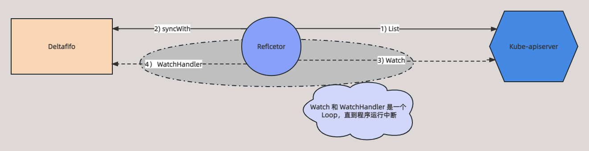

# Reflector 原理

## 简介

从这一篇开始，就详细讲解 Client-go 中组件的原理，并通过源码走读的形式来摸清里面的逻辑，按照 Client-go 架构，先从 Reflector 组件开始。

在 Client-go 架构中，Reflector 与 Kube-apiserver 连接，并且可以从 Kube-apiserver  *`List`* 和  *`Watch`* 资源数据。*`List`* 可以从 Kube-apiserver 获取全量对应资源数据，*`Watch`* 则可以实现与 Kube-apiserver 的长连接，不断监听集群资源的变化，将数据和事件添加到 Deltafifo 中。下面这张图可以看出 Reflector 组件在 Client-go 的作用。


## Reflector 源码解析

本篇基于 [k8s.io/client-go](http://k8s.io/client-go) v0.23.4 源码讲解

### 结构体定义

先通过 Reflector 结构体定义来大概看看 Reflector 的作用和其字段的作用。

```go
// k8s.io/client-go/tools/cache/reflector.go:49

type Reflector struct {
	// name 标识这个反射器的名称，默认为 文件:行数（比如reflector.go:125）
  // 默认名字通过 k8s.io/apimachinery/pkg/util/naming/from_stack.go 下面的 GetNameFromCallsite 函数生成
	name string

	// 期望放到 Store 中的类型名称，如果提供，则是 expectedGVK 的字符串形式
  // 否则就是 expectedType 的字符串，它仅仅用于显示，不用于解析或者比较。
	expectedTypeName string

	// 期望放到 Store 中的类型
	// 只有类型需要正确，除非是非结构化。非结构化`对象的`“apiVersion”`和“Kind”也必须是正确的。
	expectedType reflect.Type

	// 如果是非结构化的，我们希望放置在 Store 中的对象的GVK.
	expectedGVK *schema.GroupVersionKind

	// 同步事件的目标存储，指 Deltafifo
	store Store

	// listerWatcher 是一个接口，包括 List() 和 Watch() 两个方法
	listerWatcher ListerWatcher

	// 管理循环 List 和 Watch 
	backoffManager wait.BackoffManager

	// initConnBackoffManager 管理 ListWatch 的连接
	initConnBackoffManager wait.BackoffManager

	// 重新同步周期，指从 Indexer 同步数据到 Deltafifo
	resyncPeriod time.Duration

	// ShouldResync 会周期性的被调用，当返回 true 的时候，就会调用 Store 的 Resync 操作
	ShouldResync func() bool

	// clock allows tests to manipulate time
	clock clock.Clock

	// paginatedResult定义是否应为列表调用强制分页
	// 它是根据初始列表调用的结果设置的
	paginatedResult bool

	// 最新的 ResourceVersion
	lastSyncResourceVersion string

	// 如果带有lastSyncResourceVersion的上一个 List 或 Watch 请求因“过期”或“资源版本太大”错误而失败，则isLastSyncResourceVersionUnavailable为true。
	isLastSyncResourceVersionUnavailable bool

	// 互斥锁，保证操作原子性
	lastSyncResourceVersionMutex sync.RWMutex

	// 分页大小
	WatchListPageSize int64

	// List 和 Watch 失败了会调用失败处理
	watchErrorHandler WatchErrorHandler
}
```

看看 Reflector 是如何初始化的

```go
// k8s.io/client-go/tools/cache/reflector.go:171

func NewNamedReflector(name string, lw ListerWatcher, expectedType interface{}, store Store, resyncPeriod time.Duration) *Reflector {
	realClock := &clock.RealClock{}
	r := &Reflector{
		name:          name,
		// 初始化 listerWatcher，这是每个资源类型都会实现的接口
		listerWatcher: lw,
		// 初始化 store
		store:         store,
		backoffManager:         wait.NewExponentialBackoffManager(800*time.Millisecond, 30*time.Second, 2*time.Minute, 2.0, 1.0, realClock),
		initConnBackoffManager: wait.NewExponentialBackoffManager(800*time.Millisecond, 30*time.Second, 2*time.Minute, 2.0, 1.0, realClock),
		resyncPeriod:           resyncPeriod,
		clock:                  realClock,
		watchErrorHandler:      WatchErrorHandler(DefaultWatchErrorHandler),
	}
	r.setExpectedType(expectedType)
	return r
}
```

需要重点关注 *`NewNamedReflector`* 函数入参的 *`ListerWatcher`* 和 *`store`*，前面结构体定义说到 *`ListerWatcher`* 是一个结构，所以需要传入一个实现该接口的实例，*`store`* 是 Deltafifo 的一个实例。

初始化完成之后，就是运行 Reflector。



上图可以看出 Reflector 运行基本原理，下面通过源码走读来佐证上图。

```go
// k8s.io/client-go/tools/cache/reflector.go:171:218

func (r *Reflector) Run(stopCh <-chan struct{}) {
	klog.V(3).Infof("Starting reflector %s (%s) from %s", r.expectedTypeName, r.resyncPeriod, r.name)
	// 反复运行 ListAndWatch
	wait.BackoffUntil(func() {
		if err := r.ListAndWatch(stopCh); err != nil {
			r.watchErrorHandler(r, err)
		}
	}, r.backoffManager, true, stopCh)
	klog.V(3).Infof("Stopping reflector %s (%s) from %s", r.expectedTypeName, r.resyncPeriod, r.name)
}

// k8s.io/client-go/tools/cache/reflector.go:171:254

// 首先 List 全量数据以及当前数据的 ResourceVersion
// 用这个 ResourceVersion 去 Watch 资源
func (r *Reflector) ListAndWatch(stopCh <-chan struct{}) error {
	klog.V(3).Infof("Listing and watching %v from %s", r.expectedTypeName, r.name)
	var resourceVersion string

	options := metav1.ListOptions{ResourceVersion: r.relistResourceVersion()}

	if err := func() error {
		initTrace := trace.New("Reflector ListAndWatch", trace.Field{"name", r.name})
		defer initTrace.LogIfLong(10 * time.Second)
		var list runtime.Object
		var paginatedResult bool
		var err error
		listCh := make(chan struct{}, 1)
		panicCh := make(chan interface{}, 1)
		go func() {
			defer func() {
				if r := recover(); r != nil {
					panicCh <- r
				}
			}()
			// 先去尝试分块 List，如果失败则全量 List
			pager := pager.New(pager.SimplePageFunc(func(opts metav1.ListOptions) (runtime.Object, error) {
				return r.listerWatcher.List(opts)
			}))
			switch {
			// 设置分页大小
			case r.WatchListPageSize != 0:
				pager.PageSize = r.WatchListPageSize
			case r.paginatedResult:
				// We got a paginated result initially. Assume this resource and server honor
				// paging requests (i.e. watch cache is probably disabled) and leave the default
				// pager size set.
			case options.ResourceVersion != "" && options.ResourceVersion != "0":
				// 如果 ResourceVersion 不等于 0, 说明已经 List 过了，所以设置分页为 0
				pager.PageSize = 0
			}
			
			// 去 Kube-apiserver List 全量数据，对应上图 (1) 阶段
			list, paginatedResult, err = pager.List(context.Background(), options)
			if isExpiredError(err) || isTooLargeResourceVersionError(err) {
				// list 失败
				r.setIsLastSyncResourceVersionUnavailable(true)
				// 重新设置 ResourceVersion，再去 List
				list, paginatedResult, err = pager.List(context.Background(), metav1.ListOptions{ResourceVersion: r.relistResourceVersion()})
			}
			close(listCh)
		}()
		select {
		case <-stopCh:
			return nil
		case r := <-panicCh:
			panic(r)
		case <-listCh:
		}
		initTrace.Step("Objects listed", trace.Field{"error", err})
		if err != nil {
			klog.Warningf("%s: failed to list %v: %v", r.name, r.expectedTypeName, err)
			return fmt.Errorf("failed to list %v: %v", r.expectedTypeName, err)
		}

		// We check if the list was paginated and if so set the paginatedResult based on that.
		// However, we want to do that only for the initial list (which is the only case
		// when we set ResourceVersion="0"). The reasoning behind it is that later, in some
		// situations we may force listing directly from etcd (by setting ResourceVersion="")
		// which will return paginated result, even if watch cache is enabled. However, in
		// that case, we still want to prefer sending requests to watch cache if possible.
		//
		// Paginated result returned for request with ResourceVersion="0" mean that watch
		// cache is disabled and there are a lot of objects of a given type. In such case,
		// there is no need to prefer listing from watch cache.
		if options.ResourceVersion == "0" && paginatedResult {
			r.paginatedResult = true
		}

		r.setIsLastSyncResourceVersionUnavailable(false) // list 成功
		listMetaInterface, err := meta.ListAccessor(list)
		if err != nil {
			return fmt.Errorf("unable to understand list result %#v: %v", list, err)
		}
		// 获得 list 的最新 ResourceVersion，Watch 数据时就会拿着这个 ResourceVersion 监听，保证数据不会丢失
		resourceVersion = listMetaInterface.GetResourceVersion()
		initTrace.Step("Resource version extracted")
		// 将 runtime.object 转为 []runtime.object
		items, err := meta.ExtractList(list)
		if err != nil {
			return fmt.Errorf("unable to understand list result %#v (%v)", list, err)
		}
		initTrace.Step("Objects extracted")
		// 将 List 数据同步到 Deltafifo 中, 对应上图的 (2) 阶段
		if err := r.syncWith(items, resourceVersion); err != nil {
			return fmt.Errorf("unable to sync list result: %v", err)
		}
		initTrace.Step("SyncWith done")
		// 设置最后一次同步的 ResourceVersion
		r.setLastSyncResourceVersion(resourceVersion)
		initTrace.Step("Resource version updated")
		return nil
	}(); err != nil {
		return err
	}

	resyncerrc := make(chan error, 1)
	cancelCh := make(chan struct{})
	defer close(cancelCh)
	go func() {
		resyncCh, cleanup := r.resyncChan()
		defer func() {
			cleanup() // Call the last one written into cleanup
		}()
		for {
			select {
			case <-resyncCh:
			case <-stopCh:
				return
			case <-cancelCh:
				return
			}
			// 定期同步数据到 Deltafifo
			if r.ShouldResync == nil || r.ShouldResync() {
				klog.V(4).Infof("%s: forcing resync", r.name)
				if err := r.store.Resync(); err != nil {
					resyncerrc <- err
					return
				}
			}
			cleanup()
			resyncCh, cleanup = r.resyncChan()
		}
	}()

	for {
		// 出错能够返回
		select {
		case <-stopCh:
			return nil
		default:
		}

		timeoutSeconds := int64(minWatchTimeout.Seconds() * (rand.Float64() + 1.0))
		options = metav1.ListOptions{
			ResourceVersion: resourceVersion,
			// 设置 Watch 超时，防止 Watch hang 住
			TimeoutSeconds: &timeoutSeconds,
			AllowWatchBookmarks: true,
		}

		// start the clock before sending the request, since some proxies won't flush headers until after the first watch event is sent
		start := r.clock.Now()
		// Watch 资源变化事件, 对应上图的 (3) 阶段
		w, err := r.listerWatcher.Watch(options)
		if err != nil {
			// 如果 watch 出现 ConnectionRefused 和 TooManyRequests 的报错，设置当前数据 ResourceVersion 来 Watch
			if utilnet.IsConnectionRefused(err) || apierrors.IsTooManyRequests(err) {
				<-r.initConnBackoffManager.Backoff().C()
				continue
			}
			return err
		}

		// 处理 Watch 的事件类型，将事件和数据 push 到 Deltafifo，对应上图的 (3) 阶段
		if err := r.watchHandler(start, w, &resourceVersion, resyncerrc, stopCh); err != nil {
			if err != errorStopRequested {
				switch {
				case isExpiredError(err):
					// Don't set LastSyncResourceVersionUnavailable - LIST call with ResourceVersion=RV already
					// has a semantic that it returns data at least as fresh as provided RV.
					// So first try to LIST with setting RV to resource version of last observed object.
					klog.V(4).Infof("%s: watch of %v closed with: %v", r.name, r.expectedTypeName, err)
				case apierrors.IsTooManyRequests(err):
					klog.V(2).Infof("%s: watch of %v returned 429 - backing off", r.name, r.expectedTypeName)
					<-r.initConnBackoffManager.Backoff().C()
					continue
				default:
					klog.Warningf("%s: watch of %v ended with: %v", r.name, r.expectedTypeName, err)
				}
			}
			return nil
		}
	}
}
```

可以看到上面函数就是 ListerWatch 的逻辑，先 *`List`*，然后 *`Watch`*。

### List

Reflector  `List` 全量数据之后，然后 `syncWith`  到 Deltafifo 中，下面看看 `SyncWith` 的逻辑

```go
// k8s.io/client-go/tools/cache/reflector.go:451

func (r *Reflector) syncWith(items []runtime.Object, resourceVersion string) error {
	found := make([]interface{}, 0, len(items))
	for _, item := range items {
		found = append(found, item)
	}
	return r.store.Replace(found, resourceVersion)
}
```

可以看出来，`syncWith` 就是对 `List` 数据存放到 Deltafifio 中。

### Watch

Reflector  Watch 到事件后，调用 `watchHandler` 来对事件进行处理。

```go
// k8s.io/client-go/tools/cache/reflector.go:460

func (r *Reflector) watchHandler(start time.Time, w watch.Interface, resourceVersion *string, errc chan error, stopCh <-chan struct{}) error {
	eventCount := 0

	// Stopping the watcher should be idempotent and if we return from this function there's no way
	// we're coming back in with the same watch interface.
	defer w.Stop()

loop:
	for {
		select {
		case <-stopCh:
			return errorStopRequested
		case err := <-errc:
			return err
		// 获取事件类型，ResultChan() 可以返回事件类型和具体数据，是 Kube-apiserver 定义好的返回体
		case event, ok := <-w.ResultChan():
			// 以下基本都是处理一些错误
			if !ok {
				break loop
			}
			if event.Type == watch.Error {
				return apierrors.FromObject(event.Object)
			}
			if r.expectedType != nil {
				if e, a := r.expectedType, reflect.TypeOf(event.Object); e != a {
					utilruntime.HandleError(fmt.Errorf("%s: expected type %v, but watch event object had type %v", r.name, e, a))
					continue
				}
			}
			if r.expectedGVK != nil {
				if e, a := *r.expectedGVK, event.Object.GetObjectKind().GroupVersionKind(); e != a {
					utilruntime.HandleError(fmt.Errorf("%s: expected gvk %v, but watch event object had gvk %v", r.name, e, a))
					continue
				}
			}
			meta, err := meta.Accessor(event.Object)
			if err != nil {
				utilruntime.HandleError(fmt.Errorf("%s: unable to understand watch event %#v", r.name, event))
				continue
			}
			// 获取 Watch 到的数据的 ResourceVersion
			newResourceVersion := meta.GetResourceVersion()
			// 分别对 ADD,UPDATE,DELETE,Bookmark 事件进行处理，最终都是 Deltafifo 的实现
			switch event.Type {
			case watch.Added:
				err := r.store.Add(event.Object)
				if err != nil {
					utilruntime.HandleError(fmt.Errorf("%s: unable to add watch event object (%#v) to store: %v", r.name, event.Object, err))
				}
   
			case watch.Modified:
				err := r.store.Update(event.Object)
				if err != nil {
					utilruntime.HandleError(fmt.Errorf("%s: unable to update watch event object (%#v) to store: %v", r.name, event.Object, err))
				}
      
			case watch.Deleted:
				// TODO: Will any consumers need access to the "last known
				// state", which is passed in event.Object? If so, may need
				// to change this.
				err := r.store.Delete(event.Object)
				if err != nil {
					utilruntime.HandleError(fmt.Errorf("%s: unable to delete watch event object (%#v) from store: %v", r.name, event.Object, err))
				}
			case watch.Bookmark:
				// A `Bookmark` means watch has synced here, just update the resourceVersion
			default:
				utilruntime.HandleError(fmt.Errorf("%s: unable to understand watch event %#v", r.name, event))
			}
			*resourceVersion = newResourceVersion
			// 设置最新 ResourceVersion
			r.setLastSyncResourceVersion(newResourceVersion)
			if rvu, ok := r.store.(ResourceVersionUpdater); ok {
				// 更新 ResourceVersion
				rvu.UpdateResourceVersion(newResourceVersion)
			}
			eventCount++
		}
	}

	watchDuration := r.clock.Since(start)
	if watchDuration < 1*time.Second && eventCount == 0 {
		return fmt.Errorf("very short watch: %s: Unexpected watch close - watch lasted less than a second and no items received", r.name)
	}
	klog.V(4).Infof("%s: Watch close - %v total %v items received", r.name, r.expectedTypeName, eventCount)
	return nil
}
```

可以看出最终都是分别对事件类型进行处理，数据都是流入 *`Store(Dletafifio)`* 中。

Reflector 主要就是用 *`ListerWatcher`* 接口来获取和监听数据的，所以下面重点分析怎么 实现 *`ListerWatcher`* 接口

### ListerWatcher 的实现

ListerWatcher 接口包含两个方法：*`List()`*，*`Watch()`*

```go
// k8s.io/client-go/tools/cache/listwatch.go:30

// ListFunc 知道如何 List 资源
type ListFunc func(options metav1.ListOptions) (runtime.Object, error)

// WatchFunc 知道如何 watch 资源
type WatchFunc func(options metav1.ListOptions) (watch.Interface, error)

// ListWatch 结构体知道如何 list 和 watch 资源对象，它实现了 ListerWatcher 接口。
// 它为 NewReflector 使用者提供了方便的函数。其中 ListFunc 和 WatchFunc 不能为 nil。
type ListWatch struct {
	ListFunc  ListFunc
	WatchFunc WatchFunc
	// DisableChunking 对 list watcher 请求不分块。
	DisableChunking bool
}

// 列出一组 APIServer 资源
func (lw *ListWatch) List(options metav1.ListOptions) (runtime.Object, error) {
	return lw.ListFunc(options)
}

// Watch 一组 APIServer 资源
func (lw *ListWatch) Watch(options metav1.ListOptions) (watch.Interface, error) {
	return lw.WatchFunc(options)
}
```

先猜想一下，*`List()`*，*`Watch()`* 肯定某种资源类型实现的，这样才能获取当前类型的数据。

前面讲解 Informer 使用的时候，初始化 Pod Informer 的时候其实内部就实现了 pod 的 *`ListAndWatch`*。

```go
// k8s.io/client-go/informers/core/v1/pod.go:58

// 初始化 PodInformer
func NewFilteredPodInformer(client kubernetes.Interface, namespace string, resyncPeriod time.Duration, indexers cache.Indexers, tweakListOptions internalinterfaces.TweakListOptionsFunc) cache.SharedIndexInformer {
	return cache.NewSharedIndexInformer(
		&cache.ListWatch{
			// 初始化 ListFunc
			ListFunc: func(options metav1.ListOptions) (runtime.Object, error) {
				if tweakListOptions != nil {
					tweakListOptions(&options)
				}
				// list() 其实就是调用 clientSet 的 List()
				return client.CoreV1().Pods(namespace).List(context.TODO(), options)
			},
			// 初始化 WatchFunc
			WatchFunc: func(options metav1.ListOptions) (watch.Interface, error) {
				if tweakListOptions != nil {
					tweakListOptions(&options)
				}
				// list() 其实就是调用 clientSet 的 Watch()
				return client.CoreV1().Pods(namespace).Watch(context.TODO(), options)
			},
		},
		&corev1.Pod{},
		resyncPeriod,
		indexers,
	)
}
```

这样看实现一个资源的 *`ListAndWatch`* 比较简单，就是通过调用 ClientSet 的 *`List()`*，*`Watch()`* 即可。

在 Client-go 项目源码中，内置了所有 K8S 内置资源的 Informer 实现，但是平常开发时不应该直接调用这些单独资源的 Informer，推荐使用 SharedInformer，可以降低 Kube-apiserver 的压力，后面会详解 SharedInformer 的使用和原理。

## 总结

根据上面的分析，基本摸清了 Reflector 在 Client-go 中的作用，Reflector 作用在 Kube-apiserver 和 Deltafifo 之间。

Reflector 启动时先从 Kube-apiserver `list` 全量数据，然后 `syncWith` 到 Deltafifo 中，设置 List 数据最新的 `ResourceVersion`，接着根据 `ResourceVersion` 不断 `Watch` 事件，根据事件类型进行处理，

处理流程就是在 Deltafifio 中完成的了，最后再更新当前数据的 ResourceVersion，返回重复这个过程，直到程序运行中断。

可以发现 Reflector 将数据最终都是放到 Deltafifio 中了，所以 接下来就看看 Client-go 的 Deltafifo 的原理。