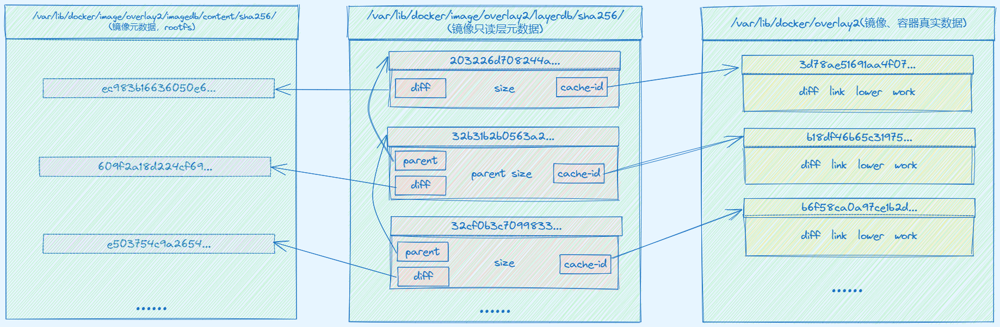
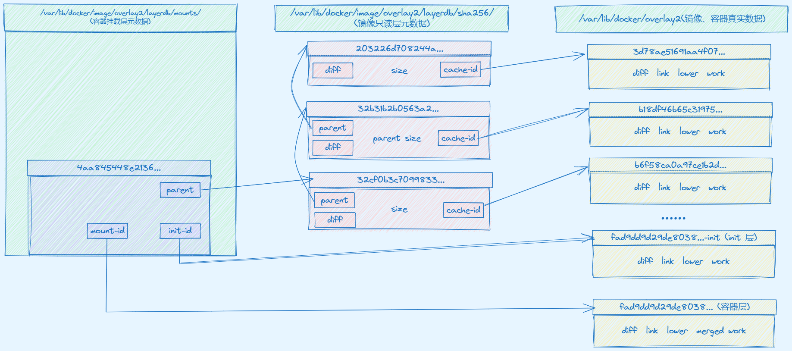
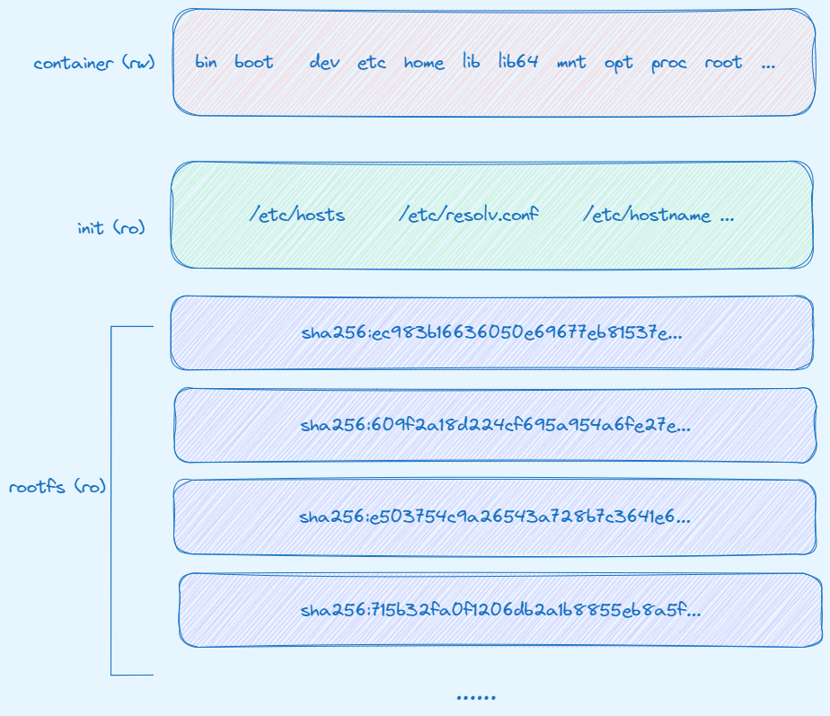

## OverlayFS 存储驱动

上一篇 [容器的文件系统(一): OverlayFS 原理](https://www.sfernetes.com/container-filesystem-overlayfs/) 说到 **OverlayFS** 是类似 **AUFS** 的现代联合文件系统（union filesystem），但是速度更快，实现更简单。

针对 **OverlayFS** 提供了两个**存储驱动**：最初的 `overlay`，以及更新更稳定的 `overlay2` ，这里简单介绍下这两种驱动。

> **OverlayFS** 的发展分为两个阶段。2014 年，**OverlayFS** 第一个版本被合并到 Linux 内核 3.18 版本中，此时的 **OverlayFS** 在 Docker 中使用 **overlay** 驱动。由于第一版的 overlay 驱动存在很多弊端(例如运行一段时间后 Docker 会报 `too many links problem` 的错误)， Linux 内核在 4.0 版本对 overlay 做了很多必要的改进，即 overlay2。
> 

Docker 作为**容器**的管理工具，同样支持这两种 **OverlayFS** 的存储驱动，在 Docker 17.06.02 之后的版本**默认使用 overlay2** ，具体配置可参考[官网](https://docs.docker.com/storage/storagedriver/overlayfs-driver/#configure-docker-with-the-overlay2-storage-driver)，接下来都是围绕 overlay2 展开讲解。

## 使用 overlay2 先决条件

当然 Docker 使用 overlay2 也有前提：

- 你需要系统内核版本 4.0 或者更高版本，除非你是使用 RHEL 或者 CentOS 用户，此时需要内核版本在 3.10.0-514 或更高版本。
- `overlay2` 最好搭配 xfs 文件系统使用，并且使用 xfs 作为底层文件系统时，`d_type` 必须开启，可以使用以下命令验证 `d_type` 是否开启：

```bash
$ xfs_info /var/lib/docker | grep "ftype"
naming   =version 2              bsize=4096   ascii-ci=0 ftype=1
```

当输出结果中有 `ftype=1` 时，表示 d_type 已经开启。如果你的输出结果为 `ftype=0`，则需要重新格式化磁盘目录，命令如下：

```bash
$ mkfs.xfs -f -n ftype=1 /path/to/disk
```

## Image 是如何存储的

Docker 即管理着容器，也管理着镜像，首先看看 Image 是如何存储的？

为了实验现象简洁，Docker 环境是干净的，没有任何镜像和容器，我们先通过 `docker pull nginx` 拉取一个开源 nginx 镜像下来。

```bash
$ docker pull nginx
Using default tag: latest
latest: Pulling from library/nginx
578acb154839: Pull complete 
e398db710407: Pull complete 
85c41ebe6d66: Pull complete 
7170a263b582: Pull complete 
8f28d06e2e2e: Pull complete 
6f837de2f887: Pull complete 
c1dfc7e1671e: Pull complete 
Digest: sha256:86e53c4c16a6a276b204b0fd3a8143d86547c967dc8258b3d47c3a21bb68d3c6
Status: Downloaded newer image for nginx:latest
docker.io/library/nginx:latest
```

当我们pull一个image的时候，可以看到output里面有很多`xxxxxxxx: Pull complete`，这里面每条表示image的一个层。这些层联合挂载起来构成了image的整体的文件结构。我们来看看ubuntu image的rootfs结构：

```json
[
	{
		...
		"GraphDriver": {
        "Data": {
            "LowerDir": "/var/lib/docker/overlay2/b18df46b65c319751cf86317614fceb0087c2babc4eaf2fbcb469c216b8d1ed8/diff:
                         /var/lib/docker/overlay2/94a26712250d2ccd05d0e15816a3483a68cc15843a8ff40adf895f1d51567fbf/diff:
												 /var/lib/docker/overlay2/b3020f86313a62dbc3647f0d8520d72c4ec220462bcab6c493ff18fa30f7a6f5/diff:
												 /var/lib/docker/overlay2/3d78ae51691aa4f07c00ea6168ec6ca54165ebd9d6006d1a743408c5edca1489/diff:
												 /var/lib/docker/overlay2/f0e9d5570c8050176318e2d6e6e5377f8d1482b665cde827b11cafae3fe6154d/diff:
												 /var/lib/docker/overlay2/02b68c4485091fcf697dbe8a5e99622b862f2f63fb72d1c59920d7ef0ad2e16f/diff",
            "MergedDir": "/var/lib/docker/overlay2/b6f58ca0a97ce1b2dbd4b3b459d579ae51eb7ef80f097109e97999185c8ca7a6/merged",
            "UpperDir": "/var/lib/docker/overlay2/b6f58ca0a97ce1b2dbd4b3b459d579ae51eb7ef80f097109e97999185c8ca7a6/diff",
            "WorkDir": "/var/lib/docker/overlay2/b6f58ca0a97ce1b2dbd4b3b459d579ae51eb7ef80f097109e97999185c8ca7a6/work"
        },
        "Name": "overlay2"
		},
		...
	}
]
```

根据上一篇说的 **OverlayFS** 原理知道 lowerDir、upperDir、mergedDir、workDir 这些目录的概念之后，再看这个 nginx 镜像有 6 个 lowerDir，同时也有 upperDir、workDir、mergedDir。

但是这里的 mergedDir，因为还没有创建容器，并没有将 lower 联合挂载起来。

```bash
$ ls /data/docker/overlay2/b6f58ca0a97ce1b2dbd4b3b459d579ae51eb7ef80f097109e97999185c8ca7a6/merged
ls: 无法访问'/data/docker/overlay2/b6f58ca0a97ce1b2dbd4b3b459d579ae51eb7ef80f097109e97999185c8ca7a6/merged': 没有那个文件或目录
```

下面看看每个 lower 层的内容。`ls -l /var/lib/docker/overlay2/`

```bash
$ ls -l
总用量 68
drwx--x--- 3 root root  4096 11月 10 20:42 02b68c4485091fcf697dbe8a5e99622b862f2f63fb72d1c59920d7ef0ad2e16f
drwx--x--- 4 root root  4096 11月 10 20:42 3d78ae51691aa4f07c00ea6168ec6ca54165ebd9d6006d1a743408c5edca1489
drwx--x--- 4 root root  4096 11月 10 20:42 94a26712250d2ccd05d0e15816a3483a68cc15843a8ff40adf895f1d51567fbf
drwx--x--- 4 root root  4096 11月 10 20:42 b18df46b65c319751cf86317614fceb0087c2babc4eaf2fbcb469c216b8d1ed8
drwx--x--- 4 root root  4096 11月 10 20:42 b3020f86313a62dbc3647f0d8520d72c4ec220462bcab6c493ff18fa30f7a6f5
drwx--x--- 4 root root  4096 11月 10 20:42 b6f58ca0a97ce1b2dbd4b3b459d579ae51eb7ef80f097109e97999185c8ca7a6
drwx--x--- 4 root root  4096 11月 10 20:42 f0e9d5570c8050176318e2d6e6e5377f8d1482b665cde827b11cafae3fe6154d
drwx------ 2 root root 36864 11月 10 20:42 l
```

这些以 ID 命名的目录都是对应上面的 lowerDir、upperDir、mergedDir、workDir。同时也有一个 l 目录。这个目录下面实际上是一些**短标识命名的软链接**，链接到上面这些目录，目的是**短标识**用于避免 `mount` 命令参数页面大小限制。

```bash
$ ls -l l/
总用量 28
lrwxrwxrwx 1 root root 72 11月 10 20:42 3TPMQPOVHZSVPRPH3VW5XLDDIG -> ../3d78ae51691aa4f07c00ea6168ec6ca54165ebd9d6006d1a743408c5edca1489/diff
lrwxrwxrwx 1 root root 72 11月 10 20:42 52W7E2WJWS5EJUCZQUTV345REZ -> ../b18df46b65c319751cf86317614fceb0087c2babc4eaf2fbcb469c216b8d1ed8/diff
lrwxrwxrwx 1 root root 72 11月 10 20:42 6FPXXPV57OC3NQ4Y6D6EASPP77 -> ../b6f58ca0a97ce1b2dbd4b3b459d579ae51eb7ef80f097109e97999185c8ca7a6/diff
lrwxrwxrwx 1 root root 72 11月 10 20:42 AVJBEVYO62ZL6VFNRGA7HVKPE3 -> ../94a26712250d2ccd05d0e15816a3483a68cc15843a8ff40adf895f1d51567fbf/diff
lrwxrwxrwx 1 root root 72 11月 10 20:42 BV4NQODZ2Z6HYO355RDRYOGFNL -> ../b3020f86313a62dbc3647f0d8520d72c4ec220462bcab6c493ff18fa30f7a6f5/diff
lrwxrwxrwx 1 root root 72 11月 10 20:41 CV76J6PKGXHZDZXREQ6UBAO37M -> ../02b68c4485091fcf697dbe8a5e99622b862f2f63fb72d1c59920d7ef0ad2e16f/diff
lrwxrwxrwx 1 root root 72 11月 10 20:42 LGECDEXL2PAD3KGI4G4RDA3QNK -> ../f0e9d5570c8050176318e2d6e6e5377f8d1482b665cde827b11cafae3fe6154d/diff
```

下面看看这些目录都有些什么内容，

```bash
$ ls 3d78ae51691aa4f07c00ea6168ec6ca54165ebd9d6006d1a743408c5edca1489/
committed  diff  link  lower  work
$ ls b18df46b65c319751cf86317614fceb0087c2babc4eaf2fbcb469c216b8d1ed8/
committed  diff  link  lower  work
$ ls b6f58ca0a97ce1b2dbd4b3b459d579ae51eb7ef80f097109e97999185c8ca7a6/
diff  link  lower  work
$ ls 94a26712250d2ccd05d0e15816a3483a68cc15843a8ff40adf895f1d51567fbf/
committed  diff  link  lower  work
$ ls b3020f86313a62dbc3647f0d8520d72c4ec220462bcab6c493ff18fa30f7a6f5/
committed  diff  link  lower  work
$ ls 02b68c4485091fcf697dbe8a5e99622b862f2f63fb72d1c59920d7ef0ad2e16f/
committed  diff  link
$ ls f0e9d5570c8050176318e2d6e6e5377f8d1482b665cde827b11cafae3fe6154d/
committed  diff  link  lower  work
```

可以发现所有目录基本都有 commited、diff、link、lower、work 这些目录或者文件。这里以 `3d78ae51691aa4f07c00ea6168ec6ca54165ebd9d6006d1a743408c5edca1489` 目录讲解，其他目录可以自行验证。

- **diff：** 是一个目录，存放这一层的数据
    
    ```bash
    ls 3d78ae51691aa4f07c00ea6168ec6ca54165ebd9d6006d1a743408c5edca1489/diff/
    docker-entrypoint.sh
    ```
    
- **link：** 是一个文件，存放这一层短标识软链接名字。
    
    ```bash
    # 参照上面的 l 目录下的软链接
    $ cat 3d78ae51691aa4f07c00ea6168ec6ca54165ebd9d6006d1a743408c5edca1489/link 
    3TPMQPOVHZSVPRPH3VW5XLDDIG
    ```
    
- **lower：** 是一个文件，存放父级层的短标识软链接，所以这一层的父级层是 `LGECDEXL2PAD3KGI4G4RDA3QNK、CV76J6PKGXHZDZXREQ6UBAO37M` 两层。
    
    ```bash
    $ cat 3d78ae51691aa4f07c00ea6168ec6ca54165ebd9d6006d1a743408c5edca1489/lower 
    l/LGECDEXL2PAD3KGI4G4RDA3QNK:l/CV76J6PKGXHZDZXREQ6UBAO37M
    ```
    
    另外如果当前层是最底层，即没有父级层，那么就没有 lower 文件，这里 `02b68c4485091fcf697dbe8a5e99622b862f2f63fb72d1c59920d7ef0ad2e16f` 就是最底层。
    
- **work：** 该目录就是 **OverlayFS** 工作时存放临时文件的目录，完成会将该目录清空
- **commited：** 该目录可忽略

那么 Docker 是如何将这些目录和镜像的关系是怎么组织在的一起呢？答案是通过元数据关联。元数据分为 image 元数据和 layer 元数据。

## Image 元数据

镜像元数据存储在了 `/var/lib/docker/image/<storage_driver>/imagedb/content/sha256/` 目录下，名称是以镜像ID命名的文件。

```bash
$pwd
/var/lib/docker/image/overlay2/imagedb/content/sha256
$ ls
c20060033e06f882b0fbe2db7d974d72e0887a3be5e554efdb0dcf8d53512647
```

该元数据文件名称就是以镜像 ID 命名，镜像ID可通过`docker images` 查看。

```bash
$ docker images
REPOSITORY   TAG       IMAGE ID       CREATED      SIZE
nginx        latest    c20060033e06   9 days ago   187MB
$ docker inspect c20060033e06
[
    {
        "Id": "sha256:c20060033e06f882b0fbe2db7d974d72e0887a3be5e554efdb0dcf8d53512647",
		}
		...
]
```

这些文件以 json 的形式保存了该镜像的 rootfs 信息、镜像创建时间、构建历史信息、所用容器、包括启动的 Entrypoint 和 CMD 等等

```bash
$ cat c20060033e06f882b0fbe2db7d974d72e0887a3be5e554efdb0dcf8d53512647 | python -m json.tool
{
    "architecture": "amd64",
    "config": {
        "AttachStderr": false,
        "AttachStdin": false,
        "AttachStdout": false,
        "Cmd": [
            "nginx",
            "-g",
            "daemon off;"
        ],
        "Domainname": "",
        "Entrypoint": [
            "/docker-entrypoint.sh"
        ],
        "Env": [
            "PATH=/usr/local/sbin:/usr/local/bin:/usr/sbin:/usr/bin:/sbin:/bin",
            "NGINX_VERSION=1.25.3",
            "NJS_VERSION=0.8.2",
            "PKG_RELEASE=1~bookworm"
        ],
        "ExposedPorts": {
            "80/tcp": {}
        },
        "Hostname": "",
        "Image": "sha256:68099835596e7e1043c4c8bbbc1961c727080f9ebb5c0b2c54387c794eb0f621",
        "Labels": {
            "maintainer": "NGINX Docker Maintainers <docker-maint@nginx.com>"
        },
        "OnBuild": null,
        "OpenStdin": false,
        "StdinOnce": false,
        "StopSignal": "SIGQUIT",
        "Tty": false,
        "User": "",
        "Volumes": null,
        "WorkingDir": ""
    },
    "container": "22d7d657198f5b244b6263948a9fbb121dfeac76df31a9769da4586fb5115071",
    "container_config": {
        "AttachStderr": false,
        "AttachStdin": false,
        "AttachStdout": false,
        "Cmd": [
            "/bin/sh",
            "-c",
            "#(nop) ",
            "CMD [\"nginx\" \"-g\" \"daemon off;\"]"
        ],
        "Domainname": "",
        "Entrypoint": [
            "/docker-entrypoint.sh"
        ],
        "Env": [
            "PATH=/usr/local/sbin:/usr/local/bin:/usr/sbin:/usr/bin:/sbin:/bin",
            "NGINX_VERSION=1.25.3",
            "NJS_VERSION=0.8.2",
            "PKG_RELEASE=1~bookworm"
        ],
        "ExposedPorts": {
            "80/tcp": {}
        },
        "Hostname": "22d7d657198f",
        "Image": "sha256:68099835596e7e1043c4c8bbbc1961c727080f9ebb5c0b2c54387c794eb0f621",
        "Labels": {
            "maintainer": "NGINX Docker Maintainers <docker-maint@nginx.com>"
        },
        "OnBuild": null,
        "OpenStdin": false,
        "StdinOnce": false,
        "StopSignal": "SIGQUIT",
        "Tty": false,
        "User": "",
        "Volumes": null,
        "WorkingDir": ""
    },
    "created": "2023-11-01T05:12:14.305489502Z",
    "docker_version": "20.10.23",
    "history": [
        {
            "created": "2023-11-01T00:20:49.430103745Z",
            "created_by": "/bin/sh -c #(nop) ADD file:fbd8521c24ed758023728505c18d7a0d6d101bc77fd772a4af9b65049b943864 in / "
        },
        {
            "created": "2023-11-01T00:20:49.728500273Z",
            "created_by": "/bin/sh -c #(nop)  CMD [\"bash\"]",
            "empty_layer": true
        },
        {
            "created": "2023-11-01T05:11:50.662368838Z",
            "created_by": "/bin/sh -c #(nop)  LABEL maintainer=NGINX Docker Maintainers <docker-maint@nginx.com>",
            "empty_layer": true
        },
        {
            "created": "2023-11-01T05:11:50.751287484Z",
            "created_by": "/bin/sh -c #(nop)  ENV NGINX_VERSION=1.25.3",
            "empty_layer": true
        },
        {
            "created": "2023-11-01T05:11:50.843895931Z",
            "created_by": "/bin/sh -c #(nop)  ENV NJS_VERSION=0.8.2",
            "empty_layer": true
        },
        {
            "created": "2023-11-01T05:11:50.932267638Z",
            "created_by": "/bin/sh -c #(nop)  ENV PKG_RELEASE=1~bookworm",
            "empty_layer": true
        },
        {
            "created": "2023-11-01T05:12:13.275458637Z",
            "created_by": "/bin/sh -c set -x     && groupadd --system --gid 101 nginx     && useradd --system --gid nginx --no-create-home --home /nonexistent --comment \"nginx user\" --shell /bin/false --uid 101 nginx     && apt-get update     && apt-get install --no-install-recommends --no-install-suggests -y gnupg1 ca-certificates     &&     NGINX_GPGKEY=573BFD6B3D8FBC641079A6ABABF5BD827BD9BF62;     NGINX_GPGKEY_PATH=/usr/share/keyrings/nginx-archive-keyring.gpg;     export GNUPGHOME=\"$(mktemp -d)\";     found='';     for server in         hkp://keyserver.ubuntu.com:80         pgp.mit.edu     ; do         echo \"Fetching GPG key $NGINX_GPGKEY from $server\";         gpg1 --keyserver \"$server\" --keyserver-options timeout=10 --recv-keys \"$NGINX_GPGKEY\" && found=yes && break;     done;     test -z \"$found\" && echo >&2 \"error: failed to fetch GPG key $NGINX_GPGKEY\" && exit 1;     gpg1 --export \"$NGINX_GPGKEY\" > \"$NGINX_GPGKEY_PATH\" ;     rm -rf \"$GNUPGHOME\";     apt-get remove --purge --auto-remove -y gnupg1 && rm -rf /var/lib/apt/lists/*     && dpkgArch=\"$(dpkg --print-architecture)\"     && nginxPackages=\"         nginx=${NGINX_VERSION}-${PKG_RELEASE}         nginx-module-xslt=${NGINX_VERSION}-${PKG_RELEASE}         nginx-module-geoip=${NGINX_VERSION}-${PKG_RELEASE}         nginx-module-image-filter=${NGINX_VERSION}-${PKG_RELEASE}         nginx-module-njs=${NGINX_VERSION}+${NJS_VERSION}-${PKG_RELEASE}     \"     && case \"$dpkgArch\" in         amd64|arm64)             echo \"deb [signed-by=$NGINX_GPGKEY_PATH] https://nginx.org/packages/mainline/debian/ bookworm nginx\" >> /etc/apt/sources.list.d/nginx.list             && apt-get update             ;;         *)             echo \"deb-src [signed-by=$NGINX_GPGKEY_PATH] https://nginx.org/packages/mainline/debian/ bookworm nginx\" >> /etc/apt/sources.list.d/nginx.list                         && tempDir=\"$(mktemp -d)\"             && chmod 777 \"$tempDir\"                         && savedAptMark=\"$(apt-mark showmanual)\"                         && apt-get update             && apt-get build-dep -y $nginxPackages             && (                 cd \"$tempDir\"                 && DEB_BUILD_OPTIONS=\"nocheck parallel=$(nproc)\"                     apt-get source --compile $nginxPackages             )                         && apt-mark showmanual | xargs apt-mark auto > /dev/null             && { [ -z \"$savedAptMark\" ] || apt-mark manual $savedAptMark; }                         && ls -lAFh \"$tempDir\"             && ( cd \"$tempDir\" && dpkg-scanpackages . > Packages )             && grep '^Package: ' \"$tempDir/Packages\"             && echo \"deb [ trusted=yes ] file://$tempDir ./\" > /etc/apt/sources.list.d/temp.list             && apt-get -o Acquire::GzipIndexes=false update             ;;     esac         && apt-get install --no-install-recommends --no-install-suggests -y                         $nginxPackages                         gettext-base                         curl     && apt-get remove --purge --auto-remove -y && rm -rf /var/lib/apt/lists/* /etc/apt/sources.list.d/nginx.list         && if [ -n \"$tempDir\" ]; then         apt-get purge -y --auto-remove         && rm -rf \"$tempDir\" /etc/apt/sources.list.d/temp.list;     fi     && ln -sf /dev/stdout /var/log/nginx/access.log     && ln -sf /dev/stderr /var/log/nginx/error.log     && mkdir /docker-entrypoint.d"
        },
        {
            "created": "2023-11-01T05:12:13.62569915Z",
            "created_by": "/bin/sh -c #(nop) COPY file:01e75c6dd0ce317d516928a17584d111cd082840c01e58be0afc851b33adb916 in / "
        },
        {
            "created": "2023-11-01T05:12:13.713501735Z",
            "created_by": "/bin/sh -c #(nop) COPY file:caec368f5a54f70a844a13005eb2255bed778809b3672d516e719ce2f4bce123 in /docker-entrypoint.d "
        },
        {
            "created": "2023-11-01T05:12:13.802953983Z",
            "created_by": "/bin/sh -c #(nop) COPY file:3b1b9915b7dd898a0e32f7eb9715a35c9feab914022efff68ba990bc1ec7d169 in /docker-entrypoint.d "
        },
        {
            "created": "2023-11-01T05:12:13.892317192Z",
            "created_by": "/bin/sh -c #(nop) COPY file:57846632accc89753f45cbc00cb9e6223d991e1d31297eec3395a7ca58eed6a6 in /docker-entrypoint.d "
        },
        {
            "created": "2023-11-01T05:12:13.979738707Z",
            "created_by": "/bin/sh -c #(nop) COPY file:9e3b2b63db9f8fc702e2dc2bdd0943be0d990c028cddcf1c159f5556a8ba3030 in /docker-entrypoint.d "
        },
        {
            "created": "2023-11-01T05:12:14.061454223Z",
            "created_by": "/bin/sh -c #(nop)  ENTRYPOINT [\"/docker-entrypoint.sh\"]",
            "empty_layer": true
        },
        {
            "created": "2023-11-01T05:12:14.143109031Z",
            "created_by": "/bin/sh -c #(nop)  EXPOSE 80",
            "empty_layer": true
        },
        {
            "created": "2023-11-01T05:12:14.224594995Z",
            "created_by": "/bin/sh -c #(nop)  STOPSIGNAL SIGQUIT",
            "empty_layer": true
        },
        {
            "created": "2023-11-01T05:12:14.305489502Z",
            "created_by": "/bin/sh -c #(nop)  CMD [\"nginx\" \"-g\" \"daemon off;\"]",
            "empty_layer": true
        }
    ],
    "os": "linux",
    "rootfs": {
        "diff_ids": [
            "sha256:ec983b16636050e69677eb81537e955ab927757c23aaf73971ecf5f71fcc262a",
            "sha256:609f2a18d224cf695a954a6fe2785101828954829417021d1f7c3fa4d31e0753",
            "sha256:e503754c9a26543a728b7c3641e617c2a69ca599617ce783eeb81bc12a88df95",
            "sha256:715b32fa0f1206db2a1b8855eb8a5f90392d4c30e622fced07baf73b0711d31b",
            "sha256:768e28a222fdcbea7962af44913d7ccba7e9d03e1aa089e428103caa87d89eb8",
            "sha256:9920f1ebf52b217bf9e7a40a88cf4c609450692fc5b2b112347a1b05fbb8ae57",
            "sha256:505f49f13fbe9f5ff9e965e1ef1280f4fd776153cab92f152bd572926eed8830"
        ],
        "type": "layers"
    }
}
```

其中 `diff_ids` 字段比较重要，每个 diff_id 对应的是一个镜像层，其排列也是有顺序的，从上到下依次表示镜像层的最低层到最顶层。

那么 diff_id 如何关联进行层？也就是 Docker 利用 rootfs 中的每个 diff_id 和历史信息计算出与之对应的内容寻址的索引(chainID) ，而 chaiID 则关联了 layer 层，进而关联到每一个镜像层的镜像文件。下面看看镜像 layer 元数据。

## Layer 元数据

Layer 分为 **roLayer** 和 **mountedLayer**，**roLayer** 用于描述只读层，**mountedLayer** 用于描述可读写的容器层。下面分别看看：

### roLayer

**roLayer** 存储的内容主要有该镜像层的校验码 diffID、父镜像层 chainID、storage_driver、 存储当前镜像层文件的 cacheID、该镜像层的 size 等内容。这些元数据被保存在 `/var/lib/docker/image/<storage_driver>/layerdb/sha256/<chainID>/` 

```bash
$ pwd 
/var/lib/docker/image/overlay2/layerdb/sha256

$ tree
.
├── 203226d708244adf6c392a28e22e3a7e276270da43094205137c404fc9949691
│   ├── cache-id
│   ├── diff
│   ├── parent
│   ├── size
│   └── tar-split.json.gz
├── 32b31b2b0563a28eb36f90bcd835540ead275b63cf48ed85e998a8df0b1845ff
│   ├── cache-id
│   ├── diff
│   ├── parent
│   ├── size
│   └── tar-split.json.gz
├── 32cf0b3c70998330104acfc1a02f6aae2f8a728bc6ad91c2415fda501593fa81
│   ├── cache-id
│   ├── diff
│   ├── parent
│   ├── size
│   └── tar-split.json.gz
├── 79cae367d5d42d54224c249db6a06234d077ea32168bed4261141c1016469623
│   ├── cache-id
│   ├── diff
│   ├── parent
│   ├── size
│   └── tar-split.json.gz
├── 9969d65d0618198425e0be29ec6194be71b36c856ce9fe2142dd54163aef6eae
│   ├── cache-id
│   ├── diff
│   ├── parent
│   ├── size
│   └── tar-split.json.gz
├── e9c1515f88f6e5652bde5583f0d1ddb7dd4097380aa66d90b722c53fbea3ebab
│   ├── cache-id
│   ├── diff
│   ├── parent
│   ├── size
│   └── tar-split.json.gz
└── ec983b16636050e69677eb81537e955ab927757c23aaf73971ecf5f71fcc262a
    ├── cache-id
    ├── diff
    ├── size
    └── tar-split.json.gz
```

> 这里有三个 ID，cacheID、diffID、chainID 容易混乱。
**cacheID：**存放镜像层数据的目录名称，也就是 `/var/lib/docker/overlay2` 下的目录名称
**diffID：**镜像层校验 ID、根据该镜像层的打包文件校验获得，就是 `/var/lib/docker/image/overlay2/imagedb/content/sha256` 下的文件
**chainID：**docker 内容寻址机制采用的索引 ID，其值根据当前层和所有父级层的 diffID 算得，就是上面看到的目录名称。
        若该镜像层是最底层，那么其 chainID 和 diffID 相同
        否则，chainID=sha256(父层 chainID+" "+本层 diffID)
> 

下面看看目录下具体内容，以 `203226d708244adf6c392a28e22e3a7e276270da43094205137c404fc9949691` 为例。

**cache-id 文件：**

内容是保存镜像层的目录索引，也就是 `/var/lib/docker/overlay2/` 中的目录，这就是为什么通过 chainID 能找到对应的 layer 目录。

以 chainID `203226d708244adf6c392a28e22e3a7e276270da43094205137c404fc9949691` 对应的 cacheID 为 `b3020f86313a62dbc3647f0d8520d72c4ec220462bcab6c493ff18fa30f7a6f5`，那么这一层的镜像数据也就保存在 `/var//lib/docker/overlay2/b3020f86313a62dbc3647f0d8520d72c4ec220462bcab6c493ff18fa30f7a6f5` 目录下。

```bash
$ pwd
/var/lib/docker/image/overlay2/layerdb/sha256/203226d708244adf6c392a28e22e3a7e276270da43094205137c404fc9949691
$ cat cache-id 
b3020f86313a62dbc3647f0d8520d72c4ec220462bcab6c493ff18fa30f7a6f5

$ ls /var//lib/docker/overlay2/b3020f86313a62dbc3647f0d8520d72c4ec220462bcab6c493ff18fa30f7a6f5
committed  diff  link  lower  work
```

**diff 文件：**

保存了镜像元数据中的 diff_id（与镜像元数据中的 diff_ids 中的 uuid 对应）

```bash
$ pwd
/var/lib/docker/image/overlay2/layerdb/sha256/203226d708244adf6c392a28e22e3a7e276270da43094205137c404fc9949691
$ cat diff 
sha256:715b32fa0f1206db2a1b8855eb8a5f90392d4c30e622fced07baf73b0711d31b
```

**parent 文件：**

保存父级 chainID 

```bash
$ pwd
/var/lib/docker/image/overlay2/layerdb/sha256/203226d708244adf6c392a28e22e3a7e276270da43094205137c404fc9949691
$ cat parent
sha256:9969d65d0618198425e0be29ec6194be71b36c856ce9fe2142dd54163aef6eae
```

**size 文件：**

保存了镜像层的大小

```bash
$ pwd
/var/lib/docker/image/overlay2/layerdb/sha256/203226d708244adf6c392a28e22e3a7e276270da43094205137c404fc9949691
$ cat size
2125
```

**tar-split.json.gz：**

layer压缩包的split文件，通过这个文件可以还原 layer 的 tar 包，在 docker save 导出 image 的时候会用到，

那么下图就展示了镜像数据、镜像元数据、镜像只读层元数据之间的关系。



### mountedLayer

**mountedLayer** 描述可读写的容器层，就是说这一层是对于启动的容器来说的。存储的可读 init 层以及容器挂载点信息包括：容器 init 层 ID(init-id）、联合挂载使用的 ID(mount-id）以及容器层的父层镜像的 chainID(parent)。相关文件位于 `/var/lib/docker/image/<storage_driver>/layerdb/mounts/<container_id>/` 目录下。

首先利用上面说的 nginx 镜像启动一个 nginx 容器。

```bash
$ docker run -d --name nginx nginx:latest
4aa845448e2136c1158cdc1df72e78517ccd1274f4252e35f9e2684946588947
```

看看容器层的元数据，进到 `/var/lib/docker/image/overlay2/layerdb/mounts/4aa845448e2136c1158cdc1df72e78517ccd1274f4252e35f9e2684946588947`

```bash
$ pwd
/var/lib/docker/image/overlay2/layerdb/mounts
$ ls 4aa845448e2136c1158cdc1df72e78517ccd1274f4252e35f9e2684946588947
init-id  mount-id  parent

$ cat init-id
fad9dd9d29de8038cd48407b0c7288f3c741b049b0492e8567d373f6f4654691-init
$ cat mount-id
fad9dd9d29de8038cd48407b0c7288f3c741b049b0492e8567d373f6f4654691
$ cat parent
sha256:32cf0b3c70998330104acfc1a02f6aae2f8a728bc6ad91c2415fda501593fa81
```

- **mount-id：**存储在 `/var/lib/docker/overlay2/` 的目录名称，对应容器层数据目录。
- **init-id：**initID 是在 mountID 后加了一个 `-init`，同时 initID 就是存储在 `/var/lib/docker/overlay2/` 的目录名称。
- **parent：**容器所基于的**镜像的最上层的 chain_id**。

首先看看 `/var/lib/docker/overlay2/` 目录的变化，发现对比创建容器前，多了两个目录，就是对应的 init-id、mount-id 的目录

```bash
$ cd /var/lib/docker/overlay2/
$ ls
02b68c4485091fcf697dbe8a5e99622b862f2f63fb72d1c59920d7ef0ad2e16f  b3020f86313a62dbc3647f0d8520d72c4ec220462bcab6c493ff18fa30f7a6f5  fad9dd9d29de8038cd48407b0c7288f3c741b049b0492e8567d373f6f4654691-init
3d78ae51691aa4f07c00ea6168ec6ca54165ebd9d6006d1a743408c5edca1489  b6f58ca0a97ce1b2dbd4b3b459d579ae51eb7ef80f097109e97999185c8ca7a6  l
94a26712250d2ccd05d0e15816a3483a68cc15843a8ff40adf895f1d51567fbf  f0e9d5570c8050176318e2d6e6e5377f8d1482b665cde827b11cafae3fe6154d
b18df46b65c319751cf86317614fceb0087c2babc4eaf2fbcb469c216b8d1ed8  fad9dd9d29de8038cd48407b0c7288f3c741b049b0492e8567d373f6f4654691
```

进入 init layer 目录发现目录结构和普通 layer 层差不多，只不过在 diff 目录下多了 `/etc/hosts、/etc/resolv.conf` 等配置文件。

```bash
$ cd fad9dd9d29de8038cd48407b0c7288f3c741b049b0492e8567d373f6f4654691-init/
$ tree
.
├── committed
├── diff
│   ├── dev
│   │   ├── console
│   │   ├── pts
│   │   └── shm
│   └── etc
│       ├── hostname
│       ├── hosts
│       ├── mtab -> /proc/mounts
│       └── resolv.conf
├── link
├── lower
└── work
    └── work

7 directories, 8 files
```

需要这一层的原因是当容器启动时候，这些本该属于 image 层的文件或目录，比如 hostname，用户需要修改，但是 image 层又不允许修改，所以启动时候通过单独挂载一层 init 层，通过修改 init 层中的文件达到修改这些文件目的。而这些修改往往只读当前容器生效，而在 `docker commit` 提交为镜像时候，将 **init 层**与**镜像层( layerDir )、容器读写层( upperDir)** 区分，只会将**镜像层、容器读写层**提交，并不会将 **init层** 提交。

再看看容器层的内容：

```bash
$cd fad9dd9d29de8038cd48407b0c7288f3c741b049b0492e8567d373f6f4654691
$ ls
diff  link  lower  merged  work
$ ls diff/
etc  run  var
$ cat link 
IP3MICENB5GTXVCNU3OIWBWMBH
$ cat lower 
l/V7MXTC5OJYJ6I7QNABX33Y5KIJ:l/6FPXXPV57OC3NQ4Y6D6EASPP77:l/52W7E2WJWS5EJUCZQUTV345REZ:l/AVJBEVYO62ZL6VFNRGA7HVKPE3:l/BV4NQODZ2Z6HYO355RDRYOGFNL:l/3TPMQPOVHZSVPRPH3VW5XLDDIG:l/LGECDEXL2PAD3KGI4G4RDA3QNK:l/CV76J6PKGXHZDZXREQ6UBAO37M
$ ls merged/
bin  boot  dev  docker-entrypoint.d  docker-entrypoint.sh  etc  home  lib  lib32  lib64  libx32  media  mnt  opt  proc  root  run  sbin  srv  sys  tmp  usr  var
```

发现容器层多了一个 merged 目录，也就是 **OverlayFS** 最终的挂载目录，它是由镜像层、init 层联合挂载而来的。

我们通过 `mount | grep overlay` 查看挂载信息

```bash
$ mount | grep overlay
/dev/sda1 on /var/lib/containers/storage/overlay type ext4 (rw,relatime,errors=remount-ro,data=ordered)
overlay on /var/lib/docker/overlay2/fad9dd9d29de8038cd48407b0c7288f3c741b049b0492e8567d373f6f4654691/merged type overlay 
(rw,relatime,lowerdir=/var/lib/docker/overlay2/l/V7MXTC5OJYJ6I7QNABX33Y5KIJ:/var/lib/docker/overlay2/l/6FPXXPV57OC3NQ4Y6D6EASPP77:/var/lib/docker/overlay2/l/52W7E2WJWS5EJUCZQUTV345REZ:/var/lib/docker/overlay2/l/AVJBEVYO62ZL6VFNRGA7HVKPE3:/var/lib/docker/overlay2/l/BV4NQODZ2Z6HYO355RDRYOGFNL:/var/lib/docker/overlay2/l/3TPMQPOVHZSVPRPH3VW5XLDDIG:/data/docker/overlay2/l/LGECDEXL2PAD3KGI4G4RDA3QNK:/var/lib/docker/overlay2/l/CV76J6PKGXHZDZXREQ6UBAO37M,
upperdir=/var/lib/docker/overlay2/fad9dd9d29de8038cd48407b0c7288f3c741b049b0492e8567d373f6f4654691/diff,
workdir=/var/lib/docker/overlay2/fad9dd9d29de8038cd48407b0c7288f3c741b049b0492e8567d373f6f4654691/work)
```

上面 overlay 挂载的 mergedDir 与容器层正好对应

再看看 upperDir，发现目录下有文件，说明容器已经更新了数据。

```bash
$ ls diff/
etc  run  var
```

如果在容器内部创建或者删除一个文件，根据上一篇文章说到，所有的更新都会体现在 upperDir 目录，下面简单验证下：

```bash
# 进入 nginx 容器创建、删除文件
$ docker exec -it nginx bash
root@4aa845448e21:/# touch /opt/text
root@4aa845448e21:/# rm -rf /etc/fstab

# 在宿主机查看 upperDir
$ cd diff/
# 发现 etc 下多了个 whiteout 类型的 fstab 文件
$ ls etc/
fstab  nginx
# 发现 opt 下多个一个 text 文件
$ ls opt/
text
```

我们在 nginx 容器中创建了 `/opt/text` 文件，且删除了 `/etc/fstab` 文件。在宿主机发现容器层的 diff 目录 `opt/` 多了 `text`，`etc/` 产生 **whiteout** 类型的 `fstab` 文件，此文件覆盖了下层的`/etc/fstab`，导致我们在 container 中看不到它了，但它在 image 中依然存在。

下图展示了容器层元数据、镜像只读层元数据、容器真实数据之间的关系。



## 总结

以上讲解了 Docker 作为容器的管理着，它是如何使用 **OverlayFS** 的，容器使用 **OverlayFS** 的技术体现在两个方面：

- 镜像：Docker 将所有的镜像层作为 **OverlayFS** 的 layer 层
- 容器：启动容器时将所有的镜像层、容器可读写层( upper 层)联合挂载起来形成最终的容器文件系统( merged 层)

有一个注意点：

> 挂载所有镜像层的时候，会多出一个 init 层，这一层是用于记录容器的 `/etc/hosts、/etc/resolv.conf` 等文件
> 

最后下图描述了容器各层，**镜像层 —> init 层 —> 容器层**

