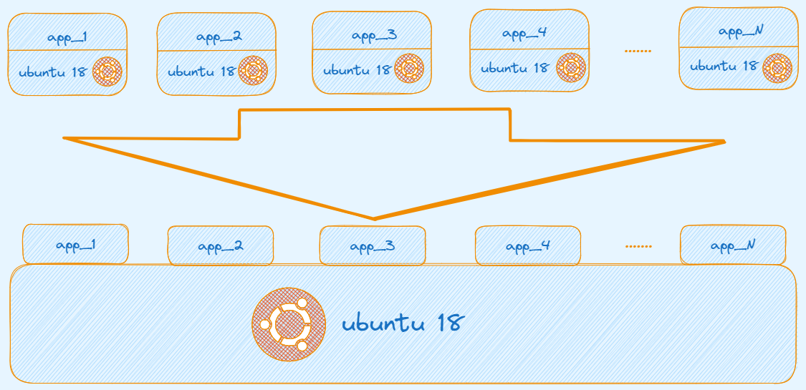
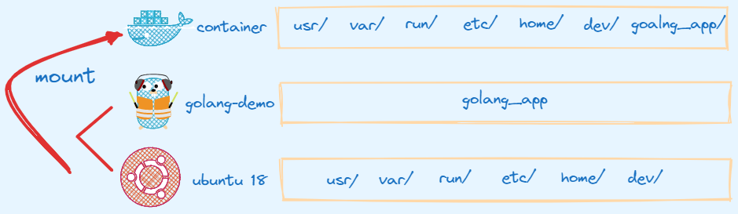
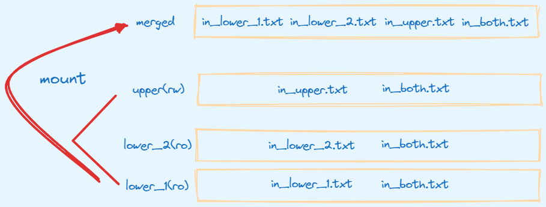
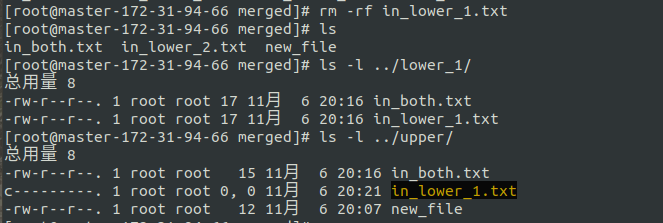
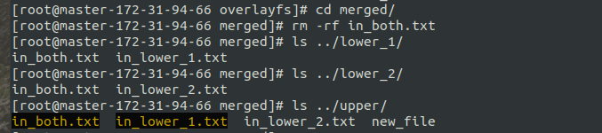
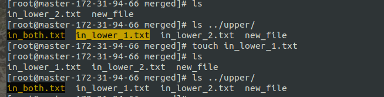

## 容器文件系统

之前文章 [容器原理](https://www.sfernetes.com/container-principle/) 说到容器的核心技术是由 Linux **Namespace + Cgroups** 实现的。 其中在说到 **Mount Namespace** 中说到，使用 `docker exec` 进入某个容器后。
可以看到一个崭新的文件系统，就类似于 `ssh` 到某个虚拟机或者物理机上，实际上就是利用 Linux **Mount Namespace** 隔离实现的。 当创建一个容器时，Linux 系统上就会创建一个
对应的 **Mount Namespace**，那么这个 **Mount Namespace** 就是该容器的文件系统。

容器的文件系统在用户视角和宿主机的文件系统没有什么区别，但是其背后的原理却不同。
在容器里运行 `df` 命令，可以看到在容器中`根目录(/)`的文件系统类型是 "**overlay**"，它不是我们在普通 Linux 节点上看到的 Ext4 或者 XFS 之类常见的文件系统。

```bash
root@624d08ddaf99:~# df -h
Filesystem      Size  Used Avail Use% Mounted on
overlay         558G   70G  488G  13% /
```

## 为什么需要 OverlayFS

那么这个 **OverlayFS** 是一个怎样的文件系统，容器为什么使用这种文件系统？

我们知道虚拟机需要 iso 镜像才能启动，那么每个容器也需要一个镜像才能启动。 然后这个镜像会包含容器运行的二进制文件、库文件、配置文件，其他的依赖的文件等全部打包成一个
镜像文件。 如果使用正常的 EXT4 或者 XFS 文件系统的话，那么每次启动一个容器，就需要把一个镜像文件下载并存储在宿主机上。

比如：假设一个镜像文件的大小是 500MB，那么 100 个容器的话，就需要下载 `500MB*100= 50GB` 的文件，并且占用 50GB 的磁盘空间。然而在这 50GB 的磁盘空间中，大部分数据都是重复的，因为大部分数据都是镜像的 base 镜像，而且这些 base 镜像基本都是只读的，在容器运行时不会变动。

如说这 100 个容器镜像都是基于 ubuntu:18.04 的，每个容器镜像只是额外复制了 50MB 左右自己的应用程序到 ubuntu: 18.04 里，那么就是说在总共 50GB 的数据里，有 90% 的数据是冗余的。

所以有没有一种文件系统可以达到用户的应用程序可以重复利用 ubuntu:18.04 ？也就是能够有效地减少磁盘上冗余的镜像数据，同时减少冗余的镜像数据在网络上的传输。这类的文件系统被称为 **UnionFS**。下图就是 **UnionFS** 解决问题的实现。



**UnionFS** 这类文件系统实现的主要功能是把多个目录（处于不同的分区）一起挂载（`mount`）在一个目录下。这种多目录挂载的方式，正好可以解决我们刚才说的容器镜像的问题。

比如，我们可以把 ubuntu18.04 这个基础镜像的文件放在一个目录 ubuntu18.04/ 下，容器自己额外的程序文件 `app_1_bin` 放在 `app_1/` 目录下。

然后，我们把这两个目录挂载到 `container_1/` 这个目录下，作为**容器 1** 看到的文件系统；对于**容器 2**，就可以把 `ubuntu18.04/` 和 `app_2/` 两个目录一起挂载到 `container_2` 的目录下。这样在节点上我们只要保留一份 ubuntu18.04 的文件就可以了。可参考下图：



## OverlayFS

**UnionFS** 类似的有很多种实现，Docker 支持 **OverlayFS、Fuse-overlayfs、Devicemapper、Btrfs、ZFS、VFS、AUFS(已废弃)**。前面我们在运行 `df` 的时候，看到的文件系统类型 **overlay** 指的就是 **OverlayFS**。

在 Linux 内核 3.18 版本中，**OverlayFS** 代码正式合入 Linux 内核的主分支。在这之后，**OverlayFS** 也就逐渐成为各个主流 Linux 发行版本里缺省使用的容器文件系统了。

**OverlayFS** 工作时由四个目录组成：

- **lowerdir**：只读层，该层无法修改，可以指定多个 lower
- **upperdir**：读写层，容器数据修改保存的地方
- **merged**：最终呈现给用户的目录
- **workdir**：工作目录，指 **OverlayFS** 工作时临时使用的目录，保证文件操作的原子性，挂载后会被清空

### 如何使用

**OverlayFS** 实现的功能就是将 lower 层和 upper 层联合挂载到 merged 层，使得 merged 层拥有 lower 和 upper 层所有文件、目录。

```bash
$ mkdir upper lower_1 lower_2 merged work
$ echo "I'm from lower_1" > lower_1/in_lower_1.txt 
$ echo "I'm from lower_2" > lower_2/in_lower_2.txt 
$ echo "I'm from upper" > upper/in_upper.txt
$ # `in_both` is in both directories
$ echo "I'm from lower_1" > lower_1/in_both.txt 
$ echo "I'm from lower_2" > lower_2/in_both.txt 
$ echo "I'm from upper" > upper/in_both.txt
```

只需使用 `mount` 命令即可将 lower、upper 挂载到 merged，用法：`mount -t overlay overlay -o lowerdir=<lowerdir1-dir>:<lowerdir2-dir>:<lowerdir3-dir>,upperdir=<upper-dir>,workdir=<work-dir> <merded-dir>`

```bash
$ mount -t overlay overlay -o lowerdir=./lower_1:./lower_2,upperdir=./upper,workdir=./work ./merged
```

最终实现的效果就是可以在 `./merged` 目录下看到 `in_lower_1.txt、in_lower_2.txt、in_upper.txt、in_both.txt`

```bash
$ find lower_1/ lower_2/ upper/ merged/
lower_1/
lower_1/in_lower_1.txt
lower_1/in_both.txt
lower_2/
lower_2/in_lower_2.txt
lower_2/in_both.txt
upper/
upper/in_upper.txt
upper/in_both.txt
merged/
merged/in_lower_2.txt
merged/in_both.txt
merged/in_upper.txt
merged/in_lower_1.txt
```

具体挂载实现可参考下图：



上面我们在 upper 目录、lower_1 目录、lower_2 目录都创建了 in_both.txt，同时写入不同的内容。

最终挂载时 upper 层的文件会覆盖 lower 层的文件，所以 `merged/in_upper.txt` 内容应该是 `I'm from upper!`

```bash
$ cat merged/in_both.txt 
"I'm from upper
```

> 当我们挂载完成 **OverlayFS** 以后，对文件系统的任何操作都只能在 merge dir 中进行，用户不允许再直接或间接的到底层文件系统的原始 lowerdir 或 upperdir 目录下修改文件或目录，否则可能会出现一些无法预料的后果（kernel crash除外）。
> 

上面说到 **OverlayFS** 文件系统的 upper 层是保存更新的文件，就是说我们在 merged 层创建、修改、删除文件、目录时应该都发生在 upper 层。下面看看在 OverlayFS 删除、新建、更新文件是如何实现的？

### 删除文件

在 merged 目录删除文件或者目录时，存在三种情况：

1、删除来源于 upper 层 的文件

upper 层用于保存文件的更新，那么这个文件在 upper 层消失

```bash
$ cd merged/
$ rm -rf in_upper.txt 
# in_upper.txt 已经删除
$ ls
in_both.txt  in_lower_1.txt  in_lower_2.txt  new_file
# 发现 upper 层 in_upper.txt 也消失了
$ ls -l ../upper/
总用量 8
-rw-r--r--. 1 root root 15 11月  6 20:16 in_both.txt
-rw-r--r--. 1 root root 12 11月  6 20:07 new_file
```

2、删除来源于 lower 层的文件

lower 层是只读层，不允许被修改，所以删除该层文件并不会在 lower 层消失，只不过会在 upper 层创建一个 **Whiteout 文件**，标识这个文件已经删除，在 merged 层起到删除的效果。



**Whiteout 文件**在用户删除文件时创建，用于屏蔽底层的同名文件，同时该文件在 merge 层是不可见的，所以用户就看不到被删除的文件或目录了。**whiteout 文件**并非普通文件，而是主次设备号都为 0 的**字符设备(** 可以通过 `mknod <name> c 0 0` 命令手动创建 )，当用户在 merge 层通过 `ls` 命令( 将通过 `readddir` 系统调用）检查父目录的目录项时，**OverlayFS** 会自动过过滤掉和 **whiteout 文件**自身以及和它同名的 lower 层文件和目录，达到了隐藏文件的目的，让用户以为文件已经被删除了。

3、要删除的文件是 upper 层覆盖 lower层的文件

这种情况 **OverlayFS** 即需要删除 upper 层对应文件系统中的文件或目录，也需要在对应位置创建同名 **whiteout文件**，让upper层的文件被删除后不至于lower层的文件被暴露出来。

这里我们删除 in_both.txt，该文件是 upper 层覆盖两个 lower 层的文件，删除之后，发现两个 lower 层依然存在该文件，但是 upper 层的 in_both.txt 已经变成 **whiteout 文件**了。



### 新建文件

在 **OverlayFS** 新建文件同样存在两种情况：

1、新建的文件在 lower 层中和 upper 层中都不存在对应的文件或目录

这种情况会直接在 upper 层中对应的目录下新创建文件或目录

```bash
$ echo 'new file' > merged/new_file
$ ls -l */new_file 
-rw-r--r--. 1 root root 9 11月  6 20:05 merged/new_file
-rw-r--r--. 1 root root 9 11月  6 20:05 upper/new_file
```

2、创建一个在 lower 层已经存在且在 upper 层有 **whiteout 文件**的同名文件

显然该文件已经在 merged 层被删除了，所以用户在 merge 层看不到它们，可以新建一个同名的文件。这种场景下，**OverlayFS** 需要删除 upper 层中的用新建的文件替换原有的 **whiteout文件**，这样在 merge 层中看到的文件就是来自 upper 层的新文件了。

这里创建 in_lower_1.txt(该文件来源于 lower 层且之前已经被删除)，发现可以创建成功，且在 upper 层用新建的文件替换了原有的 **whiteout 文件**。



### 修改文件

修改文件同样地会发生在 upper 层，同样存在两情况：

1、修改来源与 upper 层的文件

这里修改 `merged/in_upper.txt`(来源于 upper 层)，那么在 upper 层该文件也被修改。

```bash
$ sed -i 's/new file/update file/g' merged/new_file
$ grep -R 'update file' *
merged/new_file:update file
upper/new_file:update file
```

### 写时复制

用户在写文件时，如果文件来自 upper 层，那直接写入即可。但是如果文件来自 lower 层，由于 lower 层文件无法修改，因此需要先复制到 upper 层，然后再往其中写入内容，这就是**OverlayFS** 的**写时复制(copy-up)** 特性。

2、修改来源于 lower 层的文件

修改 `merged/in_lower_2.txt`(来源于 lower 层)，`lower/in_lower_2.txt` 不会被修改，同时 upper 层会出现 in_lower_2.txt

这里就是触发了 **OverlayFS** 的 **写时复制(copy-up)** 机制。

```bash
$ cd merged/
# 更新 in_lower_2.txt
$ echo 'update lower_2' >> in_lower_2.txt
$ **cat in_lower_2.txt 
I'm from lower_2
update lower_2**
$ ls -l ../upper/
总用量 12
-rw-r--r--. 1 root root   15 11月  6 20:16 in_both.txt
c---------. 1 root root 0, 0 11月  6 20:21 in_lower_1.txt
-rw-r--r--. 1 root root   32 11月  6 20:53 in_lower_2.txt
-rw-r--r--. 1 root root   12 11月  6 20:07 new_file
```

通过 merged 目录向 in_lower_2.txt 写入新的内容，观察 merged 目录下 in_lower_2.txt 文件的内容，包含来原有的和新写入的，同时观察 upper 目录中，也同样存在一个新的从 lower 目录复制上来的文件 in_lower_2.txt，内容同merge目录中看到的一致。

> 当然，**OverlayFS** 的 **copy-up** 特性并不仅仅在往一个来自 lower 层的文件写入新内容时触发，还有很多的场景会触发，但是基本上都是对 lower 层进行修改会触发，比如：
> 
> 
> 1）用户以写方式打开来自 lower 层的文件时，对该文件执行 **copy-up**，即 `open()`系统调用时带有 O_WRITE 或 O_RDWR 等标识；
> 
> 2）修改来自 lower 层文件或目录属性或者扩展属性时，对该文件或目录触发 **copy-up**，例如 `chmod`、`chown` 或设置 acl 属性等；
> 
> 3）rename 来自 lower 层文件时，对该文件执行 **copy-up**；
> 
> 4）对来自 lower 层的文件创建硬链接时，对链接原文件执行 **copy-up**；
> 
> 5）在来自 lower 层的目录里创建文件、目录、链接等内容时，对其父目录执行 **copy-up**；
> 
> 6）对来自 lower 层某个文件或目录进行删除、rename、或其它会触发 **copy-up** 的动作时，其对应的父目录会至下而上递归执行 **copy-up**。
> 

通过这个例子，我们知道了 **OverlayFS** 是怎么工作了。那么我们可以再想一想，怎么把它运用到容器的镜像文件上？

从系统的 mounts 信息中，我们可以看到 Docker 是怎么用 **OverlayFS** 来挂载镜像文件的。容器镜像文件可以分成多个层（layer），每层可以对应 **OverlayFS** 里 lowerdir 的一个目录，lowerdir 支持多个目录，也就可以支持多层的镜像文件。在容器启动后，对镜像文件中修改就会被保存在 upperdir 里了。

```bash
$ mount | grep overlay
overlay on /var/lib/docker/overlay2/ee3585aa8e2cd992af3a66db41f54c4d046b5f3758fb87d7f96c140e90e0dfe6/merged type overlay 
(rw,relatime,seclabel,lowerdir=/var/lib/docker/overlay2/l/URC3EYQVHZ23W6KLE3MASVGHSG:/var/lib/docker/overlay2/l/NFMDRCK2PPWPFDSVGPU2YYLJUF,
upperdir=/var/lib/docker/overlay2/ee3585aa8e2cd992af3a66db41f54c4d046b5f3758fb87d7f96c140e90e0dfe6/diff,
workdir=/var/lib/docker/overlay2/ee3585aa8e2cd992af3a66db41f54c4d046b5f3758fb87d7f96c140e90e0dfe6/work)
```

## 总结

本文主要解答了容器为什么需要 **OverlayFS** 的问题，同时详细讲解 **OverlayFS** 的使用、原理。

下一篇接着本篇讲解**容器是如何使用 OverlayFS 的？**