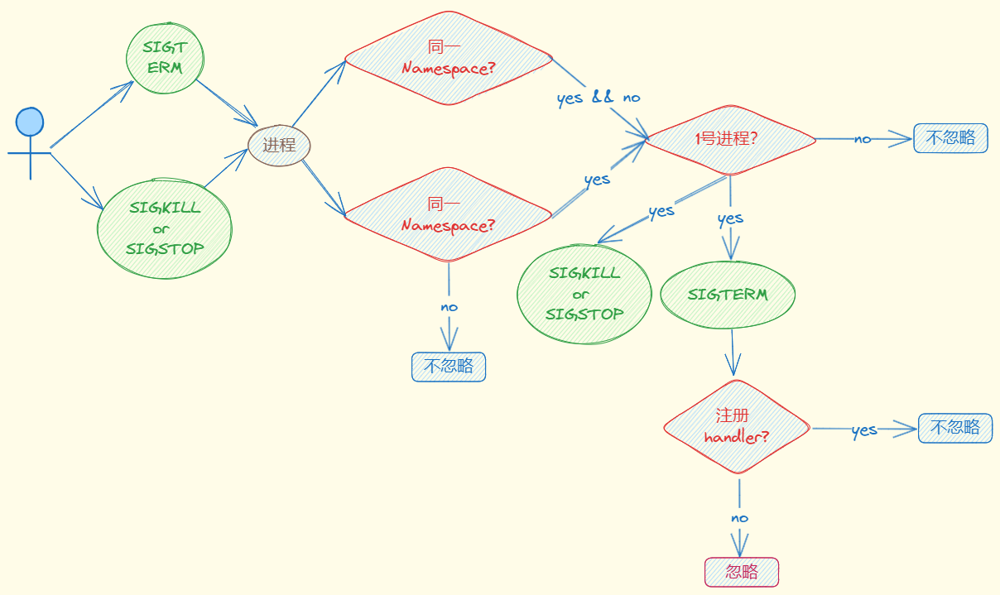

## 简介

在 Linux 系统中，系统启动的时候先是执行内核态的代码，然后在内核中调用 **1 号进程**的代码，从内核态切换到用户态。内核执行的第一个用户态程序就是 **1 号进程。**

目前主流的 Linux 发行版，无论是 RedHat 系的还是 Debian 系的，都会把 /sbin/init 作为符号链接指向 Systemd。Systemd 是目前最流行的 Linux init 进程，在它之前还有 SysVinit、UpStart 等 Linux init 进程。

同样在**容器中**也有 1 号进程的概念，一旦容器建立了自己的 **Pid Namespace（进程命名空间)，**这个 Namespace 里的进程号也是从 1 开始标记的。

1 号进程是第一个用户态的进程，由它直接或者间接创建了容器中的其他进程。

## 为什么杀不掉容器中 1号进程

通过几个实际的示例来说明

下面示例统一用如下 Dockerfile，启动一个休闲 `600s` 的容器。

```docker
FROM ubuntu
ENTRYPOINT ["sleep", "600"]
```

### 现象

**示例一**

在容器中使用 `kill -9，kill -15` 杀死 1 号进程

```bash
$ docker run --name test -d test-init:v1
$ docker exec -it test bash
[root@4db3c6f1766b /]# ps -ef
UID         PID   PPID  C STIME TTY          TIME CMD
root          1      0  0 01:38 ?        00:00:00 sleep 600
root          6      0  2 01:39 pts/0    00:00:00 bash
root         13      6  0 01:39 pts/0    00:00:00 ps -ef

[root@5cc69036b7b2 /]# kill 1
[root@5cc69036b7b2 /]# kill -9 1
[root@5cc69036b7b2 /]# ps -ef
UID         PID   PPID  C STIME TTY          TIME CMD
root          1      0  0 01:38 ?        00:00:00 sleep 600
root          6      0  2 01:39 pts/0    00:00:00 bash
root         13      6  0 01:39 pts/0    00:00:00 ps -ef
```

当我们完成前面的操作，就会发现无论运行 `kill 1` (对应 Linux 中的 `SIGTERM` 信号) 还是 `kill -9 1`(对应 Linux 中的 `SIGKILL` 信号)，都无法让进程终止。那么问题来了，这两个常常用来终止进程的信号，都对容器中的 1号进程不起作用。

**示例二**

在宿主机上使用 `kill -9, kill -15` 杀死容器 1 号进程对应在**宿主机上的进程**

```bash
# 获取宿主机上对应容器的进程
$ docker inspect test | grep Pid
$ kill -15 24446
$ ps -ef | grep 24446
root      24446  24404  0 09:38 ?        00:00:00 sleep 600
root      54735  44623  0 09:48 pts/0    00:00:00 grep --color=auto 24446
$ kill -9 24446
$ ps -ef | grep 24446
root      55167  44623  0 09:48 pts/0    00:00:00 grep --color=auto 24446
```

发现 `kill -15` 无法杀死容器进程，而 `kill -9` 却可以。

**示例三**

在宿主机上使用 `docker stop <container-id>` 杀死容器

```bash
$ /usr/bin/time docker stop e58851b5452f
e58851b5452f

real	0m 10.19s
user	0m 0.04s
sys	0m 0.03s
```

发现经过了 `10s` 左右容器进程才杀死。

**示例四**

把容器中的 sleep 换成 Golang 程序，使用 `kill -9，kill -15` 杀死进程

Golang 代码如下：

```go
package main

import (
       "fmt"
       "time"
)

func main() {
       fmt.Println("Start app\n")
       time.Sleep(time.Duration(100000) * time.Millisecond)
}
```

Dockerfile 如下：

```docker
FROM ubuntu
# go-demo 就是上面代码编译出的二进制程序
COPY go-demo .
RUN chmod +x go-demo
ENTRYPOINT ["./go-demo"]
```

进入容器操作

```bash
docker exec -it 7a62c48d0d1f bash
[root@7a62c48d0d1f /]# ps -ef
UID         PID   PPID  C STIME TTY          TIME CMD
root          1      0  0 02:04 ?        00:00:00 ./go-demo
root         10      0  1 02:04 pts/0    00:00:00 bash
root         23     10  0 02:04 pts/0    00:00:00 ps -ef
[root@7a62c48d0d1f /]# kill -9 1
[root@7a62c48d0d1f /]# ps -ef
UID         PID   PPID  C STIME TTY          TIME CMD
root          1      0  0 02:04 ?        00:00:00 ./go-demo
root         10      0  0 02:04 pts/0    00:00:00 bash
root         24     10  0 02:04 pts/0    00:00:00 ps -ef
[root@7a62c48d0d1f /]# kill 1
```

发现 `kill -9` 无法杀死进程，`kill -15` 可以。

要解释以上现象，需要先了解 Linux 中信号机制。

### Linux 信号

我们运行 kill 命令，其实在 Linux 里就是发送一个信号。信号一般会从 1 开始编号，通常来说，信号编号是 1 到 64。在 Linux 上我们可以用 `kill -l` 来看这些信号的编号和名字

```bash
$ kill -l
 1) SIGHUP      2) SIGINT    3) SIGQUIT    4) SIGILL    5) SIGTRAP
 6) SIGABRT     7) SIGBUS    8) SIGFPE     9) SIGKILL  10) SIGUSR1
11) SIGSEGV    12) SIGUSR2  13) SIGPIPE   14) SIGALRM  15) SIGTERM
16) SIGSTKFLT  17) SIGCHLD  18) SIGCONT   19) SIGSTOP  20) SIGTSTP
21) SIGTTIN    22) SIGTTOU  23) SIGURG    24) SIGXCPU  25) SIGXFSZ
26) SIGVTALRM  27) SIGPROF  28) SIGWINCH  29) SIGIO    30) SIGPWR
31) SIGSYS
```

典型的使用信号机制的场景：

- 如果我们按下键盘 `Ctrl+C`，当前运行的进程就会收到一个信号 `SIGINT` 而退出；
- 如果应用程序内存访问出错了，当前的进程就会收到另一个信号 `SIGSEGV`；
- 我们也可以通过命令 `kill` ，直接向一个进程发送一个信号，缺省情况下不指定信号的类型，那么这个信号就是 `SIGTERM`。也可以指定信号类型，比如命令 `kill -9`，这里的 9，就是编号为 9 的信号，`SIGKILL` 信号。

在操作系统常见手动杀死进程的信号就是 `SIGTERM` 和 `SIGKILL` ，进程在收到信号后，就会去做相应的处理。对于每一个信号，进程对它的处理都有下面三个选择。

**忽略**

忽略( Ignore ) 就是对这个信号不做任何处理，但是有两个信号例外，对于 `SIGKILL` 和 `SIGSTOP` 这个两个信号，进程是不能忽略的。这是因为它们的主要作用是为 Linux kernel 和超级用户提供删除任意进程的特权。

**捕获**

捕获( Catch )，这个是指让用户进程可以注册自己针对这个信号的 handler。对于捕获，`SIGKILL` 和 `SIGSTOP` 这两个信号也同样例外，这两个信号不能由用户自己的处理代码，只能执行系统的**缺省行为**。

**缺省行为**

缺省行为( Default )，Linux 为每个信号都定义了一个缺省的行为，你可以在 Linux 系统中运行 `man 7 signal` 来查看每个信号的缺省行为。对于大部分的信号而言，应用程序不需要注册自己的 handler，使用系统缺省定义行为就可以了。

常见的 `SIGTERM` 和 `SIGKILL`  信号默认行为都是**终止进程。**针对上面说的三个实例，详细看看这两个信号。

**SIGTERM**

这个信号是 Linux 命令 `kill` 缺省发出的。前面例子里的命令 `kill 1` ，就是通过 `kill` 向 1 号进程发送一个信号，等价于 `kill -15`，在没有别的参数时，这个信号类型就默认为 `SIGTERM`。`SIGTERM` 这个信号是可以被捕获的，这里的**捕获**指的就是用户进程可以为这个信号注册自己的 handler，而 `SIGTERM` 信号一般是用于进程优雅退出。

**SIGKILL**

`SIGKILL (9)`，这个信号是 Linux 里两个特权信号之一。特权信号就是 Linux 为 kernel 和超级用户去删除任意进程所保留的，不能被忽略也不能被捕获。那么进程一旦收到 `SIGKILL`，就要退出。在前面的例子里，我们运行的命令 `kill -9 1` 里的参数 `-9` ，其实就是指发送编号为 9 的这个 `SIGKILL` 信号给 **1 号进程**。

### Linux 信号处理原理

在了解了 Linux 信号机制的概念后，再解释上述现象就会较容易理解。

在 Linux 中，使用 `kill` 命令向 1号进程发起信号时，Linux 内核会根据如下代码逻辑判断是否忽略该信号。当下面代码 if 条件为 true 的话则忽略信号，否则执行信号默认行为。

```c
kernel/signal.c
static bool sig_task_ignored(struct task_struct *t, int sig, bool force)
{
        void __user *handler;
        handler = sig_handler(t, sig);

				/* unlikely(t->signal->flags & SIGNAL_UNKILLABLE) 表示是否为 1 号进程  */
				/* handler == SIG_DFL 表示进程是否使用默认信号行为 */
				/* force 表示发出信号和接受信号是否在同一个 Namespace 下, 在即为 0, 不在为 1 */
        if (unlikely(t->signal->flags & SIGNAL_UNKILLABLE) &&
            handler == SIG_DFL && !(force && sig_kernel_only(sig)))
                return true;

        return sig_handler_ignored(handler, sig);
}
```

分别对上述 if 中的三个条件进行分析。

**1、unlikely(t->signal->flags & SIGNAL_UNKILLABLE)**

`t->signal->flags & SIGNAL_UNKILLABLE` 表示进程必须是 `SIGNAL_UNKILLABLE` 的。在每个 Namespace 的 init 进程建立的时候，就会打上 `SIGNAL_UNKILLABLE` 这个标签，也就是说只要是 1 号进程，就会有这个 flag，这个条件也是满足的。

**2、handler == SIG_DFL**

判断信号的 handler 是否是 `SIG_DFL`。对于每个信号，用户进程如果不注册一个自己的 handler，就会有一个系统缺省的 handler，这个缺省的 handler 就叫作 `SIG_DFL`。
对于 `SIGKILL`，它是特权信号，是不允许被捕获的，所以它的 handler 就一直是 `SIG_DFL`。对 `SIGKILL`来说该条件总是满足的。对于 `SIGTERM`，它是可以被捕获的。也就是说如果用户不注册 handler，那么这个条件对 `SIGTERM` 也是满足的。

**3、!(force && sig_kernel_only(sig))**

`force` 表示如果发出信号的进程与接受信号的进程在同一个 Namespace 中值为 `false`，否则为 `true` 。
`sig_kernel_only(sig)` ****表示信号是否为特权信号，`SIGKILL` 为特权信号，`SIGTERM` 不是。
所以 `!(force && sig_kernel_only(sig))` 这个条件对于 `SIGKILL` 来说是 true，对于 `SIGTERM` 来说是 false。

> Namespace 概念不了解的话，可参考前期文章 [容器原理](https://www.sfernetes.com/container-principle/)
> 

上述逻辑可参考下图：



**示例一解释**

现在再来看第一个示例，示例中容器的 1 号进程是 `sleep`，同时发信号和接受信号都在容器内部，属于同一个 Namespace，同时由于 `sleep` 命令自身没有注册 handler，满足上述三个条件。导致 `kill -9，kill -15` 被 Linux 内核忽略。

**示例二解释**

对于示例二，由于在宿主机操作容器内的进程，这样就是发出信号的进程和接受信号的进程不属于同一个 Namespace，`force = true` ，对于 `SIGTERM` 信号，它不是特权信号，所以 `sig_kernel_only(sig)=false` —> `!(force && sig_kernel_only(sig)) = true` —> `kill -15` 忽略。

对于 `SIGKILL` 信号来说，它是特权信号，所以 `sig_kernel_only(sig)=true` —> `!(force && sig_kernel_only(sig)) = false` —> `kill -9`执行动作。

**示例三解释**

示例三其实和示例二的原理一样，因为 `docker stop <containier-id>` 背后其实先向容器进程发出 `SIGTERM` 信号，如果 10s 后进程还在，那么直接再发出 `SIGKILL` 信号。

**示例四解释**

再看第四个示例，第四个示例容器的 1 号进程是 Golang 程序，然而 Golang 程序默认自带了 handler，kill -9 发出的是 `SIGKILL` 信号，不允许被捕获，满足以上三个条件，导致 `kill -9` 不生效。

`kill -15` 发出的是 `SIGTERM` 信号，该信号允许捕获，所以使用自带的 handler，即不满足条件 2，导致 `kill -15` 可以杀死进程。

> Golang 语言 runtime 自动注册了 `SIGTERM` 信号 handler，https://pkg.go.dev/os/signal#section-directories
> 

通过上面的分析，我们了解了容器中的 1号进程以及解释了在容器中为什么杀不掉 1 号进程。

## 1 号进程与 init 进程

在 Linux 中 1号进程也叫 init 进程，但是在不同环境下 1号进程与 init 进程并不是等价的。

1 号进程与 init 进程是什么关系，又有什么区别？

init 进程就是 1 号进程，但是 1 号进程不一定是 init 进程。

我们看看 1 号进程和 init 进程的特性：

### **1 号进程**

- 操作系统第一个进程
- 是所有用户态进程的父进程

### **init 进程**

- 操作系统第一个进程
- 是所有用户态进程的父进程
- 可以回收**僵尸进程**(失去了父进程的子进程就都会以 init 作为它们的父进程)
- 可以向子进程发送操作系统信号

对于宿主机和容器的关系，在宿主机中 1 号进程和 init 进程是等价的，在容器中 1 号进程不一定是 init 进程，取决与用户对容器的定义，下面详细看看。

## 容器中的 init 进程

容器中的 1 号进程是否具有 init 进程的特性取决于容器启动的命令。在 Dockerfile 中，CMD、ENTRYPOINT 可以启动容器，它们都有两种模式：**shell 模式**，**exec 模式**

这里用 ENTRYPOINT 举例，CMD 是一样的。

### shell 模式

该模式下会开启一个 shell 来执行后面的命令，即使用 `/bin/sh -c`  启动业务进程，那么容器中的 1 号进程就是 shell。用法：`ENTRYPOINT command`

```docker
FROM ubuntu
# go-demo 是 go 语言程序, 内部是 sleep 100s
COPY go-demo .
ENTRYPOINT ./go-demo
```

启动该容器后，容器的 1 号进程就是 `sh` ，`go-demo` 是 `sh` 的子进程。

```bash
$ docker exec -it test-go-init ps -ef
UID         PID   PPID  C STIME TTY          TIME CMD
root          1      0  0 08:45 ?        00:00:00 /bin/sh -c ./go-demo
root          6      1  0 08:45 ?        00:00:00 ./go-demo
root         11      0  0 08:46 pts/0    00:00:00 ps -ef
```

### exec 模式

该模式下直接运行命令，容器中的 1 号进程就是业务应用进程。用法：`ENTRYPOINT ["command"]`

```docker
FROM ubuntu
COPY go-demo .
ENTRYPOINT ["./go-demo"]
```

启动该容器后，容器的 1 号进程就是 `go-demo` 

```bash
$ docker exec -it test-go-init ps -ef
UID         PID   PPID  C STIME TTY          TIME CMD
root          1      0  0 08:49 ?        00:00:00 ./go-demo
root         18      0  0 08:51 pts/0    00:00:00 ps -ef
```

### 使用 exec 命令

在 shell 模式下使用 `exec` 命令也可以达到 **exec 模式**的效果，用法：`ENTRYPOINT exec command`

```docker
FROM ubuntu
COPY go-demo .
ENTRYPOINT exec ./go-demo
```

同样容器启动后，容器的 1 号进程就是 `go-demo` 

```bash
$ docker exec -it test-go-init ps -ef
UID         PID   PPID  C STIME TTY          TIME CMD
root          1      0  0 08:59 ?        00:00:00 ./go-demo
root         10      0  0 08:59 pts/0    00:00:00 ps -ef
```

### 使用 tini

上面说了如果容器需要实现优雅退出，要么也用进程作为 1号进程且实现 **SIGTERM** handler，要么启动 init 进程。下面看看如何在容器中启动 init 进程。

在容器中添加一个 **init 系统**。init 系统有很多种，推荐使用 **[tini](https://github.com/krallin/tini.git)**，使用如下：

- 安装 tini
- 将 tini 作为容器中的 1号进程
- **用户进程启动命令**作为 tini 参数

可参考如下 Dockerfile：

```docker
FROM ubuntu
RUN apt-get install tini
COPY test.sh .
RUN chmod +x test.sh
ENTRYPOINT ["/sbin/tini", "--", "./test.sh"]
```

现在 tini 就是 **1 号进程**，它会将收到的系统信号转发给子进程 `test.sh` 。使用 `docker stop <container-id>` 就可以瞬间杀死容器了，docker 发送 `SIGTERM` 信号给容器的 tini，tini 将信号转发给 test.sh，如果 test.sh 对 `SIGTERM` 信号有自定义 handler，那么执行完 handler 退出；

如果 test.sh 没有对 `SIGTERM` 信号处理，那么执行默认行为，即直接退出。因为现在的 test.sh 已经不是 1号进程了，仅仅是一个普通进程，所以并不会上面说的**示例二**的现象。所以要实现应用进程真正的优雅退出，应用程序也得实现 `SIGTERM` 的 handler。

tini 作为 init 进程，还可以清理容器中的僵尸进程。

> 如果你想直接通过 docker 命令来运行容器，可以直接通过参数 `--init` 来使用 tini，不需要在镜像中安装 tini。如果是 `Kubernetes` 就不行了，必须手动安装 tini。
> 

### 使用场景

那么为什么有 **shell 模式**和 **exec 模式**，分别在什么场景下使用？

**优雅退出**

**shell 模式**的一号进程是 `sh`，而且 `sh` 不能传递信号，所以就无法实现容器内进程优雅退出了( `docker stop <container-id>` 只能等待 10s 强制杀死)，这时候就可以就考虑使用 **exec 模式**，

因为 **exec 模式**的 1号进程就是自身，自身实现 `SIGTERM` handler 即可。

**环境变量**

在 **exec 模式**下，没有办法获取容器内的**环境变量**，Dockerfile 如下：

```docker
FROM ubuntu
# 自定义环境变量
ENV CUSTOMENAME test-exec
# 输出自定义环境变量和系统自带环境变量的值
ENTRYPOINT ["echo", "Welcome, $CUSTOMENAME $HOSTNAME"]
```

运行输出发现并没有输出对应值。

```bash
$ docker run --rm test-exec:v1
Welcome, $CUSTOMENAME", "$HOSTNAME
```

使用 **shell 模式**或者 **exec 命令**看看。

```docker
FROM ubuntu
# 自定义环境变量
ENV CUSTOMENAME test-exec
# 输出自定义环境变量和系统自带环境变量的值
ENTRYPOINT echo $CUSTOMENAME
```

运行输出可以输出环境变量的值

```bash
$ docker run --rm test-exec:v1
test-exec
```

所以 **shell 模式**和 **exec 模式**都有对应的使用限制和优势。

## 总结

本文主要讲述了两段内容：

- 通过 Linux 信号处理的机制分析了在容器中为什么杀不死 1号进程的原因；
- 介绍了 1号进程和 init 进程的关系和区别，同时展开说明容器中的 1 号进程和 init 进程的使用。

相信看完这篇文章，可以对容器中的进程有了一些原理性的理解。

上文 **为什么杀不掉容器中 1号进程** 的示例中的 Dockerfile 都是 **exec 模式**，如果换成 **shell 模式**，是否会出现不同情况，有兴趣可以实验验证下。