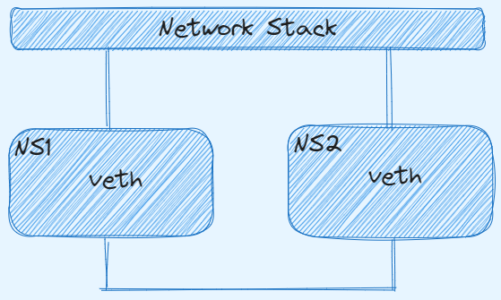
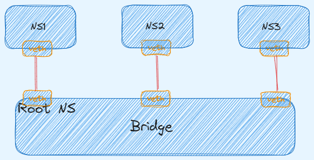
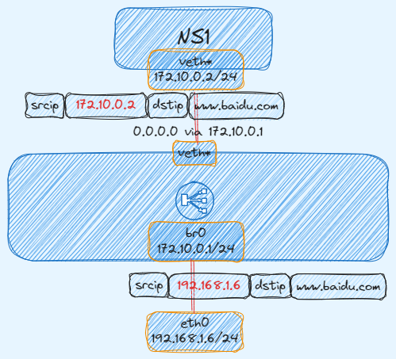
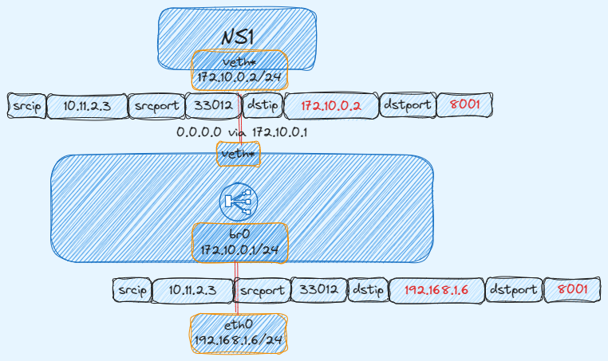
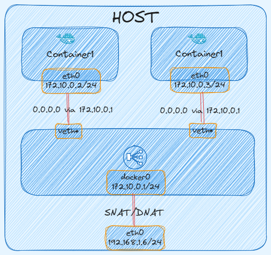
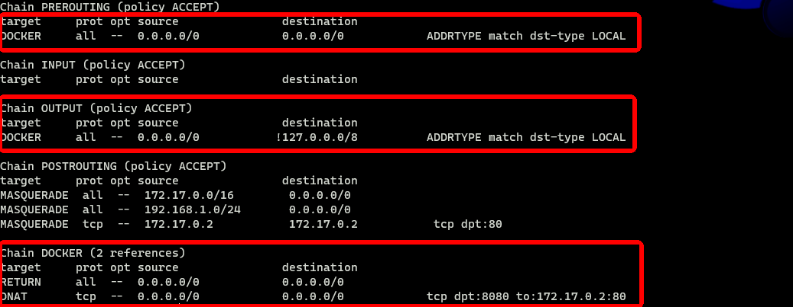

## 容器网络

前文[容器原理](https://www.sfernetes.com/container-principle/)一文说到容器在网络上，容器使用 `Network Namespace` 实现对网络资源的隔离，被隔离的进程只能看到当前 `Namespace` 里的**网络栈。**

**网络栈**包括了：网卡（Network Interface）、回环设备（Loopback Device）、路由表（Routing Table）和 iptables 规则。Linux 宿主机的网络通过网络栈来实现，同样容器的网络也是通过网络栈实现。

容器网络需要解决哪些问题：

- 容器 IP 的分配；
- 容器之间的互相访问(这里只考虑单节点容器间访问，跨节点可考虑 Kubernetes)；
- 容器如何访问主机外部网络；
- 外部网络如何访问到容器内部。

下面带着以上四个问题来看看容器网络的实现原理。

## Linux 虚拟网络技术

一般网络设备包括，交换机，路由器，网桥等，这些网络设备会存在多个网卡或者端口，那么 Linux 不仅仅可以作为网络设备，同时还可以实现虚拟网络设备，例如：网桥，虚拟网卡对等，那么 `Network Namespace` 就是利用 Linux 虚拟网络技术、路由、iptables 等技术来实现的，下面看看常用的 **veth pair** 和 **bridge。**

## Linux veth pair

**veth pair** 是成对出现的一种虚拟网络设备接口，一端连着网络协议栈，一端彼此相连。**veth pair** 总是成对出现的，从一端进入的数据包将会在另一端出现。我们可以把 **veth pair** 看成一条网线两端连接的两张以太网卡。只要将 **veth pair** 每一段分别接入不同的 `Namespace`，那么这两个 `Namespace` 就可以实现互通了。

> Linux 即使在同一个主机上创建的两个 `Network Namespace`，相互之间缺省也是不能进行网络通信的。
> 



下面通过示例将两个 `Namespace` 通过 **veth pair** 连接起来，并验证连通性。

创建两个 `namespace，ns1、ns2`

```bash
$ ip netns add ns1
$ ip netns add ns2
```

创建一个 **veth pair**

```bash
$ ip link add veth-ns1 type veth peer name veth-ns2
```

将 **veth pair** 一端接入放入 `ns1`，另一端接入 `ns2`，这样就相当于采用网线将两个 `Network Namespace` 连接起来了。

```bash
$ ip link set veth-ns1 netns ns1
$ ip link set veth-ns2 netns ns2
```

为两个网卡分别设置 IP 地址，这两个网卡的地址位于同一个子网 `192.168.1.0/24` 中。

```bash
$ ip -n ns1 addr add 192.168.1.1/24 dev veth-ns1
$ ip -n ns2 addr add 192.168.1.2/24 dev veth-ns2
```

使用 `ip link` 命令设置两张虚拟网卡状态为 `up`。

```bash
$ ip -n ns1 link set veth-ns1 up
$ ip -n ns2 link set veth-ns2 up
```

从 `ns1 ping ns2` 的 IP，测试连通性

```bash
$ ip netns exec ns1 ping 192.168.1.2
PING 192.168.1.2 (192.168.1.2) 56(84) bytes of data.
64 bytes from 192.168.1.2: icmp_seq=1 ttl=64 time=0.142 ms
64 bytes from 192.168.1.2: icmp_seq=2 ttl=64 time=0.021 ms
```

上面创建了一对 **veth pair** 连接着两个 `namespace`，可以分别进入 `namespace` 查看到对应网卡信息

```bash
$ ip netns exec ns1 ifconfig
veth-ns1: flags=4163<UP,BROADCAST,RUNNING,MULTICAST>  mtu 1500
        inet 192.168.1.1  netmask 255.255.255.0  broadcast 0.0.0.0
        inet6 fe80::e415:f8ff:fe53:bbb3  prefixlen 64  scopeid 0x20<link>
        ether e6:15:f8:53:bb:b3  txqueuelen 1000  (Ethernet)
        RX packets 45  bytes 3693 (3.6 KiB)
        RX errors 0  dropped 0  overruns 0  frame 0
        TX packets 54  bytes 4642 (4.5 KiB)
        TX errors 0  dropped 0 overruns 0  carrier 0  collisions 0

$ ip netns exec ns2 ifconfig
veth-ns2: flags=4163<UP,BROADCAST,RUNNING,MULTICAST>  mtu 1500
        inet 192.168.1.2  netmask 255.255.255.0  broadcast 0.0.0.0
        inet6 fe80::e415:f8ff:fe53:bbb3  prefixlen 64  scopeid 0x20<link>
        ether e6:15:f8:53:bb:b3  txqueuelen 1000  (Ethernet)
        RX packets 45  bytes 3693 (3.6 KiB)
        RX errors 0  dropped 0  overruns 0  frame 0
        TX packets 54  bytes 4642 (4.5 KiB)
        TX errors 0  dropped 0 overruns 0  carrier 0  collisions 0
```

## Bridge

**veth pair** 实现了两个网络之间的连通，如果我们需要将 3 个或者多个 `namespace` 接入同一个二层网络时，就不能只使用 **veth pair** 了。在物理网络中，如果需要连接多个主机，我们会使用**网桥**，或者又称为交换机。Linux 也提供了网桥的虚拟实现。



那么下面通过示例演示通过 **Bridge** 来连通三个 `namespace`。

首先创建三个 `namespace`

```bash
$ ip netns add ns1
$ ip netns add ns2
$ ip netns add ns3
```

创建 Linux **Bridge**

```bash
$ brctl addbr virtual-bridge
```

这里需要创建三对 **veth pair**，因为每一对的 **veth pair** 需要与 **bridge** 连接。将每对 **veth pair** 的一端接入对应 **namespace**，另一端接入 **bridge**

```bash
# 创建 veth pair
$ ip link add veth-ns1 type veth peer name veth-ns1-br
# 将 veth pair 一端接入 ns1
$ ip link set veth-ns1 netns ns1
# 将 veth pair 另一端接入 bridge
$ brctl addif virtual-bridge veth-ns1-br

$ ip link add veth-ns2 type veth peer name veth-ns2-br
$ ip link set veth-ns2 netns ns2
$ brctl addif virtual-bridge veth-ns2-br

$ ip link add veth-ns3 type veth peer name veth-ns3-br
$ ip link set veth-ns3 netns ns3
$ brctl addif virtual-bridge veth-ns3-br
```

为三个 **namespace** 中的虚拟网卡设置 IP 地址，这些 IP 地址位于同一个子网 `192 168.1.0/24` 中。

```bash
$ ip -n ns1 addr add local 192.168.1.1/24 dev veth-ns1
$ ip -n ns2 addr add local 192.168.1.2/24 dev veth-ns2
$ ip -n ns3 addr add local 192.168.1.3/24 dev veth-ns3
```

将 **bridge** 和 **veth pair** 启动

```bash
$ ip link set virtual-bridge up

$ ip link set veth-ns1-br up
$ ip link set veth-ns2-br up
$ ip link set veth-ns3-br up

$ ip -n ns1 link set veth-ns1 up
$ ip -n ns2 link set veth-ns2 up
$ ip -n ns3 link set veth-ns3 up
```

测试三个 **namespace** 之间的连通性

```bash
$ ip netns exec ns1 ping 192.168.1.2
PING 192.168.1.2 (192.168.1.2) 56(84) bytes of data.
64 bytes from 192.168.1.2: icmp_seq=1 ttl=64 time=0.165 ms
64 bytes from 192.168.1.2: icmp_seq=2 ttl=64 time=0.131 ms

$ ip netns exec ns1 ping 192.168.1.3
PING 192.168.1.3 (192.168.1.3) 56(84) bytes of data.
64 bytes from 192.168.1.3: icmp_seq=1 ttl=64 time=0.345 ms
64 bytes from 192.168.1.3: icmp_seq=2 ttl=64 time=0.163 ms
```

这里的 **bridge** 只扮演了**二层设备**的角色，就可以实现同一子网下的两个 `namespace` 的通信。

如果 `namespace` 里需要访问宿主机或者访问外网，那么 **bridge** 作为二层设备就无法实现了，因为数据包只能到达 **bridge**。

### 子 namespace 访问 root namespace

要想`子 namespace` 访问 `root namespace`，单纯的二层通信无法实现。

Linux **Bridge** 即可以扮演**二层交换机**，也可作为**三层交换机或者路由器**使用，我们只需将 **bridge** 设置 `IP`，并作为`子 namespace` 的默认网关，这样数据包就可以通过 **bridge** 来到 `root namespace`。

> 如果 Linux 需要扮演三层设备，必须开启 **IP 转发**
> 
> 
> `sysctl -w net.ipv4.ip_forward=1` 或者 `echo 1 > /proc/sys/net/ipv4/ip_forward`
> 
> 这种设置只是暂时的，它的效果会随着计算机的重启而失效。
> 

首先创建`子 namespace` 和 **bridge**

```bash
$ ip netns add ns1
$ ip netns add ns2
$ brctl addbr br0
```

通过 **veth pair** 将 `ns1` 和 `ns2` 连接到 **bridge** 上。

```bash
$ ip link add veth-ns1 type veth peer name veth-ns1-br
$ ip link set veth-ns1 netns ns1
$ brctl addif br0 veth-ns1-br

$ ip link add veth-ns2 type veth peer name veth-ns2-br
$ ip link set veth-ns2 netns ns2
$ brctl addif br0 veth-ns2-br
```

为 `ns1，ns2` 设置 `IP` 地址。

```bash
$ ip -n ns1 addr add local 192.168.1.2/24 dev veth-ns1
$ ip -n ns2 addr add local 192.168.1.3/24 dev veth-ns2
```

启动 **bridge** 和 **veth pair**

```bash
$ ip link set br0 up
$ ip link set veth-ns1-br up
$ ip link set veth-ns2-br up
$ ip -n ns1 link set veth-ns1 up
$ ip -n ns2 link set veth-ns2 up
```

从 `ns1 ping root namespace`，发现网络不可达。

```bash
# 172.30.95.74 是宿主机网卡
$ ip netns exec ns1 ping 172.30.95.74
connect: Network is unreachable
```

需要先给 **bridge** 设置 `IP`，这里需要将 **bridge** 设置为 `ns1、ns2` 的默认网关

```bash
$ ip addr add local 192.168.1.1/24 dev br0
$ ip link set br0 up

$ ip netns exec ns1 ip route add default via 192.168.1.1
$ ip netns exec ns2 ip route add default via 192.168.1.1
```

可以查看到宿主机上 **bro** 网卡上配置了 `IP`

```bash
$ ifconfig br0
br0: flags=4163<UP,BROADCAST,RUNNING,MULTICAST>  mtu 1500
        inet 192.168.1.1  netmask 255.255.255.0  broadcast 0.0.0.0
        inet6 fe80::d6:2dff:fec5:a767  prefixlen 64  scopeid 0x20<link>
        ether 02:d6:2d:c5:a7:67  txqueuelen 1000  (Ethernet)
        RX packets 15  bytes 1032 (1.0 KiB)
        RX errors 0  dropped 0  overruns 0  frame 0
        TX packets 8  bytes 656 (656.0 B)
        TX errors 0  dropped 0 overruns 0  carrier 0  collisions 0
```

这次从 `ns1 、 ns2 ping namespace`，发现网络可达。

```bash
$ ip netns exec ns1 ping 172.30.95.74
PING 172.30.95.74 (172.30.95.74) 56(84) bytes of data.
64 bytes from 172.30.95.74: icmp_seq=1 ttl=64 time=0.097 ms
64 bytes from 172.30.95.74: icmp_seq=2 ttl=64 time=0.061 ms

$ ip netns exec ns2 ping 172.30.95.74
PING 172.30.95.74 (172.30.95.74) 56(84) bytes of data.
64 bytes from 172.30.95.74: icmp_seq=1 ttl=64 time=0.124 ms
64 bytes from 172.30.95.74: icmp_seq=2 ttl=64 time=0.062 ms
```

### 子 namespace 访问外网

如果想要`子 namespace` 能够访问外网，那么还需要将设置一条 **iptables** 规则。

因为不设置规则的话，从`子 namespace` 发送数据包可以出去，但是回包会有问题，因为回包的时候，**目的 IP** 是`子 namespace IP`，但是每个节点的路有点并没有到`子 namespace IP` 的路由，所以就需要在 `namespace` 里设置一条 **SNAT Iptables** 规则，发送数据包到 **bridge** 时，将**源地址**改为**宿主机 IP**，这样回包时就无需知道 `namespace` 下的 IP 了。

```bash
$ iptables -t nat -A POSTROUTING -s 192.168.1.0/24 ! -o br0 -j MASQUERADE
```

这样`子 namespace` 下就可以访问外网了

```bash
$ ip netns exec ns1 ping www.baidu.com
PING www.a.shifen.com (153.3.238.110) 56(84) bytes of data.
64 bytes from 153.3.238.110 (153.3.238.110): icmp_seq=1 ttl=49 time=9.53 ms
64 bytes from 153.3.238.110 (153.3.238.110): icmp_seq=2 ttl=49 time=9.52 ms
64 bytes from 153.3.238.110 (153.3.238.110): icmp_seq=3 ttl=49 time=9.04 ms
```

下图展示 IP 数据包经过 **SNAT** 规则后，报文的**源 IP** 发生了改变



### 端口映射

如果想要将`子 namespace` 里的**端口**发布出去给外部访问，就需要使用 Linux **DNAT** 技术。

比如在 `ns1` 启动一个 `8001` 端口的服务，想要暴露给外部访问

```bash
$ ip netns exec ns1 python3 -m http.server --bind 192.168.1.2 8001
```

通过 iptables 设置 **DNAT** 规则发布端口，**DNAT** 规则作用就是将 IP 包的**目的地址和端口**进行修改再转发。

```bash
# 为来自外部的流量做 DNAT
$ iptables -t nat -A PREROUTING -d 172.30.95.72 -p tcp -m tcp --dport 8001 -j DNAT --to-destination 192.168.1.2:8001

# 为来自 host 自己的流量做 DNAT（因为本地流量不会经过 PREROUTING chain）
$ iptables -t nat -A OUTPUT -d  172.30.95.72 -p tcp -m tcp --dport 8000 -j DNAT --to-destination 192.168.1.2:8001
```

可以查看到对应 iptables 规则

```bash
$ iptables -t nat -nL
```

启用 `br_netfilter` 模块

```bash
$ modprobe br_netfilter
```

现在从外部或者本机都可用访问

```bash
$ curl 172.30.95.72:8001

<!DOCTYPE HTML PUBLIC "-//W3C//DTD HTML 4.01//EN" "http://www.w3.org/TR/html4/strict.dtd">
<html>
<head>
<meta http-equiv="Content-Type" content="text/html; charset=ascii">
<title>Directory listing for /</title>
</head>
<body>
</body>
</html>
```

下图展示 IP 数据包经过 **DNAT** 规则后，**报文的目的 IP 和目的端口**都进行了变化



在平时使用容器网络时，无非就是以上几种网络场景：**宿主机上容器间访问，容器内访问外网，外部访问容器内的服务。**

下面就看看容器网络是如何实现的。

## 容器网络模式

Docker 可以为容器提供四种网络模式：

- **Host：**该网络模式使得容器与宿主机属于同一个网络 `namespace`，这样容器网络和宿主机一样，使用 `--net=host` 指定
- **Bridge：**该网络模式是 Docker **默认**的网络模式，类似于上文说的例子，使用 `--net=bridge` 指定
- **Container：**复用其他容器的网络模式，使用 `--net=container:NAME_or_ID` 指定
- **None：**表示容器没有网络，即容器没有 IP、路由等网络协议栈，使用 `--net=none` 指定

### Host

如果启动容器的时候使用 **host** 模式，那么这个容器将不会获得一个独立的 `Network Namespace`，而是和宿主机共用一个 `Network Namespace`。容器将不会虚拟出自己的网卡，配置自己的 IP 等，而是使用宿主机的 IP 和端口。

这里启动一个 **host** 模式的容器，会发现容器的网络协议栈与宿主机一样。

```bash
$ docker run -it --net host busybox:latest ifconfig
```

### None

使用 **none** 模式，Docker 容器拥有自己的 `Network Namespace`，但是，并不为 Docker 容器进行任何网络配置。也就是说，这个 Docker 容器没有网卡、IP、路由等信息。需要我们自己为 Docker 容器添加网卡、配置 IP 等。

```bash
$ docker run -it --net none artifacts.iflytek.com/docker-private/cloudnative/busybox:1.35 ifconfig
lo        Link encap:Local Loopback
          inet addr:127.0.0.1  Mask:255.0.0.0
          UP LOOPBACK RUNNING  MTU:65536  Metric:1
          RX packets:0 errors:0 dropped:0 overruns:0 frame:0
          TX packets:0 errors:0 dropped:0 overruns:0 carrier:0
          collisions:0 txqueuelen:1000
          RX bytes:0 (0.0 B)  TX bytes:0 (0.0 B)
```

### Bridge

如果不指定网络模式的话，该模式是 Docker 创建容器时**默认**网络模式。原理图如下：



当 `Docker` 进程启动时，会在主机上创建一个名为 `docker0` 的虚拟网桥，并且分配一个 IP，该 IP 就是后面容器的**默认网关**。

```bash
$ ifconfig docker0
docker0: flags=4163<UP,BROADCAST,RUNNING,MULTICAST>  mtu 1500
        inet 172.17.0.1  netmask 255.255.0.0  broadcast 172.17.255.255
        inet6 fe80::42:a8ff:fe2a:210  prefixlen 64  scopeid 0x20<link>
        ether 02:42:a8:2a:02:10  txqueuelen 0  (Ethernet)
        RX packets 10274607  bytes 1726083694 (1.6 GiB)
        RX errors 0  dropped 0  overruns 0  frame 0
        TX packets 8862553  bytes 5870677425 (5.4 GiB)
        TX errors 0  dropped 0 overruns 0  carrier 0  collisions 0面创建一个 bridge 模式的容器，
```

创建 **Bridge** 网络模式的容器，可以发现容器属于单独 `Network Namespace`，且 Docker 创建一对 `veth pair(eth0@if38：vethf240dfc@if37)` ，一端接入**容器内**，一端接入 **Docker0 网桥**上。

```bash
$ docker run -it --net bridge busybox:latest sh
/ # ip addr
1: lo: <LOOPBACK,UP,LOWER_UP> mtu 65536 qdisc noqueue qlen 1000
    link/loopback 00:00:00:00:00:00 brd 00:00:00:00:00:00
    inet 127.0.0.1/8 scope host lo
       valid_lft forever preferred_lft forever
    inet6 ::1/128 scope host
       valid_lft forever preferred_lft forever
37: eth0@if38: <BROADCAST,MULTICAST,UP,LOWER_UP,M-DOWN> mtu 1500 qdisc noqueue
    link/ether 02:42:ac:11:00:02 brd ff:ff:ff:ff:ff:ff
    inet 172.17.0.2/16 scope global eth0
       valid_lft forever preferred_lft forever
    inet6 fe80::42:acff:fe11:2/64 scope link
       valid_lft forever preferred_lft forever

/ # ip link show eth0
35: eth0@if36: <BROADCAST,MULTICAST,UP,LOWER_UP,M-DOWN> mtu 1500 qdisc noqueue
    link/ether 02:42:ac:11:00:02 brd ff:ff:ff:ff:ff:ff

# 宿主机上查看
$ ip addr | grep 38
38: vethf240dfc@if37: <BROADCAST,MULTICAST,UP,LOWER_UP> mtu 1500 qdisc noqueue master docker0 state UP group default
```

同时查看容器内的路由表，发现容器的默认网关指向 **Docker0**

```bash
/ # route -n
Kernel IP routing table
Destination     Gateway         Genmask         Flags Metric Ref    Use Iface
0.0.0.0         172.17.0.1      0.0.0.0         UG    0      0        0 eth0
172.17.0.0      0.0.0.0         255.255.0.0     U     0      0        0 eth0
```

再创建一个容器，然后访问另一个容器，发现可以互通

```bash
$ docker run -it --net bridge busybox:latest sh
/ # ifconfig
eth0      Link encap:Ethernet  HWaddr 02:42:AC:11:00:03
          inet addr:172.17.0.3  Bcast:0.0.0.0  Mask:255.255.0.0
          inet6 addr: fe80::42:acff:fe11:3/64 Scope:Link
          UP BROADCAST RUNNING MULTICAST  MTU:1500  Metric:1
          RX packets:16 errors:0 dropped:0 overruns:0 frame:0
          TX packets:16 errors:0 dropped:0 overruns:0 carrier:0
          collisions:0 txqueuelen:0
          RX bytes:1216 (1.1 KiB)  TX bytes:1216 (1.1 KiB)

lo        Link encap:Local Loopback
          inet addr:127.0.0.1  Mask:255.0.0.0
          inet6 addr: ::1/128 Scope:Host
          UP LOOPBACK RUNNING  MTU:65536  Metric:1
          RX packets:0 errors:0 dropped:0 overruns:0 frame:0
          TX packets:0 errors:0 dropped:0 overruns:0 carrier:0
          collisions:0 txqueuelen:1000
          RX bytes:0 (0.0 B)  TX bytes:0 (0.0 B)
/ # ping 172.17.0.2
PING 172.17.0.2 (172.17.0.2): 56 data bytes
64 bytes from 172.17.0.2: seq=0 ttl=64 time=0.108 ms
64 bytes from 172.17.0.2: seq=1 ttl=64 time=0.119 ms
```

虽然两个容器属于单独 `Network Namespace`，但是都通过 **veth pair** 接入了 **docker0 网桥**，且在同一个**子网**下面，所以可以二层互通。

在宿主机上查看 **docker0 网桥**上挂的网卡，发现两张网卡就是两个容器的一端。

```bash
$ brctl show
bridge name     bridge id               STP enabled     interfaces
docker0         8000.02428f5df66f       no              veth2a72e0f
                                                        vethf240dfc

$ ifconfig | grep veth
veth2a72e0f: flags=4163<UP,BROADCAST,RUNNING,MULTICAST>  mtu 1500
vethf240dfc: flags=4163<UP,BROADCAST,RUNNING,MULTICAST>  mtu 1500
```

现在在容器内访问外网，同样也是正常的，因为 Docker 在宿主机上创建了对应的 **SNAT** 规则。

```bash
/ # ping www.baidu.com
PING www.baidu.com (153.3.238.102): 56 data bytes
64 bytes from 153.3.238.102: seq=0 ttl=49 time=8.843 ms
64 bytes from 153.3.238.102: seq=1 ttl=49 time=8.422 ms

# 宿主上查看 iptables SNAT 规则
$ iptables -t nat -nL POSTROUTING
Chain POSTROUTING (policy ACCEPT)
target     prot opt source               destination
MASQUERADE  all  --  172.17.0.0/16        0.0.0.0/0
```

现在创建一个暴露端口的容器供外部访问，将容器的 80 端口映射到宿主机的 80 端口。

```bash
$ docker run -d --net bridge -p 8080:80 nginx:latest

$ curl http://172.30.95.74:8080
<!DOCTYPE html>
<html>
<head>
<title>Welcome to nginx!</title>
<style>
    body {
        width: 35em;
        margin: 0 auto;
        font-family: Tahoma, Verdana, Arial, sans-serif;
    }
</style>
</head>
<body>
<h1>Welcome to nginx!</h1>
<p>If you see this page, the nginx web server is successfully installed and
working. Further configuration is required.</p>

<p>For online documentation and support please refer to
<a href="http://nginx.org/">nginx.org</a>.<br/>
Commercial support is available at
<a href="http://nginx.com/">nginx.com</a>.</p>

<p><em>Thank you for using nginx.</em></p>
</body>
</html>
```

测试发现访问正常，因为 Docker 也会在宿主机上创建对应的 **DNAT** 规则。



这里的 **DNAT** 规则发现与上面举例的不大一样，这里解释一下

上面说到 `namespace` 发布端口需要在 `PREROUTING、OUTPUT` 这两条链创建 **DNAT**，这里同样也是在这两条链创建了 **DNAT** 规则，只不过跳到了 `DOCKER` 自定义链了，然后这个 `Chain DOCKER` 设置了具体的 **DNAT** 规则。

经过以上说明，发现 **Bridge** 模式使用的技术其实就是上面说到 Linux 虚拟网络技术。

### Container

这个模式指定新创建的容器和已经**存在的一个容器**共享一个 `Network Namespace`，而不是和宿主机共享。新创建的容器不会创建自己的网卡，配置自己的 IP，而是和一个指定的容器共享 IP、端口范围等。原理图如下：


这里先创建一个容器，指定 **bridge** 网络模式。

```bash
docker run -it --net bridge busybox:latest sh
/ # ifconfig
eth0      Link encap:Ethernet  HWaddr 02:42:AC:11:00:03
          inet addr:172.17.0.3  Bcast:0.0.0.0  Mask:255.255.0.0
          inet6 addr: fe80::42:acff:fe11:3/64 Scope:Link
          UP BROADCAST RUNNING MULTICAST  MTU:1500  Metric:1
          RX packets:6 errors:0 dropped:0 overruns:0 frame:0
          TX packets:5 errors:0 dropped:0 overruns:0 carrier:0
          collisions:0 txqueuelen:0
          RX bytes:516 (516.0 B)  TX bytes:426 (426.0 B)

lo        Link encap:Local Loopback
          inet addr:127.0.0.1  Mask:255.0.0.0
          inet6 addr: ::1/128 Scope:Host
          UP LOOPBACK RUNNING  MTU:65536  Metric:1
          RX packets:0 errors:0 dropped:0 overruns:0 frame:0
          TX packets:0 errors:0 dropped:0 overruns:0 carrier:0
          collisions:0 txqueuelen:1000
          RX bytes:0 (0.0 B)  TX bytes:0 (0.0 B)
```

然后创建另外一个容器，并且设置与上面容器网络模式**共享**，发现该容器的网络协议栈与上一个容器的一致。

```bash
docker run -it --net container:8d5aedb8ed81 busybox:latest sh
/ # ifconfig
eth0      Link encap:Ethernet  HWaddr 02:42:AC:11:00:03
          inet addr:172.17.0.3  Bcast:0.0.0.0  Mask:255.255.0.0
          inet6 addr: fe80::42:acff:fe11:3/64 Scope:Link
          UP BROADCAST RUNNING MULTICAST  MTU:1500  Metric:1
          RX packets:8 errors:0 dropped:0 overruns:0 frame:0
          TX packets:8 errors:0 dropped:0 overruns:0 carrier:0
          collisions:0 txqueuelen:0
          RX bytes:656 (656.0 B)  TX bytes:656 (656.0 B)

lo        Link encap:Local Loopback
          inet addr:127.0.0.1  Mask:255.0.0.0
          inet6 addr: ::1/128 Scope:Host
          UP LOOPBACK RUNNING  MTU:65536  Metric:1
          RX packets:0 errors:0 dropped:0 overruns:0 frame:0
          TX packets:0 errors:0 dropped:0 overruns:0 carrier:0
          collisions:0 txqueuelen:1000
          RX bytes:0 (0.0 B)  TX bytes:0 (0.0 B)
```

## 总结

本篇文章首先讲解了 Linux 虚拟网络相关技术：

- **veth pair：**虚拟网卡对
- **bridge：**虚拟网桥，Linux 虚拟网桥不仅可以作为二层设备也可以作为三层设备

进而通过实例讲解实现了在 **Network Namespace** 不同的网络场景：

- `Network Namespace` 间的通信
- `子 Network Namespace` 与 `root Namespace` 间通信
- `子 Network Namespace` 访问外网
- `Network Namespace` 发布服务端口供外部访问

了解了 Linux 虚拟网络技术，然后通过对容器网络的介绍，基本可以了解文章开头提出 **“容器网络需要解决什么问题”。**