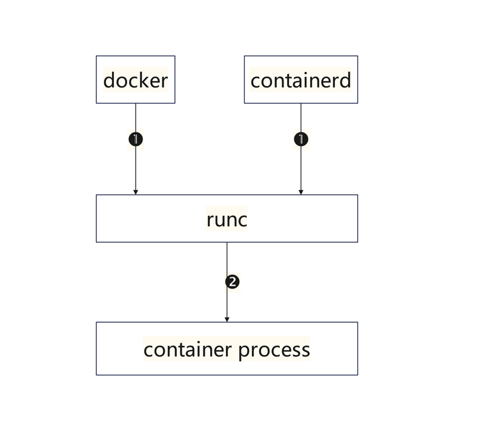
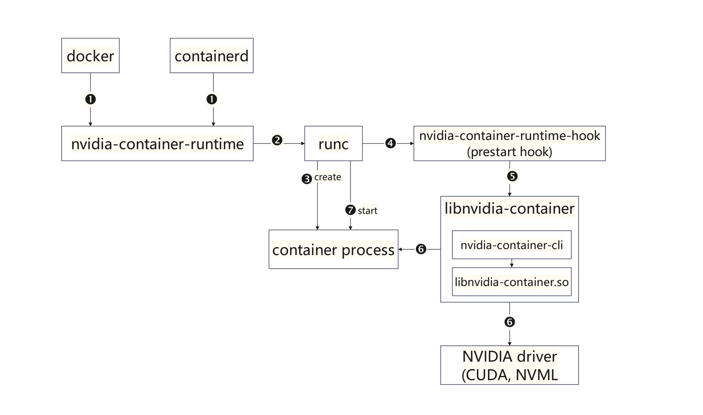

## 简介

AI 大模型时代，国内外各大加速卡厂商都适配了在容器环境下如何使用加速卡的功能，最早实现的就是 Nvidia 公司，Nvidia 公司先后推出了 **nvidia-docker、nvidia-docker2、nvidia-container-toolkits。**

网上教程的概念模糊不清，并没有把 Nvidia 支持容器使用 GPU 的几个项目阐述清楚，主要是由于 Nvidia 为 docker 的支持更新了好几代。下面看看 Nvidia 为容器支持 GPU 的发展历程以及原理。

**本系列文章介绍 GPU 在容器、K8S 上的使用、原理、源码解析，以及相关 GPU 调度、GPU 虚拟化、NVlink、RDMA 技术等。**

## 原生 Docker

使用宿主机上的 GPU，通常只需要安装对应 GPU 型号的驱动即可。那么在容器里使用 GPU，只需要将宿主机上的 GPU 设备、驱动文件、二进制以及对应库文件挂载到容器里即可。以下是 docker 容器使用 GPU 的示例：

```bash
$ docker run \
--device /dev/nvidia0:/dev/nvidia0 \
--device /dev/nvidiactl:/dev/nvidiactl \
--device /dev/nvidia-uvm:/dev/nvidia-uvm \
-v /usr/local/nvidia:/usr/local/nvidia \
-it nvidia/cuda

# 进入容器后，可以通过 nvidia-smi 看到容器里的 GPU 卡信息
$ nvidia-smi 
Fri Jul 26 19:53:09 2024       
+---------------------------------------------------------------------------------------+
| NVIDIA-SMI 535.54.03              Driver Version: 535.54.03    CUDA Version: 12.2     |
|-----------------------------------------+----------------------+----------------------+
| GPU  Name                 Persistence-M | Bus-Id        Disp.A | Volatile Uncorr. ECC |
| Fan  Temp   Perf          Pwr:Usage/Cap |         Memory-Usage | GPU-Util  Compute M. |
|                                         |                      |               MIG M. |
|=========================================+======================+======================|
|   0  NVIDIA A100-PCIE-40GB          Off | 00000000:84:00.0 Off |                    0 |
| N/A   38C    P0              39W / 250W |   6778MiB / 40960MiB |      0%      Default |
|                                         |                      |             Disabled |
+-----------------------------------------+----------------------+----------------------+

+---------------------------------------------------------------------------------------+
| Processes:                                                                            |
|  GPU   GI   CI        PID   Type   Process name                            GPU Memory |
|        ID   ID                                                             Usage      |
|=======================================================================================|
+---------------------------------------------------------------------------------------+
```

当然也可以在创建容器的时候使用**特权模式**，如下：

```bash
$ docker run -it --privileged nvidia/cuda

# 进入容器后，可以通过 nvidia-smi 看到容器里的 GPU 卡信息
$ nvidia-smi 
Fri Jul 26 20:01:00 2024       
+---------------------------------------------------------------------------------------+
| NVIDIA-SMI 535.54.03              Driver Version: 535.54.03    CUDA Version: 12.2     |
|-----------------------------------------+----------------------+----------------------+
| GPU  Name                 Persistence-M | Bus-Id        Disp.A | Volatile Uncorr. ECC |
| Fan  Temp   Perf          Pwr:Usage/Cap |         Memory-Usage | GPU-Util  Compute M. |
|                                         |                      |               MIG M. |
|=========================================+======================+======================|
|   0  NVIDIA A100-PCIE-40GB          Off | 00000000:84:00.0 Off |                    0 |
| N/A   38C    P0              39W / 250W |   6778MiB / 40960MiB |      0%      Default |
|                                         |                      |             Disabled |
+-----------------------------------------+----------------------+----------------------+

+---------------------------------------------------------------------------------------+
| Processes:                                                                            |
|  GPU   GI   CI        PID   Type   Process name                            GPU Memory |
|        ID   ID                                                             Usage      |
|=======================================================================================|
+---------------------------------------------------------------------------------------+
```

**特权模式**会将宿主机上 GPU 卡全都挂载到容器里，因为这台服务器上就一张 A100 卡，所以使用**特权模式**创建容器也只能看到一张卡。

使用特权模式是非常危险的操作，不建议使用；但是使用手动挂载的方式也非常麻烦，需要清楚 GPU 设备、驱动文件、二进制以及对应库文件目录路径。

因此英伟达基于以上问题推出了 **nvidia-docker、nvidia-docker2、nvidia-container-toolkits**

## nvidia-docker

[**nvidia-docker**](https://github.com/NVIDIA/nvidia-docker) 是 NVIDIA 在 2016 年发布的开源项目，也可以是说是 **nvidia-docker 1.0**，也是第一代支持 docker 容器内使用 GPU 资源的项目。运行时用 `nvidia-docker` 命令。根据 github 社区描述，已经不再使用。**nvidia-docker** 实际上就是替换了 docker 本身的命令，使用 `nvidia-docker` 命令来启动 GPU 容器，例如：

```bash
nvidia-docker run --rm nvidia/cuda:9.0-base nvidia-smi
```

### 执行流程

`nvidia-docker` 命令启动一个容器时，会发生以下步骤：

- **初始化容器**：`nvidia-docker` 会调用标准的 Docker 命令来启动一个新容器。
- **挂载 GPU 资源**：在启动容器的过程中，**NVIDIA Docker Volume Plugin** 会将必要的 GPU 驱动程序和库文件挂载到容器内的特定位置。
- **配置环境变量**：`nvidia-docker` 会设置一些必要的环境变量，例如 `LD_LIBRARY_PATH`，以确保容器内部的应用程序能够正确地找到和使用这些 GPU 库和驱动程序。
- **运行应用程序**：最终，容器内的应用程序会在一个支持 GPU 的环境中运行，能够访问到 GPU 资源并进行计算。

**nvidia-docker** 与原生 Docker 生态兼容性差，只支持 docker 运行时，因此 Nvidia 推出了 **nvidia-docker2**。

## nvidia-docker2

**nvidia-docker2** 是 NVIDIA 第二代支持容器内使用 GPU 资源的项目，也可以认为是 **nvidia-docker 2.0**，在 2017 年 12 月发布。

**nvidia-docker2** 是一个软件包，包含 `nvidia-docker` 、`nvidia-container-runtime` 两个包。

**nvidia-docker2** 主要是通过增强的 Docker 运行时来支持 GPU，而不再依赖于独立的 `nvidia-docker` 命令，它引入了 `nvidia-container-runtime`，并通过 `--runtime=nvidia` 选项支持 GPU 容器，`--runtime` 支持自定义容器运行时，默认是 **runc**。

```bash
docker run --runtime=nvidia --rm nvidia/cuda:11.0-base nvidia-smi
```

然而，为了兼容性，`nvidia-docker2` 仍然保留了 `nvidia-docker` 命令作为 `docker` 命令的别名。这意味着用户可以继续使用 `nvidia-docker` 命令，但实际执行的命令是 Docker 运行时的增强版。

```bash
nvidia-docker run --rm nvidia/cuda:11.0-base nvidia-smi
```

### 工作原理

1、安装 **nvidia-docker2** 安装包，会安装 `NVIDIA Container Runtime` 运行时，且需要配置 `/etc/docker/daemon.json`，添加以下内容以启用 NVIDIA 运行时

```json
{
  "runtimes": {
    "nvidia": {
      "path": "nvidia-container-runtime",
      "runtimeArgs": []
    }
  }
}
```

## NVIDIA Container Toolkit

[NVIDIA Container Toolkit](https://docs.nvidia.com/datacenter/cloud-native/container-toolkit/1.17.0/arch-overview.html) 是目前容器使用 GPU 最新的方案，前面两个项目都已经废弃。

NVIDIA Container Toolkit 是一个软件包，包含多个 rpm 包，且 rpm 包和对应的二进制组件、库文件对应关系比较复杂，理解起来较困难。

> 该软件包在 v1.14.0 之前还包含 nvidia-docker2，也就是说安装 v1.14.0 之前版本的 NVIDIA Container Toolkit 依然可以使用 nvidia-docker2 来管理 GPU 容器。
>

### yum 安装

这里以 CentOS 为例，其余操作系统可参考[官网](https://docs.nvidia.com/datacenter/cloud-native/container-toolkit/1.17.0/install-guide.html)

1、配置镜像源

```bash
$ curl -s -L https://nvidia.github.io/libnvidia-container/stable/rpm/nvidia-container-toolkit.repo | \
  sudo tee /etc/yum.repos.d/nvidia-container-toolkit.repo
```

2、安装 NVIDIA Container Toolkit 软件包

```bash
sudo yum install -y nvidia-container-toolkit
```

3、配置 docker

```bash
sudo nvidia-ctk runtime configure --runtime=docker
sudo systemctl restart docker
```

4、使用

```bash
# docker 在 19.03 版本支持 --gpus 选项
$ docker run --rm --gpus all nvidia/cuda nvidia-smi

$ docker run --rm --runtime=nvidia \
    -e NVIDIA_VISIBLE_DEVICES=all nvidia/cuda nvidia-smi

$ docker run --rm --gpus 2 nvidia/cuda nvidia-smi

$ docker run --gpus '"device=1,2"' \
    nvidia/cuda nvidia-smi --query-gpu=uuid --format=csv
```

### rpm 安装

除了使用 yum 镜像源安装，也可以提前下载好 rpm 包或者 deb 包安装，所有离线包都可以在 [libnvidia-container](https://github.com/NVIDIA/libnvidia-container/tree/gh-pages) 项目下载。

1、下载离线包，需要下载如下四个 rpm 包，也就是下面四个 rpm 包组成了  NVIDIA Container Toolkit

```bash
libnvidia-container1-1.17.0-1.x86_64.rpm
libnvidia-container-tools-1.17.0-1.x86_64.rpm
nvidia-container-toolkit-1.17.0-1.x86_64.rpm
nvidia-container-toolkit-base-1.17.0-1.x86_64.rpm

# 依赖关系如下：
├─ nvidia-container-toolkit (version)
│    ├─ libnvidia-container-tools (>= version)
│    └─ nvidia-container-toolkit-base (version)
│
├─ libnvidia-container-tools (version)
│    └─ libnvidia-container1 (>= version)
└─ libnvidia-container1 (version)
```

1、安装所有 rpm 包

```bash
rpm -ivh  ./*.rpm
```

2、配置 docker

```bash
sudo nvidia-ctk runtime configure --runtime=docker
sudo systemctl restart docker
```

### 组件介绍

当安装完 NVIDIA Container Toolkit 后，服务器上即会存在以下二进制和库文件：

```bash
# 二进制
/usr/bin/nvidia-container-runtime
/usr/bin/nvidia-container-runtime-hook
/usr/bin/nvidia-container-toolkit
/usr/bin/nvidia-container-cli
/usr/bin/nvidia-ctk

# 库文件
$ ldconfig -p | grep libnvidia-container
        libnvidia-container.so.1 (libc6,x86-64) => /usr/lib64/libnvidia-container.so.1
        libnvidia-container-go.so.1 (libc6,x86-64) => /usr/lib64/libnvidia-container-go.so.1
```

以上组件整体分为三个部分：

### **The NVIDIA Container Library and CLI**

包含 `libnvidia-container、nvidia-container-cli`，其中 `libnvidia-container` 是一个库文件，该库文件由上面 **libnvidia-container1** rpm 包安装得到。

`nvidia-container-cli` 是一个 c 二进制命令，该命令由上面 **libnvidia-container-tools** rpm 包安装得到。

`libnvidia-container` 提供良好的 API 供 `nvidia-container-cli` 调用，将宿主机上的 gpu 驱动，设备，库文件等挂载到容器内。

### **The NVIDIA Container Runtime Hook**

包含 `nvidia-container-runtime-hook、nvidia-container-toolkit` 二进制命令，该命令由上面 **nvidia-container-toolkit** rpm 包安装得到。

`nvidia-container-toolkit` 为 `nvidia-container-runtime-hook` 的软连接，具体为啥设置这个软连接，不是太清楚

```bash
$ ll /usr/bin/nvidia-container-toolkit 
lrwxrwxrwx 1 root root 38  6月  7 10:51 /usr/bin/nvidia-container-toolkit -> /usr/bin/nvidia-container-runtime-hook
```

该组件主要作为 `runc` 的 **prestart hook**，这里需要先了解 `runc` 操作容器时几个阶段。

> runc 是一个底层容器运行时，它只能识别 OCI 容器标准，即 **runC spec**，**runC spec** 里定义了容器的所有信息，例如 env、mount、status 等。
OCI 容器标准定义了容器的三个 hook，分别在对应阶段操作容器。
**prestart：**只能在运行时进行调用，如果调用失败需要清除容器进程。prestart 会在 start 命令执行后，但还未启动用户进程之前进行调用。对 Linux 来讲，prestart 会在容器命名空间创建完成后调用。
**poststart：**该 hook 会在启动完用户进程，但start操作还未返回前进行调用。比如，我们可以通过 poststart hook 通知用户容器的进程已经启动。
**poststop：**会在容器被删除但是删除命令还未返回之前被调用。
>

那么 `nvidia-container-runtime-hook` 是在 `runc` 创建容器之后，启动容器之前被 `runc` 调用。`runc` 将 **runC spec** 传给 `nvidia-container-runtime-hook`，然后 `nvidia-container-runtime-hook` 解析 **runC spec** 内容，如果存在 GPU 相关的 env、device 等信息，就调用 `nvidia-container-cli` 命令将 GPU 相关驱动、设备、库文件挂载到容器内部。最后 `runc` 正式启动容器。

### **The NVIDIA Container Runtime**

即 `nvidia-container-runtime、nvidia-ctk` 二进制命令，该命令由上面 **nvidia-container-toolkit-base** rpm 包安装得到。

`nvidia-container-runtime` 命令是基于原生 `runc` 的接口开发，做的事很纯粹，接收 docker、containerd 转入的 `runC spec`，然后修改 `runC spec`，设置 `nvidia-container-runtime-hook` 作为其 **prestart hook**。

`nvidia-ctk` 命令可配置 docker、containerd 配置文件，配置 `nvidia-container-runtime` 作为默认容器运行时。

### 普通容器流程

了解了以上二进制命令和库文件的作用和来源，可能对整体创建 GPU 容器的流程还是一知半解，接下来系统梳理下整个流程和原理。

先看看创建一个非 GPU 容器的过程：



根据上图可看出，当 docker、containerd 创建容器时，调用默认 `runc` 即可，`runc` 根据 **runC spec** 内容创建、启动对应的容器

### GPU 容器流程

整体组件物理架构如下( 如果是 cri-o、lxc 流程可参考[官网](https://docs.nvidia.com/datacenter/cloud-native/container-toolkit/1.16.0/arch-overview.html#architecture-overview))：



- docker、containerd 创建一个 gpu 容器，这里并没有调用默认 `runc`，而是 `nvidia-container-runtime`，并将 **runC spec** 传给 `nvidia-container-runtime`。

    > docker、containerd 默认情况下调用 `runc` 创建容器，在 gpu 环境下，就需要将默认 `runc` 换成 `nvidia-container-runtime`，通过修改 docker、containerd 配置，这里以 docker 为例：
    >
    >
    > ```json
    > {
    >     "data-root": "/data/docker",
    >     "default-runtime": "nvidia",
    >     "exec-opts": [
    >         "native.cgroupdriver=systemd"
    >     ],
    >     "log-driver": "json-file",
    >     "log-level": "warn",
    >     "log-opts": {
    >         "max-file": "3",
    >         "max-size": "10m"
    >     },
    >     "max-concurrent-downloads": 20,
    >     "runtimes": {
    >         "nvidia": {
    >             "args": [],
    >             "path": "nvidia-container-runtime"
    >         }
    >     }
    > }
    > 
    > ```
    >
- `nvidia-container-runtime` 接收到 **runC spec** 后，仅仅修改 **runC spec** 里 **prestart** 字段，将该字段值设置为 `nvidia-container-runtime-hook` 的执行路径。然后调用默认 `runc`，并将 **runC spec** 传给 `runc`
- `runc` 接收到 **runC spec** 后，首先**创建**容器，但是不会**启动**容器，因为它解析到 **runC spec** 中有 **prestart hook**。这样 `runc` 在启动容器之前会调用 **prestart hook**，也就是调用 `nvidia-container-runtime-hook`。`runc` 同样也会将 **runC spec** 传给 `nvidia-container-runtime-hook`
- `nvidia-container-runtime-hook` 解析 **runC spec** 里是否存在 `NVIDIA_VISIBLE_DEVICES` 环境变量或者相关 gpu 设备 mount 信息。如果存在即直接调用 `nvidia-container-cli` 命令，如果不存在即程序退出，这样按照普通容器逻辑完成。

    > 所以即使将 `nvidia-container-runtime` 设置为**默认 runc**，创建普通容器不会受影响，但是链路会稍微长一点。
    >
- [`nvidia-container-cli`](https://github.com/NVIDIA/libnvidia-container/tree/master/src/cli) 是一个 C 写的小工具，主要作用就是根据上执行命令时传递的参数，把 GPU 设备及其相关依赖库挂载到容器中，使得容器能够正常使用 GPU 能力。`nvidia-container-cli` 最终还是调用 [`libnvidia-container.so`](http://libnvidia-container.so) ，该库文件是采用 linux c `mount --bind`功能将 CUDA Driver Libraries/Binaries 一个个挂载到容器里，而不是将整个目录挂载到容器中。

    > `nvidia-container-cli` 和 `libnvidia-container.so` 是属于一个组件，统称为 `libnvidia-container`，因为 c 项目一般都是一个二进制命令加一些依赖库组成。
    >
- `runc` 执行完 **prestart hook** 之后，再启动容器以及后续动作，至此，GPU 容器的创建流程就结束了。

### 注意

当把默认 `runc` 设置为 `nvidia-container-runtime` 后，即使在创建容器时，并没有指定 gpu 相关选项，但是容器中也会挂载 gpu 。可能是如下原因导致：

- 原始镜像存在 `NVIDIA_VISIBLE_DEVICES` 环境变量，即使创建容器不指定 gpu 选项，但是镜像存在 `NVIDIA_VISIBLE_DEVICES` 环境，同样会被 `nvidia-container-runtime-hook` 解析到
- `nvidia-container-toolkit` 中存在特殊逻辑，没有设置 `NVIDIA_VISIBLE_DEVICES`环境变量，也没通过其他方式解析到 device 并且还是一个 **legacy image**，那么默认会返回`all`，即：`NVIDIA_VISIBLE_DEVICES=all` ，因此该 Pod 可以看到全部 GPU。

    > **lagacy image** 指镜像有 `*CUDA_VERSION` 环境变量，但是不存在 `NVIDIA_REQUIRE_CUDA` 变量*
    >

## 总结

容器使用 GPU 已经不是一个复杂的技术，得益于英伟达先后推出了 **nvidia-docker、nvidia-docker2、NVIDIA Container Toolkit**，目前 **NVIDIA Container Toolkit** 是社区统一方案，前两个已废弃不维护。

本片文章系统地分析了容器使用 GPU 的原理，以及创建 GPU 容器的全流程。本篇文章主要以 docker 为容器运行时举例说明，对于 containerd、cri-o 等其他容器运行时，可能存在技术实现区别，但是整体原理基本差不多，可参考 [nvidia 官网](https://docs.nvidia.com/datacenter/cloud-native/container-toolkit/1.16.0/arch-overview.html)了解细节。

除了英伟达实现了 GPU 容器，其他加速卡厂商基本都有类似实现，例如华为 NPU、燧原 GCU，但也有的厂商并没有实现类似替代 `runc` 的运行时。但是需要结合厂商指定镜像来创建容器，例如寒武纪 MLU、 天数、 海光。
比如天数就没有提供自己的 container-toolkit，只在 device plugin 中通过 Device 指定要挂载哪些设备, 这样容器启动时也会把这些设备挂载到容器中。不过由于没有挂载驱动进去，因此需要容器内自带驱动才行。
