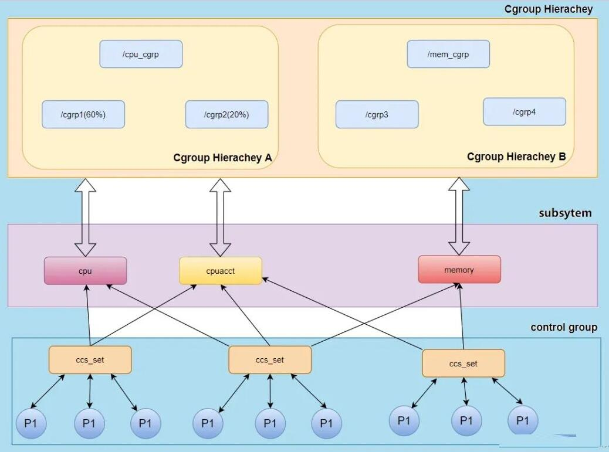

## 简介

当在任何一个能够运行 CRI (Docker、Containered 等) 的机器上，使用 `docker run <image-id>` 启动一个容器后。从使用者的角度来看，容器和一台独立的机器或者虚拟机几乎没有什么区

别。使得我们在容器里就像操作虚拟机一样将服务运行在容器中，这样你的机器上能够非常多的容器，且容器之间都有独立的运行资源，网络、文件系统等相互隔离。

但是容器和虚拟机相比，却没有各种复杂的硬件虚拟层，没有独立的 Linux 内核。容器所有的进程调度，内存访问，文件的读写都直接跑在宿主机的内核之上，这是怎么做到的呢？

Linux 内核的 **Namespace** 和 **Cgroups** 功能可以让程序在一个资源可控的独立（隔离）环境中运行，这个就是容器了。

## 用户视角的容器

上面说到用户使用容器就跟使用虚拟机几乎没什么区别，也就是说：

- 容器的文件系统是独立的，也就是容器之间文件系统是隔离的
- 容器网络是独立的，默认容器网络有单独网络协议栈
- 容器进程间的通信是隔离的
- 容器的用户、用户组也是隔离的
- 容器内进程 PID 独立
- 容器的主机名独立
- 资源( CPU、Memory 等 ) 隔离，容器之间资源隔离

对于一个操作系统，如果以上这些条件都实现，那么该操作系统在用户视角下就完完全全是一个全新、独立的。容器就是利用 **Linux Namespace、Cgroup** 技术来实现的。

当使用 `docker run -d centos/httpd-24-centos7:latest` 启动一个 httpd 服务的容器，使用 `ls -l /proc/<pid>/ns/` 在宿主机查看该进程的 **Namespace** 信息。

```bash
ls -l /proc/126013/ns/
lrwxrwxrwx. 1 1001 root 0 10月 30 11:33 ipc -> ipc:[4026535315]
lrwxrwxrwx. 1 1001 root 0 10月 30 11:33 mnt -> mnt:[4026535313]
lrwxrwxrwx. 1 1001 root 0 10月 30 11:33 net -> net:[4026535319]
lrwxrwxrwx. 1 1001 root 0 10月 30 11:33 pid -> pid:[4026535316]
lrwxrwxrwx. 1 1001 root 0 10月 30 15:27 user -> user:[4026531837]
lrwxrwxrwx. 1 1001 root 0 10月 30 11:33 uts -> uts:[4026535314]
```

发现该进程对应的 ipc、mnt、net、pid、user、uts 都指向了单独的 namespace。

## Namespace

Linux 内核 **Namespace** 类型有很多，支持 **cgroup/ipc/network/mount/pid/time/user/uts，**下面看看是如何使用这些 Namespace 隔离技术运行一个容

器。

### PID Namespace

当使用 `docker exec 624d08ddaf99 ps -ef` 获取一个容器的所有进程，看到了该容器只运行了五个 httpd 进程。

```bash
# docker exec c5a9ff78d9c1 ps -ef

UID        PID  PPID  C STIME TTY          TIME CMD
root         1     0  0 01:59 ?        00:00:00 /sbin/httpd -D FOREGROUND
apache       6     1  0 01:59 ?        00:00:00 /sbin/httpd -D FOREGROUND
apache       7     1  0 01:59 ?        00:00:00 /sbin/httpd -D FOREGROUND
apache       8     1  0 01:59 ?        00:00:00 /sbin/httpd -D FOREGROUND
apache       9     1  0 01:59 ?        00:00:00 /sbin/httpd -D FOREGROUND
```

直接获取该容器所在的宿主机上的 httpd 进程，同样可以看到这 5 个进程。

```bash
# ps -ef | grep httpd

UID        PID  PPID  C STIME TTY          TIME CMD
1001     126013 125976  0 11:33 ?        00:00:00 httpd -D FOREGROUND
1001     126100 126013  0 11:33 ?        00:00:01 httpd -D FOREGROUND
1001     126105 126013  0 11:33 ?        00:00:01 httpd -D FOREGROUND
1001     126119 126013  0 11:33 ?        00:00:01 httpd -D FOREGROUND
1001     126134 126013  0 11:33 ?        00:00:01 httpd -D FOREGROUND
1001     126140 126013  0 11:33 ?        00:00:01 httpd -D FOREGROUND
```

对比两组结果，发现两组数据的 **PID** 不一样。Linux 在创建容器的时候，就会建出一个 **PID Namespace**，该 **PID Namespace** 下所有所有进程编号都从1 开始。其实和 Linux 宿主机一样，

Linux 开机时就会启动一个 1 号进程，该进程是所有进程的父进程。同时在这个 **PID Namesapce** 中只能看到该 Namespace 下的进程，看不到其他 Namespace 下的进程。

那么这个 httpd 服务对应的**宿主机 PID** 和**容器 PID** 的关系是什么样的，这两个 PID 对应着都是同一个 httpd 服务的某个进程。

可以通过 `docker inspect <container id> | grep Pid` 查看这个容器对应`宿主机上的 PID`。会发现这个 `"Pid": 126013` 就是在宿主机上使用 `ps -ef |grep httpd` 查到的 httpd 进程一样，只

不过这个 httpd 服务有多个进程，126013 是所有子进程的父进程。

```bash
# docker inspect 5d22ea980dc8|grep Pid
            "Pid": 126013,

# ps -ef | grep httpd
UID        PID  PPID  C STIME TTY          TIME CMD
1001     126013 125976  0 11:33 ?        00:00:00 httpd -D FOREGROUND
```

这也就是说，如果有另外一个容器，那么它也有自己的一个 **PID Namespace**，而这两个 **PID Namespace** 之间是不能看到对方的进程的，这里就体现出了 Namespace 的作用：**相互隔离**。

当然这只是隔离了服务的进程，下面看看 **Network Namespace**。

### Network Namespace

如果启动容器时不使用 `—net=host` ，即容器使用宿主机的网络，那么 Linux 就会给这个容器创建单独的 **Network Namespace**。在这个 **Network Namespace** 中都有一套独立的网络接口。

比如查看容器的网络接口，这里的 lo，eth0，还有独立的 TCP/IP 的协议栈配置。

```bash
# docker exec 5d22ea980dc8 ip addr
1: lo: <LOOPBACK,UP,LOWER_UP> mtu 65536 qdisc noqueue state UNKNOWN group default qlen 1000
    link/loopback 00:00:00:00:00:00 brd 00:00:00:00:00:00
    inet 127.0.0.1/8 scope host lo
       valid_lft forever preferred_lft forever

168: eth0@if169: <BROADCAST,MULTICAST,UP,LOWER_UP> mtu 1500 qdisc noqueue state UP group default
    link/ether 02:42:ac:11:00:02 brd ff:ff:ff:ff:ff:ff link-netnsid 0
    inet 172.17.0.2/16 brd 172.17.255.255 scope global eth0
       valid_lft forever preferred_lft forever
```

至于这个容器的网络通信原理会在后面讲解。

### Mount Namespace

同样的进入容器内会发现容器的文件系统也是独立的。容器的文件系统，其实就是我们做的**镜像。**

运行 `docker exec 5d22ea980dc8 ls/` 查看容器中的根文件系统（rootfs）。这里依靠的是 `Mount Namespace`，`Mount Namespace` 保证了每个容器都有自己独立的文件目录结构。

### IPC Namespace

**IPC Namespace** 主要是用来隔离进程间通信的。例如 **PID Namespace** 和 **IPC Namespace** 一起使用可以实现同一 **IPC Namespace** 内的进程彼此可以通信，不同 **IPC Namespace** 的进程却不

能通信。

### User Namespace

**User Namespace** 主要是用来隔离用户和用户组的。一个比较典型的应用场景就是在主机上以非 root 用户运行的进程可以在一个单独的 **User Namespace** 中映射成 root 用户。使用 

**User Namespace** 可以实现进程在容器内拥有 root 权限，而在主机上却只是普通用户。

### UTS Namespace

UTS Namespace 用于隔离容器的主机名和域名，意思是每个容器内的主机名都可以独立。

### Time Namespace

Time Namespace 用于隔离容器的时间，但是容器并没有隔离时间，也就是说所有容器的时间是和宿主机一致的。

## Cgroups

上面介绍了一系列 Linux 隔离技术，那么容器内的资源使用是如何限制的。

Linux **Cgroups( Control Groups)**  技术可以对执行的进程做各种计算机资源的限制，比如限制 CPU 的使用率，内存使用量，IO流量等。

**Cgroups** 通过对不同的**子系统**限制了不同的资源，每个子系统限制一种资源。每个子系统限制资源的方式都是类似的，就是把相关的一组进程分配到一个**控制组**里，然后通过树结构进行管

理，每个控制组设有自己的控制参数。完整的 **Cgroups** 子系统的介绍，你可以查看 [Linux Programmer's Manual](https://man7.org/linux/man-pages/man7/cgroups.7.html) 中 **Cgroups** 的定义。

### (Subsystem)子系统

可通过执行 ls /sys/fs/cgroup/ 查看 Linux 支持的 **Cgroups 子系统：**

```bash
# ls /sys/fs/cgroup/
blkio  cpu  cpuacct  cpu,cpuacct  cpuset  devices  freezer  hugetlb  memory  net_cls  net_cls,net_prio  net_prio  perf_event  pids  systemd
```

- **blkio 子系统**，是 cgroup v1 中的一个子系统，使用 cgroup v1 blkio 子系统主要是为了减少进程之间共同读写同一块磁盘时相互干扰的问题。cgroup v1 blkio 控制子系统可以限制进程读
    
    写的 IOPS 和吞吐量，但它只能对 Direct I/O 的文件读写进行限速，对 Buffered I/O 的文件读写无法限制。
    
- **cpu, cpuacct 子系统**，用来限制一个控制组（一组进程，你可以理解为一个容器里所有的进程）可使用的最大 CPU。
- **cpuset 子系统**， 这个子系统来限制一个控制组里的进程可以在哪几个物理 CPU 上运行。
- **devices 子系统**，维护一个设备访问权限管理，控制进程对设备文件读写访问权限以及设备文件创建。
- **freezer 子系统**，用于挂起和恢复 cgroup 中的进程。
- **hugetlb 子系统**，用来限制控制组里进程使用的大页。
- **memory 子系统**，用来限制一个控制组最大的内存使用量。
- **net_cls,net_prio 子系统**，用来限制进程的网络资源
- **perf_event 子系统**，Cgroups 中的进程监控
- **pids 子系统**，用来限制一个控制组里最多可以运行多少个进程。
- **systemd** 不属于 cgroups 子系统

> 每个版本 linux 内核的子系统不是都一样。
> 

### cgroup 组

除了**子系统**之外，还需要了解 group 的概念，在 **Cgroups** 中，资源都是以组为单位控制的，每个组包含一个或多个的子系统。你可以按照任何自定义的标准进行组的划分。划分组之后，你

可以将任意的进程加入、迁移到任意组中并且实时生效（但是对于进程的子进程不影响）。

### (hierarchy)层级树

一组以树状结构排列的 cgroup 就是 hierarchy(层级树)，结合虚拟文件系统来理解，通过创建、删除、重命名子目录来定义层次结构。子目录能够继承父目录的全部资源（当然了，不能超

过），也可以基于父目录的资源限制进行进一步的资源大小限制。父目录如果调整了资源大小，子目录同样会马上受到影响。

每个层级树可以关联任意个数的 subsystem，但是每个 subsystem 最多只能被挂在一颗树上。



### 通过 cgroups 限制容器的 memory

对于启动的每个容器，都会在 Cgroups **子系统**下建立一个目录，在 Cgroups 中这个目录也被称作**控制组**。然后我们设置这个控制组的参数，通过这个方式，来限制这个容器的内存资源。

还记得，我们之前用 Docker 创建的那个容器吗？在每个 Cgroups 子系统下，对应这个容器就会有一个目录 **docker-5d22ea980dc8……** 这个容器的 ID 号，这个 ID 号前面我们用 ps 看到的进程号。容器中

所有的进程都会储存在这个控制组中 cgroup.procs 这个文件里。

把`（2* 1024 * 1024 * 1024 = 2147483648）`这个值，写入 memory Cgroup 控制组中的 `memory.limit_in_bytes` 里，这样设置后，cgroup.procs 里面所有进程 Memory 使用量之和，最大也不会超过 2GB。

```bash
# cd /sys/fs/cgroup/memory/system.slice/docker-**5d22ea980dc8**fedd52511e18fdbd26357250719fa0d128349547a50fad7c5de9.scope

# cat cgroup.procs
20731
20787
20788
20789
20791

# echo 2147483648 > memory.limit_in_bytes
# cat memory.limit_in_bytes
2147483648
```

### Docker 对 Cgroups 的使用

默认情况下，Docker 启动一个容器后，会在 `/sys/fs/cgroup` 目录下的各个资源目录下生成以容器 ID 为名字的目录（group），比如：

`/sys/fs/cgroup/cpu/docker/03dd196f415276375f754d51ce29b418b170bd92d88c5e420d6901c32f93dc14` 此时 `cpu.cfs_quota_us` 的内容为 -1，表示默认情况下并没有限制容器的 CPU 使用。在容器被 stopped 

后，该目录被删除。

docker 启动容器时可以指定参数对容器的 cgroup 进行设置，基本支持了上面说的 cgroup 所有**子系统。**

```bash
# docker run --help

block IO:
      --blkio-weight value          Block IO (relative weight), between 10 and 1000
      --blkio-weight-device value   Block IO weight (relative device weight) (default [])
      --cgroup-parent string        Optional parent cgroup for the container
CPU:
      --cpu-percent int             CPU percent (Windows only)
      --cpu-period int              Limit CPU CFS (Completely Fair Scheduler) period
      --cpu-quota int               Limit CPU CFS (Completely Fair Scheduler) quota
  -c, --cpu-shares int              CPU shares (relative weight)
      --cpuset-cpus string          CPUs in which to allow execution (0-3, 0,1)
      --cpuset-mems string          MEMs in which to allow execution (0-3, 0,1)
Device:    
      --device value                Add a host device to the container (default [])
      --device-read-bps value       Limit read rate (bytes per second) from a device (default [])
      --device-read-iops value      Limit read rate (IO per second) from a device (default [])
      --device-write-bps value      Limit write rate (bytes per second) to a device (default [])
      --device-write-iops value     Limit write rate (IO per second) to a device (default [])
Memory:      
      --kernel-memory string        Kernel memory limit
  -m, --memory string               Memory limit
      --memory-reservation string   Memory soft limit
      --memory-swap string          Swap limit equal to memory plus swap: '-1' to enable unlimited swap
      --memory-swappiness int       Tune container memory swappiness (0 to 100) (default -1)
```

运行命令 `docker run -d --memory 4MB httpd:latest` 启动一个容器，且限制该容器内存最大使用为 4MB( Linux 限制最小为 4MB）。在宿主机查看该容器对应进程的 cgroup 。

```bash
# cat /sys/fs/cgroup/memory/system.slice/docker-06bd180cd34ffedd52511e18fdbd26357250719fa0d128349547a50fad7c5de9.scope/memory.limit_in_bytes
4194304
```

## 总结

一句话概括，**容器 = Namespace + Cgroups，**要想学好容器技术，掌握容器原理，首先就得熟练掌握 Linux 的 Namespace、Cgroups 技术。

在容器层面还有”**镜像技术”，**镜像是容器的基础。进入容器看到的文件系统就是镜像，镜像也依赖于一系列的底层技术，比如**文件系统(filesystems)、写时复制(copy-on-write)、联合挂载(union mounts)**

等，下一篇详细讲解。