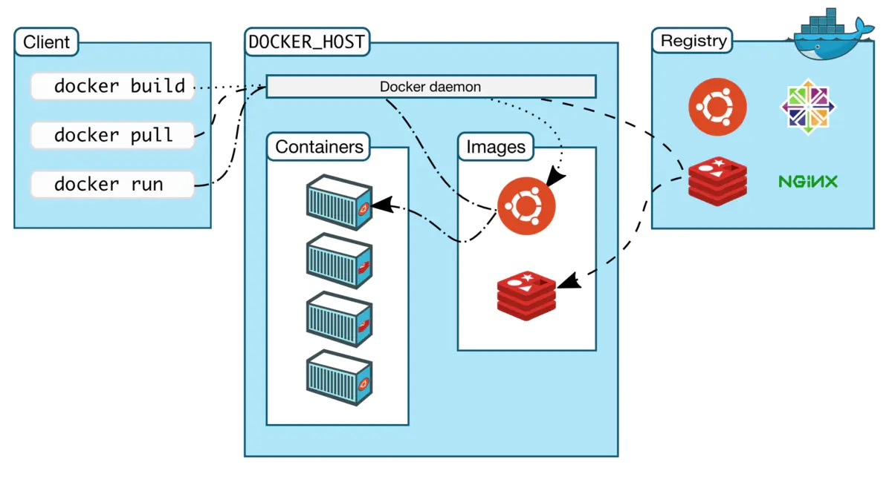

## 简介

大家在使用 docker build 命令构建 docker 镜像时，有没有发现 docker 会输出下面构建日志：`Sending build context`

同时 `docker build -t test:v1.0 .` 这个 **.** 又是什么意思？

在解答以上问题之前，先看看 docker build 命令的组成。

```bash
$ docker build [OPTIONS] PATH | URL | -
```

docker build 从 **Dockerfile** 和 **Context(构建上下文)** 构建镜像。Dockerfile 很好理解，**Context** 代表了构建所需的所有文件，可以由 **PATH(本地路径)、URL** 表示。

URL 参数可以指两种资源：**Git repositories、pre-packaged tarball contexts**

[Docker 官网](https://docs.docker.com/engine/reference/commandline/build/#text-files)认为 **plain text files** 也是 URL 资源，我个人认为单独作为一个构建参数比较容易理解

下面通过讲解这些参数的作用和使用来回答开头提出的两个问题。

## Docker 架构

Docker 在运行时分为 Docker-engine，以及 Docker-client，我们日常使用各种 docker 命令，其实就是在使用客户端工具与 Docker-engine 进行交互。



那么当我们使用 docker build 命令来构建镜像时，这个构建过程其实是在 Docker-engine 中完成的，这个 Docker-engine 可能不是本机环境。那么需要将构建镜像所**需要的文件**发送给
Docker-engine。

这些文件的路径就是上面的说的 **Context，**构建过程可以引用 **Context** 中的任何文件。比如：`COPY . /project`，其实拷贝的并不是本机目录下的全部文件，而是从 Docker-engine 中展开的

文件获取。

知道了 docker build 在构建镜像时的 Context 有 **PATH(本地路径)、URL 两种，**下面分别看看如何使用及作用。

## Build With PATH(本地路径)

`docker build -t test:v1.0 .` 这个 ***.*** 就表示 PATH。Docker-client 会将当前目录下的所有文件打包全部发送给 Docker-engine。

当使用 docker build 命令时 Docker-client 并不会解析 Dockerfile，所以这里并不是只发送 ADD、 COPY 指令列出的文件，而是路径下所有文件。

我们也可以定义其他路径，例如： docker build /tmp，即将 /tmp 目录下的文件发送给 Docker-engine。 这个 . 或者 /tmp 就是 **PATH 类型构建上下文**。

```bash
$ docker build -t nginx:latest .
Sending build context to Docker daemon  168.5MB
Step 1/3 : FROM busybox
Pulling repository busybox
 ---> e9aa60c60128MB/2.284 MB (100%) endpoint: https://cdn-registry-1.docker.io/v1/
Step 2/3 : RUN ls -lh /
 ---> Running in 9c9e81692ae9
total 24
drwxr-xr-x    2 root     root        4.0K Mar 12  2013 bin
drwxr-xr-x    5 root     root        4.0K Oct 19 00:19 dev
drwxr-xr-x    2 root     root        4.0K Oct 19 00:19 etc
drwxr-xr-x    2 root     root        4.0K Nov 15 23:34 lib
lrwxrwxrwx    1 root     root           3 Mar 12  2013 lib64 -> lib
dr-xr-xr-x  116 root     root           0 Nov 15 23:34 proc
lrwxrwxrwx    1 root     root           3 Mar 12  2013 sbin -> bin
dr-xr-xr-x   13 root     root           0 Nov 15 23:34 sys
drwxr-xr-x    2 root     root        4.0K Marjiu 12  2013 tmp
drwxr-xr-x    2 root     root        4.0K Nov 15 23:34 usr
 ---> b35f4035db3f
Step 3/3 : CMD echo Hello world
 ---> Running in 02071fceb21b
 ---> f52f38b7823e
Successfully built f52f38b7823e
Removing intermediate container 9c9e81692ae9
Removing intermediate container 02071fceb21b
```

> 在写 Dockerfile 的时候，经常会用 `COPY、 ADD` 将文件拷贝到镜像中。
如果使用 `COPY . /project`  这个指令最好结合 **.dockerignore** 来使用，将不需要的文件忽略掉，不然会导致不需要的文件也打进了镜像中, 使得镜像体积较大。因为没有被忽略的文件会被发送到 Docker-engine。
或者使用 `COPY ./test.txt /project` 拷贝具体路径下的文件，避免拷贝不需要的文件到镜像中。
> 

### -f 与 . 的关系

很多人一开始以为这个 **.**  是指 Dockerfile 的路径，其实 `-f` 参数才是用来指定 Dockerfile 的路径的。

下面通过几个示例讲解：

1、下面这个示例即指定了 `-f`，也指定了 **.** 

表示 Docker-client 会将本机当前目录下的文件发送给 Docker-engine 作为构建上下文。同时如果本机 /opt/Dockerfile 存在，那么发送给 Docker-engine；如果本机 /opt/Dockerfile 不存在即报错。

```bash
# /opt/Dockerfile 存在
$ docker build -t nginx:latest -f /opt/Dockerfile .

# /opt/Dockerfile 不存在
$ docker build -t nginx:latest -f /opt/Dockerfile .
unable to prepare context: unable to evaluate symlinks in Dockerfile path: lstat /opt/Dockerfile: no such file or directory
```

2、下面示例没有指定 `-f`，指定了 **.**  但是上下文也不存在 Dockerfile

没有指定 Dockerfile，那么 Docker-engine 会从展开的目录下寻找名为 **Dockerfile** 的文件名作为 Dockerfile。如果不存在，那么就会报错。

```bash
# ./Dockerfile 不存在
$ docker build -t nginx:latest .
unable to prepare context: unable to evaluate symlinks in Dockerfile path: lstat /tmp/nginx/Dockerfile: no such file or directory
```

3、下面示例没有指定 `-f`，指定了 **.**  上下文存在 Dockerfile

```bash
# ./Dockerfile 存在, 成功构建
$ docker build -t nginx:latest .
```

根据以上讲解，在构建镜像时最好将 Dockerfile 与所需的文件放在同一个目录下作为上下文发送给 Docker-engine。

```bash
$ ls
Dockerfile  nginx-1.21.3.tar.gz  nginx-module-vts-0.2.1.tar.gz

$ docker build -t nginx:latest -f Dockerfile .
```

到这基本解答了第一个问题。

## Build With URL

URL 类型上下文包括：**Git repositories、pre-packaged tarball contexts**

### **Git repositories**

当 URL 参数指向 Git 仓库时，Git repositories 充当构建上下文。系统递归地获取仓库及其子模块。提交历史记录不会被保留。Git 仓库首先被拉到**本地主机上**的临时目录中。拉取成功之后，

该目录将作为**上下文**发送给 Docker-engine。

Git URL 作为上下文配置，由冒号（：）分隔。第一部分表示 Git 的 Branch、Tag 或远程引用。第二部分表示仓库下的一个子目录，该子目录将用作构建上下文。

例如，运行此命令可以在 container 分支中使用名为 docker 的目录作为**构建上下文**：

```bash
$ docker build https://github.com/docker/rootfs.git#container:docker
```

下表表示所有有效后缀及其代表的上下文：

| Build Syntax Suffix | Commit Used | Build Context Used |
| --- | --- | --- |
| myrepo.git | refs/heads/master | / |
| myrepo.git#mytag | refs/tags/mytag | / |
| myrepo.git#mybranch | refs/heads/mybranch | / |
| myrepo.git#pull/42/head | refs/pull/42/head | / |
| myrepo.git#:myfolder | refs/heads/master | /myfolder |
| myrepo.git#master:myfolder | refs/heads/master | /myfolder |
| myrepo.git#mytag:myfolder | refs/tags/mytag | /myfolder |
| myrepo.git#mybranch:myfolder | refs/heads/mybranch | /myfolder |

### **pre-packaged tarball contexts**

当 URL 参数是某个网络地址链接，下载操作将在 Docker-engine 运行的主机上执行(Git 类型是在当前主机拉取仓库)，该主机不一定与发出构建命令的主机相同。Docker-engine 将获取

context.tar.gz 并将其用作构建上下文。Tarball 上下文必须是符合标准 tar UNIX 格式的 tar 存档，并且可以使用 “xz”、“bzip2”、“gzip” 或 “identity”（无压缩）格式中的任何一种进行压缩。

```bash
$ docker build -f ctx/Dockerfile http://server/ctx.tar.gz

Downloading context: http://server/ctx.tar.gz [===================>]    240 B/240 B
Step 1/3 : FROM busybox
 ---> 8c2e06607696
Step 2/3 : ADD ctx/container.cfg /
 ---> e7829950cee3
Removing intermediate container b35224abf821
Step 3/3 : CMD /bin/ls
 ---> Running in fbc63d321d73
 ---> 3286931702ad
Removing intermediate container fbc63d321d73
Successfully built 377c409b35e4
```

上面这个例子使用 http://server/ctx.tar.gz (解压后为 `ctx/*`) 作为 URL，同时指定 Dockerfile 路径是 `ctx/Dockerfile`。那么 Docker-engine 会在  `ctx/Dockerfile` 解析 Dockerfile。

所以本次构建上下文就是 `ctx/` ，因此Dockerfile 中 `ADD ctx/container.cfg /` 操作可以按预期工作。

## Build With Text files

通过 STDIN 将 Dockerfile 内容发送给 Docker-engine。这种情况 Docker-engine 会忽略任何 `-f，--file` 选项，没有上下文。

docker build 命令将在构建上下文的根目录下查找 Dockerfile。`-f，--file` 选项允许指定文件的路径。如果指定了相对路径，则将其解释为相对于上下文的根。

```bash
$ docker build - < Dockerfile
```

这将在没有上下文的情况下从 STDIN 读取 Dockerfile。由于缺少上下文，任何本地目录的内容都不会发送到 Docker-engine。由于没有上下文，Dockerfile 中 `ADD` 指令只有在引用`远程URL` 时才有效。例如：

```docker
ADD  http://server/ctx.tar.gz .
```

## 总结

本文通过对 docker build 原理详解，解答了开头抛出的两个疑问。

上面三种**构建上下文**参数，第一种即 **Build With PATH** 使用频繁，需要掌握并熟练使用。

其实 docker build 里面涉及很多复杂的知识，很多功能使用的时候都忽略了，比如 cache 功能，要搞清楚 cache，对加快构建效率非常有帮助，后面会详细讲解。