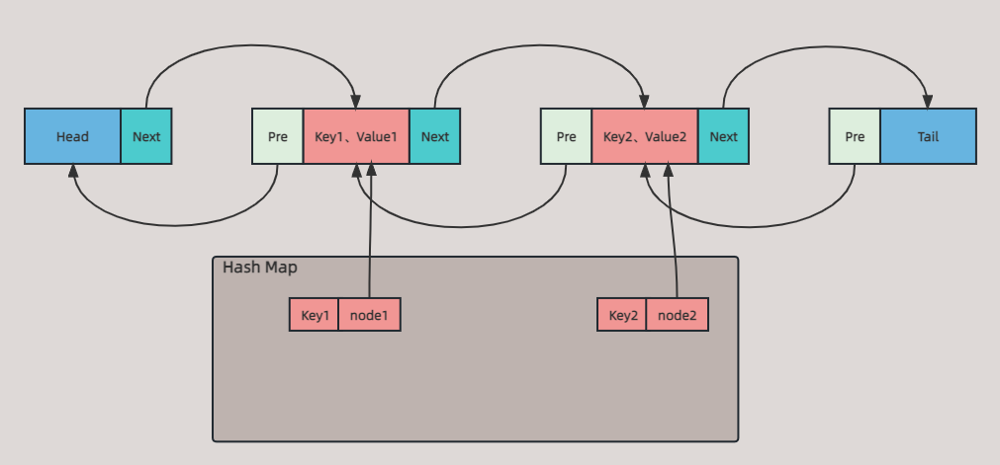

## 背景

上周参加一个云原生 DevOps 开发的面试，第一轮面试问一些技能、项目相关问题，最后留了 20 分要求用 Golang 实现 **`LRU`**。

过程大概用了半个多小时，大概写出来了 80 %，一面勉强过了。写篇文章记录下，加深印象。

## LRU 是什么

**`LRU`**（Least recently used，最近最少使用)，是一种常见的缓存淘汰算法，当缓存满时，淘汰最近最久未使用的元素。

其基本思想是如果一个数据在最近一段时间没有被访问到，那么可以认为在将来它被访问的可能性也很小。因此，当缓存满时，最久未被访问的

数据最先被淘汰。具体做法是将最近使用的元素存放到靠近缓存顶部的位置，当一个新条目被访问时，**`LRU`** 将它放置到缓存的顶部。当缓存满

时，较早之前访问的条目将从缓存底部被移除。

**`LRU`** 底层用 **`hash Map`** 来缓存数据。

## 手撸 LRU

面试手撸 **`LRU`** 很刺激~

### 题目要求

- `**LRU**` 缓存 **`int`** 类型的值，且缓存具有容量限制；
- 实现 **`LRU`** **`Get(key int)`** 方法，如果关键字 **`key`** 存在于缓存中，则返回关键字的值，否则返回 -1；
- 实现 **`LRU`** **`Put(key int，value int)`** 方法，如果关键字 **`key`** 存在于缓存中，则变更其数据值 **`value`**；如果不存在，则向缓存中插入该 **`key`**，**`value`**。如果插入操作导致导致 **`key`** 数量超过缓存容量，则应该逐出最久未使用的 **`key`**；
- **`Get`**、**`Put`** 以 O(1) 的时间复杂度运行。

### 图解 LRU

1、首先要想缓存数据，通过 **`hash map`** ，效率高，操作方便；定义当前缓存的数量和最大容量

2、因为需要保证最久未使用的数据在缓存满的时候将其删除，所以就需要一个数据结构能辅助完成这个逻辑。

所以说使用链表这种结构可以方便删除结点，新增结点，但由于最久未使用的结点在尾结点，通过单链表不方便操作，所以双链表会更加方便操作尾结点。

所以这里利用双链表数据结构，**`head、tail`** 两个指针不存数据，这样保证每个结点操作逻辑一致。

然后上面的 **`map`** 的 **`key`** 为用户传入的 **`key`**，**`map`** 的 **`value`** 为双链表的中 **`node`**，即通过 **`key`** 来获取链表中的 **`node`**，**`node`** 里存有用户传的 **`value`**



### 代码实现

```go
package main

import "fmt"

// 定义 LRU 结构体
type LRUCache struct {
	// 缓存的当前容量
	size       int      
	// 缓存的容量限制                               
	limit      int  
	// 缓存数据的 map   
	cache      map[string]*DoubleLinkList
	// 定义头、尾指针
	head, tail *DoubleLinkList
}

// 定义双链表
type DoubleLinkList struct {
	key       string
	value     int
	next, pre *DoubleLinkList
}

// Get 方法
func (lc *LRUCache) Get(key string) int {
	// 先查找该 key 是否存在缓存中, 如果不存在返回 -1
	if _, ok := lc.cache[key]; !ok {
		return -1
	}
	// 如果存在, 从缓存中获取该 key 的 value
	node := lc.cache[key]
	// 将该结点移动都 head 结点后面，head、tail 结点不存数据
	lc.moveNodeToHead(node)
	return node.value
}

// Put 方法
func (lc *LRUCache) Put(key string, value int) {
	// 如果缓存中没有当前 key
	if node, ok := lc.cache[key]; !ok {
		// 实例化一个 node
		node = &DoubleLinkList{
			key:   key,
			value: value,
		}
		// 将上面实例化的 node 缓存到 LRU 中
		lc.cache[key] = node
		// 因为刚添加进来，依据 LRU 性质, 应添加到双链表 head 后面
		lc.addNodeToHead(node)
		// 容量 + 1
		lc.size++
		// 如果当前容量已经大于缓存所支持的最大容量限制, 则删除长时间没有用的结点
		if lc.size > lc.limit {
			// tail 的前一个结点即是最久未使用的结点
			tailPre := lc.tail.pre
			// 将最久未使用的结点从链表中删除
			lc.removeNode(tailPre)
			// 将当前数据从缓存中删除
			delete(lc.cache, tailPre.key)
			// 当前容量建议 - 1
			lc.size--
		}
	// 如果缓存中存在该 key, 返回该 key 的 value, 根据 LRU 的性质将该结点移动到 head 的后面, 这样就能保证不常用的就会被放到链表尾部
	} else {
		// 从缓存中获取该 key 的 node
		node := lc.cache[key]
		// 将 node 的 value 设置为传入的 value
		node.value = value
		// 将该 node 移动到 head 下一个结点
		lc.moveNodeToHead(node)
	}
}

func (lc *LRUCache) moveNodeToHead(node *DoubleLinkList) {
	// 先将该结点从双链表中移除
	lc.removeNode(node)
	// 然后将结点添加到 head 结点后面
	lc.addNodeToHead(node)
}

// 将结点从双链表中移除
func (lc *LRUCache) removeNode(node *DoubleLinkList) {
	// 将该结点的前一个结点的后继指针指向该结点的下一个结点
	node.pre.next = node.next
	// 再将该结点的后一个结点前驱指针指向该结点的前一个结点
	node.next.pre = node.pre
}

// 将该结添加到 head 结点后面，因为 head 结点不存数据
// 下面的步骤顺序不能随意编排
func (lc *LRUCache) addNodeToHead(node *DoubleLinkList) {
	// 将该结点的后继指针指向 head 结点的下一个结点
	node.next = lc.head.next
	// 将该结点的前驱指针指向 head 结点
	node.pre = lc.head
	// 将 head 结点的下一个节点的前驱结点指向该结点
	lc.head.next.pre = node
    // 将 head 结点的后继指针指向该结点
	lc.head.next = node
}
```

### 测试代码

由于测试需要，实现一个打印 **`LRUCache`** 数据的函数和一个初始化 **`LRUCache`** 的函数

```go
func (lc *LRUCache) ListLRUCache() {
	node := lc.head.next
	for node != nil {
		fmt.Printf("key: %s, value: %d\n", node.key, node.value)
		node = node.next
	}
}

func NewLRUCache() *LRUCache {
	// 实例化一个 LRUCache
	lc := &LRUCache{
		// 缓存容量为 5
		limit: 5,
		cache: make(map[string]*DoubleLinkList),
		head: &DoubleLinkList{
			key:   "head",
			value: 0,
		},
		tail: &DoubleLinkList{
			key:   "tail",
			value: 0,
		},
	}
	// 初始化双链表，将 head 结点的后继指针指向 tail 结点
	lc.head.next = lc.tail
	// 将 tail 结点的前驱指针指向 head 结点
	lc.tail.pre = lc.head
}
```

下面分别一些场景测试：

**场景一：**

获取 **`key`** 的 **`value`**，是否该 **`key`** 的 **`node`** 会被添加到 **`head`** 下一个结点处

```go
func main() {
	// 初始化 LRUCache
	lc := NewLRUCache()
	// 填充满 LRUCache
	lc.Put("key1", 1)
	lc.Put("key2", 2)
	lc.Put("key3", 3)
	lc.Put("key4", 4)
	lc.Put("key5", 5)
	// 获取 key2, 看 key2 是否会被添加到 head.next 处
	fmt.Println(lc.Get("key2"))
	lc.ListLRUCache()
}

测试结果: 发现 key2 被添加到 head.next 处了
key2: 2
key: key2, value: 2
key: key5, value: 5
key: key4, value: 4
key: key3, value: 3
key: key1, value: 1

```

**场景二：**

填充满 **`LRUCache`** 后，使用 **`Put`** 更新某个不存在的 **`key`**，看是否会移除最久未使用的 **`key`**。

```go
func main() {
	// 初始化 LRUCache
	lc := NewLRUCache()
	// 填充满 LRUCache
	lc.Put("key1", 1)
	lc.Put("key2", 2)
	lc.Put("key3", 3)
	lc.Put("key4", 4)
	lc.Put("key5", 5)
	// 在 put 之前先打印 LRUCache 的数据，方便 put 后对比
	fmt.Println("before put: ")
	lc.ListLRUCache()
	// 更新一个缓存中不存在的 key
	lc.Put("key6", 6)
	fmt.Println("after put: ")
	lc.ListLRUCache()
}

测试结果：可以发现 key6 添加到 head.next 处且最久未用的 key1 被移除了

before put: 
key: key5, value: 5
key: key4, value: 4
key: key3, value: 3
key: key2, value: 2
key: key1, value: 1

after put: 
key: key6, value: 6
key: key5, value: 5
key: key4, value: 4
key: key3, value: 3
key: key2, value: 2
```

**场景三：**

填充满 **`LRUCache`** 后，使用 **`Put`** 存在的 **`key`**，看是否会更新且该 **`key`** 的 **`node`** 添加到 [**`head.next`**](http://head.next) 处。

```go
func main() {
	// 初始化 LRUCache
	lc := NewLRUCache()
	// 填充满 LRUCache
	lc.Put("key1", 1)
	lc.Put("key2", 2)
	lc.Put("key3", 3)
	lc.Put("key4", 4)
	lc.Put("key5", 5)
	// 在 put 之前先打印 LRUCache 的数据，方便 put 后对比
	fmt.Println("before put: ")
	lc.ListLRUCache()
	// 更新一个缓存中存在的 key, 将 key5 的 value 改为 6
	lc.Put("key5", 6)
	fmt.Println("after put: ")
	lc.ListLRUCache()
}

测试结果：发现 key5 的value 变为 6, 且被添加到 head.next 处

before put: 
key: key5, value: 5
key: key4, value: 4
key: key3, value: 3
key: key2, value: 2
key: key1, value: 1

after put: 
key: key5, value: 6
key: key4, value: 4
key: key3, value: 3
key: key2, value: 2
key: key1, value: 1

```

## 总结

**`LRUCache`** 在 Redis、Memcached 等分布式缓存系统都广泛使用，了解其原理，对后面使用这些中间件都很有帮助，而且也是常见的面试算法题。