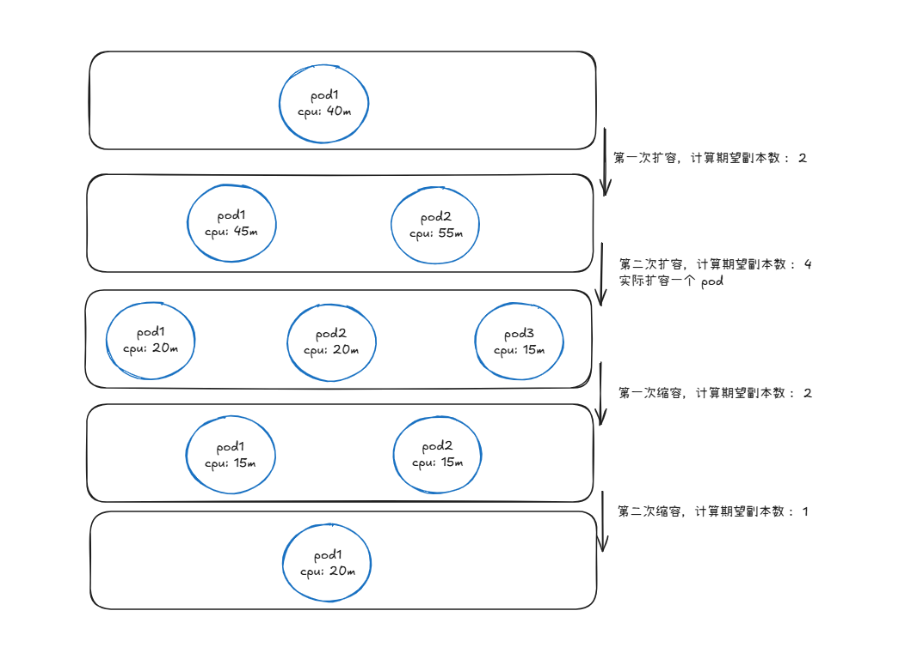

在 Kubernetes 中，**HPA(HorizontalPodAutoscaler)** 自动更新工作负载资源 （例如 [Deployment](https://kubernetes.io/zh-cn/docs/concepts/workloads/controllers/deployment/) 或者 [StatefulSet](https://kubernetes.io/zh-cn/docs/concepts/workloads/controllers/statefulset/)）， 目的是自动扩缩工作负载以满足需求。水平 Pod 自动扩缩不适用于无法扩缩的对象（例如：[DaemonSet](https://kubernetes.io/zh-cn/docs/concepts/workloads/controllers/daemonset/)。）

水平扩缩意味着对增加的负载的响应是部署更多的 [Pod](https://kubernetes.io/zh-cn/docs/concepts/workloads/pods/)。 这与“垂直（Vertical）”扩缩不同，对于 Kubernetes， 垂直扩缩意味着将更多资源（例如：内存或 CPU）分配给已经为工作负载运行的 Pod。

HPA 通过监控分析一些控制器控制的所有 Pod 的负载变化情况来确定是否需要调整 Pod 的副本数量。

## HPA 工作原理

Kubernetes 中 Kube-controller-manager 实现了 HorizontalPodAutoscaler，HorizontalPodAutoscaler 是一个 controller，通过 watch/list hpa 资源对象，实现具体逻辑。

### HPA 步骤

HPA 工作步骤大致如下：

- HorizontalPodAutoscaler 监听 HPA 资源，一旦生成 HPA 资源或者是更改 HPA 配置，HorizontalPodAutoscaler 能及时感知并调整。
- HorizontalPodAutoscaler 从 [聚合 API](https://kubernetes.io/zh-cn/docs/concepts/extend-kubernetes/api-extension/apiserver-aggregation/)  获取对应的指标数据，聚合 API 可以分为三大类：
    - `metrics.k8s.io`：即 metrics-server 组件提供，只提供 CPU、Memory 指标查询
    - `custom.metrics.k8s.io`：手动实现聚合 API，提供自定义数据指标查询
    - `external.metrics.k8s.io`：与 `custom.metrics.k8s.io` 类似都是需要用户自己实现聚合 API，但是 `external.metrics.k8s.io` 提供来自 K8S 集群外的指标数据
- 通过指标、阈值计算对应副本数，做出对应 Pod 副本数调整

第二、第三步默认 `15s` 执行一次，如需调整，可以调整 Kube-controller-manager 的 `--horizontal-pod-autoscaler-sync-period` 参数设置

### HPA 资源对象

K8S V1.22 HPA 的 API 有三个版本：

```bash
[root@k8s001 ~]# kubectl api-versions | grep autoscal
autoscaling/v1
autoscaling/v2beta1
autoscaling/v2beta2
```

- `autoscaling/v1`：只支持基于 CPU 指标的 HPA。
- `autoscaling/v2beta1`：支持 Resource Metrics（资源指标，如 pod 的 CPU）和 Custom Metrics（自定义指标）的缩放。
- `autoscaling/v2beta2`：支持 Resource Metrics（资源指标，如 pod 的 CPU）和 Custom Metrics（自定义指标）和 ExternalMetrics（额外指标）的缩放。

HPA `autoscaling/v2beta2` 资源对象如下：

```yaml
apiVersion: autoscaling/v2beta2
kind: HorizontalPodAutoscaler
metadata:
  name: demo
  namespace: default
spec:
  # HPA的伸缩对象描述，HPA会动态修改该对象的pod数量
  scaleTargetRef:
    apiVersion: apps/v1
    kind: Deployment
    name: php-apache
  # HPA的最小pod数量和最大pod数量
  minReplicas: 1
  maxReplicas: 10
  # 监控的指标数组，支持多种类型的指标共存
  metrics:
  # Object类型的指标
  - type: Object
    object:
      metric:
        # 指标名称
        name: requests-per-second
      # 监控指标的对象描述，指标数据来源于该对象
      describedObject:
        apiVersion: networking.k8s.io/v1beta1
        kind: Ingress
        name: main-route
      # Value类型的目标值，Object类型的指标只支持Value和AverageValue类型的目标值
      target:
        type: Value
        value: 10k
  # Resource类型的指标
  - type: Resource
    resource:
      name: cpu
      # Utilization类型的目标值，Resource类型的指标只支持Utilization和AverageValue类型的目标值
      target:
        type: Utilization
        averageUtilization: 50
  # Pods类型的指标
  - type: Pods
    pods:
      metric:
        name: packets-per-second
      # AverageValue类型的目标值，Pods指标类型下只支持AverageValue类型的目标值
      target:
        type: AverageValue
        averageValue: 1k
  # External类型的指标
  - type: External
    external:
      metric:
        name: queue_messages_ready
        # 该字段与第三方的指标标签相关联
        selector:
          matchLabels:
            env: "stage"
            app: "myapp"
      # External指标类型下只支持Value和AverageValue类型的目标值
      target:
        type: AverageValue
        averageValue: 30

```

### metrics 类型

- **scaleTargetRef**：HPA 控制的目标 WorkLoad，理论上HPA可以对任意支持 scale 子接口（ sub-resource ）的 WorkLoad 做弹性伸缩，不过 Statefulset 一般代表有状态服务，副本不可随便修改，而 Job 一般代表短生命周期的，所以基本可以认为 HPA 目前是专门控制 Deployment 的扩缩容的（不建议直接控制 RS，否则将无法滚动升级）。
- **minReplicas、maxReplicas**：弹性扩缩容的上下边界，也就是说 HPA 的扩缩容也不能是漫无边际，如果计算出的副本数超过 maxReplicas 则统一取maxReplicas，maxReplicas 是为了保护 K8S 集群的资源被耗尽。minReplicas 则相反，而且 minReplicas 必须不大于 maxReplicas，但是也要大于0。两者相等就相当于关闭了自动伸缩功能了，总的来说 minReplicas 和 maxReplicas 边界机制避免 metrics 数据异常导致的副本数不受控。
- **metrics**：表示指标类型、目标值，是一个数组类型。也就是说可以多个 HPA 工作同一个 WorkLoad，如果有多个 HPA 将会依次考量各个指标，然后最终 HPA Controller 选择一个会选择扩缩幅度最大的那个为最终扩容副本数。在 `autoscaling/v2beta2` 之后版本的 HPA中，metrics type 共有4种类型：
    - **Resource**：该类型支持 K8S Pod 的所有系统资源指标 ( 包括 CPU、Memory 等 )，也就是 K8S `reosurce.request` 配置的字段
    - **Pods**：表示 CPU、Memory 等系统资源之外且是由 Pod 自身提供的自定义 metrics 数据，比如用户在服务 Pod 里提供一个 Promtheus metrics 的接口，暴露本 Pod 实时 QPS 监控指标，这种情况下使用 HPA 应该采用 Pods 类型的 metrics
    - **Object**：表示监控指标不是由 Pod 本身提供，但是可以通过 K8S 的其他资源资源提供的 metrics 查询，比如 ingress 等，该对象需要和 Pod 本身关联起来
    - **External**：该类型指标也属于自定义 metrics，与 Pods、Object 不同的是，其监控指标的来源跟 K8S 本身无关，metrics 的数据完全取自外部的系统

### target 目标值

metrics 中 target 字段表示 Pod 扩缩容的阈值，共有三中类型：

- **Utilization**：表示`平均使用率 =  平均量 / Request`
- **Value**：表示总量
- **AverageValue**：表示`平均值 =  总量 / 当前实例数`

> Resource 类型的 metric 只支持 Utilization 和AverageValue 类型的目标值；
Pod 类型 metric 只支持 AverageValue 类型的目标值；
Object 类型 metric 只支持 Value 和 AverageValue 类型的目标值；
External 类型 metric 支持 Value 和 AverageValue 类型的目标值；
>

## HPA 示例

接下来基于 CPU、Memory 演示 HPA 工作流程

### 基于 CPU

使用 K8S CPU 和 Memory 的 HPA 需要安装 Metrics Server 组件，可参考[社区](https://github.com/kubernetes-sigs/metrics-server)

现在基于一个 Nginx Deployment 示例来演示 CPU HPA，资源清单如下：

```yaml
apiVersion: apps/v1
kind: Deployment
metadata:
  name: hpa-cpu-demo
  namespace: hpa-test
spec:
  selector:
    matchLabels:
      app: nginx
  template:
    metadata:
      labels:
        app: nginx
    spec:
      containers:
        - name: nginx
          image: nginx
          ports:
            - containerPort: 80
          # 使用 hpa 必须设置 request
          resources:
            requests:
              memory: 50Mi
              cpu: 50m
```

然后创建该 Nginx Deployment

```bash
$ kubectl apply -f hpa-demo.yaml
deployment.apps/hpa-demo created
$ kubectl get pods -l app=nginx -n hpa-test
NAME                        READY   STATUS    RESTARTS   AGE
hpa-demo-85ff79dd56-pz8th   1/1     Running   0          21s
```

接下来创建一个 CPU HPA

```yaml
apiVersion: autoscaling/v2beta2
kind: HorizontalPodAutoscaler
metadata:
  name: cpu-hpa
  namespace: hpa-test
spec:
  scaleTargetRef:
    apiVersion: apps/v1
    kind: Deployment
    name: hpa-cpu-demo
  minReplicas: 1
  maxReplicas: 5
  metrics:
    - type: Resource
      resource:
        # 需要和 resource.request 字段一致
        name: cpu
        target:
          type: Utilization
          averageUtilization: 10
```

查看 HPA 资源

```bash
$ kubectl get hpa -n hpa-test
NAMESPACE   NAME      REFERENCE                 TARGETS   MINPODS   MAXPODS   REPLICAS   AGE
hpa-test    cpu-hpa   Deployment/hpa-cpu-demo   0%/10%    1         5         1          35s
$ kubectl describe hpa cpu-hpa -n hpa-test
Name:                                                  cpu-hpa
Namespace:                                             hpa-test
Labels:                                                <none>
Annotations:                                           <none>
CreationTimestamp:                                     Sun, 15 Dec 2024 20:01:55 +0800
Reference:                                             Deployment/hpa-cpu-demo
Metrics:                                               ( current / target )
  resource cpu on pods  (as a percentage of request):  0% (0) / 10%
Min replicas:                                          1
Max replicas:                                          5
Deployment pods:                                       1 current / 1 desired
Conditions:
  Type            Status  Reason               Message
  ----            ------  ------               -------
  AbleToScale     True    ScaleDownStabilized  recent recommendations were higher than current one, applying the highest recent recommendation
  ScalingActive   True    ValidMetricFound     the HPA was able to successfully calculate a replica count from cpu resource utilization (percentage of request)
  ScalingLimited  False   DesiredWithinRange   the desired count is within the acceptable range
Events:           <none>
```

现在可以看到 HPA 资源对象已经正常了，现在我们来增大负载进行测试，我们来创建一个 busybox 的 Pod，并且循环访问上面创建的 Nginx Pod：

```bash
$ kubectl run -it --image busybox test-hpa --restart=Never --rm /bin/sh
If you don't see a command prompt, try pressing enter.
/ # while true; do wget -q -O- http://10.244.4.97; done
```

可以看到，HPA 已经开始工作：

```bash
$ kubectl get hpa -n hpa-test
NAMESPACE   NAME      REFERENCE                 TARGETS    MINPODS   MAXPODS   REPLICAS   AGE
hpa-test    cpu-hpa   Deployment/hpa-cpu-demo   166%/10%   1         5         4          17m
$ kubectl get pods -n hpa-test
NAME                           READY   STATUS    RESTARTS   AGE
hpa-cpu-demo-9bfdcf487-4t72x   1/1     Running   0          17s
hpa-cpu-demo-9bfdcf487-8vf8z   1/1     Running   0          20m
hpa-cpu-demo-9bfdcf487-gq9vr   1/1     Running   0          32s
hpa-cpu-demo-9bfdcf487-pqxrz   1/1     Running   0          32s
hpa-cpu-demo-9bfdcf487-vtxvj   1/1     Running   0          32s
```

我们可以看到已经自动拉起了很多新的 Pod，最后定格在了我们上面设置的 maxReplicas 5 个 Pod

同样的这个时候我们来关掉 busybox 来减少负载，然后等待一段时间观察下 HPA 和 Deployment 对象：

```bash
$ kubectl get hpa -n hpa-test
NAME      REFERENCE                 TARGETS   MINPODS   MAXPODS   REPLICAS   AGE
cpu-hpa   Deployment/hpa-cpu-demo   0%/10%    1         5         5          23m

$ kubectl get pods -n hpa-test
NAME                           READY   STATUS    RESTARTS   AGE
hpa-cpu-demo-9bfdcf487-8vf8z   1/1     Running   0          31m
```

会发现资源对象的 CPU 利用率下来了，但是 Pod 副本数并没有减少，在大约五分钟后，Pod 副本数逐渐减少至 minReplicas 1 个 Pod

> ***从 Kubernetes `v1.12` 版本开始我们可以通过设置 `kube-controller-manager` 组件的`--horizontal-pod-autoscaler-downscale-stabilization` 参数来设置一个持续时间，用于指定在当前操作完成后，`HPA` 必须等待多长时间才能执行另一次缩放操作。默认为 5 分钟，也就是默认需要等待 5 分钟后才会开始自动缩放***
>

### 基于内存

在 **`autoscaling/v1`** 中只支持基于 CPU 指标的缩放。在 Beta 版本 **`autoscaling/v2beta1`**，引入了基于内存和自定义指标的缩放

现在我们用 Deployment 来创建一个 Nginx Pod，然后利用 HPA 来进行自动扩缩容。资源清单如下所示：（hpa-mem-demo.yaml）

将一个名为 **`increase-mem-config`** 的 ConfigMap 资源对象挂载到了容器中，该配置文件是用于后面增加容器内存占用的脚本

```yaml
apiVersion: v1
kind: ConfigMap
metadata:
  name: increase-mem-config
  namespace: hpa-test
data:
  increase-mem.sh: |
    #!/bin/bash  
    mkdir /tmp/memory  
    mount -t tmpfs -o size=40M tmpfs /tmp/memory  
    dd if=/dev/zero of=/tmp/memory/block  
    sleep 60 
    rm /tmp/memory/block  
    umount /tmp/memory  
    rmdir /tmp/memory    
---
apiVersion: apps/v1
kind: Deployment
metadata:
  name: hpa-mem-demo
  namespace: hpa-test
spec:
  selector:
    matchLabels:
      app: nginx
  template:
    metadata:
      labels:
        app: nginx
    spec:
      volumes:
        - name: increase-mem-script
          configMap:
            name: increase-mem-config
      containers:
        - name: nginx
          image: nginx
          ports:
            - containerPort: 80
          volumeMounts:
            - name: increase-mem-script
              mountPath: /etc/script
          resources:
            requests:
              memory: 1Gi
              cpu: 50m
          securityContext:
            privileged: true
```

然后再创建一个基于 Memory 的 HPA 资源对象：

```yaml
apiVersion: autoscaling/v2beta2
kind: HorizontalPodAutoscaler
metadata:
  name: mem-hpa
  namespace: hpa-test
spec:
  scaleTargetRef:
    apiVersion: apps/v1
    kind: Deployment
    name: hpa-mem-demo
  minReplicas: 1
  maxReplicas: 5
  metrics:
    - type: Resource
      resource:
        # 需要和 resource.request 字段一致
        name: memory
        target:
          type: Utilization
          # 扩容阈值为内存平均利用率 60%
          averageUtilization: 60
```

查看 HPA 状态

```bash
kubectl get hpa -n hpa-test
NAMESPACE   NAME      REFERENCE                 TARGETS   MINPODS   MAXPODS   REPLICAS   AGE
hpa-test    mem-hpa   Deployment/hpa-mem-demo   32%/60%   1         5         5          7m32s
```

现在对 Pod 进行内存压测，将内存压上去，直接执行容器中的 **`increase-mem.sh`** 脚本即可：

```bash
$ kubectl exec -it hpa-mem-demo-679b67dd4b-5qwzh -n hpa-test /bin/bash
root@hpa-mem-demo-679b67dd4b-5qwzh:/# ls /etc/script/
increase-mem.sh
root@hpa-mem-demo-679b67dd4b-5qwzh:/# source /etc/script/increase-mem.sh
dd: writing to '/tmp/memory/block': No space left on device
81921+0 records in
81920+0 records out
41943040 bytes (42 MB, 40 MiB) copied, 0.584029 s, 71.8 MB/s
```

这时 Pod 平均内存使用率已经超过了我们设定的 60% 这个阈值了，HPA 资源对象也已经触发了自动扩容，变成了两个副本，最终变成 5 个副本：

```bash
kubectl get pods -n hpa-test
NAME                            READY   STATUS    RESTARTS   AGE
hpa-mem-demo-679b67dd4b-5qwzh   1/1     Running   0          2m21s
hpa-mem-demo-679b67dd4b-c7qp5   1/1     Running   0          2m3s
hpa-mem-demo-679b67dd4b-jl9s8   1/1     Running   0          2m18s
hpa-mem-demo-679b67dd4b-l47mv   1/1     Running   0          2m18s
hpa-mem-demo-679b67dd4b-rcl2m   1/1     Running   0          2m18s
```

当内存释放掉后，Kube-controller-manager 默认 5 分钟过后会进行缩放，到这里就完成了基于内存的 HPA 操作。

## HPA 副本数计算规则

根据上面基于 CPU、Memory 的两个 HPA 示例，扩缩容的副本数是通过一个计算表达式计算出来的，针对于 Resource 类型的 metrics 的表达式如下：

```bash
DesiredReplicas = ceil{currentReplicas * [ ( sum(currentMetricValue) / sum(request) ) / desiredMetricUtilization ]}
```

- **currentReplicas**：当前 Pod 的副本数量
- **currentMetricValue**：某个 pod 的指标使用量，通过 metric-server 获取都是使用量，需要通过 `currentMetricValue/ request` 计算出使用率，HPA 是通过除以 request 值计算利用率的。`sum(currentMetricValue)` 表示该工作负载下所有 pod 的当前指标总和，`sum(request)` 表示该工作负载下所有 pod 的申请量总和，`sum(currentMetricValue) / sum(request)` 表示该工作负载下指标平均使用率。
- **desiredMetricUtilization**：期望的指标值，即 HPA 对象中定义的目标指标平均利用率
- **DesiredReplicas**：根据当前指标和期望指标计算出的目标副本数量
- **ceil**：是一个数学函数，向上取整某个小数，例如 `ceil(4.2) = 5，ceil(4.8) = 5`

> 每个 metric 类型具有不同的 target 类型，如果是 Pods 类型的 metric，不支持 Utilization，所以不需要计算利用率， 计算公式如下：
`DesiredReplicas = ceil[currentReplicas * ( sum(currentMetricAverageValue) / sum(desiredMetricAverageValue) )]`
>

例如有一个设置 CPU 平均利用率 60% 进行扩缩容的 HPA，且 minReplicas 为 1，maxReplicas 为 3；并关联某个工作负载，该工作负载申请的 cpu 为 50m，即 cpu request 为 50m。该工作负载下 Pod 扩缩容动态如下：

- 当前只有一个 pod1，且 cpu 使用量为 20m，注意通过 metric-server 拿到的 cpu 都是使用量，这时业务数据量增加，cpu 使用量达到 40m
- HPA 控制器在某个周期内通过当前 cpu 利用率计算出期望副本数：
    - `DesiredReplicas = ceil{ 1 * [( 40m / 50m ) / 60%]}`
    - `DesiredReplicas = ceil{ 1.33 } = 2`
- 计算出期望副本数为 2，所以 HPA 再创建出一个 pod2，业务量持续增加，这时 pod1 cpu 使用量为 45m，pod2 cpu 使用量为 55m
- HPA 控制器同样周期性计算该工作负载的期望副本数：
    - `DesiredReplicas = ceil{ 2 * [( 45m + 55m)/ (50m + 50m) / 60%]}`
    - `DesiredReplicas = ceil{ 3.33 } = 4`
- 计算出期望副本数为 4，但是HPA 控制器只会再创建一个 pod 出来，因为设置 maxReplicas 为 3，所以 HPA 扩容的 pod 副本数上线就是 maxReplicas
- 现在业务量下降，此时 pod1 cpu 使用量为 20m，pod2 cpu 使用量为 20m，pod3 cpu 使用量为 15m
- HPA 控制器计算该工作负载期望副本数：
    - `DesiredReplicas = ceil{ 3 * [( 35m + 30m + 25m)/ (50m + 50m + 50m) / 60%]}`
    - `DesiredReplicas = ceil{ 1.83 } = 2`
- 计算出期望副本数为 2，HPA 控制器会删除一个 pod
- 业务量持续下降，此时 pod1 cpu 使用量为 15m，pod2 cpu 使用量为 10m
- HPA 控制器计算该工作负载期望副本数：
    - `DesiredReplicas = ceil{ 2 * [( 15m + 10m )/ (50m + 50m ) / 60%]}`
    - `DesiredReplicas = ceil{ 0.83 } = 1`
- 计算出副本数为 1，会再次删除一个 pod



以上就是 HPA 的工作过程，有以下几点总结：

- 在 HPA 计算过程中，指标利用率是通过除以 request 值算出的
- 多个 pod 需要计算所有 pod 的平均利用率
- 如果是多个 HPA 规则作用去同一个工作负载，那么 HPA 控制器会在多个 HPA 规则计算出的期望副本数选择一个极值。

## 总结

以上只是介绍了基于 CPU、内存下的 HPA，肯定无法满足复杂应用场景。在一些复杂场景下可以实现 [`custom.metrics.k8s.io`](http://custom.metrics.k8s.io) ，基于自定义指标，例如 QPS、网络等完成 HPA。还可以将指标数据关联至 K8S 内部对象，例如 ingress，甚至关联 K8S 集群外的指标。

下一篇基于源码分析 HPA 工作过程~
