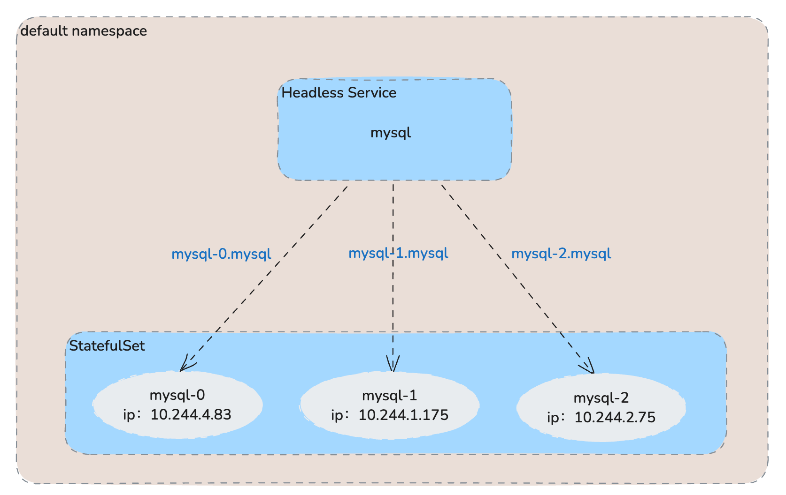
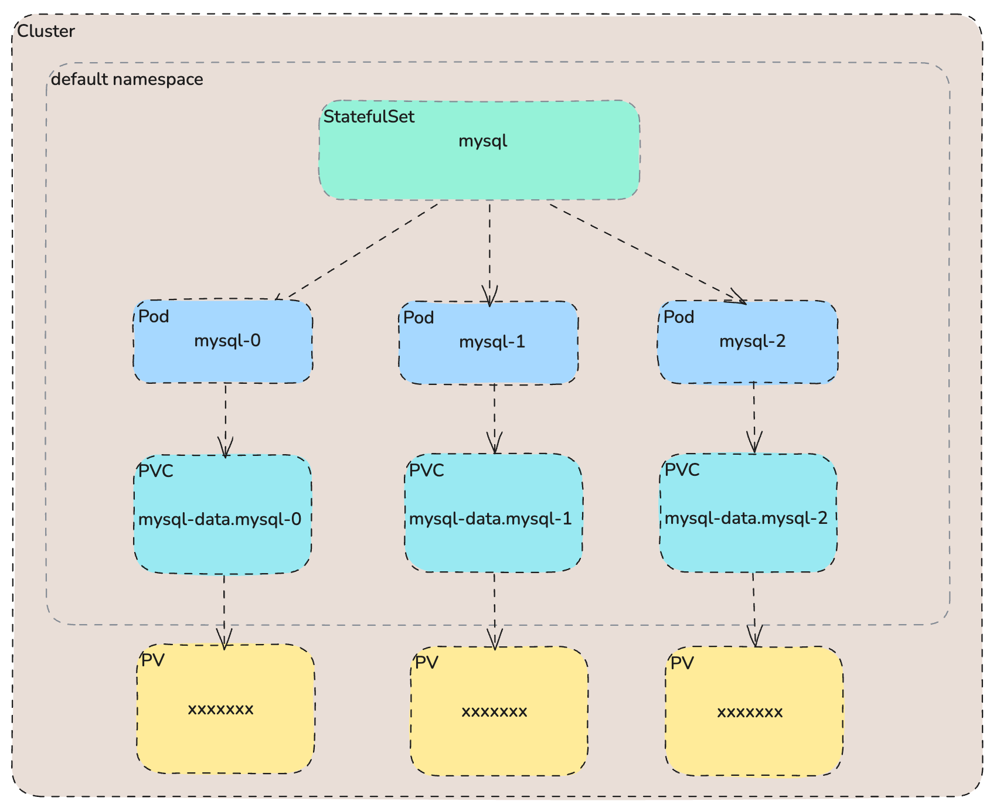

## 为什么需要 StatefulSet

在使用 Kubernetes 部署服务时，通常会选择 `Deployment` 资源对象。由 Deployment 创建的 Pod 实例是完全相同的，它们在启动时没有顺序要求，并且通常挂载相同的存储卷。因此，客户端访问任意一个 Pod，返回的结果是一致的。这类服务被称为 **无状态服务**。

然而，如果尝试使用 Deployment 部署如 MySQL、Redis 等数据库服务时，仅能满足单节点部署的需求。在集群模式下，Deployment 的特性显然无法满足复杂场景的要求。以 MySQL 一主多从集群为例，主节点和从节点的数据是各自独立的，显然不能共用同一个存储卷。同时，客户端在访问 MySQL 时，通常将写操作路由到主节点，而读操作则可以分发至任意从节点，这就要求客户端能识别并连接多个具体的 MySQL 实例。

Deployment 由于无法提供固定的网络标识、稳定的存储绑定和有序的 Pod 启动机制，难以满足上述需求。因此，这类具备状态、节点间职责区分的数据服务，通常被称为 **有状态服务**。

Kubernetes 提供的 `StatefulSet` 资源，正是专门为有状态服务设计的。它可以为每个 Pod 分配固定的名称、唯一的存储卷，并确保 Pod 的启动、缩容和终止过程具有可预测的顺序，是部署数据库、消息队列、分布式缓存等有状态应用的首选方案。

## StatefulSet 特征

`StatefulSet` 资源具有一下特征：

- 有序创建 Pod
- 稳定的、唯一的网络标识符
- 稳定的、持久化的存储
- 有序的、自动滚动更新
- 有序的、优雅的删除和终止

### 顺序创建 Pod

StatefulSet 默认以严格的顺序创建其 Pod，因为有些服务 Pod 之间启动具有先后顺序，例如 Mysql 从节点需要在主节点启动完成之后再启动。我们可以通过配置 podManagementPolicy 来管理启动策略。可以是 OrderedReady 或 Parallel。

- **OrderedReady**：表示按顺序启动和终止 Pod，保证有序性和稳定性；
- **Parallel**：表示可以并行启动和终止 Pod，适用于无依赖关系的应用场景。

```yaml
apiVersion: apps/v1
kind: StatefulSet
metadata:
  name: web
spec:
  serviceName: "nginx"
  podManagementPolicy: "Parallel"
  replicas: 2
  selector:
    matchLabels:
      app: nginx
  template:
    metadata:
      labels:
        app: nginx
    spec:
      containers:
      - name: nginx
        image: registry.k8s.io/nginx-slim:0.21
        ports:
        - containerPort: 80
          name: web
```

对于一个拥有 **n** 个副本的 StatefulSet，Pod name 是固定的，且按照 `<statefulset name>-<ordinal index>` 规则命令。Pod 被部署时是按照 **{0..n-1}** 的序号顺序创建的。

```bash
# watch pod 从创建到 running 的过程
kubectl get pods --watch -l app=nginx
NAME      READY     STATUS    RESTARTS   AGE
web-0     0/1       Pending   0          0s
web-0     0/1       Pending   0         0s
web-0     0/1       ContainerCreating   0         0s
web-0     1/1       Running   0         19s
web-1     0/1       Pending   0         0s
web-1     0/1       Pending   0         0s
web-1     0/1       ContainerCreating   0         0s
web-1     1/1       Running   0         18s
```

### 唯一的网络

在部署 MySQL 一主多从集群时，客户端服务在连接数据库时通常有读写分离的需求：**写请求**需连接主节点，而 **读请求**则可以连接任意从节点。由于 Kubernetes 中 Pod 的 IP 地址在重启后可能发生变化，因此直接使用 Pod IP 进行连接显然不可行。

此时，我们自然会想到使用 Kubernetes 的 [Service](https://sfeng1996.github.io/k8s-service/) 资源。然而，Kubernetes 中 Service 是通过 `LabelSelector` 机制将一组具有相同标签的 Pod 聚合在一起的。同一个 StatefulSet 下的 Pod 通常共享相同的标签，因此无法通过两个不同的 Service 去精确绑定主节点和从节点。

一种可行的方案是将主节点和从节点分别部署为两个独立的 StatefulSet，并分别创建对应的 Service。但这种方式虽然可以实现功能，结构上却显得 **冗余且不优雅**，增加了维护和部署的复杂度。

那么有没有更合理的方式来为每个 Pod 提供独立的访问入口呢？答案是可以通过 Kubernetes 的 DNS 系统 —— CoreDNS，为每个 Pod 提供稳定的域名解析。StatefulSet 正是基于这种设计理念，引入了 **Headless Service**（无头服务）的机制。

Headless Service 是一种特殊类型的 Service，它不会分配 ClusterIP，也不会做流量负载均衡。而是将请求通过 DNS 直接解析到 StatefulSet 中具体的 Pod IP 地址。每个 Pod 都拥有一个唯一且稳定的 DNS 域名（例如：`mysql-0.mysql-headless.default.svc.cluster.local`），即便 Pod 重启或调度到其他节点，只要 Pod 名保持不变，其域名也不会改变。DNS 记录会随着 Pod 的 IP 变更自动更新，从而保障客户端始终可以通过固定域名访问对应的数据库节点。

这种方式既实现了服务的可发现性，又满足了有状态服务对节点身份的精确识别需求，结构更清晰、运维更高效。

每个 Headless service 背后的 Pod 对应域名格式如下：

```bash
<pod-name>.<svc-name>.<namespace>.svc.cluster.local
```

这个 DNS 记录正是 Kubernetes 集群为 Pod 分配的一个唯一标识，只要我们知道 Pod 的名字，以及它对应的 Service 名字，就可以组装出这样一条 DNS 记录访问到 Pod 的 IP 地址，这个能力是非常重要的，接下来我们就来看下 StatefulSet 资源对象是如何结合 Headless Service 提供服务的。下面具体看 HeadlessService 如何提供服务的：

```yaml
apiVersion: v1
kind: Service
metadata:
  name: mysql
  labels:
    app: mysql
spec:
  # Headless Service
  clusterIP: None  
  selector:
    app: mysql
  ports:
    - port: 3306
      name: mysql
---
apiVersion: apps/v1
kind: StatefulSet
metadata:
  name: mysql
spec:
  serviceName: mysql
  replicas: 3
  selector:
    matchLabels:
      app: mysql
  template:
    metadata:
      labels:
        app: mysql
    spec:
      containers:
        - name: mysql
          image: mysql:8.0
          ports:
            - containerPort: 3306
              name: mysql
          ......
```

> StatefulSet 中 ServiceName 字段必须和 Service 中 Name 一致，StatefulSet Controller 就是通过 ServiceName 字段去查找对应的 Service
>

这样三个 Mysql Pod 实例对应的 DNS 域名为：

```bash
mysql-0.mysql.default.svc.cluster.local
mysql-1.mysql.default.svc.cluster.local
mysql-2.mysql.default.svc.cluster.local
```

进入某个客户端 Pod 去访问这些域名，可以发现解析后始终是对应的 Pod 的 IP 地址。

```yaml
$ / # nslookup  mysql-0.mysql
Server:    10.96.0.10
Address 1: 10.96.0.10 kube-dns.kube-system.svc.cluster.local

Name:      mysql-0.mysql
Address 1: 10.244.4.83 mysql-0.mysql.default.svc.cluster.local

$/ # nslookup mysql-1.mysql
Server:    10.96.0.10
Address 1: 10.96.0.10 kube-dns.kube-system.svc.cluster.local

Name:      mysql-1.mysql
Address 1: 10.244.1.175 mysql-1.mysql.default.svc.cluster.local

$/ # nslookup mysql-2.mysql
Server:    10.96.0.10
Address 1: 10.96.0.10 kube-dns.kube-system.svc.cluster.local

Name:      mysql-2.mysql
Address 1: 10.244.2.75 mysql-2.mysql.default.svc.cluster.local
```



### 稳定的存储

Mysql 这种有状态服务，每个实例对应的存储肯定是不同的，而且 Pod 重启后还能够重新挂载到之前的存储上。为了实现这种稳定存储功能，StatefulSet 中 volumeClaimTemplates 字段定义了 Pod 的存储配置定义。

```yaml
apiVersion: v1
kind: Service
metadata:
  name: mysql
  labels:
    app: mysql
spec:
  # Headless Service
  clusterIP: None  
  selector:
    app: mysql
  ports:
    - port: 3306
      name: mysql
---
apiVersion: apps/v1
kind: StatefulSet
metadata:
  name: mysql
spec:
  serviceName: mysql
  replicas: 3
  selector:
    matchLabels:
      app: mysql
  template:
    metadata:
      labels:
        app: mysql
    spec:
      containers:
        - name: mysql
          image: mysql:8.0
          ports:
            - containerPort: 3306
              name: mysql
          volumeMounts:
	        - name: data
	          mountPath: /var/lib/mysql
	          subPath: mysql
  volumeClaimTemplates:
    - metadata:
        name: mysql-data
      spec:
        accessModes: ["ReadWriteOnce"]
        resources:
          requests:
            storage: 1Gi
```

`volumeClaimTemplates` 属性会自动给每一个 Pod 创建一个 PVC 对象，然后会在集群中绑定适合的 PV 资源。`volumeClaimTemplates` 其实这里就是一个 PVC 的模板，而且 PVC Name 是有规则的，按照 <volumeClaimTemplatesName.podName> ，以上 Yaml 会创建三个 PVC，如下：

```bash
$ kubectl get pvc -l app=mysql
NAME                 STATUS    VOLUME                                     CAPACITY   ACCESSMODES   AGE
mysql-data.mysql-0   Bound     pvc-15c268c7-b507-11e6-932f-42010a800002   1Gi        RWO           48s
mysql-data.mysql-1   Bound     pvc-15c79307-b507-11e6-932f-42010a800002   1Gi        RWO           48s
```

由于 PVC name 是固定的，即使 Pod 重启后也会挂载到之前的 PVC 上。



### 更新策略

由于有状态服务的多个实例之间通常存在数据同步、复制等机制，因此在更新这类服务时，需要遵循一定的顺序，以保证系统的一致性与稳定性。

Kubernetes 中，`StatefulSet` 通过 `spec.updateStrategy` 字段定义了更新策略，支持以下两种策略：

**OnDelete**

`OnDelete` 策略意味着，当更新了 `StatefulSet` 的 Pod 模板（如镜像版本或配置）后，控制器**不会自动重启或更新 Pod**。只有在手动删除旧的 Pod 时，新的 Pod 才会根据更新后的模板重新创建。这种方式适用于对更新节奏有严格控制要求的场景，运维人员可以手动掌控每个节点的替换时机。

**RollingUpdate**

`RollingUpdate` 是 StatefulSet 默认的更新策略。它会按照 **序号索引的逆序**（即从编号最大的 Pod 开始）依次进行更新，例如按照 `mysql-2`、`mysql-1`、`mysql-0` 的顺序依次重启。

在更新过程中，StatefulSet 控制器会：

- 逐个终止当前 Pod；
- 等待 Pod 恢复到 `Running` 和 `Ready` 状态；
- 再继续更新下一个 Pod。

这种顺序性确保了服务集群的稳定性，尤其适合有主从、复制关系的应用场景，如数据库、分布式存储系统等。

通过设置 `.spec.updateStrategy.rollingUpdate.partition`，可以指定一个分区序号。更新过程中，**只有序号大于或等于该分区值的 Pod 才会被滚动更新**，而序号小于 partition 的 Pod 则保持不变。

这使得在需要分批次、逐步更新集群节点时，可以更灵活地控制更新范围，进一步降低风险。

### 删除

在使用 StatefulSet 管理有状态服务时，通常会为每个 Pod 创建独立的持久化卷（PVC）。**当 StatefulSet 被删除或缩容时，默认情况下这些 PVC 会被保留**。这意味着在下次重新创建同名 StatefulSet 时，原先的 Pod 将会重新挂载到原有的数据卷上，从而保留了之前的应用状态。

然而，在某些场景下，我们希望能够在删除 StatefulSet 或缩容时自动清理对应的 PVC，避免资源浪费。在 Kubernetes v1.27 中引入了这一能力，并在 v1.32 中变为稳定特性。

Kubernetes 通过 StatefulSet 的可选字段 `.spec.persistentVolumeClaimRetentionPolicy` 来控制 PVC 的保留策略。启用该功能需确保 API Server 和 Controller Manager 开启了 `StatefulSetAutoDeletePVC` [特性门控](https://kubernetes.io/zh-cn/docs/reference/command-line-tools-reference/feature-gates/)。

该字段支持在两类场景下配置 PVC 的删除行为：

- **whenDeleted**：删除整个 StatefulSet 时触发；
- **whenScaled**：缩小副本数，删除多余 Pod 时触发。

每种场景都支持两种策略：

**Retain( 默认 )**

表示即使 Pod 被删除，来自 `volumeClaimTemplates` 的 PVC 也不会被移除。

这正是之前 Kubernetes 的默认行为，确保数据不被意外清除。

**Delete**

- 在 `whenDeleted: Delete` 下，删除 StatefulSet 时，其控制器会自动删除所有与之相关联的 PVC。
- 在 `whenScaled: Delete` 下，缩容过程中，只有对应被缩减的 Pod 所绑定的 PVC 会被清理。

通过这种方式，用户可以灵活地选择 PVC 的保留或清理策略。

> 注意：这两种策略仅适用于 StatefulSet 自身删除或缩容所引发的 Pod 删除操作。
>
>
> 如果 Pod 是由于节点故障、驱逐或重启等原因被替换，这些 PVC 仍会被保留，并由新创建的 Pod 自动重新挂载。
>

以下是 `persistentVolumeClaimRetentionPolicy` 的四种可能配置：

```yaml
# 默认行为：全部保留 PVC
spec:
	persistentVolumeClaimRetentionPolicy:
	  whenDeleted: Retain
	  whenScaled: Retain

# 删除 StatefulSet 时清理 PVC，缩容时保留
spec:
	persistentVolumeClaimRetentionPolicy:
	  whenDeleted: Delete
	  whenScaled: Retain

# 删除 StatefulSet 和缩容时均清理 PVC
spec:
	persistentVolumeClaimRetentionPolicy:
	  whenDeleted: Delete
	  whenScaled: Delete

# 删除 StatefulSet 时保留 PVC，缩容时清理多余 PVC
spec:
	persistentVolumeClaimRetentionPolicy:
	  whenDeleted: Retain
	  whenScaled: Delete
```

**背后机制**

- 当配置 `whenDeleted: Delete` 时，StatefulSet 控制器会为每个 PVC 设置 `ownerReferences`，指向 StatefulSet 本身。删除 StatefulSet 时，Kubernetes 通过 [级联删除机制](https://sfeng1996.github.io/k8s-delete/)，自动清理这些 PVC。
- 若设置 `whenScaled: Delete`，在缩容前，控制器会将对应 PVC 的 `ownerReferences` 更新为已删除的 Pod。待 Pod 正常终止后，PVC 将被 Kubernetes 的垃圾回收机制自动移除。

这种方式确保了数据在被删除前能被干净地卸载，避免资源泄漏或状态异常，同时保持整个过程的可控性和可追溯性。

## 总结

StatefulSet 相比于 Deployment，更加智能且具备更强的场景适配能力，因此需要结合深入的业务场景才能真正发挥其优势。通常在部署 MySQL、Redis、MongoDB 等有状态服务时，会优先选择使用 StatefulSet。然而，对于这些关键的中间件服务，单纯地部署往往远远不够，还需要具备如数据恢复、故障自动转移等高级功能。

为了实现更智能、自动化的管理，通常会引入 Operator 模式，例如 etcd-operator、prometheus-operator 等。这些 Operator 不仅能够自动部署和维护有状态应用，还能实现自愈、扩缩容、备份恢复等复杂运维逻辑。通过编写[自定义 Operator](https://sfeng1996.github.io/kuberbuilder/)，我们可以根据具体业务需求，构建更加智能化、自动化的有状态服务管理体系，从而提升系统的稳定性和运维效率。