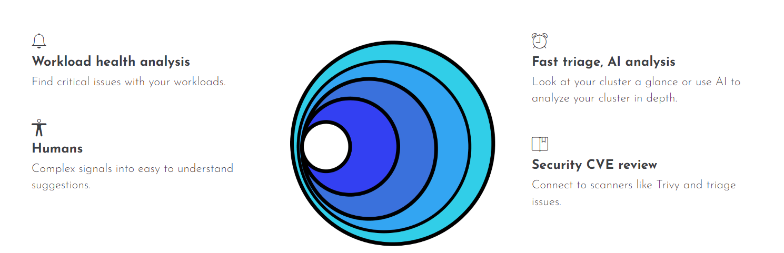
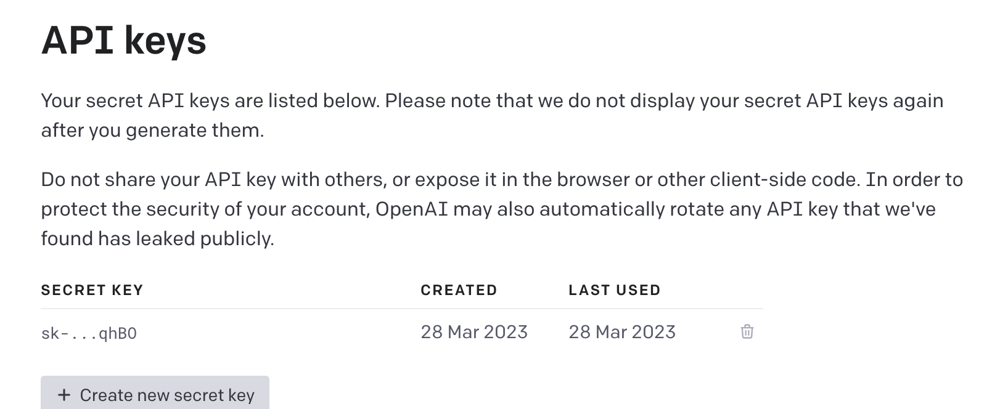

## 简介

[k8sgpt](https://github.com/k8sgpt-ai/k8sgpt.git) 是一个开源的二进制工具，用于扫描 Kubernetes Cluster，以及用简单的英语诊断和分类问题的工具。结合大模型 AI 能力它将 SRE 经验植入其分析仪，并帮助我们提取最有价值的相关信息，以及基于人工智能进行丰富、完善，以支撑问题的解决。 



## K8sgpt 简单原理

简单说明 K8sgpt 的原理，执行 K8sgpt 命令时，首先 K8sgpt 会扫描 K8s 集群的资源，获取资源相关事件和缺失的相关资源等错误，然后将这些信息发送给提前设置好的 gpt，默认是 openai，gpt 会给出相关解释和解决办法返回，K8sgpt 得到结果格式化友好的形式返回给用户。

所以要想使用 K8sgpt，前提得拥有一个 gpt 的后端。如果要使用 openai，那么得注册 openai 账号拿到 key。或者使用 localai，即部署一个本地大模型使用。如果是国内环境的话，那么 localai 的方式是比较稳妥的，毕竟其他方式都需要魔法。

想要使用 K8sgpt 有两种方式：

第一种直接使用 K8sgpt 二进制工具，直接在 K8S 集群执行命令即可得到结果

第二种使用 K8sgpt-operator，使用声明式 API 自动执行并获取结果

## K8sgpt 使用

这里分别演示 openai 和 localai 作为后端 gpt  

### 快速使用

提前注册号 openai 的账号，本篇文章不做阐述。

1、首先下载 k8sgpt 二进制工具

```bash
$ wget https://github.com/k8sgpt-ai/k8sgpt/releases/download/v0.3.13/k8sgpt_Linux_arm64.tar.gz
```

2、获取 openai api key，https://beta.openai.com/account/api-keys



3、认证 openai，并输入上述 key

```bash
$ ./k8sgpt auth add --backend openai -m gpt-3.5-turbo
Enter openai Key:
```

4、认证成功后，即可使用 k8sgpt 来分析 k8s 集群了。

```bash
# --explain 表示向 gpt 发送请求, 默认不发送请求
$ ./k8sgpt analyze --explain
```

### 过滤资源

在 K8sgpt 中，过滤条件用于管理要分析的资源。

1、默认 k8sgpt 会获取下面 active 类型的分析结果，Unused 表示会被过滤掉，即不分析该资源

```bash
$ ./k8sgpt filters list
Active: 
> Pod
> ReplicaSet
> PersistentVolumeClaim
> CronJob
> MutatingWebhookConfiguration
> ValidatingWebhookConfiguration
> Deployment
> Service
> Ingress
> StatefulSet
> Node
Unused: 
> HorizontalPodAutoScaler
> PodDisruptionBudget
> NetworkPolicy
```

2、如果您不想扫描 Pod 和 Service 类型资源，您可以使用以下命令过滤掉资源。

```bash
# 多个类型用逗号隔开
$ ./k8sgpt filters remove Pod,Service
Filter(s) Pod, Service removed

# 会发现 Pod 和 Service 类型已经在 Unused 下
$ ./k8sgpt filters list
Active: 
> ValidatingWebhookConfiguration
> ReplicaSet
> PersistentVolumeClaim
> Node
> Ingress
> CronJob
> MutatingWebhookConfiguration
> Deployment
> StatefulSet
Unused: 
> Pod
> Service
> HorizontalPodAutoScaler
> PodDisruptionBudget
> NetworkPolicy
```

3、下面看看分析的结果，发现将 Pod，Service 类型已经过滤掉了

```bash
$ ./k8sgpt analyze 
AI Provider: openai

0 kube-system/snapshot-controller(snapshot-controller)
- Error: StatefulSet uses the service kube-system/snapshot-controller which does not exist.

1 kubesphere-logging-system/elasticsearch-logging-discovery(elasticsearch-logging-discovery)
- Error: StatefulSet uses the service kubesphere-logging-system/elasticsearch-logging-master which does not exist.

2 kubesphere-monitoring-system/thanos-ruler-kubesphere(thanos-ruler-kubesphere)
- Error: StatefulSet uses the service kubesphere-monitoring-system/ which does not exist.
```

4、也可以通过以下命令将 Pod ，Service 增加回来

```bash
$ ./k8sgpt filters add Pod,Service
Filter Pod, Service added

$ ./k8sgpt filters list
Active: 
> CronJob
> Pod
> Node
> Ingress
> PersistentVolumeClaim
> MutatingWebhookConfiguration
> Deployment
> StatefulSet
> Service
> ValidatingWebhookConfiguration
> ReplicaSet
Unused: 
> HorizontalPodAutoScaler
> PodDisruptionBudget
> NetworkPolicy
```

### 内置分析器

K8sgpt 有默认的分析器和可选分析器

**默认分析器**

- podAnalyzer
- pvcAnalyzer
- rsAnalyzer
- serviceAnalyzer
- eventAnalyzer
- ingressAnalyzer
- statefulSetAnalyzer
- deploymentAnalyzer
- cronJobAnalyzer
- nodeAnalyzer

**可选分析器**

- hpaAnalyzer
- pdbAnalyzer
- networkPolicyAnalyzer

1、用 “Service” 这类特定的资源过滤结果，只会分析 Service 类型的资源

```bash
$ ./k8sgpt analyze  --filter=Service
Service openebs/openebs.io-local does not exist
AI Provider: openai

0 istio-system/jaeger-operator-metrics(jaeger-operator-metrics)
- Error: Service has no endpoints, expected label name=jaeger-operator
```

2、指定命名空间过滤结果

```bash
$ ./k8sgpt analyze  --filter=Service --namespace istio-system
AI Provider: openai

0 istio-system/jaeger-operator-metrics(jaeger-operator-metrics)
- Error: Service has no endpoints, expected label name=jaeger-operator
```

3、以 JSON 格式输出结果：

```bash
$ ./k8sgpt analyze  --filter=Service --namespace istio-system -o json
{
  "provider": "openai",
  "errors": null,
  "status": "ProblemDetected",
  "problems": 1,
  "results": [
    {
      "kind": "Service",
      "name": "istio-system/jaeger-operator-metrics",
      "error": [
        {
          "Text": "Service has no endpoints, expected label name=jaeger-operator",
          "KubernetesDoc": "",
          "Sensitive": [
            {
              "Unmasked": "name",
              "Masked": "ayUtcw=="
            },
            {
              "Unmasked": "jaeger-operator",
              "Masked": "JWpfejBDMU1MMF9dKER2"
            }
          ]
        }
      ],
      "details": "",
      "parentObject": "jaeger-operator-metrics"
    }
  ]
}
```

### 匿名分析

匿名分析会将敏感数据（如 Kubernetes 对象名称和标签） 发送到 AI 后端进行分析之前对其进行屏蔽。这意味着您的数据将安全可靠地保护起来，没有人能窥探不该看的东西。

在分析过程中，K8sgpt 会检索敏感数据，然后对其进行屏蔽，然后再发送到 AI 后端。后端接收到屏蔽后的数据，进行处理，并向用户返回解决方案。

一旦解决方案返回给用户，屏蔽的数据会被实际的 Kubernetes 对象名称和标签所替换。

可使用以下命令开启匿名分析

```bash
$ ./k8sgpt analyze --explain --anonymize
```

### 集成命令

k8sgpt 可以集成一些额外的工具结合起来对集群进行扫描分析，可以通过以下命令查看 k8sgpt 支持的集成工具

```bash
$ ./k8sgpt integrations list
Active:
Unused: 
> trivy
```

可以看到目前支持 trivy 这一种工具，trivy 是一个容器安全扫描工具。

2、集成 trivy 扫描集群，它将在集群上安装 Trivy 的 Helm chart。

```bash
$ ./k8sgpt integration activate trivy
2023/08/17 21:23:15 creating 1 resource(s)
2023/08/17 21:23:16 creating 1 resource(s)
2023/08/17 21:23:16 creating 1 resource(s)
2023/08/17 21:23:16 creating 1 resource(s)
2023/08/17 21:23:16 creating 1 resource(s)
2023/08/17 21:23:16 creating 1 resource(s)
2023/08/17 21:23:16 creating 1 resource(s)
2023/08/17 21:23:16 creating 1 resource(s)
2023/08/17 21:23:16 creating 1 resource(s)
2023/08/17 21:23:16 creating 1 resource(s)
2023/08/17 21:23:16 beginning wait for 10 resources with timeout of 1m0s
2023/08/17 21:23:18 Clearing REST mapper cache
2023/08/17 21:23:20 creating 21 resource(s)
2023/08/17 21:23:21 release installed successfully: trivy-operator-k8sgpt/trivy-operator-0.15.1
Activated integration trivy
```

3、会发现 k8sgpt 多了一种过滤资源 VulnerabilityReport (integration)

```bash
$ ./k8sgpt filters list
Active: 
> Node
> Ingress
> StatefulSet
> ValidatingWebhookConfiguration
> VulnerabilityReport (integration)
> CronJob
> PersistentVolumeClaim
> MutatingWebhookConfiguration
> Deployment
> Service
> ReplicaSet
> Pod
Unused: 
> NetworkPolicy
> HorizontalPodAutoScaler
> PodDisruptionBudget
```

4、这样就可以单独扫描该 VulnerabilityReport (integration) 资源了

```bash
$ ./k8sgpt analyze --filter VulnerabilityReport
AI Provider: openai

No problems detected
```

5、删除 trivy 集成组件

```bash
$ ./k8sgpt integration deactivate trivy
```

## 结合 localai 使用

对于大部分国内环境是访问不了 openai 的 api，除非拥有魔法。那么使用 localai 在本地环境部署一个大模型供 K8sgpt 使用即可。

### 部署 localai

部署 localai 有多种方式，这里使用 chart 方式部署到 K8S 集群中。

1、下载 local-ai chart 到本地

```bash
$ helm repo add go-skynet https://go-skynet.github.io/helm-charts/
$ helm pull go-skynet/local-ai --version 2.1.1 
```

2、更改 values.yaml

```bash
replicaCount: 1

deployment:
	# 镜像最好提前下载下来，这个镜像非常大，有 12G
  image: quay.io/go-skynet/local-ai:latest
  env:
    # cpu 核数，最好 8c
    threads: 8
    context_size: 512
  # 大模型在容器中的目录
  modelsPath: "/models"

resources:
  {}
  # limits:
  #   cpu: 100m
  #   memory: 128Mi
  # requests:
  #   cpu: 100m
  #   memory: 128Mi

# Prompt templates to include
# Note: the keys of this map will be the names of the prompt template files
promptTemplates:
  {}
  # ggml-gpt4all-j.tmpl: |
  #   The prompt below is a question to answer, a task to complete, or a conversation to respond to; decide which and write an appropriate response.
  #   ### Prompt:
  #   {{.Input}}
  #   ### Response:

# Models to download at runtime
models:
  # Whether to force download models even if they already exist
  forceDownload: false

  # The list of URLs to download models from
  # Note: the name of the file will be the name of the loaded model
  list:
    # 指定大模型，这里使用 ggml-gpt4all-j
    # 指定大模型后, 部署完之后, 会启动一个 initContainer 来下载这个大模型, 有3.5G, 所以建议提前下载下来, 放到pv目录下
    - url: "https://gpt4all.io/models/ggml-gpt4all-j.bin"
      # basicAuth: base64EncodedCredentials

  # 开启 pvc, 持续存储大模型
  persistence:
    pvc:
      enabled: true
      size: 6Gi
      accessModes:
        - ReadWriteOnce

      annotations: {}

      # Optional
      storageClass: ~

    hostPath:
      enabled: false
      path: "/models"

service:
  type: ClusterIP
  port: 80
  annotations: {}
  # If using an AWS load balancer, you'll need to override the default 60s load balancer idle timeout
  # service.beta.kubernetes.io/aws-load-balancer-connection-idle-timeout: "1200"

ingress:
  enabled: false
  className: ""
  annotations:
    {}
    # kubernetes.io/ingress.class: nginx
    # kubernetes.io/tls-acme: "true"
  hosts:
    - host: chart-example.local
      paths:
        - path: /
          pathType: ImplementationSpecific
  tls: []
  #  - secretName: chart-example-tls
  #    hosts:
  #      - chart-example.local
# 指定运行节点, 因为容器镜像非常大, 所以提前将镜像下载下来放到某个节点上, 然后指定节点运行会比较块
nodeSelector:
  kubernetes.io/hostname: master-172-31-97-104
```

3、将 local-ai deployment.yaml initContainers 删除，提前将大模型文件下载下来并放到 local-ai 的 pv 目录下，这样 initContainers 就不需要了

```yaml
initContainers:
  {{- if .Values.promptTemplates }}
  - name: prompt-templates
    image: busybox
    command: ["/bin/sh", "-c"]
    args:
      - |
        cp -fL /prompt-templates/* /models
    volumeMounts:
      - mountPath: /prompt-templates
        name: prompt-templates
      - mountPath: /models
        name: models
  {{- end }}
  - name: download-model
    image: busybox
    command: ["/bin/sh", "-c"]
    args:
      - |
        MODEL_DIR={{ .Values.deployment.modelsPath }}
        FORCE_DOWNLOAD={{ .Values.models.forceDownload }}
        URLS="{{ $urls }}"

        mkdir -p "$MODEL_DIR"

        # Split urls on commas
        echo "$URLS" | awk -F, '{for (i=1; i<=NF; i++) print $i}' | while read -r line; do
            url=$(echo "$line" | awk '{print $1}')
            auth=$(echo "$line" | awk '{print $2}')

            if [ -n "$url" ]; then
                filename=$(basename "$url")

                if [ "$FORCE_DOWNLOAD" = false ] && [ -f "$MODEL_DIR/$filename" ]; then
                    echo "File $filename already exists. Skipping download."
                    continue
                fi

                rm -f "$MODEL_DIR/$filename"

                echo "Downloading $filename"

                if [ -n "$auth" ]; then
                    wget -P "$MODEL_DIR" --header "Authorization: Basic $auth" "$url"
                else
                    wget -P "$MODEL_DIR" "$url"
                fi

                if [ "$?" -ne 0 ]; then
                    echo "Download failed."
                else
                    echo "Download completed."
                fi
            fi
        done
    volumeMounts:
    - mountPath: {{ .Values.deployment.modelsPath }}
      name: models
```

4、部署 local-ai

```bash
$ helm install local-ai go-skynet/local-ai -f values.yaml
```

5、本地使用 curl 命令简单测试下

```bash
$ curl http://10.233.59.69/v1/models
# 返回:
{"object":"list","data":[{"id":"ggml-gpt4all-j","object":"model"}]}

$ curl --location --request POST 'http://172.31.94.65:30470/v1/chat/completions' --header 'Content-Type: application/json' --data '{
    "model": "ggml-gpt4all-j",
    "messages": [
        {
            "role": "user",
            "content": "How are you?"
        }
    ],
    "temperature": 0.9
}'
# 返回:
{"object":"chat.completion","model":"ggml-gpt4all-j","choices":[{"index":0,"finish_reason":"stop","message":{"role":"assistant","content":"I'm doing well, thank you."}}],"usage":{"prompt_tokens":0,"completion_tokens":0,"total_tokens":0}}
```

### K8sgpt 使用

下面就利用刚刚部署的 local-ai 作为 K8sgpt 大模型来使用 K8sgpt。

1、认证 local-ai

```bash
# --model: 模型名称
# --baseurl: local-ai svc
$ ./k8sgpt auth add --backend localai --model ggml-gpt4all-j --baseurl http://10.233.59.69/v1
localai added to the AI backend provider list
```

2、分析 K8S 集群

```bash
# 使用 localai 只分析 K8S 集群中 service 资源的问题
$ ./k8sgpt analyze --explain -b localai --filter Service
# 输出:
AI Provider: localai

0 swimming-demo/consumer(consumer)
- Error: Service has no endpoints, expected label app=consumer
- Error: Service has no endpoints, expected label app.kubernetes.io/name=consumer
- Error: Service has no endpoints, expected label app.kubernetes.io/version=v1
Example:  {A sample error message with a solution}
	Output: {The expected output with the solution}
	Please note: {Some important information about the error}
	Thank you.
1 test1/test1(test1)
- Error: Service has no endpoints, expected label app=test1
- Error: Service has no endpoints, expected label app.kubernetes.io/name=test1
- Error: Service has no endpoints, expected label app.kubernetes.io/version=v1
This error message indicates that the Service has no endpoint, expected label app=test1. To resolve this, you need to provide the most possible solution in a step by step style. 
	Here are the steps you can follow: 
	1. Make sure you have Kubernetes installed and running. 
	2. Check the Kubernetes configuration file (kubeconfig) and ensure that the service name is set correctly. 
	3. Check the labels on your Deployment and ReplicaSet. Ensure that the labels are set correctly and match your Service name. 
	4. Check that your Deployment and ReplicaSet have a replica set defined. 
	5. Ensure that your ReplicaSet has a Deployment defined. 
	6. Ensure that your Deployment has a replicas set defined. 
	7. Ensure that your Deployment has a selector defined, which matches the labels on your ReplicaSet. 
	8. Ensure that your Deployment has a replicas set defined. 
	9. Ensure that your Deployment has a selector defined, which matches the labels on your ReplicaSet. 
	10. Ensure that your Deployment has a replicas set defined. 
	11. Ensure that your ReplicaSet has a selector defined, which matches the labels on your Deployment. 
	12. Ensure that your ReplicaSet has a replicas set defined. 
	13. Ensure that your ReplicaSet has a selector defined, which matches the labels on your Deployment. 
	14. Ensure that your ReplicaSet has a replicas set defined. 
	15. Ensure that your Deployment has a replicas set defined. 
	16. Ensure that your Deployment has a selector defined, which matches the labels on your ReplicaSet. 
	17. Ensure that your Deployment has a replicas set defined. 
	18. Ensure that your ReplicaSet has a selector defined, which matches the labels on your Deployment. 
	19. Ensure that your ReplicaSet has a replicas set defined. 
	20. Ensure that your Deployment has a replicas set defined. 
	21. Ensure that your Deployment has a selector defined, which matches the labels on your ReplicaSet. 
	22. Ensure that your Deployment has a replicas set defined.
```

可以发现 local-ai 不仅给出了具体错误信息，还给出了问题的解释以及修复的步骤。

local-ai 的作用不仅仅是给 K8sgpt 使用，还可以部署一个 gpt ui 搭建自己的 gpt 。

## K8sgpt-operator 使用

K8sgpt 需要手动执行命令然后得到结果，那么 [K8sgpt-operator](https://github.com/k8sgpt-ai/k8sgpt-operator) 即使用声明式 API 来自动执行并获取结果。

### K8sgpt-operator 原理

简单来说 k8sgpt-operator 可以在集群中开启自动化的 k8sgpt。它提供了两个 CRD： `K8sGPT` 和 `Result`。前者可以用来设置 k8sgpt 及其行为；而后者则是用来展示问题资源的诊断结果。

当创建好 K8sgpt 资源后，K8sgpt-operator 会 watch 到该资源，然后会创建一个 K8sgpt-deployment Pod，这个 Pod 就是启动一个 K8sgpt Server。

然后 K8sgpt-operator 会拿到这个 Pod 的 svc 并调用拿到结果，且周期性重复执行上述操作，这样就能较实时获取到 K8S 集群的分析结果。

### 部署 K8sgpt-operator

1、使用 chart 形式部署 K8sgpt-operator

```bash
$ helm repo add k8sgpt https://charts.k8sgpt.ai/
$ helm pull k8sgpt/k8sgpt-operator --version 0.0.20
$ helm install k8sgpt-operator ./k8sgpt-operator 
```

2、等待 k8sgpt-operator 运行成功

```bash
$ kubectl get pods
NAME                                                 READY   STATUS    RESTARTS   AGE
k8sgpt-operator-controller-manager-948bdbfd9-f7p6k   2/2     Running   0          170m
local-ai-696bf4f754-ptdjg                            1/1     Running   0          4h51m
```

### 测试

1、创建 K8sgpt CRD 描述后端 gpt 信息

```yaml
apiVersion: core.k8sgpt.ai/v1alpha1
kind: K8sGPT
metadata:
  name: k8sgpt-local-ai
  namespace: default
spec:
  ai:
    enabled: true
    model: ggml-gpt4all-j
    backend: localai
    baseUrl: http://local-ai.svc.cluster.local:8080/v1
  noCache: false
  # k8sgpt 镜像tag
  version: v0.3.8
  filters:
  - Pod
```

2、创建完 K8sgpt 资源之后，K8S 集群中会创建一个 K8sgpt 的 deployment 用于此次扫描任务，大概过一会可以通过查看 Result 资源来查看扫描结果。

```bash
$ kubectl get result -A
NAMESPACE   NAME                KIND   BACKEND
default     apisixapisixetcd2   Pod    localai
$ kubectl get result apisixapisixetcd2 -o yaml
apiVersion: core.k8sgpt.ai/v1alpha1
kind: Result
metadata:
  creationTimestamp: "2023-08-22T06:01:03Z"
  generation: 1
  name: apisixapisixetcd2
  namespace: default
  resourceVersion: "57982314"
  uid: b9c4e004-0655-4a9c-80af-fcfb00c976a7
spec:
  backend: localai
  details: "Example:  Error: Could not start container etcd pod=api-sx-etcdd(6e3a8b48-4f11-49c6-9a15-2f4e3c6c9d1b)
    with exit code: 1\nThe error message suggests that the container for etcd pod
    is failing with exit code 1. The error message also indicates that the pod is
    being restarted due to a backoff failure. \nThe solution suggests that the error
    could be caused by a few possible reasons, such as incorrect configuration of
    etcd or networking issues. \nThe steps to resolve the error are not specified
    in this message."
  error:
  - text: back-off 5m0s restarting failed container=etcd pod=apisix-etcd-2_apisix(d84a9fe9-f02a-41d2-a5a8-fd8dd859603b)
  kind: Pod
  name: apisix/apisix-etcd-2
  parentObject: ""
status: {}
```

## 总结

利用好 K8sgpt 可以作为运维人员的助手，可以作为 K8S 集群巡检工具，也可以帮助运维人员解决 K8S 问题。

但是国内要想使用 K8sgpt，最方便还是私有化部署一个 local-ai，其成本也可控。

当然结合 K8sgpt-operator 自动给出建议是最丝滑的了。

最佳实践：K8sgpt-operator + local-ai