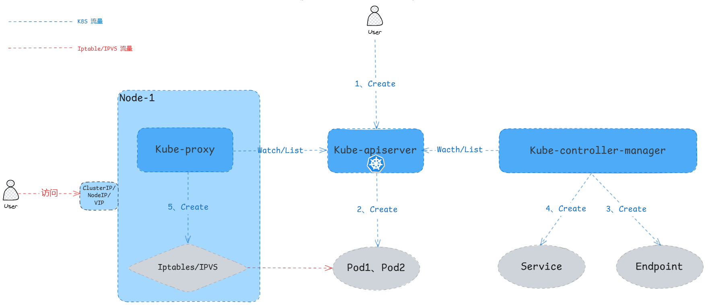
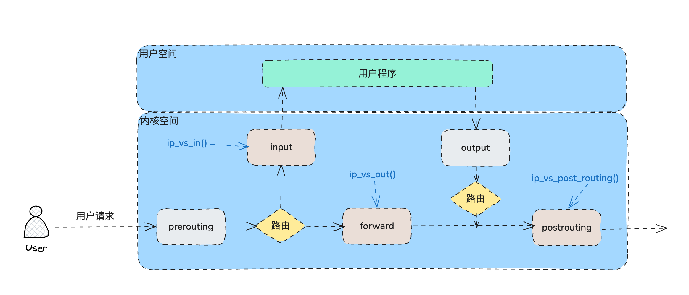
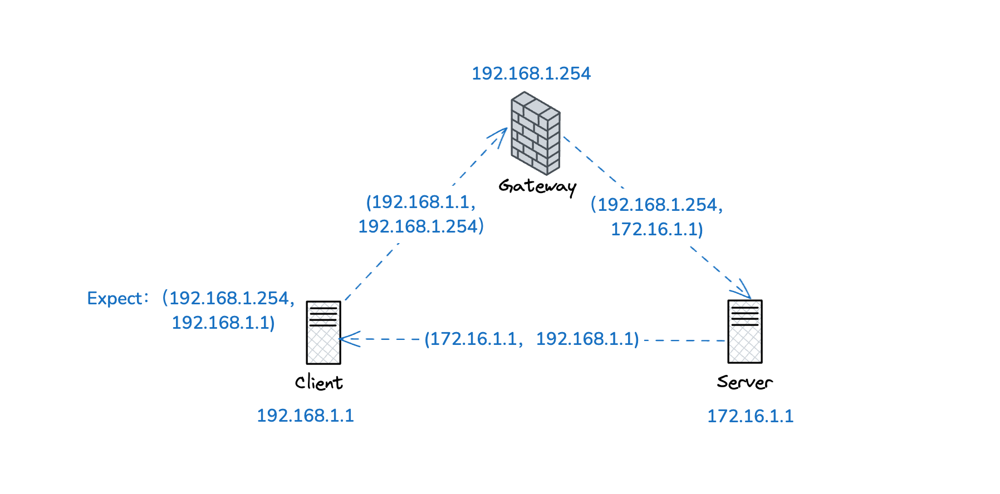
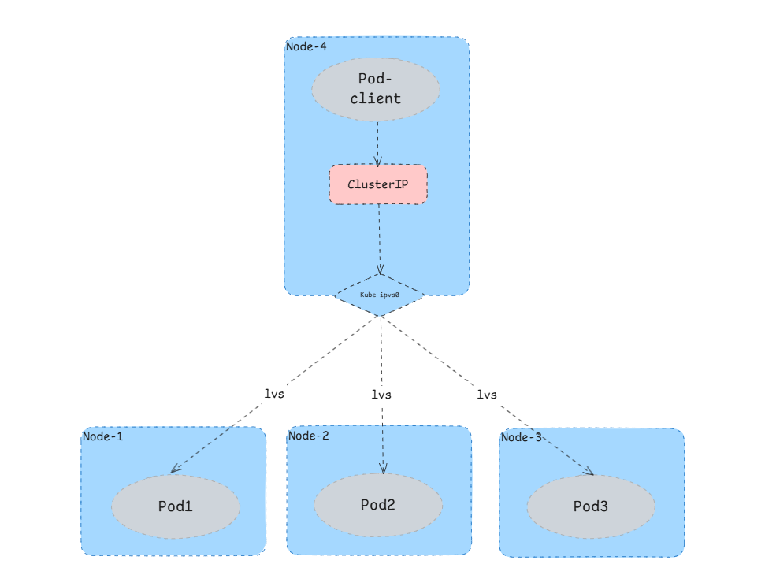
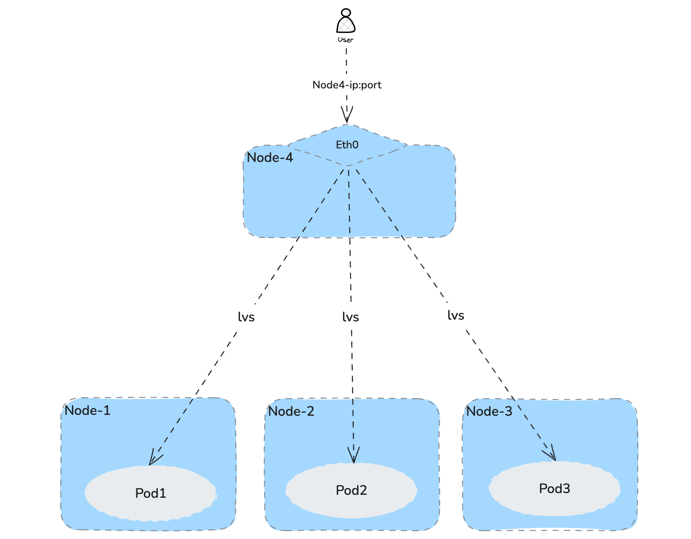

## 概述

在 K8S 集群中， K8S 会给每一个 Pod 分配一个 podIP，默认网络模式下，这个 podIP 是随机分配的虚拟 IP，且该 podIP 会由于 Pod 重启而自动更新，那么客户端访问 Pod 时，必然要更新访问地址。另一方面如果一个服务由多个 Pod 实例负载均衡提供服务，那么在客户端侧实现负载均衡访问也不合理。

基于以上两个问题，K8S 实现了 Service，Service 也是 K8S 中的一个资源对象。每一个 Kubernetes 的 Service 都是一组 Pod 的逻辑集合和访问方式的抽象，由 Service 去代理访问上游每个 Pod 实例。

在这篇文章中，会详细分析 K8S Service 的使用和实现原理。

## Service 创建流程

当有 Service 对象创建事件触发时，Kube-controller-manager 中的 Endpoints controller 通过 Kube-apiserver Watch/List 到 Service 创建事件时，会根据 Service 的资源定义创建一个 Endpoints 对象，这个对象即定义了上游对应的 Pod 实例组的 IP、Port 。Endpoints 资源对象如下：

```yaml
apiVersion: v1
kind: Endpoints
metadata:
  name: svc-a
  namespace: default
subsets:
# 上游 Pod 组 IP、Port
- addresses:
  - ip: 101.76.9.141
    targetRef:
      kind: Pod
      name: pod-a-55fcf5456c-86mw6
      namespace: default
      uid: dfcbaa48-912d-4ab6-b935-99e119553cca
  ports:
  - name: http
    port: 80
    protocol: TCP
```

Endpoints controller 创建完 Endpoint 对象时，会去创建 Service 对象，Service 根据 Label_selector 去匹配绑定 Endpoints 对象，Service 资源对象如下：

```yaml
apiVersion: v1
kind: Service
metadata:
  name: svc-a
  namespace: default
spec:
  clusterIP: 10.233.56.44
  clusterIPs:
  - 10.233.56.44
  internalTrafficPolicy: Cluster
  ipFamilies:
  - IPv4
  ipFamilyPolicy: SingleStack
  ports:
  - name: http
    port: 80
    protocol: TCP
    targetPort: 80
  selector:
    app: pod-a
  sessionAffinity: None
  # Service 类型
  type: ClusterIP
status:
  loadBalancer: {}
```

当 Service、Endpoints 创建好之后，K8S 中的每个节点上的 Kube-proxy 组件会去 Watch/List 该对象，然后在节点上创建相应的 Iptables/IPVS 规则。那么这些 Iptables/IPVS 规则就是将流量根据策略转发至上游 Pod。

所以这里涉及 Service、Endpoint、Pod 这三个对象，整体流程如下：



## IPVS 原理

每个 Node 上都运行一个 Kube-proxy 组件，负责为 Service 创建 Iptables 或者 IPVS 规则，实现一种 VIP 的代理形式。

Kube-proxy 有三种模式：`userspace`、`Iptables` 和 `IPVS`，其中 `userspace` 模式不太常用。`Iptables` 模式最主要的问题是在服务多的时候产生太多的 Iptables 规则，非增量式更新会引入一定的时延，大规模情况下有明显的性能问题。为解决 `Iptables` 模式的性能问题，K8S v1.11 新增了 `IPVS` 模式（v1.8 开始支持测试版，并在 v1.11 GA），采用增量式更新，并可以保证 service 更新期间连接保持不断开。K8S v1.14 版本默认使用 IPVS 模式，本篇文章只讲解 IPVS 模式。

当使用 IPVS 做集群内服务的负载均衡可以解决 Iptables 带来的性能问题。它不会像 iptables 一样随着 K8S 节点的增加，其 Iptables 规则也随之线性增长。IPVS 使用更高效的数据结构( 散列表 )，允许无限规模扩张。

IPVS 是 Linux 内核实现的四层负载均衡，是 LVS 负载均衡模块的实现。IPVS 和 Iptables 一样都是基于Netfilter 实现。IPVS 支持 TCP、UDP、SCTP、IPv4、IPv6 等协议，也支持多种负载均衡策略，例如 rr、wrr、lc、wlc、sh、dh、lblc 等。

Iptables 向 Netfilter 5个阶段都注册了对应的表，每个表都有具体的函数来处理数据包。`LVS` 主要通过向 `Netfilter` 的3个阶段注册钩子函数来对数据包进行处理，如下图：



- 在 `LOCAL_IN` 阶段注册了 `ip_vs_in()` 钩子函数。`LOCAL_IN` 阶段，在路由判决之后，如果发现数据包是发送给本机的，那么就调用 `ip_vs_in()` 函数对数据包进行处理。
- 在 `FORWARD` 阶段注册了 `ip_vs_out()` 钩子函数。`FORWARD` 阶段，在路由判决之后，如果发现数据包不是发送给本机的，调用 `ip_vs_out()` 函数对数据包进行处理。
- 在 `POST_ROUTING` 阶段注册了 `ip_vs_post_routing()` 钩子函数。`POST_ROUTING` 阶段，在发送数据前，需要调用 `ip_vs_post_routing()` 函数对数据包进行处理。

所以说要使用 IPVS 实现 Service，数据包必须要经过 INPUT、FORWARD、POSTROUTING 任意一个链，这样才能触发三个 hook 函数。那么 K8S Service 使用 IPVS 如何才能保证报文经过这三个链呢？在下面文章会解释。

IPVS 支持三种负载均衡模式：**Direct Routing** ( 简称 DR ）、**Tunneling** ( 也称 ipip 模式）、**NAT** ( 也称 Masq 模式）。由于 DR 和 Tunneling 模式都不支持端口映射，只有 NAT 模式支持端口映射，所以只有 NAT 模式支撑 Kubernetes Service 所有场景。下面主要讲解 NAT 模式原理。

### NAT 模式

因为 K8S Pod 提供服务，肯定需要通过端口访问，那么通过 Service 访问 Pod，也需要支持 Service 的端口转发至上游 Pod 的端口。IPVS 只有 NAT 模式支持端口转发映射，其实和 Iptables 原理一样，包含 DNAT、SNAT。例如一个 IPVS 服务端口 3080 到 Pod 端口 8080 的 DNAT 映射样例如下：

```bash
TCP  10.233.56.44:3080 rr
  -> 101.76.9.141:8080              Masq    1      0          0
  -> 101.76.9.142:8080              Masq    1      0          0
```

但是只有 DNAT 会导致回包报文被丢弃，还需要一次 SNAT。

下面我们看看没有做 SNAT 会出现什么问题：



上图 Client ip 地址为 `192.168.1.1`，Server ip 地址为 `172.16.1.1`，Client 无法直接访问 Server，但是 Client 和 Gateway 在同一内网，Gateway 具有到达 Server 的路由。所以 Client 可以通过 Gateway 来访问 Server。

Client 向 Server 发起一个访问，其原始报文报文中源目 ip 地址为 `(192.168.1.1，192.168.1.254)` ，那么客户端期待得到的回程报文源地址是 `192.168.1.254` 即 Gateway ip 地址。当报文经过 Gateway 的 netfilter 进行一次 DNAT 后，报文的目的地址被修改成了 `172.16.1.1`，即 Server 端地址。当报文送到 Server 后，Server 一看报文的源地址是 Client ip 地址后便直接把响应报文返回给 Client，即此时响应报文的源和目的地址对为 `(172.16.1.1， 192.168.1.1)`。这与 Client 端期待的报文源目地址不匹配，Client 端收到后会直接丢弃该报文。

因此，当报文不直接送达后端服务，而是访问中间设备 (Gateway) 时，都需要再网关处做一次 SNAT 把报文的源 IP 修改成 Gateway 地址。这样 Server 响应报文会先回到 Gateway，然后 Gateway 会把回程报文目的地址改成 Client 地址，源地址改为 Gateway 地址。

因此，IPVS 访问 Service VIP 做了一次 DNAT 后，必须要要做一次 SNAT 才能让报文顺利返回。但是 linux 内核原生版本的 IPVS 只做 DNAT，不做 SNAT。所以在该模式下，依旧借助 Iptables 来实现 SNAT。

> 有些定制版本的 IPVS，例如华为和阿里自己维护的分支支持 fullNAT，既同时支持 SNAT 和 DNAT。
这里就解释了为什么使用 IPVS 模式，依然存在 Iptables 规则
>

那么使用 Iptables 创建的 SNAT 规则如下：

```bash
# 该命令是查询 POSTROUGING 链上的 nat 表规则
$ iptables -t nat -L POSTROUTING
Chain POSTROUTING (policy ACCEPT)
target     prot opt source               destination         
KUBE-POSTROUTING  all  --  anywhere             anywhere             /* kubernetes postrouting rules */

# 该命令是查询 KUBE-POSTROUGING 链上的 nat 表规则
$ iptables -t nat -L KUBE-POSTROUTING
Chain KUBE-POSTROUTING (1 references)
target     prot opt source               destination         
MARK       all  --  anywhere             anywhere             MARK xor 0x4000
MASQUERADE  all  --  anywhere             anywhere             /* kubernetes service traffic requiring SNAT */ random-fully
```

由上述规则可知，IPVS 报文经过节点 netfilter `POSTROUTING` 链时，会跳到 `KUBE-POSTROUTING` 链去处理。在 `KUBE-POSTROUTING` 链中，对每个报文都设置 Kubernetes 独有的 MARK 标记 `( 0x4000/0x4000)`。并且将数据包进行一次 SNAT，即 `MASQUERADE` (用节点 IP 替换包的源 IP )。

## Service 原理

Service 常用支持三种类型，即 **ClusterIP、NodePort、LoadBalancer**，下面详细讲解每个类型的原理。

### ClusterIP

我们在定义 Service 的时候可以指定一个自己需要的类型的 Service，如果不指定的话默认是 **ClusterIP** 类型。Kube-proxy 启动时会在当前节点上创建一个 `kube-ipvs0` 网卡，每当创建一个 ClusterIP 类型的 Service，Kube-proxy 都会在 `kube-ipvs0` 上动态分配一个 IP 地址，这个地址就是该 Service 的虚拟 VIP。当然也可以在创建 Service 时手动配置具体的 IP。下面是集群中某个节点的 `kube-ipvs0` 网卡信息。

```bash
$ ip addr show kube-ipvs0
33597871: kube-ipvs0: <BROADCAST,NOARP> mtu 1500 qdisc noop state DOWN group default 
    link/ether 56:b2:39:2a:8b:f5 brd ff:ff:ff:ff:ff:ff
    inet 10.233.0.10/32 scope global kube-ipvs0
       valid_lft forever preferred_lft forever
    inet 10.233.0.1/32 scope global kube-ipvs0
       valid_lft forever preferred_lft forever
    inet 10.233.38.167/32 scope global kube-ipvs0
       valid_lft forever preferred_lft forever
    inet 10.233.87.218/32 scope global kube-ipvs0
       valid_lft forever preferred_lft forever
    inet 10.233.220.119/32 scope global kube-ipvs0
       valid_lft forever preferred_lft forever
    inet 10.233.56.44/32 scope global kube-ipvs0
       valid_lft forever preferred_lft forever
    inet 10.233.98.21/32 scope global kube-ipvs0
       valid_lft forever preferred_lft forever
```

上面遗留一个问题，就是如何保证 Service 报文能经过 netfilter 的 **INPUT、FORWARD、POSTROUTING** 这三个链。其实节点上创建 `kube-ipvs0` 网卡并将 Service ip 绑定到该网卡，让内核觉得需 IP 就是本机 IP，进而报文进入 **INPUT** 链。

而接下来，Kube-proxy 就会通过 Linux 的 IPVS 模块，为这个 IP 地址设置多个虚拟主机，并且这些虚拟主机之间使用轮询模式 (rr) 来作为负载均衡策略。我们可以通过 `ipvsadm` 命令查看，如下所示：

```bash
$ ipvsadm -ln
IP Virtual Server version 1.2.1 (size=4096)
Prot LocalAddress:Port Scheduler Flags
  -> RemoteAddress:Port           Forward Weight ActiveConn InActConn
TCP  10.233.56.44:80 rr
  -> 101.76.9.141:80              Masq    1      0          0
  -> 101.76.9.142:80              Masq    1      0          0
```

以上 IPVS 规则中，`10.233.56.44` 就是分配的虚拟 VIP，而 `101.76.9.141、101.76.9.142` 即是上游两个 Pod ip 地址。

在集群中不管是在 Pod 里还是主机节点上，任何任何发往 `10.233.56.44:80` 的请求，都会被当前节点的 `kube-ipvs0` 网卡获取然后通过 IPVS 模块转发至某一个虚拟主机。流量如下：



> IPVS 提供如下负载均衡策略：
**rr** ：轮询调度
>
>
> **lc** ：最小连接数
>
> **dh** ：目标哈希
>
> **sh** ：源哈希
>
> **sed** ：最短期望延迟
>
> **nq** ： 不排队调度
>

根据上面描述，使用 IPVS 模式后，主机上依然还会创建 SNAT Iptables 规则。只不过这条规则是共用的，不需要每个 Service 都创建。以上就是 ClusterIP 模式的原理。

### NodePort

使用 ClusterIP 只能在集群内部访问，如果想在集群外部访问 K8S 内的资源，需要在物理主机层面开放端口访问，那么 **NodePort** 是一种方式。

NodePort 类型的 service 会在集群内部署了 Kube-proxy 的节点打开一个指定的端口，之后所有的流量直接发送到这个端口，然后会被转发到 Service 后端真实的服务进行访问。

当开启 NodePort Service 时，每个节点的 Kube-proxy 都会在该节点创建一个 lvs 规则：

```bash
$ ipvsadm -l
IP Virtual Server version 1.2.1 (size=4096)
Prot LocalAddress:Port Scheduler Flags
  -> RemoteAddress:Port           Forward Weight ActiveConn InActConn    
TCP  172.17.0.1:32257 rr
  -> 101.76.9.141:9153             Masq    1      0          0         
  -> 101.76.9.142:9153             Masq    1      0          0   
```

这条 lvs 规则的意思就是访问 `172.17.0.1:32257` 负载均衡到 `101.76.9.141:9153、101.76.9.142:9153`，其中 `172.17.0.1` 是主机节点 IP，`101.76.9.141、101.76.9.142` 是 Pod IP。流量如下：



同样，NodePort 模式也会进行一次 SNAT，规则共用。

> K8S 的 Service 的 NodePort 默认端口范围是 `30000-32767`，也可以通过修改 **Kube-apiserver** `—-service-node-port-range` 启动参数来修改 NodePort 的范围，例如 `—service-node-port-range=8000-9000`。
如果需要修改 NodePort 默认端口范围，除了修改 **Kube-apiserver** `—service-node-port-range` 参数外，也需要修改 Linux 主机的 `ip_local_port_range` 内核参数，默认范围是： `32768-60999`，正好是 NodePort 默认范围的下一个端口。
该内核参数作用是系统会在 32768 到 60999 之间为本地的临时端口分配端口号。这些端口用于系统发起的出站连接，并在出站连接结束时释放。
所以 `ip_local_port_range` 与 **Kube-apiserver** `—service-node-port-range` 的端口范围不能冲突，否则会导致异常。
>

### LoaBalancer

NodePort 的模式虽然可以实现集群外访问，但是，不能保证高可用。因为如果使用 `Node-1:80` 去访问，当 Node-1 宕机，那么就需要手动切换节点。那么 **LoadBalancer** 就是这个问题，使用外部 VIP 访问，只要保证这个外部 VIP 正常即可。**LoadBalancer** 的工作需要搭配第三方的负载均衡器来完成，各大云厂商都有自己的 LoadBalancer，开源的 [MetalLB](https://metallb.io/) 也支持。

当创建一个类型为 **LoadBalancer** 的 Service。新创建的 Service 的 `EXTERNAL-IP` 状态是 `pending`，假如没有负载均衡器的话，会一直处于 `pending` 状态：

```bash
NAME       TYPE           CLUSTER-IP   EXTERNAL-IP   PORT(S)                                    AGE
test       LoadBalancer   10.96.0.10   <pending>     53:32083/UDP,53:30321/TCP,9153:32257/TCP   30d
```

如果集群中存在负载均衡器，那么就会自动分配一个 VIP

```bash
NAME       TYPE           CLUSTER-IP   EXTERNAL-IP   PORT(S)                                    AGE
test       LoadBalancer   10.96.0.10   172.17.0.3    53:32083/UDP,53:30321/TCP,9153:32257/TCP   30d
```

LoadBalancer 原理可参考该篇文章 [MetalLB 原理](https://sfeng1996.github.io/metallb-principle/)

## 总结

K8S Service 三种模式，都存在不同的使用场景：

- ClusterIP：用于集群内部访问，无论在节点还是 Pod 内，都可以通信
- NodePort：集群内、外都可以访问，但是没有高可用
- LoadBalancer：集群内、外都可以访问，且稳定、高可用

Kube-proxy 实现的是分布式负载均衡器，而非集中式负载均衡器。就是每个节点的充当一个负载均衡器，每个节点上都会配置一摸一样的规则，包括 IPVS/Iptables。在生产使用时，建议少用 NodePort 模式，因为会导致某个节点的流量高于其他节点。建议集群内使用 ClusterIP，集群外使用 LoadBalancer。