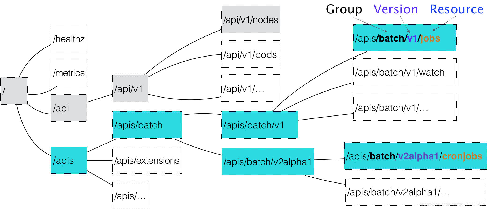

## 简介

kube-apiserver 组件是 k8s 中非常重要的组件，每个组件都只能和 kube-apiserver 进行通信，kube-apiserver 提供所有的 API。

## 资源与 API

在 k8s 中，一般都说某某资源，并不说接口。比如 Deployment，Service 等资源，这些资源就是 k8s api 操作的实体，最终这些资源都会存储到 etcd 中，其实最终就是对 etcd 中的这些资源做 CRUD。

### 例子

当我们使用 kubectl get deployment查看集群 default 命令空间的 deployment时，其实 kubectl 最终是将命令语言转化为 API 发送给 kube-apiserver，然后将 kube-apiserver 返回的数据再转成特定格式打印出来。

```bash
$ kubectl get deployment
--> https://apiserver.cluster.local:6443/apis/apps/v1/namespaces/default/deployments
# apiserver.cluster.local:6443 这个是 kube-apiserver 的访问 url
# apis: 表示下面有多组 api
# apps: 表示 api 组
# v1: 表示 api version
# default: 表示命名空间
# deployments: 表示操作的具体资源类型
```

下面详细看看一个 url 的设计

### API 组

k8s 将每一个 api 都设置组和版本即 groupVersion。

例如：/apis/apps/v1/deployment，apis 表示有多组 api，apps 是 group，v1 是 version

但是 /api/v1 这一组 API 例外，因为在 k8s 刚开发时，并没有预料到后面会发展这么多的 API，当时并没有设置 group，现在都认为 /api/v1 都是核心组，可以这么理解 /api/core/v1，这样就和目前所有 API 结构对应上了。

例如：/api/v1/service，api 表示只有一组 api 及核心组，v1 是 version

### API 版本

每一个 API 除了有 group，还需要拥有 version 属性，因为每一个 API 都需要经历多次打磨才能稳定，k8s 是这样定义 API version 的。

- Alpha 级别，例如 `v1alpha1` 默认情况下是被禁用的，可以随时删除对功能的支持，所以要慎用
- Beta 级别，例如 `v2beta1` 默认情况下是启用的，表示代码已经经过了很好的测试，但是对象的语义可能会在随后的版本中以不兼容的方式更改
- 稳定级别，比如 `v1` 表示已经是稳定版本了，也会出现在后续的很多版本中。

 

## 举例

可以用 kubectl get - - raw / 命令查看 k8s 集群中有哪些 API

```go
$ kubectl get --raw /
{
  "paths": [
    "/.well-known/openid-configuration",
    "/api",
    "/api/v1",
    "/apis",
    "/apis/",
    "/apis/admissionregistration.k8s.io",
    "/apis/admissionregistration.k8s.io/v1",
    "/apis/apiextensions.k8s.io",
    "/apis/apiextensions.k8s.io/v1",
    "/apis/apiregistration.k8s.io",
    "/apis/apiregistration.k8s.io/v1",
    "/apis/apps",
    "/apis/apps/v1",
    "/apis/authentication.k8s.io",
    "/apis/authentication.k8s.io/v1",
    "/apis/authorization.k8s.io",
    "/apis/authorization.k8s.io/v1",
    "/apis/autoscaling",
    "/apis/autoscaling/v1",
    "/apis/autoscaling/v2beta1",
    "/apis/autoscaling/v2beta2",
    "/apis/batch",
    "/apis/batch/v1",
    "/apis/batch/v1beta1",
    "/apis/builder.moss.iflytek.com",
    "/apis/builder.moss.iflytek.com/v1",
    "/apis/certificates.k8s.io",
    "/apis/certificates.k8s.io/v1",
    "/apis/cluster.moss.iflytek.com",
    "/apis/cluster.moss.iflytek.com/v1",
    "/apis/coordination.k8s.io",
    "/apis/coordination.k8s.io/v1",
    "/apis/crd.projectcalico.org",
    "/apis/crd.projectcalico.org/v1",
    "/apis/discovery.k8s.io",
    "/apis/discovery.k8s.io/v1",
    "/apis/discovery.k8s.io/v1beta1",
    "/apis/events.k8s.io",
    "/apis/events.k8s.io/v1",
    "/apis/events.k8s.io/v1beta1",
    "/apis/flowcontrol.apiserver.k8s.io",
    "/apis/flowcontrol.apiserver.k8s.io/v1beta1",
    "/apis/metrics.k8s.io",
    "/apis/metrics.k8s.io/v1beta1",
    "/apis/networking.k8s.io",
    "/apis/networking.k8s.io/v1",
    "/apis/node.k8s.io",
    "/apis/node.k8s.io/v1",
    "/apis/node.k8s.io/v1beta1",
    "/apis/openebs.io",
    "/apis/openebs.io/v1alpha1",
    "/apis/operator.tigera.io",
    "/apis/operator.tigera.io/v1",
    "/apis/policy",
    "/apis/policy/v1",
    "/apis/policy/v1beta1",
    "/apis/projectcalico.org",
    "/apis/projectcalico.org/v3",
    "/apis/rbac.authorization.k8s.io",
    "/apis/rbac.authorization.k8s.io/v1",
    "/apis/scheduling.k8s.io",
    "/apis/scheduling.k8s.io/v1",
    "/apis/storage.k8s.io",
    "/apis/storage.k8s.io/v1",
    "/apis/storage.k8s.io/v1beta1",
    "/healthz",
    "/healthz/autoregister-completion",
    "/healthz/etcd",
    "/healthz/log",
    "/healthz/ping",
    "/healthz/poststarthook/aggregator-reload-proxy-client-cert",
    "/healthz/poststarthook/apiservice-openapi-controller",
    "/healthz/poststarthook/apiservice-registration-controller",
    "/healthz/poststarthook/apiservice-status-available-controller",
    "/healthz/poststarthook/bootstrap-controller",
    "/healthz/poststarthook/crd-informer-synced",
    "/healthz/poststarthook/generic-apiserver-start-informers",
    "/healthz/poststarthook/kube-apiserver-autoregistration",
    "/healthz/poststarthook/priority-and-fairness-config-consumer",
    "/healthz/poststarthook/priority-and-fairness-config-producer",
    "/healthz/poststarthook/priority-and-fairness-filter",
    "/healthz/poststarthook/rbac/bootstrap-roles",
    "/healthz/poststarthook/scheduling/bootstrap-system-priority-classes",
    "/healthz/poststarthook/start-apiextensions-controllers",
    "/healthz/poststarthook/start-apiextensions-informers",
    "/healthz/poststarthook/start-cluster-authentication-info-controller",
    "/healthz/poststarthook/start-kube-aggregator-informers",
    "/healthz/poststarthook/start-kube-apiserver-admission-initializer",
    "/livez",
    "/livez/autoregister-completion",
    "/livez/etcd",
    "/livez/log",
    "/livez/ping",
    "/livez/poststarthook/aggregator-reload-proxy-client-cert",
    "/livez/poststarthook/apiservice-openapi-controller",
    "/livez/poststarthook/apiservice-registration-controller",
    "/livez/poststarthook/apiservice-status-available-controller",
    "/livez/poststarthook/bootstrap-controller",
    "/livez/poststarthook/crd-informer-synced",
    "/livez/poststarthook/generic-apiserver-start-informers",
    "/livez/poststarthook/kube-apiserver-autoregistration",
    "/livez/poststarthook/priority-and-fairness-config-consumer",
    "/livez/poststarthook/priority-and-fairness-config-producer",
    "/livez/poststarthook/priority-and-fairness-filter",
    "/livez/poststarthook/rbac/bootstrap-roles",
    "/livez/poststarthook/scheduling/bootstrap-system-priority-classes",
    "/livez/poststarthook/start-apiextensions-controllers",
    "/livez/poststarthook/start-apiextensions-informers",
    "/livez/poststarthook/start-cluster-authentication-info-controller",
    "/livez/poststarthook/start-kube-aggregator-informers",
    "/livez/poststarthook/start-kube-apiserver-admission-initializer",
    "/logs",
    "/metrics",
    "/openapi/v2",
    "/openid/v1/jwks",
    "/readyz",
    "/readyz/autoregister-completion",
    "/readyz/etcd",
    "/readyz/informer-sync",
    "/readyz/log",
    "/readyz/ping",
    "/readyz/poststarthook/aggregator-reload-proxy-client-cert",
    "/readyz/poststarthook/apiservice-openapi-controller",
    "/readyz/poststarthook/apiservice-registration-controller",
    "/readyz/poststarthook/apiservice-status-available-controller",
    "/readyz/poststarthook/bootstrap-controller",
    "/readyz/poststarthook/crd-informer-synced",
    "/readyz/poststarthook/generic-apiserver-start-informers",
    "/readyz/poststarthook/kube-apiserver-autoregistration",
    "/readyz/poststarthook/priority-and-fairness-config-consumer",
    "/readyz/poststarthook/priority-and-fairness-config-producer",
    "/readyz/poststarthook/priority-and-fairness-filter",
    "/readyz/poststarthook/rbac/bootstrap-roles",
    "/readyz/poststarthook/scheduling/bootstrap-system-priority-classes",
    "/readyz/poststarthook/start-apiextensions-controllers",
    "/readyz/poststarthook/start-apiextensions-informers",
    "/readyz/poststarthook/start-cluster-authentication-info-controller",
    "/readyz/poststarthook/start-kube-aggregator-informers",
    "/readyz/poststarthook/start-kube-apiserver-admission-initializer",
    "/readyz/shutdown",
    "/version"
  ]
}
```

从上图中我们也可以看出 Kubernetes 的 API 对象的组织方式，在顶层，我们可以看到有一个核心组（由于历史原因，开发过程不可能完全预示以后的api这么丰富，当时把所有的资源对象 api 全部放在 `/api/v1` 下面。是 `/api/v1` 下的所有内容而不是在 `/apis/core/v1` 下面）和命名组（路径 `/apis/$NAME/$VERSION`）和系统范围内的实体，比如 `/metrics`。所以例如，pod, serivce 等资源的 api 不存在 group

### API 示例

1、namespaced resources

所谓的namespaced resources,就是这个resource是从属于某个namespace的, 也就是说它不是cluster-scoped的资源. 比如pod, deployment, service都属于namespaced resource. 那么我们看一下如何请求一个namespaced resources.

http://localhost:8080/api/v1/namespaces/default/pods/test-pod

可以看出, 该restful api的组织形式是:

这里api version如果是v1的话,表示这是一个很稳定的版本了, 以后不会有大的修改,并且当前版本所支持的所有特性以后都会兼容. 而如果版本号是v1alpha1, v1beta1之类的,则不保证其稳定性.

2、non-namespaced resources

http://localhost:8080/apis/rbac.authorization.k8s.io/v1/clusterroles/test-clusterrole

这里可以观察到它clusterrole与pod不同, apis表示这是一个非核心api，rbac.authorization.k8s.io指代的是api-group, 另外它没有namespaces字段, 其他与namespaced resources类似.不再赘述.

3、non-resource url

这类资源和pod, clusterrole都不同. 例如

http://localhost:8080/healthz/etcd

这就是用来确认etcd服务是不是健康的.它不属于任何namespace,也不属于任何api版本.

4、custom api

当开发 operator 或者聚合 api 时，都会自定义 API，例如：

http://localhost:8080/apis/custom.io/v1/test

[custom.io](http://custom.io) 表示自定义 group

test 为自定义资源

k8s的REST API的设计结构为:

api/apis /  [api-group]   / api-version /  namespaces / namespace-name / resource-kind / resource-name

示例：

apis    /   rbac.authorization.k8s.io /  v1   /  namespaces / default      /  roles            /  test-role

## 总结

弄清楚 K8s 的 API 结构，对看源码以及后面开发自定义 API 都很有帮助。