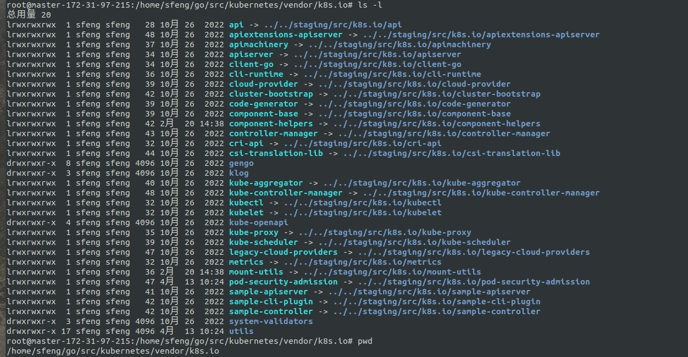

# Kubernetes 源码结构

## 简介

Kubernetes 源码非常庞大，其中包括自身核心代码，以及对外提供给开发者的 sdk 等。

Kubernetes 的源码结构也是按照上述五个组成部分来组织的，这里以 Kubernetes:v1.22.17 讲解，其主要目录结构如下：

```bash
kubernetes/
     ├── api/
     ├── build/
     ├── CHANGELOG/
     ├── cmd/
     ├── docs/
     ├── hack/
     ├── pkg/
     ├── plugin/
     ├── staging/
     ├── test/
     └── vendor/
```

## 目录作用

### **api**

包含 Kubernetes 的 API 定义文件，如 Pod、Service、ReplicationController 等。但是现在 K8s 的 api 基本都移到 k8s.io/api，和 k8s.io/apis 项目下。

### **build**

包含 Kubernetes 内部组件编译的脚本以及制作 Dcoker 镜像的 Dockerfile 等。

### **CHANGELOG**

本次版本更新的 Future 以及修复的 Bug 记录

### **cmd**

包含 Kubernetes 组件启动命令，如 kube-apiserver，kube-controller-manager 等

### **docs**

包含 Kubernetes 的文档，如开发者指南、API 文档等。这些文档是用 MkDocs 工具编写的，可以生成静态网站供用户参考。Kubernetes 的文档非常丰富，包括了从安装到使用到开发的所有内容。对于初学者来说，阅读 Kubernetes 的官方文档是非常必要的。

### **hack**

包含 Kubernetes 的构建和测试脚本。这些脚本用于自动化构建、测试和发布 Kubernetes。在这些脚本中，包含了大量的构建细节和测试用例。这些脚本可以大大提高我们的工作效率，同时也可以确保 Kubernetes 的代码质量和稳定性。

### **pkg**

包含 Kubernetes 的核心代码，如 API Server、Controller Manager、Scheduler 等。

### **plugin**

包含 Kubernetes 的插件，例如存储插件、认证插件等，它们都可以让 Kubernetes 更加灵活和强大。

### **test**

包含 Kubernetes 的测试用例。这些测试用例用于测试 Kubernetes 的功能是否正常。在 Kubernetes 的开发过程中，测试是非常重要的环节。通过测试，我们可以发现和解决各种问题，确保 Kubernetes 的功能正确性和稳定性。

### **vendor**

用于存放 Kubernetes 所有依赖的第三方库的代码。在编译 Kubernetes 源码时，需要使用大量的第三方库，例如 `etcd`、`docker`、`glog` 等。这些库的源码会被存放在 `vendor` 目录下，它们会被自动下载和编译，最终被打包到 Kubernetes 的二进制文件中。

### **staging**

这个目录比较特殊，单独拿出来说。

## Staging 目录

在 kubernetes 源码中，对 kubernetes 项目代码的引用使用的都是 [k8s.io](http://k8s.io/)：

```go
package proxy

import (
    "bytes"
    "fmt"

    "github.com/pkg/errors"
    apps "k8s.io/api/apps/v1"
    "k8s.io/api/core/v1"
    rbac "k8s.io/api/rbac/v1"
    metav1 "k8s.io/apimachinery/pkg/apis/meta/v1"
    kuberuntime "k8s.io/apimachinery/pkg/runtime"
    clientset "k8s.io/client-go/kubernetes"
    clientsetscheme "k8s.io/client-go/kubernetes/scheme"
    kubeadmapi "k8s.io/kubernetes/cmd/kubeadm/app/apis/kubeadm"
    "k8s.io/kubernetes/cmd/kubeadm/app/componentconfigs"
    "k8s.io/kubernetes/cmd/kubeadm/app/constants"
    "k8s.io/kubernetes/cmd/kubeadm/app/images"
    kubeadmutil "k8s.io/kubernetes/cmd/kubeadm/app/util"
    "k8s.io/kubernetes/cmd/kubeadm/app/util/apiclient"
)
```

### ****主项目代码****

第一种情况是对主项目代码的引用。k8s.io/kubernetes 就是主项目代码的 package name，在 [go-modules](https://www.lijiaocn.com/prog/go/chapter04/01-dependency.html#go-modules) 使用的 go.mod 文件中定义的：

```go
module k8s.io/kubernetes

go 1.16
```

因此引用主项目代码，需要使用 k8s.io/kubernetes，而不是其他项目中经常看到 `github.com/xxxx`。

### 单独发布的代码

第二种情况是对位于主项目中但是独立发布的代码的引用。

kubernetes 的一些代码以独立项目的方式发布的，譬如：[kubernetes/api](https://github.com/kubernetes/api)、[kubernetes/client-go](https://github.com/kubernetes/client-go) 等，主要是考虑这些包开发者会经常用到，所以将这些包单独拿到 k8s 源码项目之外，方便开发者引用。这些项目的 package name 也用同样的方式在 go.mod 中定义：

```go
module k8s.io/api

或者

module k8s.io/client-go
```

要注意的是，这些代码虽然以独立项目发布，但是都在 kubernetes 主项目中维护，位于目录 kubernetes/staging/ ，这里面的代码代码被定期同步到各个独立项目中。

[kubernetes/staging/](https://github.com/kubernetes/kubernetes/tree/v1.16.3/staging) 列出了独立发布的代码：

```go
k8s.io/api
k8s.io/apiextensions-apiserver
k8s.io/apimachinery
k8s.io/apiserver
k8s.io/cli-runtime
k8s.io/client-go
k8s.io/cloud-provider
k8s.io/cluster-bootstrap
k8s.io/code-generator
k8s.io/component-base
k8s.io/cri-api
k8s.io/csi-api
k8s.io/csi-translation-lib
k8s.io/kube-aggregator
k8s.io/kube-controller-manager
k8s.io/kube-proxy
k8s.io/kube-scheduler
k8s.io/kubectl
k8s.io/kubelet
k8s.io/legacy-cloud-providers
k8s.io/metrics
k8s.io/node-api
k8s.io/sample-apiserver
k8s.io/sample-cli-plugin
k8s.io/sample-controller
```

更需要注意的是，kubernetes 主项目引用这些独立发布的代码时，引用是位于主项目 staging 目录中的代码，而不是独立 repo 中的代码。这是因为主项目的 vendor 目录中设置了软链接。

只要单独项目发生了更新，例如：k8s.io/apimachinery ，就会被自动同步到 Kubernetes 源码的 staging/src/k8s.io/apimachinery 之下。



## API 代码

api 定义代码位于 kubernetes/staging/src/k8s.io/api

需要注意 kubernetes 主项目中还有kubernetes/api，kubernetes/pkg/api，kubernetes/pkg/apis 三个目录。

```bash
kubernetes/api:      api 规范定义
kuberntes/pkg/api:   简单的操作函数, api util 方法
kuberntes/pkg/apis:  与 kubernetes/staging/src/k8s.io/api 内容类似，也定义了内置 api，但是这个项目只建议被 Kubernetes 内部引用，如果外部项目引用建议使用 kubernetes/staging/src/k8s.io/api。而且 Kubernetes 内置代码也有很多引用了 kubernetes/staging/src/k8s.io/api 下面的 api，所以后面可能都会迁移至 kubernetes/staging/src/k8s.io/api 项目下。
```

## 总结

总之，了解 Kubernetes 的源码结构可以帮助我们更好地理解 Kubernetes 的实现原理，从而更好地使用和开发 Kubernetes。阅读 kubernetes 源码，先梳理好源码结构非常重要。