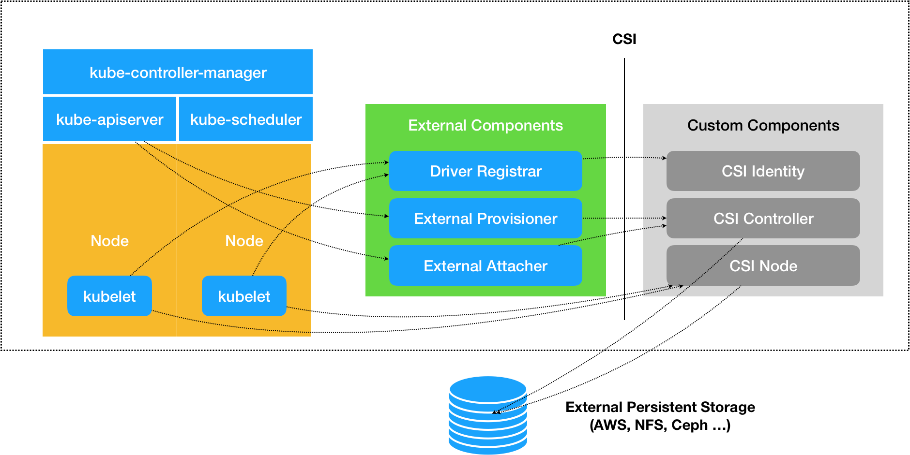
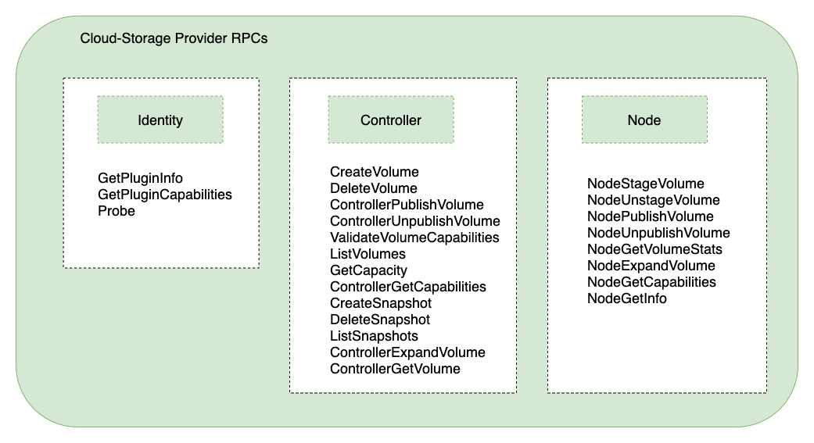
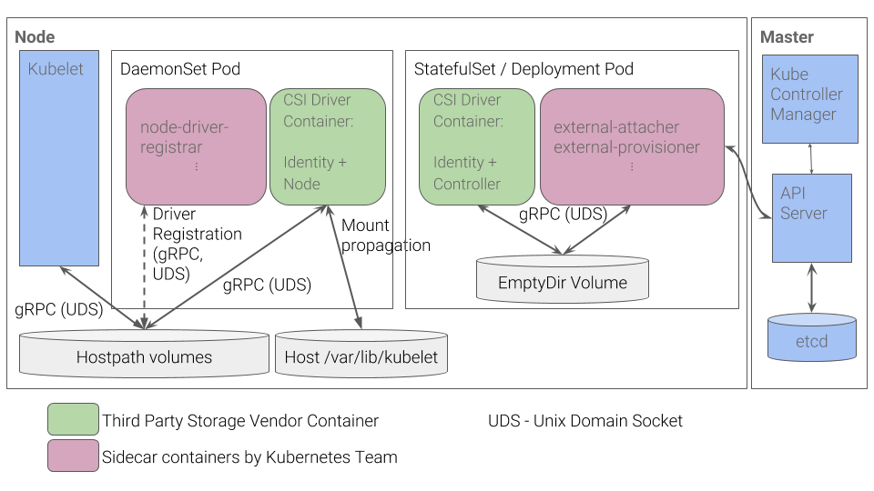
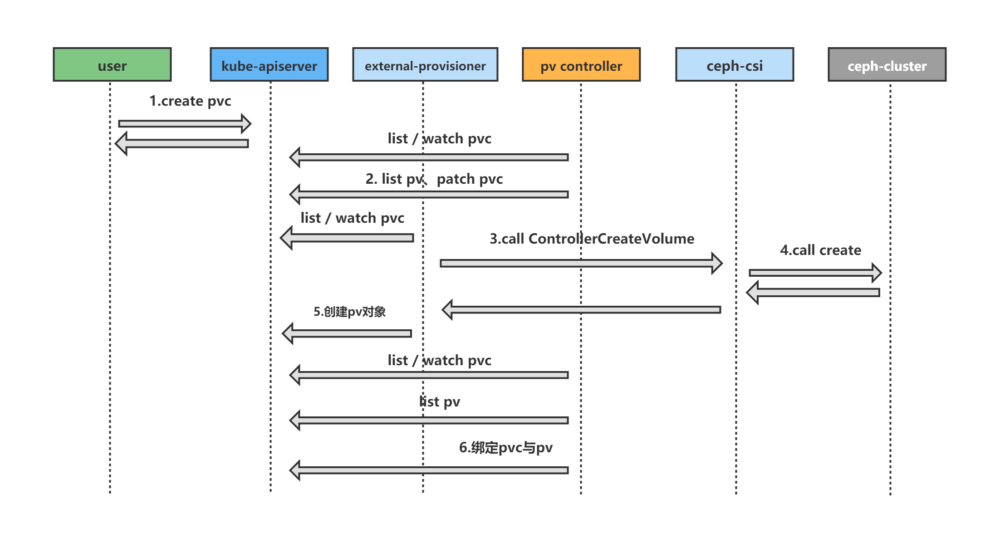
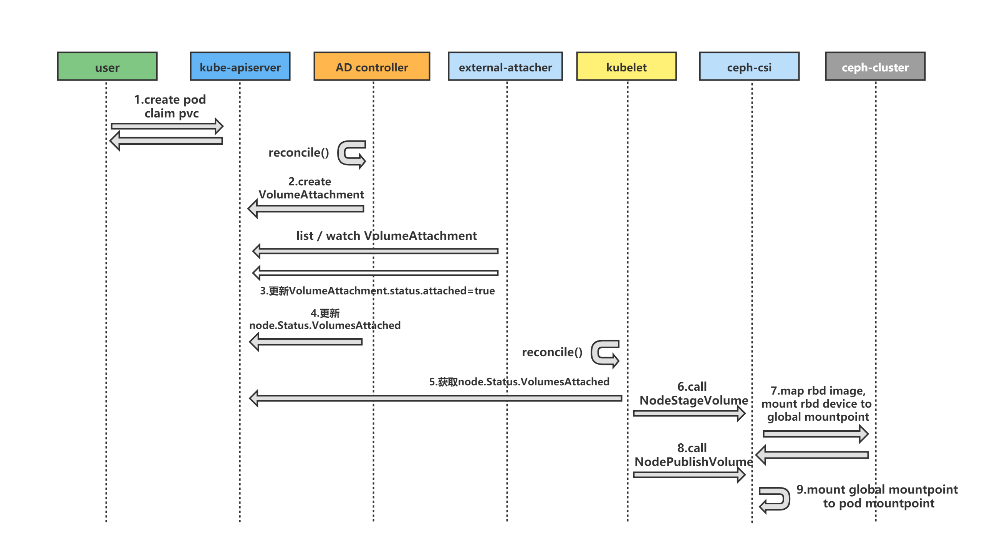

## 简介

CSI （Container Storage Interface) 是 Kubernetes 存储扩展的接口, 在 Kubernetes 中, 要想使用持久化存储, Kubernetes 提供了插件机制可以将存储接进来。对应着 In-Tree 和 Out-Of-Tree 两种方式，In-Tree 就是在 Kubernetes 源码内部实现的, 使用 In-Tree 方式会带来以下问题:

- 更改 in-tree 类型的存储代码，用户必须更新 K8s 组件，成本较高
- in-tree 存储代码中的 bug 会引发 K8s 组件不稳定
- K8s 社区需要负责维护及测试 in-tree 类型的存储功能
- in-tree 存储插件享有与 K8s 核心组件同等的特权，存在安全隐患
- 三方存储开发者必须遵循 K8s 社区的规则开发 in-tree 类型存储代码

那么 Out-Of-Tree 方式就比较灵活, 它是独立于 Kubernetes 的, 目前主要有 CSI 和 FlexVolume 两种机制。使得三方存储厂商研发人员只需实现 CSI 或者 FlexVolume 接口（无需关注容器平台是 K8s 还是 Swarm 等）。
其中 FlexVolume 本身也存在众多问题，会在 Kubernetes v1.23 遗弃。所以 CSI 方式会是主流方式，本篇文章重点讲解 CSI 方式来扩展 Kubernetes 存储。

## 存储原理

在正式介绍 CSI 之前，先简单介绍下 K8S 架构下的存储实现原理。

在 K8S 中 Pod 内的容器使用 PVC 绑定 PV 这种抽象的过程来实现容器使用三方存储。这样的好处是使得专业的人去关心专业的模块。比如：

- 对于业务开发人员只需要关注我的服务需要多少存储即可，那么我只需要定义 PVC 来描述我的需求，至于使用什么存储以及如何创建存储都不关心。
- 对于专业存储工程师，他并不关心存储的申请，他只需要维护好底层存储的实现以及分配存储即可，所以存储工程师只需关心底层 PV，CSI 即可。

PV 和 PVC 绑定上了，那么又是如何将容器里面的数据进行持久化的呢，前面我们学习过 Docker 的 Volume 挂载，其实就是**将一个宿主机上的目录和一个容器里的目录绑定挂载在了一起**，具有持久化功能当然就是指的宿主机上面的这个目录了，当容器被删除或者在其他节点上重建出来以后，这个目录里面的内容依然存在，所以一般情况下实现持久化是需要一个远程存储的，比如 NFS、Ceph 或者云厂商提供的磁盘等等。所以接下来需要做的就是持久化宿主机目录这个过程。

当 Pod 被调度到一个节点上后，节点上的 kubelet 组件就会为这个 Pod 创建它的 Volume 目录，默认情况下 kubelet 为 Volume 创建的目录在 kubelet 工作目录下面：

```bash
/var/lib/kubelet/pods/<Pod的ID>/volumes/kubernetes.io~<Volume类型>/<Volume名字>
```

要获取 Pod 的唯一标识 uid，可通过命令 `kubectl get pod pod名 -o jsonpath={.metadata.uid}` 获取。比如上面我们创建的 Pod 对应的 Volume 目录完整路径为：

```bash
/var/lib/kubelet/pods/d4fcdb11-baf7-43d9-8d7d-3ede24118e08/volumes/kubernetes.io~nfs/nfs-pv
```

然后就需要根据我们的 Volume 类型来决定需要做什么操作了，比如上 Ceph RBD，那么 K8S CSI 就需要先将 Ceph 提供的 RBD 挂载到 Pod 所在的宿主机上面，这个阶段在 Kubernetes 中被称为 Attach 阶段。Attach 阶段完成后，为了能够使用这个块设备，K8S CSI 还要进行第二个操作，即：格式化这个块设备，然后将它挂载到宿主机指定的挂载点上。这个挂载点，也就是上面我们提到的 Volume 的宿主机的目录。将块设备格式化并挂载到 Volume 宿主机目录的操作，在 Kubernetes 中被称为 Mount 阶段。

```bash
$ kubectl get pods -o wide -l app=wordpress
NAME                              READY   STATUS    RESTARTS   AGE   IP             NODE         NOMINATED NODE   READINESS GATES
wordpress-5b886cf59b-dv2zt        1/1     Running   0          20d   10.244.1.158   ydzs-node1   <none>           <none>
wordpress-mysql-b9ddd6d4c-pjhbt   1/1     Running   0          20d   10.244.4.70    ydzs-node4   <none>           <none>
```

我们可以看到 MySQL 运行在 node4 节点上，然后可以在该节点上查看 Volume 信息，Pod 对应的 uid 可以通过如下命令获取：

```bash
$ kubectl get pod wordpress-mysql-b9ddd6d4c-pjhbt -o jsonpath={.metadata.uid}
3f84af87-9f58-4c69-9e38-5ef234498133
$ ls /var/lib/kubelet/pods/3f84af87-9f58-4c69-9e38-5ef234498133/volumes/kubernetes.io~csi/pvc-c8861c23-c03d-47aa-96f6-73c4d4093109/
mount  vol_data.json
```

然后通过如下命令可以查看 Volume 的持久化信息：

```bash
$ findmnt /var/lib/kubelet/pods/3f84af87-9f58-4c69-9e38-5ef234498133/volumes/kubernetes.io~csi/pvc-c8861c23-c03d-47aa-96f6-73c4d4093109/mount
TARGET                                                                                            SOURCE    FSTYPE OPTIONS
/var/lib/kubelet/pods/3f84af87-9f58-4c69-9e38-5ef234498133/volumes/kubernetes.io~csi/pvc-c8861c23-c03d-47aa-96f6-73c4d4093109/mount    /dev/rbd0 ext4   rw,relatime,
```

可以看到这里的 Volume 是挂载到 `/dev/rbd0` 这个设备上面的，通过 `df` 命令也是可以看到的：

```bash
$ df -h |grep dev
devtmpfs        3.9G     0  3.9G   0% /dev
tmpfs           3.9G     0  3.9G   0% /dev/shm
/dev/vda3        18G  4.7G   13G  27% /
/dev/vda1       497M  158M  340M  32% /boot
/dev/vdb1       197G   24G  164G  13% /data
/dev/rbd0        20G  160M   20G   1% /var/lib/kubelet/pods/3f84af87-9f58-4c69-9e38-5ef234498133/volumes/kubernetes.io~csi/pvc-c8861c23-c03d-47aa-96f6-73c4d4093109/mount
```

这里我们就经过了 `Attach` 和 `Mount` 两个阶段完成了 Volume 的持久化。但是对于上面我们使用的 NFS 就更加简单了， 因为 NFS 存储并没有一个设备需要挂载到宿主机上面，所以这个时候 K8S CSI 就会直接进入第二个 `Mount` 阶段，相当于直接在宿主机上面执行如下的命令：

```bash
$ mount -t nfs 10.151.30.11:/data/k8s /var/lib/kubelet/pods/d4fcdb11-baf7-43d9-8d7d-3ede24118e08/volumes/kubernetes.io~nfs/nfs-pv
```

同样可以在测试的 Pod 所在节点查看 Volume 的挂载信息：

```bash
$ findmnt /var/lib/kubelet/pods/d4fcdb11-baf7-43d9-8d7d-3ede24118e08/volumes/kubernetes.io~nfs/nfs-pv
TARGET                                                                               SOURCE                 FSTYPE OPTIONS
/var/lib/kubelet/pods/d4fcdb11-baf7-43d9-8d7d-3ede24118e08/volumes/kubernetes.io~nfs/nfs-pv
                                                                                     10.151.30.11:/data/k8s nfs4   rw,relatime,
```

我们可以看到这个 Volume 被挂载到了 NFS（10.151.30.11:/data/k8s）下面，以后我们在这个目录里写入的所有文件，都会被保存在远程 NFS 服务器上。

这样在经过了上面的两个阶段过后，我们就得到了一个持久化的宿主机上面的 Volume 目录了，接下来 kubelet 只需要把这个 Volume 目录挂载到容器中对应的目录即可，这样就可以为 Pod 里的容器挂载这个持久化的 Volume 了，这一步其实也就相当于执行了如下所示的命令：

```bash
$ docker run -v /var/lib/kubelet/pods/<Pod的ID>/volumes/kubernetes.io~<Volume类型>/<Volume名字>:/<容器内的目标目录> 我的镜像 ...
```

我们上面使用的 NFS 就属于 In-Tree 这种方式，而 Ceph RBD 就是 Out-Of-Tree 的方式，而且是使用的是 CSI 插件。下面我们再来了解下`CSI` 插件方式。

## CSI 架构

Kubernetes CSI 存储体系主要由两部分组成，即下图中绿色和灰色部分。



### External component( Kubernetes Team )

包含 **Driver registar**、 **External provisioner**、 **External attacher** 三部分，除了这三个主要部分，还有 **External-resizer、external-snapshotter、livenessprobe** 在上图没有体现**。**这六个组件是从 Kubernetes 原本 In-Tree 存储体系中剥离出来的存储管理功能, 实际上是 Kubernetes 中的一种外部 controller。它们 watch Kubernetes 的 API 资源对象，根据 watch 到的状态来调用下面提到的第二部分的 CSI 插件来实现存储的管理和操作。

- **Driver registar**

用于将插件注册到 Kubelet 的 sidecar 容器, 并将驱动程序自定义的 NodeId 添加到节点的 Annotations 上, 通过与 CSI Identity 服务进行通信调用 CSI Identity 的 GetNodeId 方法来完成操作。

- **External provisioner**

用于watch Kubernetes 的 PVC 对象并调用 CSI Controller 的 CreateVolume 和 DeleteVolume 操作, 之后创建 PV。

- **External attacher**

用于 Attach/Detach 阶段, 通过 watch Kubernetes 的 VolumeAttachment 对象并调用 CSI 的 ControllerPublishVolume 和 ControllerUnpublishVolume 操作来完成对应的 Volume 的 Attach/Detach。 而 Volume 的 Mount/Unmount 阶段并不属于外部组件，当真正需要执行 Mount 操作的时候，kubelet 会去直接调用下面的 CSI Node 服务来完成 Volume 的 Mount/UnMount 操作。

- **External-resizer**

它是一个 sidecar 容器，用于监视 Kubernetes ApiServer 上的 PersistentVolumeClaim 对象的改动，如果用户请求在 PersistentVolumeClaim 对象上请求更多存储，则会针对 CSI 端点触发ControllerExpandVolume 操作。

- **External-snapshotter**

它是一个 sidecar 容器，用于监视 Kubernetes ApiServer 服务器上的 VolumeSnapshot 和 VolumeSnapshotContent CRD 对象。创建新的 VolumeSnapshot 对象（引用与此驱动程序对应的 SnapshotClass CRD 对象）将导致 sidecar 容器提供新的快照。

该 Sidecar 侦听指示成功创建 VolumeSnapshot 的服务，并立即创建 VolumeSnapshotContent 资源。

- **livenessprobe**

它是一个 sidecar 容器，用于监视 CSI 驱动程序的运行状况，并通过 Liveness probe 机制 将其报告给 Kubernetes。 这使 Kubernetes 能够自动检测驱动程序问题并重新启动 Pod 以尝试解决问题。

### External component( 3rd party )

这部分正是第三方存储厂商开发者需要实现的 CSI 插件部分, 都是通过 gRPC 实现的服务, 主要包含三部分：**CSI Identity**、**CSI Controller**、**CSI Node**。

这个三个组件的接口定义如下图：



**CSI Identity**

主要用于负责对外暴露这个插件本身的信息，确保插件的健康状态。

```go
service Identity {
    // 返回插件的名称和版本
    rpc GetPluginInfo(GetPluginInfoRequest)
        returns (GetPluginInfoResponse) {}
    // 返回这个插件的包含的功能，比如非块存储类型的 CSI 插件不需要实现 Attach 功能，GetPluginCapabilities 就可以在返回中标注这个 CSI 插件不包含 Attach 功能
    rpc GetPluginCapabilities(GetPluginCapabilitiesRequest)
        returns (GetPluginCapabilitiesResponse) {}
    // 插件插件是否正在运行
    rpc Probe (ProbeRequest)
        returns (ProbeResponse) {}
}
```

**CSI Controller**

主要实现 Volume 管理流程当中的 Provision 和 Attach 阶段，Provision 阶段是指创建和删除 Volume 的流程，而 Attach 阶段是指把存储卷附着在某个节点或脱离某个节点的流程，另外只有块存储类型的 CSI 插件才需要 Attach 功能。

```go
service Controller {
    // 创建存储卷，包括云端存储介质以及PV对象
    rpc CreateVolume (CreateVolumeRequest)
        returns (CreateVolumeResponse) {}

    //  删除存储卷
    rpc DeleteVolume (DeleteVolumeRequest)
        returns (DeleteVolumeResponse) {}

    // 挂载存储卷，将存储介质挂载到目标节点
    rpc ControllerPublishVolume (ControllerPublishVolumeRequest)
        returns (ControllerPublishVolumeResponse) {}

    // 卸载存储卷
    rpc ControllerUnpublishVolume (ControllerUnpublishVolumeRequest)
        returns (ControllerUnpublishVolumeResponse) {}

    // 例如：是否可以同时用于多个节点的读/写
    rpc ValidateVolumeCapabilities (ValidateVolumeCapabilitiesRequest)
        returns (ValidateVolumeCapabilitiesResponse) {}

    // 返回所有可用的 volumes
    rpc ListVolumes (ListVolumesRequest)
        returns (ListVolumesResponse) {}

    // 可用存储池的总容量
    rpc GetCapacity (GetCapacityRequest)
        returns (GetCapacityResponse) {}

    // 例如. 插件可能未实现 GetCapacity、Snapshotting
    rpc ControllerGetCapabilities (ControllerGetCapabilitiesRequest)
        returns (ControllerGetCapabilitiesResponse) {}

    // 创建快照
    rpc CreateSnapshot (CreateSnapshotRequest)
        returns (CreateSnapshotResponse) {}

    // 删除指定的快照
    rpc DeleteSnapshot (DeleteSnapshotRequest)
        returns (DeleteSnapshotResponse) {}

    // 获取所有的快照
    rpc ListSnapshots (ListSnapshotsRequest)
        returns (ListSnapshotsResponse) {}
}
```

**CSI Node**

负责控制 Kubernetes 节点上的 Volume 操作。其中 Volume 的挂载被分成了 NodeStageVolume 和 NodePublishVolume 两个阶段。

NodeStageVolume 接口主要是针对块存储类型的 CSI 插件而提供的，块设备在 "Attach" 阶段被附着在 Node 上后，需要挂载至 Pod 对应目录上，但因为块设备在 linux 上只能 mount 一次，而在 kubernetes volume 的使用场景中，一个 volume 可能被挂载进同一个 Node 上的多个 Pod 实例中，所以这里提供了 NodeStageVolume 这个接口。使用这个接口把块设备格式化后先挂载至 Node 上的一个临时全局目录，然后再调用 NodePublishVolume 使用 linux 中的 bind mount 技术把这个全局目录挂载进 Pod 中对应的目录上。

```go
service Node {
    // 在节点上初始化存储卷（格式化），并执行挂载到Global目录
    rpc NodeStageVolume (NodeStageVolumeRequest)
        returns (NodeStageVolumeResponse) {}

    // umount 存储卷在节点上的 Global 目录
    rpc NodeUnstageVolume (NodeUnstageVolumeRequest)
        returns (NodeUnstageVolumeResponse) {}

    // 在节点上将存储卷的 Global 目录挂载到 Pod 的实际挂载目录
    rpc NodePublishVolume (NodePublishVolumeRequest)
        returns (NodePublishVolumeResponse) {}

    // unmount 存储卷在节点上的 Pod 挂载目录
    rpc NodeUnpublishVolume (NodeUnpublishVolumeRequest)
        returns (NodeUnpublishVolumeResponse) {}

    // 获取节点上Volume挂载文件系统统计信息（总空间、可用空间等）
    rpc NodeGetVolumeStats (NodeGetVolumeStatsRequest)
        returns (NodeGetVolumeStatsResponse) {}

    // 获取节点的唯一 ID
    rpc NodeGetId (NodeGetIdRequest)
        returns (NodeGetIdResponse) {
        option deprecated = true;
    }

    // 返回节点插件的能力
    rpc NodeGetCapabilities (NodeGetCapabilitiesRequest)
        returns (NodeGetCapabilitiesResponse) {}

    // 获取节点的一些信息
    rpc NodeGetInfo (NodeGetInfoRequest)
        returns (NodeGetInfoResponse) {}
}
```

### CSI 部署架构

对于第三方存储厂商，只需要实现以上三个 grpc 接口，就可以实现一个 CSI 了。

为了表述方便，我们这里把上面的 K8S 维护的 CSI 组件统称为 External-Component，存储厂商实现的插件统称为 CSI-Driver

**部署架构**

要想 CSI 与 Kubernetes 对接，还需要将 CSI-driver 与 External-component 组合使用。参考下图看看 CSI 的部署架构：



可以发现 **CSI Driver = DaemonSet + Deployment(StatefuleSet)**。

右边一个 StatefulSet 或 Deployment 的 pod，可以说是 CSI Controller，提供存储服务视角对存储资源和存储卷进行管理和操作

- 绿色部分为 CSI Driver，包括 Identity、Controller。
- 粉色部分与 Master（Kube-controller-manager）通信的辅助 sidecar 容器，包括 External Attacher、External Provisioner 等。
- 这两个容器通过本地 Socket（Unix DomainSocket，UDS），并使用 gPRC 协议进行通信。
- sidecar 容器通过 Socket调用 CSI Driver 容器的 CSI 接口，CSI Driver 容器负责具体的存储卷操作。

左边一个 Daemonset 的 pod：对主机（Node）上的 Volume 进行管理和操作。在每个Node上都运行一个Pod，以便 Kubelet 可以调用，它包含 2 个容器：

- 绿色部分为第三方存储实现，包括 Identity、Node。
- 粉色部分为 Node-driver-registar 作为 sidecar 容器。
- Node-driver-registrar 容器与 kubelet 通过 Node 主机的一个 hostPath 目录下的 unixsocket 进行通信。CSI Driver 容器与 kubelet 通过 Node 主机的另一个 hostPath 目录下的 unixsocket 进行通信，同时需要将 kubelet 的工作目录（默认为/var/lib/kubelet）挂载给 CSIDriver 容器，用于为 Pod 进行 Volume 的管理操作（包括 mount、umount 等）。

**通信协议**

External-Component 与 CSI-Driver 通信都是 gRPC


## CSI 基本原理

通过上面的一系列的分析，清楚了容器要想用到第三方提供的存储系统，需要经过 Provision/Deleting、Attach/Detach、Mount/Unmount 这三个阶段。下面就具体分析每个阶段的过程。

### P****rovisioning volumes****

Provisioning 这个过程会涉及到 Kube-controller-manager 的 PV-Controller、External-component 的 External-provisioner、CSI 插件的 CSI-Controller。

当 Kubernetes 集群中创建了一个带 PVC 的 Pod，那么 Provisioning 这个过程就是在集群中寻找到一个与该 PVC 匹配的 PV 进行绑定。

若环境中没有合适的 PV，则进入动态 Provisioning 场景：



- Before Provisioning：
    - PV-Controller 首先判断 PVC 使用的 StorageClass 是 in-tree 还是 out-of-tree：通过查看 StorageClass 的 Provisioner 字段是否包含 “kubernetes.io/” 前缀来判断；
    - PV-Controller 更新 PVC 的 annotation：`claim.Annotations[“volume.beta.kubernetes.io/storage-provisioner”] = storageClass.Provisioner`；
- out-of-tree Provisioning（external provisioning）：
    - External Provisioner Watch 到 PVC；
    - External Provisioner 检查 PVC 中的 `claim.Spec.VolumeName` 是否为空，不为空则直接跳过该 PVC；
    - External Provisioner 检查 PVC 中的 `claim.Annotations[“volume.beta.kubernetes.io/storage-provisioner”]`是否等于自己的 Provisioner Name（External Provisioner 在启动时会传入 `–provisioner` 参数来确定自己的 Provisioner Name）；
    - 若 PVC 的 VolumeMode=Block，检查 External Provisioner 是否支持块设备；
    - External Provisioner 通过 gRPC 调用 CSI 存储插件的 CSI-Controller 的 `CreateVolume` 接口；
    - External Provisioner 创建一个 PV 来代表该 volume
    - PV-Controller 同时将该 PV 与之前的 PVC 做绑定。

### ****Attaching Volumes****

Attaching 这个阶段用于块存储，同样会涉及到 Kube-controller-manager/Kubelet 的 AD-Controller、External-component 的 External-attacher、CSI 插件的 CSI-Controller。当 Kubelet 启动参数`--enable-controller-attach-detach`，该启动参数设置为 `true` 表示启用 `Attach/Detach controller`进行`Attach/Detach` 操作。



当 Pod 的 PVC 与 PV 绑定后，需要将该 PV 的 Volume 附着到对应 Pod 的调度节点上。

- AD-Controller 调用 in-tree 的 CSIAttacher 的 `attach` 函数 创建一个 VolumeAttachement（VA）对象，该对象包含了 Attacher 信息、节点名称、待挂接 PV 信息；
- External Attacher 会 watch 集群中的 VolumeAttachement 资源，发现有需要挂接的数据卷时，调用 `Attach` 函数，通过 gRPC 调用 CSI 插件的 CSI-Controller 的 `ControllerPublishVolume` 接口。

### Mounting Volumes

Mounting 这个阶段将宿主机上的存储挂载到容器内，该过程涉及到 Kubelet、CSI 插件的 CSI-Node。

这里会涉及到一个全局目录的概念，全局目录（global mount path）存在的目的：块设备在 Linux 上只能挂载一次，而在 K8s 场景中，一个 PV 可能被挂载到同一个 Node 上的多个 Pod 实例中。若块设备格式化后先挂载至 Node 上的一个临时全局目录，然后再使用 Linux 中的 bind mount 技术把这个全局目录挂载进 Pod 中对应的目录上，就可以满足要求。上述流程图中，全局目录即 `/var/lib/kubelet/plugins/kubernetes.io/csi/pv/csi-blockvolume-pv/globalmount`, 全局目录在 PVC 和 PV 绑定后 Kubelet 就会在当前节点创建。

Mounting 流程如下，流程图可参考上图阶段 8：

- Kubelet 的 Volume Manager 调用 CSI 插件的 CSI-Node 的 `NodeStageVolume` 接口**，**挂载 volume 到全局目录；
- Kubelet 的 Volume Manager 调用 CSI 插件的 CSI-Node 的 `NodePublishVolume` 接口 bind-mount volume 到 Pod 上，这个 Pod 目录是在宿主机上的唯一目录，格式为：`/var/lib/kubelet/pods/{poduid}/volumes/{volume-plugin}/{pv-name}` , 并不是容器内的目录，挂载到容器内是 CRI 做的事。

以上就是 Kubernetes 使用 CSI 的完整流程，如果是删除带有 PVC 的 Pod，那么则是以上过程的逆向操作，即 Umount Volumes —> Dettaching Volumes —> Deleting Volumes，具体细节这里不再赘述。

## 总结

Kubernetes 的存储架构是比较复杂的，涉及到很多抽象的资源概念和组件之间的协作。要想深入了解 Kubernetes 存储，除了要清楚以上内容，还需深入到 Kuberneets 源码和具体 CSI 的源码才能掌握的更透彻。

后面也会出一篇文章讲解某个具体 CSI 的源码，通过源码解析来摸清 Kubernetes 如何通过 CSI 实现存储功能的。