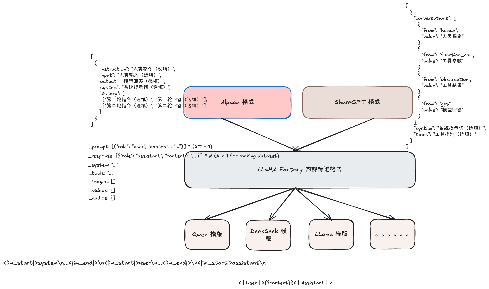

## 简介

LLaMA Factory是由北京航空航天大学的郑耀威开发的高效、易用、可扩展的[开源大模型](https://qianfan.cloud.baidu.com/)训练框架。无需写代码，一键去微调、量化、蒸馏、部署等模型。同时 LLaMa Factory 也有 WebUI 界面。

LLaMa Factory 目前支持如下主要功能：

- 内置数据集：LLaMA Factory 内置了**60+ 个内置**数据集，用户可直接使用，也可自定义数据集，支持 Alpaca、ShareGPT 两种数据集格式。
- 模型类型：支持500+纯文本大模型、200+多模态大模型以及All-to-All全模态模型、序列分类模型、Embedding模型训练到部署全流程。
- 硬件支持：CPU、RTX系列、T4/V100、A10/A100/H100、Ascend NPU、MPS等。
- **模型精调**：支持了LoRA、QLoRA、DoRA、LoRA+、ReFT、RS-LoRA、LLaMAPro、Adapter、GaLore、Q-Galore、LISA、UnSloth、Liger-Kernel 等轻量微调方式。
- **分布式训练**：支持分布式数据并行（DDP）、device_map 简易模型并行、DeepSpeed ZeRO2 ZeRO3、FSDP 等分布式训练技术。
- **量化训练**：支持对BNB、AWQ、GPTQ、AQLM、HQQ、EETQ 量化模型进行训练。
- **RLHF 训练**：支持纯文本大模型和多模态大模型的 DPO、GRPO、RM、PPO、GKD、KTO、CPO、SimPO、ORPO 等人类对齐训练方法。
- **多模态训练**：支持对图像、视频和语音不同模态模型进行训练，支持 VQA、Caption、OCR、Grounding 任务的训练。
- 推理加速：支持PyTorch、vLLM、SGLang和LmDeploy推理加速引擎，并提供OpenAI接口，为推理、部署和评测模块提供加速。
- 模型评测：以EvalScope作为评测后端，支持100+评测数据集对纯文本和多模态模型进行评测。
- 模型量化：支持AWQ、GPTQ和BNB的量化导出，导出的模型支持使用vLLM/SGLang/LmDeploy推理加速，并支持继续训练。

下面通过基于 **Qwen3** 做模型微调讲解如何使用 LLaMa Factory。

## 环境

这里使用 Docker 镜像部署方式，在使用 LLaMa Factory 需要保证如下环境依赖：

- 硬件：1 * NVIDIA GeForce RTX 4090；CUDA 12.4；
- 系统：Ubuntu 22.04（x86_64）；
- Kubernetets：v1.28.8；

## 安装

### 本地安装

运行以下指令以安装 LLaMA-Factory 及其依赖:

```bash
$ git clone --depth **1** https://github.com/hiyouga/LLaMA-Factory.git
$ cd LLaMA-Factory
$ pip install -e ".[torch,metrics]"
```

如果出现环境冲突，请尝试使用 `pip install --no-deps -e .` 解决

### 镜像安装

为了方便准备环境依赖，也可以使用社区提供的 Docker 镜像部署安装，这里提供了启动 LLaMa Factory 的 K8S yaml

```yaml
apiVersion: v1
kind: Pod
metadata:
  name: llama-factory-train
  namespace: default
spec:
  containers:
  - command: ["sleep", "infinity"]
    image: hiyouga/llamafactory:latest
    imagePullPolicy: IfNotPresent
    name: llama-factory-train
    resources:
      limits:
        cpu: "16"
        memory: 32768M
        nvidia.com/gpu: "1"
      requests:
        cpu: "16"
        memory: 32768M
        nvidia.com/gpu: "1"
    terminationMessagePath: /dev/termination-log
    terminationMessagePolicy: File
    volumeMounts:
    - mountPath: /dev/shm
      name: dshm
    - mountPath: /mnt/data
      name: data
      readOnly: false
  dnsPolicy: ClusterFirst
  runtimeClassName: nvidia
  enableServiceLinks: true
  volumes:
  - emptyDir:
      medium: Memory
      sizeLimit: 32768M
    name: dshm
  - hostPath: 
      path: /root/llama-factory/data
    name: data
```

启动完成后，进入 pod 内，默认在 `/app` 目录下，该目录就是 **LLaMa Factory** 的代码根目录，后期所有的操作都在 pod 内 `/app` 目录下执行。

```bash
$ kubectl exec -it llama-factory-train bash
root@llama-factory-train:/app# pwd
/app
root@llama-factory-train:/app# ls
CITATION.cff  MANIFEST.in  README.md     assets  evaluation  pyproject.toml    saves    setup.py  tests
LICENSE       Makefile     README_zh.md  data    examples    requirements.txt  scripts  src
```

## 数据集准备

在微调之前，需要提前准备数据集。在 LLaMa Factory 项目里提前准备了内置的本地数据集，可以直接使用，在 `./data` 目录下：

```bash
$ ll data/
total 7988
drwxr-xr-x 6 root root    4096 Jun 18 10:18 ./
drwxr-xr-x 1 root root    4096 Jun 20 07:58 ../
-rw-r--r-- 1 root root   13690 Jun 18 10:18 README.md
-rw-r--r-- 1 root root   12917 Jun 18 10:18 README_zh.md
-rw-r--r-- 1 root root  860929 Jun 18 10:18 alpaca_en_demo.json
-rw-r--r-- 1 root root  636036 Jun 18 10:18 alpaca_zh_demo.json
drwxr-xr-x 2 root root    4096 Jun 18 10:18 belle_multiturn/
-rw-r--r-- 1 root root  747189 Jun 18 10:18 c4_demo.jsonl
-rw-r--r-- 1 root root   17160 Jun 18 10:18 dataset_info.json
-rw-r--r-- 1 root root 1575286 Jun 18 10:18 dpo_en_demo.json
-rw-r--r-- 1 root root  853311 Jun 18 10:18 dpo_zh_demo.json
-rw-r--r-- 1 root root  738925 Jun 18 10:18 glaive_toolcall_en_demo.json
-rw-r--r-- 1 root root  680684 Jun 18 10:18 glaive_toolcall_zh_demo.json
drwxr-xr-x 2 root root    4096 Jun 18 10:18 hh_rlhf_en/
-rw-r--r-- 1 root root   20306 Jun 18 10:18 identity.json
-rw-r--r-- 1 root root  913519 Jun 18 10:18 kto_en_demo.json
-rw-r--r-- 1 root root     877 Jun 18 10:18 mllm_audio_demo.json
-rw-r--r-- 1 root root    3301 Jun 18 10:18 mllm_demo.json
drwxr-xr-x 2 root root    4096 Jun 18 10:18 mllm_demo_data/
-rw-r--r-- 1 root root    1071 Jun 18 10:18 mllm_video_audio_demo.json
-rw-r--r-- 1 root root     828 Jun 18 10:18 mllm_video_demo.json
drwxr-xr-x 2 root root    4096 Jun 18 10:18 ultra_chat/
-rw-r--r-- 1 root root 1028326 Jun 18 10:18 wiki_demo.txt
```

`dataset_info.json` 配置了所有可用的数据集，包括 **本地数据集** 以及 **在线数据集。**如果希望使用自定义数据集，请**务必**在 `dataset_info.json` 文件中添加*数据集描述*，并通过修改 `dataset: 数据集名称` 配置来使用数据集。

其中 `dataset_info.json` 文件应放置在 `dataset_dir` 目录下。可以通过修改 `dataset_dir` 参数来使用其他目录。默认值为 `./data` 

`dataset_info.json` 配置模版如下：

```json
"数据集名称": {
  "hf_hub_url": "Hugging Face 的数据集仓库地址（若指定，则忽略 script_url 和 file_name）",
  "ms_hub_url": "ModelScope 的数据集仓库地址（若指定，则忽略 script_url 和 file_name）",
  "script_url": "包含数据加载脚本的本地文件夹名称（若指定，则忽略 file_name）",
  "file_name": "该目录下数据集文件夹或文件的名称（若上述参数未指定，则此项必需）",
  "formatting": "数据集格式（可选，默认：alpaca，可以为 alpaca 或 sharegpt）",
  "ranking": "是否为偏好数据集（可选，默认：False）",
  "subset": "数据集子集的名称（可选，默认：None）",
  "split": "所使用的数据集切分（可选，默认：train）",
  "folder": "Hugging Face 仓库的文件夹名称（可选，默认：None）",
  "num_samples": "该数据集所使用的样本数量。（可选，默认：None）",
  "columns（可选）": {
    "prompt": "数据集代表提示词的表头名称（默认：instruction）",
    "query": "数据集代表请求的表头名称（默认：input）",
    "response": "数据集代表回答的表头名称（默认：output）",
    "history": "数据集代表历史对话的表头名称（默认：None）",
    "messages": "数据集代表消息列表的表头名称（默认：conversations）",
    "system": "数据集代表系统提示的表头名称（默认：None）",
    "tools": "数据集代表工具描述的表头名称（默认：None）",
    "images": "数据集代表图像输入的表头名称（默认：None）",
    "videos": "数据集代表视频输入的表头名称（默认：None）",
    "audios": "数据集代表音频输入的表头名称（默认：None）",
    "chosen": "数据集代表更优回答的表头名称（默认：None）",
    "rejected": "数据集代表更差回答的表头名称（默认：None）",
    "kto_tag": "数据集代表 KTO 标签的表头名称（默认：None）"
  },
  "tags（可选，用于 sharegpt 格式）": {
    "role_tag": "消息中代表发送者身份的键名（默认：from）",
    "content_tag": "消息中代表文本内容的键名（默认：value）",
    "user_tag": "消息中代表用户的 role_tag（默认：human）",
    "assistant_tag": "消息中代表助手的 role_tag（默认：gpt）",
    "observation_tag": "消息中代表工具返回结果的 role_tag（默认：observation）",
    "function_tag": "消息中代表工具调用的 role_tag（默认：function_call）",
    "system_tag": "消息中代表系统提示的 role_tag（默认：system，会覆盖 system column）"
  }
}
```

下面看一个使用**本地数据集**的 `dataset_info.json` 配置，`file_name` 就是数据集的文件名称，需要手动存放在 `dataset_dir` 目录下。

```json
{
  "identity": {
    "file_name": "identity.json" 
  },
  "alpaca_en_demo": {
    "file_name": "alpaca_en_demo.json"
  },
  "alpaca_zh_demo": {
    "file_name": "alpaca_zh_demo.json"
  },
  ......
}
```

下面是一个**在线数据集**的配置，`hf_hub_url` 表示 huggingface 上数据集的 url，`ms_hub_url` 表示 modelscope 上数据集的 url。

LLaMa Factory 在处理数据集时，都是通过解析 `dataset_info.json`。所以除了使用 LLaMa Factory 已经准备好的数据集，如果使用自定义的数据集配置，请**务必**在 `dataset_info.json` 文件中添加*数据集描述。除了自建数据集的名称、文件名称或者在线 url、还可以选配格式，以及对应格式字段对应配置。*

*目前 LLaMa Factory 支持*  **alpaca** 格式和 **sharegpt** 格式，默认 LLaMa Factory 使用 **alpaca** 格式。这是两种常见的数据格式，通常用于训练或微调基于指令（instruction-based）的语言模型。每种格式都反映了数据组织和任务指令的不同方式。所以用 LLaMa Factory 做模型微调只支持 **alpaca** 和 **sharegpt** 两种数据集格式，LLaMa Factory 会自动处理数据集，将这两种格式的数据集先转为内部标准格式，然后再将标准格式转为对应模型的数据模版，最后进行数据向量化传给模型。

### **Alpaca 格式**

Alpaca 格式是一种简单的数据结构，通常用于指令微调（Instruction Tuning）任务。

它由斯坦福大学的研究团队提出，特别适合训练语言模型理解和生成符合人类指令的回答。数据通常以 JSON 格式存储，每个样本包含以下几个核心字段：

- **instruction**（指令）：告诉模型要做什么。
- **input**（输入，可选）：提供给模型的具体上下文或问题。
- **output**（输出）：模型应该生成的回答。

例如指令监督微调数据集的 Alpaca 格式如下：

```json
[
  {
    "instruction": "人类指令（必填）",
    "input": "人类输入（选填）",
    "output": "模型回答（必填）",
    "system": "系统提示词（选填）",
    "history": [
      ["第一轮指令（选填）", "第一轮回答（选填）"],
      ["第二轮指令（选填）", "第二轮回答（选填）"]
    ]
  }
]
```

`instruction` 列对应的内容为人类指令， `input` 列对应的内容为人类输入， `output` 列对应的内容为模型回答。`system` 列对应的内容将被作为系统提示词。`history` 列是由多个字符串二元组构成的列表，分别代表历史消息中每轮对话的指令和回答。注意在指令监督微调时，历史消息中的回答内容也会被用于模型学习。

下面提供一个 alpaca 格式 **多轮** 对话的例子，对于单轮对话只需省略 `history` 列即可。

```json
[
  {
    "instruction": "今天的天气怎么样？",
    "input": "",
    "output": "今天的天气不错，是晴天。",
    "history": [
      [
        "今天会下雨吗？",
        "今天不会下雨，是个好天气。"
      ],
      [
        "今天适合出去玩吗？",
        "非常适合，空气质量很好。"
      ]
    ]
  }
]
```

那么对于上述 Alpaca 格式的数据集，`dataset_info.json` 中需要如下配置：

```json
"数据集名称": {
  "file_name": "data.json",
  "formatting": "alpaca",
  "columns": {
    "prompt": "instruction",
    "query": "input",
    "response": "output",
    "system": "system",
    "history": "history"
  }
}
```

以上配置中，columns 字段表示该数据集如何与 LLaMa Factory 中标准格式字段映射，LLaMa Factory 在处理数据集时根据该配置解析数据，并转为内部标准格式。

> Alpaca 格式，`dataset_info.json` 的 `formatting` 字段可不配置，因为默认是 alpaca
> 

当然除了指令监督微调数据集，还有预训练、强化学习、多模态等，Alpaca 格式都有对应的字段格式，详情可参考[官网](https://llamafactory.readthedocs.io/zh-cn/latest/getting_started/data_preparation.html#alpaca)

### **ShareGPT** 格式

ShareGPT 格式是基于多轮对话的数据结构，最初由 ShareGPT 项目（一个开源对话数据收集平台）推广。

它更适合训练支持多轮对话的模型，数据通常以 JSON 格式存储，每个样本是一个对话列表，包含多条消息，每条消息有：

- **role**（角色）：表示消息是谁发的，比如 "user"（用户）或 "assistant"（助手）。
- **content**（内容）：具体的对话内容。

同样拿指令监督微调数据集为例，相比 `alpaca` 格式的数据集， `sharegpt` 格式支持 **更多** 的角色种类，例如 human、gpt、observation、function 等等。它们构成一个对象列表呈现在 `conversations` 列中。

```json
[
  {
    "conversations": [
      {
        "from": "human",
        "value": "人类指令"
      },
      {
        "from": "function_call",
        "value": "工具参数"
      },
      {
        "from": "observation",
        "value": "工具结果"
      },
      {
        "from": "gpt",
        "value": "模型回答"
      }
    ],
    "system": "系统提示词（选填）",
    "tools": "工具描述（选填）"
  }
]
```

注意其中 human 和 observation 必须出现在奇数位置，gpt 和 function 必须出现在偶数位置。

对于上述格式的数据， `dataset_info.json` 中的 **数据集描述** 应为：

```json
"数据集名称": {
  "file_name": "data.json",
  "formatting": "sharegpt",
  "columns": {
    "messages": "conversations",
    "system": "system",
    "tools": "tools"
  }
}
```

> 1、ShareGPT 也支持多模态、强化学习数据。
2、预训练数据集不支持 ShareGPT 格式。
> 

### LLaMa Factory 标准格式

在准备数据集时，用户只需关注如何制作 Alpaca 或者 ShareGPT 这两种格式的数据集就行。无论使用 Alpaca 还是 ShareGPT 格式，LLaMa Factory 会先将其处理为内部标准格式：

```json
"""Align the dataset to a specific format.

    Aligned dataset:
    _prompt: [{"role": "user", "content": "..."}] * (2T - 1)
    _response: [{"role": "assistant", "content": "..."}] * N (N > 1 for ranking dataset)
    _system: "..."
    _tools: "..."
    _images: []
    _videos: []
    _audios: []
    """
```

LLaMa Factory 根据用户在 dataset_info.json 中 columns 字段配置，映射出以上字段内容。下面具体映射代码逻辑：

这些 key 都是**内部标准字段**，后续所有处理都只依赖这些字段，不再关心原始数据集的 column 名称。

```python
# Alpaca 格式的处理逻辑
@dataclass
class AlpacaDatasetConverter(DatasetConverter):
    def __call__(self, example: dict[str, Any]) -> dict[str, Any]:
        prompt = []
        if self.dataset_attr.history and isinstance(example[self.dataset_attr.history], list):
            for old_prompt, old_response in example[self.dataset_attr.history]:
                prompt.append({"role": Role.USER.value, "content": old_prompt})
                prompt.append({"role": Role.ASSISTANT.value, "content": old_response})

        query = []
        if self.dataset_attr.prompt and example[self.dataset_attr.prompt]:
            query.append(example[self.dataset_attr.prompt])

        if self.dataset_attr.query and example[self.dataset_attr.query]:
            query.append(example[self.dataset_attr.query])

        prompt.append({"role": Role.USER.value, "content": "\n".join(query)})  # "prompt\nquery"

        if self.dataset_attr.kto_tag and isinstance(example[self.dataset_attr.kto_tag], bool):  # kto example
            response = [{"role": Role.ASSISTANT.value, "content": example[self.dataset_attr.response]}]
            if example[self.dataset_attr.kto_tag]:
                response = response + [{"role": Role.ASSISTANT.value, "content": ""}]
            else:
                response = [{"role": Role.ASSISTANT.value, "content": ""}] + response
        elif (
            self.dataset_attr.ranking
            and isinstance(example[self.dataset_attr.chosen], str)
            and isinstance(example[self.dataset_attr.rejected], str)
        ):  # pairwise example
            response = [
                {"role": Role.ASSISTANT.value, "content": example[self.dataset_attr.chosen]},
                {"role": Role.ASSISTANT.value, "content": example[self.dataset_attr.rejected]},
            ]
        elif self.dataset_attr.response and isinstance(example[self.dataset_attr.response], str):  # normal example
            response = [{"role": Role.ASSISTANT.value, "content": example[self.dataset_attr.response]}]
        else:  # unsupervised
            response = []

        output = {
            "_prompt": prompt,
            "_response": response,
            "_system": example[self.dataset_attr.system] if self.dataset_attr.system else "",
            "_tools": example[self.dataset_attr.tools] if self.dataset_attr.tools else "",
            "_images": self._find_medias(example[self.dataset_attr.images]) if self.dataset_attr.images else None,
            "_videos": self._find_medias(example[self.dataset_attr.videos]) if self.dataset_attr.videos else None,
            "_audios": self._find_medias(example[self.dataset_attr.audios]) if self.dataset_attr.audios else None,
        }
        return output

# ShareGPT 格式的处理逻辑
@dataclass
class SharegptDatasetConverter(DatasetConverter):
    def __call__(self, example: dict[str, Any]) -> dict[str, Any]:
        tag_mapping = {
            self.dataset_attr.user_tag: Role.USER.value,
            self.dataset_attr.assistant_tag: Role.ASSISTANT.value,
            self.dataset_attr.observation_tag: Role.OBSERVATION.value,
            self.dataset_attr.function_tag: Role.FUNCTION.value,
            self.dataset_attr.system_tag: Role.SYSTEM.value,
        }
        odd_tags = (self.dataset_attr.user_tag, self.dataset_attr.observation_tag)
        even_tags = (self.dataset_attr.assistant_tag, self.dataset_attr.function_tag)
        accept_tags = (odd_tags, even_tags)
        messages = example[self.dataset_attr.messages]
        if (
            self.dataset_attr.system_tag
            and len(messages) != 0
            and messages[0][self.dataset_attr.role_tag] == self.dataset_attr.system_tag
        ):
            system = messages[0][self.dataset_attr.content_tag]
            messages = messages[1:]
        else:
            system = example[self.dataset_attr.system] if self.dataset_attr.system else ""

        aligned_messages = []
        broken_data = False
        for turn_idx, message in enumerate(messages):
            if message[self.dataset_attr.role_tag] not in accept_tags[turn_idx % 2]:
                logger.warning_rank0(f"Invalid role tag in {messages}.")
                broken_data = True
                break

            aligned_messages.append(
                {
                    "role": tag_mapping[message[self.dataset_attr.role_tag]],
                    "content": message[self.dataset_attr.content_tag],
                }
            )

        if (not self.dataset_attr.ranking and len(aligned_messages) % 2 != 0) or (
            self.dataset_attr.ranking and len(aligned_messages) % 2 == 0
        ):
            logger.warning_rank0(f"Invalid message count in {messages}.")
            broken_data = True

        if broken_data:
            logger.warning_rank0("Skipping this abnormal example.")
            prompt, response = [], []
        elif self.dataset_attr.kto_tag and isinstance(example[self.dataset_attr.kto_tag], bool):  # kto example
            prompt = aligned_messages[:-1]
            response = aligned_messages[-1:]
            if example[self.dataset_attr.kto_tag]:
                response = response + [{"role": Role.ASSISTANT.value, "content": ""}]
            else:
                response = [{"role": Role.ASSISTANT.value, "content": ""}] + response
        elif (
            self.dataset_attr.ranking
            and isinstance(example[self.dataset_attr.chosen], dict)
            and isinstance(example[self.dataset_attr.rejected], dict)
        ):  # pairwise example
            chosen = example[self.dataset_attr.chosen]
            rejected = example[self.dataset_attr.rejected]
            if (
                chosen[self.dataset_attr.role_tag] not in accept_tags[-1]
                or rejected[self.dataset_attr.role_tag] not in accept_tags[-1]
            ):
                logger.warning_rank0(f"Invalid role tag in {[chosen, rejected]}.")
                broken_data = True

            prompt = aligned_messages
            response = [
                {
                    "role": tag_mapping[chosen[self.dataset_attr.role_tag]],
                    "content": chosen[self.dataset_attr.content_tag],
                },
                {
                    "role": tag_mapping[rejected[self.dataset_attr.role_tag]],
                    "content": rejected[self.dataset_attr.content_tag],
                },
            ]
        else:  # normal example
            prompt = aligned_messages[:-1]
            response = aligned_messages[-1:]

        output = {
            "_prompt": prompt,
            "_response": response,
            "_system": system,
            "_tools": example[self.dataset_attr.tools] if self.dataset_attr.tools else "",
            "_images": self._find_medias(example[self.dataset_attr.images]) if self.dataset_attr.images else None,
            "_videos": self._find_medias(example[self.dataset_attr.videos]) if self.dataset_attr.videos else None,
            "_audios": self._find_medias(example[self.dataset_attr.audios]) if self.dataset_attr.audios else None,
        }
        return output
```

LLaMa Factory 将用户的数据集转为内部标准格式后，会根据用户传的不同模型进行分词，因为不同的模型在训练、推理都有对应的对话模版。例如 Qwen3 的对话模版如下：

```python
<|im_start|>system\n...<|im_end|>\n<|im_start|>user\n...<|im_end|>\n<|im_start|>assistant\n
```

DeekSeekr1 的对话模版如下：

```python
<｜User｜>{{content}}<｜Assistant｜>
```

不同模型的对话模版格式不尽相同，所以在分词之前，LLaMa Factory 根据用户传入的 `Template`，也就是模型类型将内部标准格式的数据集转为对应模型的对话模版。代码逻辑如下：

```python
def _get_preprocessed_dataset(
    dataset: Optional[Union["Dataset", "IterableDataset"]],
    data_args: "DataArguments",
    training_args: "Seq2SeqTrainingArguments",
    stage: Literal["pt", "sft", "rm", "ppo", "kto"],
    template: "Template",  # 这里传入了模型对应的模板
    tokenizer: "PreTrainedTokenizer",
    processor: Optional["ProcessorMixin"] = None,
    is_eval: bool = False,
) -> Optional[Union["Dataset", "IterableDataset"]]:
    # 1. 获取对应的数据处理器
    dataset_processor = _get_dataset_processor(
        data_args, stage, template, tokenizer, processor, do_generate=(training_args.predict_with_generate and is_eval)
    )
    
    # 2. 调用预处理方法，将标准格式转换为模型模板格式
    dataset = dataset.map(
        dataset_processor.preprocess_dataset,  # 这里进行格式转换
        batched=True,
        batch_size=data_args.preprocessing_batch_size,
        remove_columns=column_names,
        **kwargs,
    )
```

LLaMA Factory 处理数据集的逻辑如下图所示：



## 训练

数据集处理好即可以进行训练，LLaMa Factory 支持各个阶段的训练。

包括：pretrain、sft、reward modeling、PPO、DPO、KTO、ORPO。主要关注 sft 即微调阶段，支持**全参数微调、冻结参数微调、Lora 微调 等**

下面是 Lora 微调的示例：

```bash
$ llamafactory-cli train \
    --model_name_or_path=Qwen2.5-7B-Instruct \ 
    --stage=sft \
    --do_train=true \
    --finetuning_type=lora \
    --lora_target=all \
    --dataset=alpaca_en_demo,alpaca_zh_demo \
    --template=qwen \
    --cutoff_len=2048 \
    --overwrite_cache=true \
    --preprocessing_num_workers=16 \
    --output_dir=saves/Qwen2.5/lora/sft \
    --logging_steps=10 \
    --save_steps=50 \
    --plot_loss=true \
    --overwrite_output_dir=true \
    --per_device_train_batch_size=1 \
    --gradient_accumulation_steps=16 \
    --learning_rate=1.0e-4 \
    --num_train_epochs=1.0 \
    --lr_scheduler_type=cosine \
    --warmup_ratio=0.05 \
    --bf16=true \
    --ddp_timeout=180000000 \
    --val_size=0.1 \
    --per_device_eval_batch_size=1 \
    --eval_strategy=steps \
    --eval_steps=50
```

> LLaMA-Factory 默认使用所有可见的计算设备。根据需求可通过设置**环境变量** `CUDA_VISIBLE_DEVICES` 或 `ASCEND_RT_VISIBLE_DEVICES` 指定计算设备。
例如：export `CUDA_VISIBLE_DEVICES` = 0,1 表示使用 0 号、1 号两颗 GPU 芯片
> 

下面是 LLaMa Factory 训练的参数列表：

| 名称 | 描述 |
| --- | --- |
| model_name_or_path | 模型名称或路径 |
| stage | 训练阶段，可选: rm(reward modeling), pt(pretrain), sft(Supervised Fine-Tuning), PPO, DPO, KTO, ORPO |
| do_train | true用于训练, false用于评估 |
| finetuning_type | 微调方式。可选: freeze, lora, full |
| lora_target | 采取LoRA方法的目标模块，默认值为 `all`。 |
| dataset | 使用的数据集，使用”,”分隔多个数据集 |
| template | 数据集模板，请保证数据集模板与模型相对应。 |
| output_dir | 输出路径 |
| logging_steps | 日志输出步数间隔 |
| save_steps | 模型断点保存间隔 |
| overwrite_output_dir | 是否允许覆盖输出目录 |
| per_device_train_batch_size | 每个设备上训练的批次大小 |
| gradient_accumulation_steps | 梯度积累步数 |
| max_grad_norm | 梯度裁剪阈值 |
| learning_rate | 学习率 |
| lr_scheduler_type | 学习率曲线，可选 `linear`, `cosine`, `polynomial`, `constant` 等。 |
| num_train_epochs | 训练周期数 |
| bf16 | 是否使用 bf16 格式 |
| warmup_ratio | 学习率预热比例 |
| warmup_steps | 学习率预热步数 |
| push_to_hub | 是否推送模型到 Huggingface |

> 模型 `model_name_or_path` 、数据集 `dataset` 需要存在且与 `template` 相对应。
`template` 可不指定，LLaMa Factory 会根据传入的 `model_name_or_path` 去自动判断 `template`
> 

LLaMA-Factory 支持多种**训练加速**技术，包括：[FlashAttention](https://llamafactory.readthedocs.io/zh-cn/latest/advanced/acceleration.html#flashattn) 、 [Unsloth](https://llamafactory.readthedocs.io/zh-cn/latest/advanced/acceleration.html#sloth) 、 [Liger Kernel](https://llamafactory.readthedocs.io/zh-cn/latest/advanced/acceleration.html#ligerkernel) 。

以及**分布式训练**技术，支持单机多卡和多机多卡分布式训练。同时也支持 DDP , DeepSpeed 和 FSDP 三种分布式引擎。

## Lora 合并

当我们基于预训练模型训练好 LoRA 适配器后，我们不希望在每次推理的时候分别加载预训练模型和 LoRA 适配器，因此我们需要将预训练模型和 LoRA 适配器合并导出成一个模型。

```bash
$ llamafactory-cli export \
	  --model_name_or_path=/mnt/data/Qwen2.5-7B-Instruct \
	  --adapter_name_or_path=saves/Qwen2.5/lora/sft \ # lora 微调后模型保存路径
	  --template=qwen \
	  --finetuning_type=lora \
	  --export_dir=/mnt/data/Qwen2.5/lora/sft # 合并后的模型路径
```

> 全参数微调、冻结参数微调不需要进行合并操作
> 

合并之后，可以直接上传至模型仓库，也可以直接使用 LLaMa Factory 进行推理

## 推理

LLaMa Factory 可以直接推理训练后的模型，默认情况下，模型推理将使用 Huggingface 引擎。 您也可以指定 `infer_backend: vllm` 以使用 vllm 推理引擎以获得更快的推理速度。

下面是推理 Lora 合并后的模型示例：

```python
$ llamafactory-cli chat 
    --model_name_or_path /mnt/data/Qwen2.5/lora/sft
```

如果没有进行 Lora 合并，需要单独指定 Lora 模型：

```python
$ llamafactory-cli chat 
    --model_name_or_path /mnt/data/Qwen2.5-7B-Instruct \
    --adapter_name_or_path saves/Qwen2.5/lora/sft
```

> 如果需要提供 Web 界面进行推理，可直接使用 `llamafactory-cli webchat` 命令
> 

什么是**批量推理？**

**批量推理**可以理解为一次性给模型输入大量数据集，推理完成后整个推理任务结束，是一个一次性动作。

## 总结

除了以上基本功能之外，LLaMa Factory 还支持模型量化、模型评估、训练加速、分布式训练等高级功能，同时支持国产 NPU 适配。