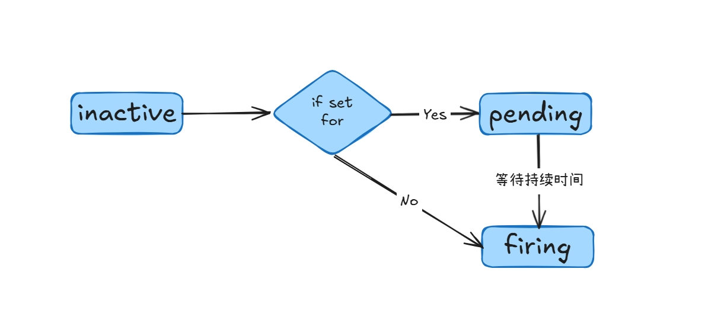
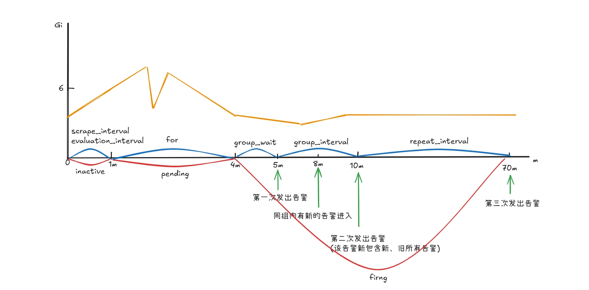

**Prometheus + Alertmanager** 作为云原生领域主流监控告警系统，**Prometheus** 主要采集监控数据，计算告警规则将告警信息发给 **Alertmanager**，**Alertmanager** 接收到告警信息，根据一系列的流程处理，最终将告警发送给对应的告警通知源。

接下来详细讲解一个监控指标从捕获数据到最终发送至告警源的全过程，包括配置、原理，不包含 **Prometheus + Alertmanager** 部署，部署可参考 [prometheus-operator](https://prometheus-operator.dev/docs/getting-started/installation/)

## Prometheus 配置

**Prometheus** 基本配置模块如下：

```yaml
global:
  scrape_interval:     15s
  evaluation_interval: 15s

rule_files:
  # - "first.rules"
  # - "second.rules"

scrape_configs:
  - job_name: prometheus
    static_configs:
      - targets: ['localhost:9090']
```

上面这个配置文件中包含了3个模块：`global`、`rule_files` 和 `scrape_configs`。

- `global` 模块控制 `Prometheus Server` 的全局配置：
- `rule_files`：指定了报警规则所在的位置，**Prometheus** 可以根据这个配置加载规则，用于生成新的时间序列数据或者报警信息，当前我们没有配置任何报警规则。
- `scrape_configs` 用于控制 **Prometheus** 监控哪些资源。

### scrape_interval

`scrape_interval` 是 Prometheus 的配置项，Prometheus 定期间隔 `scrape_interval` 去采集各个指标数据，如果单个指标规则不配置该参数，使用全局配置

```yaml
global:
  # 每隔 1m 采集所有数据
  scrape_interval: 1m
  scrape_timeout: 10s
  evaluation_interval: 1m
  external_labels:
    prometheus: kubesphere-monitoring-system/k8s
    prometheus_replica: prometheus-k8s-0
```

也可单独为某个指标配置采集间隔

```yaml
scrape_configs:
- job_name: 42c68d702a2241fbb6a157c1ff560457/etcd/0
  honor_timestamps: true
  # 定义单个指标的采集间隔
  scrape_interval: 1m
  scrape_timeout: 10s
  metrics_path: /metrics
  scheme: http
  follow_redirects: true
  relabel_configs:
  - source_labels: [__meta_kubernetes_service_label_app_kubernetes_io_name]
    separator: ;
    regex: etcd
    replacement: $1
    action: keep
```

### evaluation_interval

`evaluation_interval` 也是 Prometheus 的配置项，Prometheus 定期去计算评估监控规则，如果规则触发，则将告警信息发给 Alertmanager。

定期采集和定期评估计算是两个协程工作的，两者没有先后执行顺序和关联。

`evaluation_interval` 只能全局配置

```yaml
global:
  scrape_interval: 1m
  scrape_timeout: 10s
	# 每隔 1m 计算所有监控规则
  evaluation_interval: 1m
  external_labels:
    prometheus: kubesphere-monitoring-system/k8s
    prometheus_replica: prometheus-k8s-0
```

### for

`for` 是每个监控规则对应指标的持续时间，评估等待时间（**Pending Duration**），用于表示只有当触发条件持续一段时间后才发送告警，避免毛刺现象导致的误报。

`for` 主要用于降噪，很多类似响应时间这样的指标都是有抖动的，通过指定 `for`，我们可以过滤掉这些瞬时抖动，可以让我们能够把注意力放在真正有持续影响的问题上。

所以有的情况下计算我们的监控图表上面已经有部分指标达到了告警的阈值了，但是并不一定会触发告警规则，比如我们上面的规则中，设置的是 1 分钟的持续时间，对于下图这种情况就不会触发告警，因为持续时间太短，没有达到一分钟：


在 Prometheus 中，定义每个监控规则都有三种状态：

- inactive：指标初始状态，即未达到告警阈值
- pending：指标达到告警阈值，但是还在持续时间内，即该告警规则设置了 `for` 参数
- firing：指标达到告警阈值，且到达持续时间，将告警信息发送给 Alertmanager。当然没有设置 `for` 参数，那么直接从 `inactive` 变成 `firing`

状态流转过程如下：



## Alertmanger 配置

Alertmanager 配置模块如下：

```yaml
"global":
  "resolve_timeout": "5m"
"inhibit_rules":
- "equal":
  - "namespace"
  - "alertname"
  "source_match":
    "severity": "critical"
  "target_match_re":
    "severity": "warning|info"
"receivers":
- "name": "prometheus"
  "webhook_configs":
  - "url": "http://notification-manager-svc.kubesphere-monitoring-system.svc:19093/api/v2/alerts"
"route":
  "group_by":
  - "namespace"
  - "alertname"
  - "rule_id"
  "group_interval": "5m"
  "group_wait": "30s"
  "receiver": "Default"
  "repeat_interval": "5m"
  "routes":
  - "match":
      "alerttype": "metric"
      "name": "xxs"
    "receiver": "prometheus"
    "repeat_interval": "12h"
		"group_interval": "10m"
	  "group_wait": "60s"
```

### group_wait

AlertManager 为了避免连续发送类似的告警通知，可以将相关告警分到同一组中进行告警。分组机制可以将详细的告警信息合并成一个通知，在某些情况下，比如由于系统宕机导致大量的告警被同时触发，在这种情况下分组机制可以将这些被触发的告警合并为一个告警通知，避免一次性接受大量的告警通知，通过配置 `group_by` 分组：

```yaml
# 通过监控规则中配置的 alertname、job 进行分组
group_by: ["alertname", "job"]
```

`group_wait` 是 Alertmanager 配置，当一个新的报警分组被创建后，需要等待至少 `group_wait` 时间来初始化告警。这样实际上就缓冲了从 Prometheus 发送到 AlertManager 的告警，将告警按相同的标签分组，而不必全都发送。`group_wait` 可全局配置：

```yaml
"route":
	# 所有组内第一次告警都等待 30s
  "group_wait": "30s"
```

也可以单独在每个 route 里配置，即单个 group 下自定义 `group_wait` ：

```yaml
"route":
  "group_wait": "30s"
  "routes":
  - "match":
      "alerttype": "metric"
      "name": "xxs"
    "receiver": "prometheus"
    "repeat_interval": "12h"
		"group_interval": "10m"
    # 覆盖全局 group_wait 
	  "group_wait": "60s"
```

### group_interval

等待 `group_wait` 后，该组的第一次告警发出，每隔 `group_interval` 后，检测该组内是否有新的告警，如果还是旧的告警，即继续下一个 `group_interval` 周期；如果该组内进入新的告警，就在 `group_interval` 后将该组的新、旧告警一并发出。

意义是控制同组内有更新告警的发送频率

`group_interval` 全局配置如下：

```yaml
"route":
  # 所有组的 group_interval 为 5m
  "group_interval": "5m"
  
```

为单个 group 配置 `group_interval`

```yaml
"route":
  "group_interval": "5m"
  "routes":
  - "match":
      "alerttype": "metric"
      "name": "xxs"
    "receiver": "prometheus"
    "repeat_interval": "12h"
		# 覆盖全局 group_interval 
		"group_interval": "10m"
	  "group_wait": "60s"
```

### repeat_interval

`repeat_interval` 也是 Alertmanager 的配置参数，该参数主要是用于组内已经发送出的告警信息，隔 `repeat_interval` 重复发送。

一般不同类型的告警业务改参数配置不太一样，对于比较重要紧急的可以将改参数设置稍微小点，对于不太紧急的可以设置稍微大点。

意义是控制同组内告警的发送频率

`repeat_interval` 全局配置如下：

```yaml
"route":
  # 所有组的 repeat_interval 为 12h
  "repeat_interval": "12h"
  
```

为单个 group 配置 `repeat_interval`

```yaml
"route":
  "repeat_interval": "12h"
  "routes":
  - "match":
      "alerttype": "metric"
      "name": "xxs"
    "receiver": "prometheus"
    # 覆盖全局 repeat_interval 
    "repeat_interval": "24h"
		"group_interval": "10m"
	  "group_wait": "60s"
```

### group_interval、repeat_interval 区别

`group_interval、repeat_interval` 都作用与某个 group，控制同 group 内告警信息的发送频率，且两者都是以同组最后一次告警发送的时间，但是两者的区别较大：

Alertmanager 每隔 `group_interval` 后会判断该组内是否有新的告警进入，如果有则将该组所有告警一并发出，如果没有进入下个 `group_interval` 周期，对于 `repeat_interval`， Alertmanager 每隔 `repeat_interval` 会将组内所有告警信息一并发送

所以说 `group_interval` 主要控制组内有更新告警信息的告警频率，`repeat_interval` 后，组内不管是否有新告警，都会将组内所有告警发出

一般情况下，`repeat_interval` 要大于 `group_interval`

## 示例

接下来通过一个示例分析一个告警时间轴以及是如何发送的，例如分析`一个节点的内存可用量 < 6G` 即告警，下面是该监控规则的相关配置参数：

```yaml
scrape_interval: 1m
evaluation_interval: 1m
for: 3m
group_wait: 1m
group_interval: 5m
repeat_interval: 1h
```

通过以上配置，可以得到该监控规则从触发阈值到发出告警的时间轴发生过程：



> 1、Alertmanager 具有去重功能，也就是相同的告警在进入 Alertmanager group 后，会进入去重阶段，防止同一组内出现相同的告警

2、`group_wait` 只会作用该组的第一次告警前

3、`group_interval、repeat_interval` 都是基于最后一次告警的发送时间进行时间计算的
>

## 总结

一条监控信息大致经历以下过程会发送到对应的告警通知源：

- Prometheus 每隔 `scrape_interval` 抓取指标数据，以时序结构保存到后端存储
- Prometheus 每隔 `evaluation_interval` 计算监控规则
    - 判断是否达到告警阈值，如果达到
        - 判断是否配置持续时间 ( `for` )，如果配置，等 `for` 结束，将告警信息发送至 Alertmanager
        - 如果没配置 `for`，直接将告警信息发送至 Alertmanager
    - 如果没达到告警阈值，进入下个计算周期
- Alertmanager 定期从自身维护的告警队列里获取告警信息，判断该告警是否属于某个已存在的 group
    - 如果不属于已存在的 group，那么创建新的 group，等待 `group_wait` 后，将 `group_wait` 内进入该组的所有告警一并发出；
    - 如果属于已存在的 group，判断该组是否已发送过告警
        - 如果没有发送过告警，就等待 `group_wait` 一并发送
        - 如果发送过告警，等待 `group_interval` 一并发送
- Alertmanager 每隔 `group_interval` 都会检测 group 内是否进入新的告警
    - 有新的告警一并发送
    - 没有新告警，进入下个 `group_interval` 周期
- Alertmanager 每隔 `repeat_interval` 会将 group 内所有告警一并发出