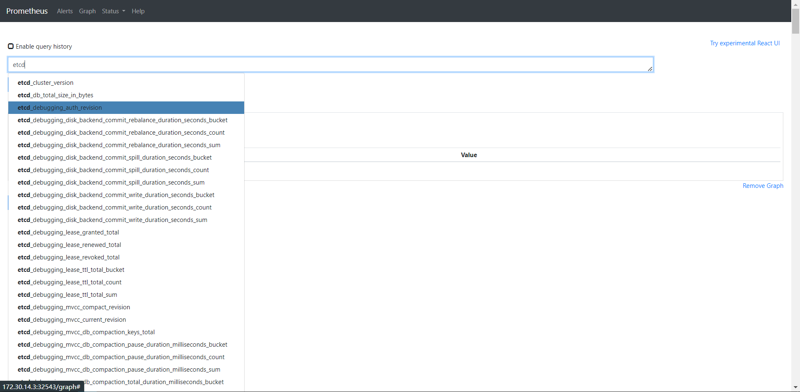
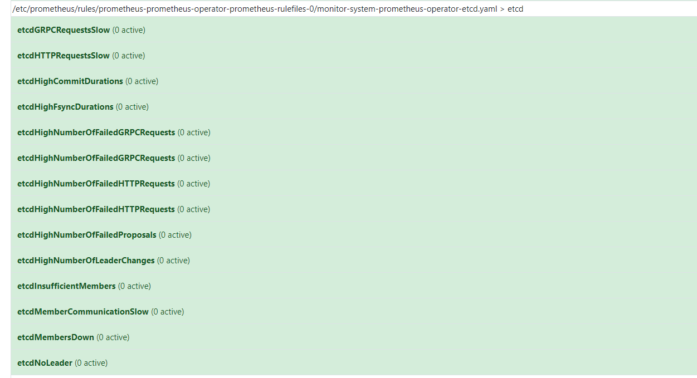
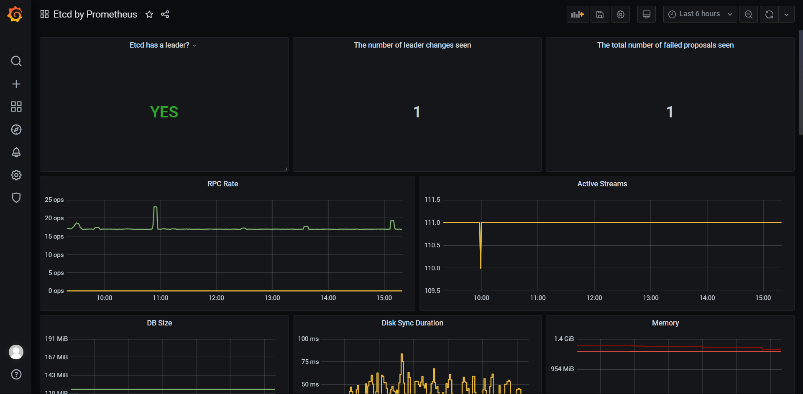
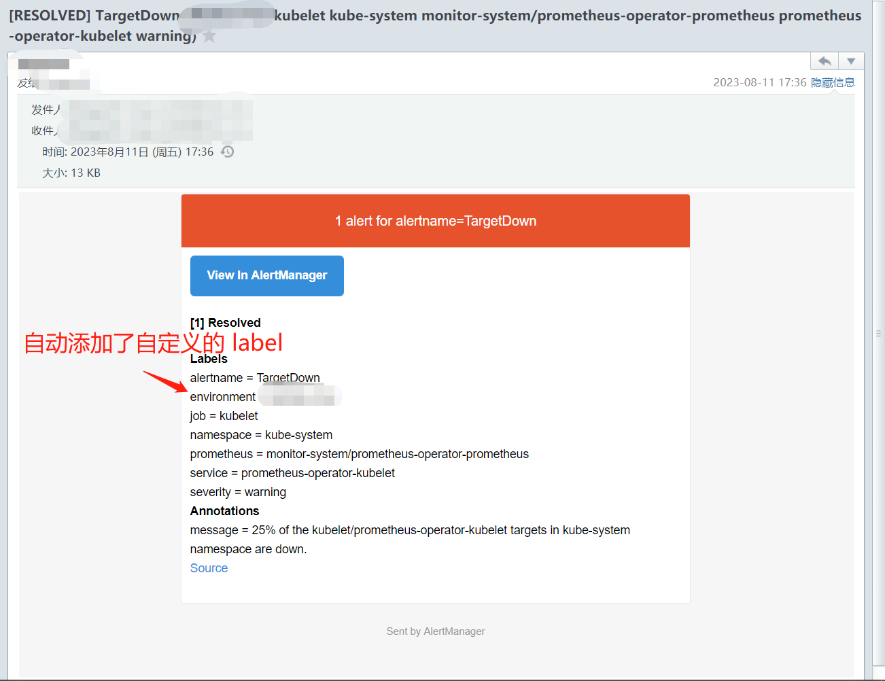

## 简介

Prometheus Operator 可以方便、简洁部署、运维 Prometheus，同时通过声明式 API 创建监控指标、告警规则等。

有以下功能：

- 通过可配置方式部署 Prometheus、Alertmanager、Kube-state-metrics、Node-exporter、Grafana
- 本身自身默认自带很多监控项，比如 Etcd、Kube-apiserver、Node、Network
- 默认自带很多常用告警规则
- 默认自带很多常用 Grafana 监控面板
- 部署完之后，可通过声明式 API 创建监控项、告警规则等

## 安装

1、添加 prometheus-community helm repo

```bash
$ helm repo add prometheus-community https://prometheus-community.github.io/helm-charts
```

2、下载对应 prometheus-operator 版本，这里以 9.3.1 为例

```bash
$ helm fetch prometheus-community/prometheus-operator --version 9.3.1
```

3、解压后打开该项目，prometheus-operator 该项目有很多镜像，安装的时候都需要从外网下载，有的还需要翻墙拉取。这里建议提前把镜像拉下来，放到本地镜像仓库。

## 配置

Prometheus 配置项比较多，需要根据自身 K8S 集群情况更改一些配置，这里以 kubeadm 部署的 v1.19.8 为例。

这里以监控 Etcd-cluster 为例。

### 配置 Etcd 证书

对于 etcd 集群一般情况下，为了安全都会开启 https 证书认证的方式，所以要想让 Prometheus 访问到 etcd 集群的监控数据，就需要提供相应的证书校验。

1、etcd 证书在 /etcd/kubernetes/pki/etcd 下，所以首先我们将需要使用到的证书通过 secret 对象保存到集群中去：(在 etcd 运行的节点)

```bash
$ kubectl -n monitor-system create secret generic etcd-certs --from-file=/etc/kubernetes/pki/etcd/healthcheck-client.crt --from-file=/etc/kubernetes/pki/etcd/healthcheck-client.key --from-file=/etc/kubernetes/pki/etcd/ca.crt
```

2、prometheus 配置 etcd 证书，prometheus 通过上面的 secret 将证书挂载到容器内进而使用。通过 valus.yaml 配置

```yaml
kubeEtcd:
  serviceMonitor:
    ## Scrape interval. If not set, the Prometheus default scrape interval is used.
    ##
    interval: ""
    scheme: https
    insecureSkipVerify: false
    serverName: ""
    
    caFile: "/etc/prometheus/secrets/etcd-certs/ca.crt"
    certFile: "/etc/prometheus/secrets/etcd-certs/healthcheck-client.crt"
    keyFile: "/etc/prometheus/secrets/etcd-certs/healthcheck-client.key"
```

2、注意上面配置的证书路径是 prometheus 容器内的路径，所以还需要通过 secret 将 etcd 真正的证书路径挂载到容器内，同样通过 values.yaml 配置

```yaml
prometheusSpec:
  secrets:
    - etcd-certs3
```

### 配置告警

这里以邮件告警为例：

配置 values.yaml

```yaml
alertmanager:
  config:
    global:
      resolve_timeout: 5m
      # 发送者邮箱
      smtp_from: '发送者邮箱'
      # 发送邮箱服务器
      smtp_smarthost: '发件服务器:端口'
      # 发送者邮箱用户名
      smtp_auth_username: '发送者邮箱用户名'
      # 发送者邮箱密码
      smtp_auth_password: '发送者邮箱密码'
      smtp_require_tls: false
    route:
      group_by: [ 'alertname' ]
      group_wait: 5s
      group_interval: 5s
      repeat_interval: 5m
      receiver: 'email'
    # 接收者信息
    receivers:
      - name: 'email'
        email_configs:
          - to: '接收者邮箱'
            send_resolved: true
```

### 添加额外标签

alertmanager 发送告警时，根据 label 信息来获取告警模板的信息。如果想要丰富告警模板，比如添加了自定义的字段，比如告警时需要说明是哪个环境，那么可以自定义 label，通过配置 values.yaml。

```yaml
prometheusSpec:
  externalLabels:
    environment: prod
```

## 部署

1、部署 prometheus-operator

```yaml
$ helm install prometheus-operator ./prometheus-operator -n monitor-system --create-namespace
```

根据以上配置，prometheus-operator 运行后会部署 prometheus、grafana、kube-state-metrics、node-exporter、alertmanager。

同时默认生成 etcd、kube-apiserver、node 等常用监控项

2、查看 prometheus server web

3、查看 grafana

4、测试告警功能

## etcd 监控指标

prometheus-operator 默认自带了常用的 Etcd-cluster 的监控项、告警规则、grafana 面板，基本上部署完成即可正常使用。

### 监控项：



### 告警规则：

prometheus-operator 默认自带了 etcd-cluster 的告警规则，有如下：



### Grafana 面板

prometheus-operator 自带的 etcd grafana 面板并不是最全面的，建议使用 3070.json

 

### 告警效果

如果不配置告警模板，alertmanager 使用默认的告警模板，如下：



## 总结

Prometheus-operator 屏蔽了 Prometheus 和 Alertmanager 的复杂配置，使用和部署非常简洁，方便。

这篇只是简单讲解了 Prometheus 的部署和使用，其很多功能还没有说明，后面可单独讲解~