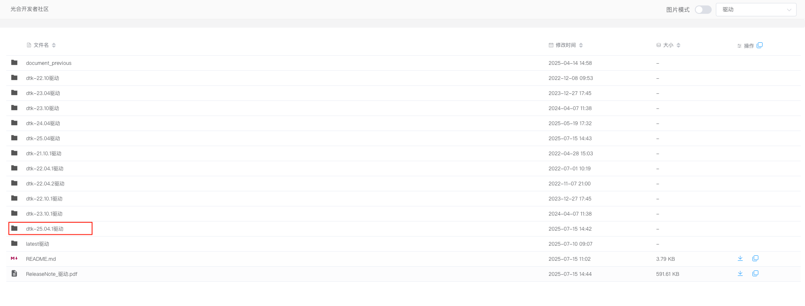
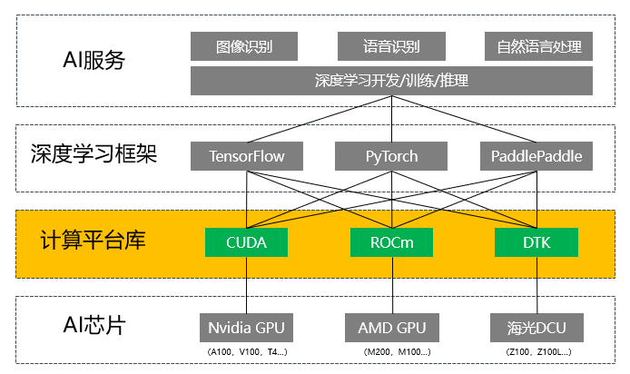
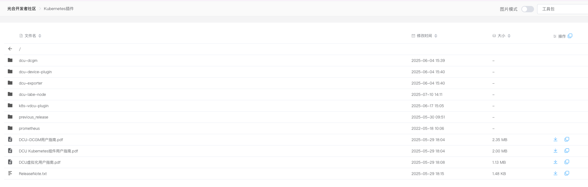
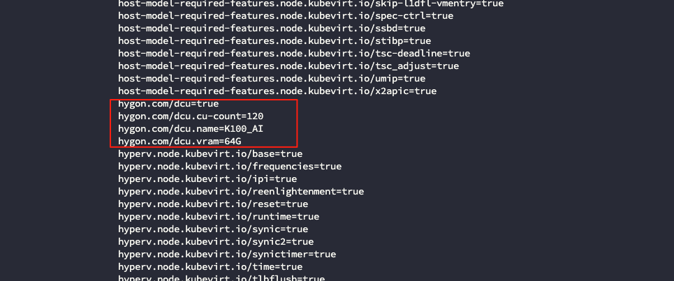
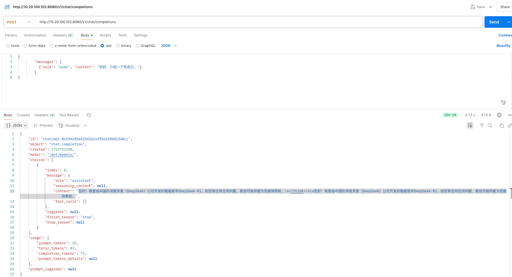
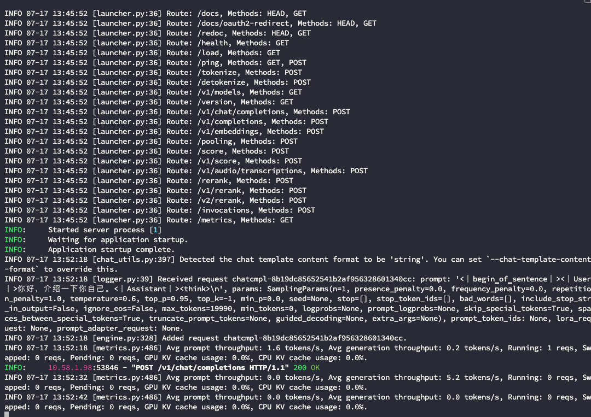
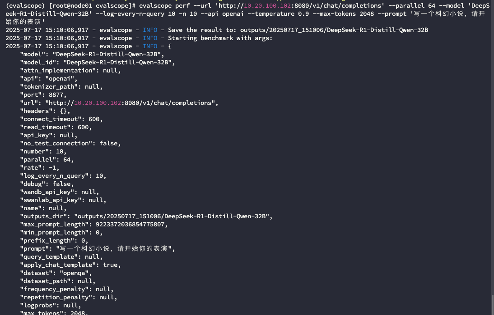

## 简介

DCU 指的是深度计算处理器（Deep-learning Computing Unit），是[海光信息](https://xueqiu.com/S/SH688041?from=status_stock_match) GPU 架构的适用于计算密集型任务加速的协处理器产品。这个 DCU 产品的有趣在于，它全面兼容 ROCm GPU计算生态，由此对齐 CUDA 生态、工具链和开发者环境等，使得海光 DCU 成为快速上市的通用加速器产品。

## 环境

- CPU：Hygon C86 7490 64-core Processor
- DCU：K100_AI * 8
- 系统：UOS Server 20
- 内核：4.19.90-2403.3.0.0270.87.uel20.x86_64
- K8S：v1.28.8

## 部署 DCU 驱动

确定当前机器 DCU 是否正常挂载

```bash
$ lspci | grep -i -E "disp|co-pro"
07:00.0 Co-processor: Chengdu C-3000 IC Design Co., Ltd. KONGMING (rev 01)
0a:00.0 Co-processor: Chengdu C-3000 IC Design Co., Ltd. KONGMING (rev 01)
0f:00.0 Co-processor: Chengdu C-3000 IC Design Co., Ltd. KONGMING (rev 01)
16:00.0 Co-processor: Chengdu C-3000 IC Design Co., Ltd. KONGMING (rev 01)
1d:00.0 Co-processor: Chengdu C-3000 IC Design Co., Ltd. KONGMING (rev 01)
20:00.0 Co-processor: Chengdu C-3000 IC Design Co., Ltd. KONGMING (rev 01)
25:00.0 Co-processor: Chengdu C-3000 IC Design Co., Ltd. KONGMING (rev 01)
2c:00.0 Co-processor: Chengdu C-3000 IC Design Co., Ltd. KONGMING (rev 01)
```

从[官方社区](https://download.sourcefind.cn:65024/6/main/)下载对应 DCU 的驱动版本。

| **驱动版本** | **支持硬件** | **推荐DTK版本** |
| --- | --- | --- |
| rock-4.0-23-5.6.25 | Z100/Z100L | 21.04/21.10/22.04 |
| rock-4.5.2-5.11.40 | Z100/Z100L | 22.04/22.10/23.04 |
| rock-5.2.0-5.16.18 | Z100/Z100L | 22.10/23.04 |
| rock-5.2.0-5.16.29 | Z100/Z100L/K100 | 23.04/23.10 |
| rock-5.7.1-6.2.26+ | Z100/Z100L/K100/K100-AI | 24.04/25.04 |
| rock-6.3.8+ | BW1000/K100-AI/K100/Z100L/Z100 | 25.04 |



安装依赖包

```bash
centos：yum install -y rpm-build gcc-c++ cmake automake elfutils-libelf-devel libdrm libdrm-devel pciutils
ubuntu：apt install -y gcc g++ cmake automake  libelf-dev libdrm_amdgpu1或libdrm-amdgpu1 libtinfo5 pciutils libdrm-dev
Centos：yum install -y kernel-devel-`uname -r` kernel-modules-extra 
ubuntu：apt install -y linux-headers-`uname -r` linux-modules-extra
```

安装驱动

```bash
安装流程
1) 下载驱动，下载地址：https://cancon.hpccube.com:65024/6/main
2）修改驱动权限 chmod +x rock*.run
3）安装驱动
./rock*.run
4）重启下驱动服务
systemctl restart hymgr

注意事项：
1）一些安装参数，可以通过./rock*.run -h 查看
2）安装新驱动，不用卸载之前的驱动，安装新驱动过程会卸载掉老驱动
3）安装过程中会遇到“Do you want to remove legacy hymgr config file? [Y/n]:”询问，选择yes会重新生成/etc/hymgr.cfg文件，选择no会保留该文件
4）在K100/K100-AI环境中会提示“Update vbios? [y/N]:”，第一次安装，建议选择更新vbios，然后重启物理机；后面安装驱动可以选择N。云计算场景，鉴于环境的稳定性需求，对物理节点重启有严格的要求，可以不选择更新vbios。
```

查看驱动有没有加载

```bash
#  6.2.x及以下的驱动
# lsmod |grep -E "hydcu|hycu"
hydcu                1435342  0 
hydcu_sched            34432  1 hydcu
hyttm                  61919  1 hydcu
hykcl                  46567  3 hydcu_sched,hydcu,hyttm
hy_extra               32140  3 hydcu_sched,hydcu,hykcl
amd_iommu_v2           18821  1 hydcu
drm_kms_helper        179394  2 hydcu,hykcl
drm                   429744  6 ttm,hydcu,hykcl,hyttm,drm_kms_helper

# 6.3.x及其以上的驱动
# lsmod |grep -E "hydcu|hycu"
hycu                 3371008  2                            
hydrm_ttm_helper       16384  1 hycu                                                                           
hycu_sched             45056  1 hycu                                                                                  
hyttm                  86016  2 hycu,hydrm_ttm_helper                                                                  
hykcl                  40960  5 hycu,hycu_sched,hyttm                                                                      
hydrm_buddy            20480  1 hycu                                                                                 
hy_extra               65536  2 hycu,hycu_sched                                                            
iommu_v2               20480  1 hycu                                                                                   
drm_kms_helper        266240  5 hycu,drm_vram_helper,ast                                                               
drm                   585728  11 drm_kms_helper,hycu,drm_vram_helper,ast,hydrm_buddy,hycu_sched,drm_ttm_helper,hydrm_ttm_helper,hyttm,ttm
```

查看 dcu 信息

```bash
# cd /opt/hyhal/bin; ./hy-smi

================================= System Management Interface ==================================
================================================================================================
HCU     Temp     AvgPwr     Perf     PwrCap     VRAM%      HCU%      Mode     
0       59.0C    114.0W     auto     400.0W     0%         0.0%      Normal   
1       61.0C    109.0W     auto     400.0W     0%         0.0%      Normal   
2       60.0C    106.0W     auto     400.0W     0%         0.0%      Normal   
3       59.0C    107.0W     auto     400.0W     0%         0.0%      Normal   
4       60.0C    118.0W     auto     400.0W     0%         0.0%      Normal   
5       62.0C    113.0W     auto     400.0W     0%         0.0%      Normal   
6       58.0C    106.0W     auto     400.0W     0%         0.0%      Normal   
7       58.0C    115.0W     auto     400.0W     0%         0.0%      Normal   
================================================================================================
======================================== End of SMI Log ========================================
```

> 1）新版本驱动依赖 cmake 版本要高于 3.2，gcc 版本要大于 7.3
> 
> 
> 2） kernel 版本要与 kernel-devel 版本一致
> 
> 3）6.2. *以前的驱动显示的模块名称是 hydcu，6.3.* 以后的驱动模块是 hycu。（变跟源于一些非人力因素）
> 
> 4） 6.3.* 驱动下，docker 调用时，推荐挂载 /sys/kernel/debug 路径，不然，容器内无法获取到 dcu 进程信息
> 

可以通过 `./hy-smi —help` 查看命令行帮助信息，例如查看该芯片的显存大小：

```bash
$ ./hy-smi --showmemavailable

================================= System Management Interface ==================================
================================================================================================
HCU[0]          : Available memory size (MiB): 65438
HCU[1]          : Available memory size (MiB): 65438
HCU[2]          : Available memory size (MiB): 65438
HCU[3]          : Available memory size (MiB): 65438
HCU[4]          : Available memory size (MiB): 65438
HCU[5]          : Available memory size (MiB): 65438
HCU[6]          : Available memory size (MiB): 65438
HCU[7]          : Available memory size (MiB): 65438
================================================================================================
======================================== End of SMI Log ========================================
```

可以通过 `hy-smi -a` 查看全部 dcu 信息，也可以看到芯片的型号

```bash
$ hy-smi -a
......
HCU[0]          : Card Series:           K100_AI
HCU[0]          : Card Vendor:           Chengdu C-3000 IC Design Co., Ltd.
HCU[1]          : Card Series:           K100_AI
HCU[1]          : Card Vendor:           Chengdu C-3000 IC Design Co., Ltd.
HCU[2]          : Card Series:           K100_AI
HCU[2]          : Card Vendor:           Chengdu C-3000 IC Design Co., Ltd.
HCU[3]          : Card Series:           K100_AI
HCU[3]          : Card Vendor:           Chengdu C-3000 IC Design Co., Ltd.
HCU[4]          : Card Series:           K100_AI
HCU[4]          : Card Vendor:           Chengdu C-3000 IC Design Co., Ltd.
HCU[5]          : Card Series:           K100_AI
HCU[5]          : Card Vendor:           Chengdu C-3000 IC Design Co., Ltd.
HCU[6]          : Card Series:           K100_AI
HCU[6]          : Card Vendor:           Chengdu C-3000 IC Design Co., Ltd.
HCU[7]          : Card Series:           K100_AI
HCU[7]          : Card Vendor:           Chengdu C-3000 IC Design Co., Ltd.
......
```

## 部署 DTK

DTK（DCU ToolKit）是海光的开放软件平台，封装了 ROCm 生态相关组件，同时基于 DCU 的硬件进行优化并提供完整的软件工具链，对标 CUDA 的软件栈，为开发者提供运行、编译、调试和性能分析等功能。



通过[官方社区](https://download.sourcefind.cn:65024/1/main)下载并安装。

如果通过容器去使用 DCU 芯片，可以不需要手动在服务器上安装 DTK，因为海光提供的容器镜像都会封装 DTK。

## K8S 适配

DCU Kubernetes 组件用于支持在 k8s 上使用及监控 DCU。通过 DCU k8s 组件，用户可以在 Kubernetes 集群中灵活分配、管理和监控 DCU 或虚拟 DCU（简称 vDCU）
资源。

通过[官方社区](https://download.sourcefind.cn:65024/5/main/Kubernetes%E6%8F%92%E4%BB%B6)下载对应镜像和部署文件。



### 部署 **DCU-Label-Node**

以 DaemonSet 的 形 式 部 署 在Kubernetes 集群上。该组件运行时，将检查节点上是否存在 DCU，若节点存在 DCU 将自动创建节点标签来描述 DCU 信息。

部署命令如下：

```bash
$ kubectl apply -f k8s-dcu-label-node.yaml
$ kubectl get pod -n kube-system -owide | grep dcu-label-node
```

DCU-Label-Node 组件运行时，将检查节点上 DCU 的状态，并在确认配置了 DCU的节点上，创建以下标签来描述 DCU 信息。

| 标签 | 类型 | 描述 |
| --- | --- | --- |
| [hygon.com/dcu](http://hygon.com/dcu) | string | 若节点存在 DCU 设备，[hygon.com/dcu] 标签取值为“true”；否则 [hygon.com/dcu](http://hygon.com/dcu) 为前缀的标签均不自动生成。 |
| [hygon.com/dcu.name](http://hygon.com/dcu.name) | string | DCU 型号如：[hygon.com/dcu.name=K100_AI](http://hygon.com/dcu.name=K100_AI) |
| [hygon.com/dcu.cu-count](http://hygon.com/dcu.cu-count) | string | DCU 的 CU 数量如：[hygon.com/dcu.cu-count=120](http://hygon.com/dcu.cu-count=120) |
| [hygon.com/dcu.vram](http://hygon.com/dcu.vram) | string | DCU 的显存容量如：[hygon.com/dcu.vram=64G](http://hygon.com/dcu.vram=64G) |

> 备注： DCU 信 息 标 签 [hygon.com/dcu.name](http://hygon.com/dcu.name) 、 [hygon.com/dcu.cu-count](http://hygon.com/dcu.cu-count) 、[hygon.com/dcu.vram](http://hygon.com/dcu.vram) 默认会自动生成，用户可以通过 yaml 以启动参数的形式开
启或关闭。
> 

可以通过查看 DCU 节点 k8s 描述信息确认 DCU 标签是否设置成功：

```bash
$ kubectl describe node worker1
```


### 部署 DCU-Device-Plugin

负责管理 Kubernetes 集群中的 DCU 设备资源分配。它通过 Kubernetes 的设备插件框架（Device Plugin Framework）将 DCU 设备暴露给 Pod，使应用程序能够直接使用 DCU 加速计算任务。

部署命令如下：

```bash
$ kubectl apply -f k8s-dcu-plugin.yaml
$ kubectl get pod -n kube-system -owide | grep dcu-device-plugin
```

DCU-Device-Plugin 向 k8s 集群注册的 DCU 资源名为 [hygon.com/dcu](http://hygon.com/dcu%EF%BC%8C%E7%94%A8%E6%88%B7%E5%8F%AF%E4%BB%A5), 通过查看 DCU 节点 k8s 资源详情确认 DCU 资源是否注册成功：

```bash
$ kubectl describe node ha-worker-2
```



> DCU 芯片在于 K8S 适配时，不需要像 nvidia、ascend 那样安装对应的容器运行时，例如 nvidia 需要安装 nvidia-docker-runtime
> 

### 部署 **DCU-Exporter**

提供 DCU 设备的监控指标，支持 Prometheus 集成。通过 DCU-Exporter，用户可以实时监控 DCU 的温度、功耗、显存使用率等关键指标，确保设备的健康运行。

### 部署 **vDCU-Plugin**

实现 vDCU 在 Kubernetes 集群中的资源分配，支持静态配置 vDCU 与动态切分 vDCU 两种方案。通过 vDCU-Plugin，用户可以将物理 DCU 设备划分为多个 vDCU，从而更灵活地分配计算资源，满足不同应用场景的需求。

**vDCU-Plugin 与** DCU-Device-Plugin 部署其中一个就行

## 部署 DeepSeek 32B

部署 Deepseek 32B 模型非量化版本需要约 1.3TB 显存

先从[魔搭社区](https://modelscope.cn/models)下载对应模型，从[海光社区](https://sourcefind.cn/#/image/dcu/vllm?activeName=overview)下载 vllm 镜像，该镜像里封装了海光 DCU 芯片 dtk 软件平台。通过以下 yaml 部署 DeepSeek 32B：

```yaml
apiVersion: apps/v1
kind: Deployment
metadata:
  name: deepseek-vllm
  labels:
    app: deepseek-vllm
spec:
  replicas: 1
  selector:
    matchLabels:
      app: deepseek-vllm
  template:
    metadata:
      labels:
        app: deepseek-vllm
    spec:
      hostNetwork: true
      hostIPC: true
      securityContext:
        fsGroup: 44  # video group ID (usually 44, check with `getent group video`)
      containers:
        - name: vllm-container
          image: image.sourcefind.cn:5000/dcu/admin/base/vllm:0.8.5-ubuntu22.04-dtk25.04.1-rc5-das1.6-py3.10-20250711
          args:
            - vllm
            - serve
            - --model=/mnt/models/
            - --served-model-name=DeepSeek-R1-Distill-Qwen-32B
            - --dtype=auto 
            - --trust-remote-code 
            - --gpu-memory-utilization=0.92 
            - --tensor-parallel-size=8
            - --max-num-seqs=32 
            - --max-model-len=20000 
            - --enforce-eager
            - --port=8080
          stdin: true
          tty: true
          resources:
            limits:
              cpu: "32"
              memory: 65536M
              hygon.com/dcu: "4"
            requests:
              cpu: "32"
              memory: 65536M
              hygon.com/dcu: "4"
          securityContext:
            privileged: false
            capabilities:
              add: ["SYS_PTRACE"]
            seccompProfile:
              type: Unconfined
            allowPrivilegeEscalation: true
          volumeMounts:
            - name: shm
              mountPath: /dev/shm
            - name: hyhal
              mountPath: /opt/hyhal
            - name: models
              mountPath: /mnt/models
            - name: dev-kfd
              mountPath: /dev/kfd
            - name: dev-mkfd
              mountPath: /dev/mkfd
            - name: dev-dri
              mountPath: /dev/dri
      volumes:
        - name: shm
          emptyDir:
            medium: Memory
            sizeLimit: 16Gi
        - name: hyhal
          hostPath:
            path: /opt/hyhal
        - name: models
          hostPath:
            path: /root/sfeng/DeepSeek-R1-Distill-Qwen-32B
        - name: dev-kfd
          hostPath:
            path: /dev/kfd
            type: CharDevice
        - name: dev-mkfd
          hostPath:
            path: /dev/mkfd
            type: CharDevice
        - name: dev-dri
          hostPath:
            path: /dev/dri
```

确认 pod 状态为 Ready

```bash
$ kubectl get pods
NAME                                                    READY   STATUS    RESTARTS      AGE
dcu-k100ai-vllm-deepseek32-predictor-7f98c686fc-phts4   1/1     Running   0             5m59s
```

查看 pod 内 DCU 卡使用情况

```bash
$ kubectl exec -it dcu-k100ai-vllm-deepseek32-predictor-699874d959-kmrhz hy-smi
kubectl exec [POD] [COMMAND] is DEPRECATED and will be removed in a future version. Use kubectl exec [POD] -- [COMMAND] instead.

================================= System Management Interface ==================================
================================================================================================
HCU     Temp     AvgPwr     Perf     PwrCap     VRAM%      HCU%      Mode     
0       59.0C    114.0W     auto     400.0W     91%        0.0%      Normal   
1       61.0C    109.0W     auto     400.0W     90%        0.0%      Normal   
2       60.0C    105.0W     auto     400.0W     90%        0.0%      Normal   
3       59.0C    107.0W     auto     400.0W     90%        0.0%      Normal   
4       59.0C    118.0W     auto     400.0W     90%        0.0%      Normal   
5       61.0C    113.0W     auto     400.0W     90%        0.0%      Normal   
6       58.0C    106.0W     auto     400.0W     90%        0.0%      Normal   
7       58.0C    116.0W     auto     400.0W     90%        0.0%      Normal   
================================================================================================
======================================== End of SMI Log ========================================
```

通过 postman 请求该推理服务，并查看日志





## 评测模型

使用魔搭社区开源的 [EvalScope](https://evalscope.readthedocs.io/zh-cn/latest/get_started/introduction.html) 模型评测与性能基准测试框架。

### 安装 EvalScope

使用 conda 来管理环境，并使用 pip 安装依赖。这里安装 python，conda 的步骤。

创建 conda 环境 (可选)：

```bash
# 建议使用 python 3.10
conda create -n evalscope python=3.10

# 激活conda环境
conda activate evalscope
```

pip 安装依赖：

```bash
# 可使用国内 pip 源安装，-i https://pypi.tuna.tsinghua.edu.cn/simple
pip install evalscope                # 安装 Native backend (默认)
# 额外选项
pip install 'evalscope[opencompass]'   # 安装 OpenCompass backend
pip install 'evalscope[vlmeval]'       # 安装 VLMEvalKit backend
pip install 'evalscope[rag]'           # 安装 RAGEval backend
pip install 'evalscope[perf]'          # 安装 模型压测模块 依赖
pip install 'evalscope[app]'           # 安装 可视化 相关依赖
pip install 'evalscope[all]'           # 安装所有 backends (Native, OpenCompass, VLMEvalKit, RAGEval)
```

### 执行推理性能压测

```bash
$ evalscope perf \ 
    --url 'http://10.20.100.102:8080/v1/chat/completions' \ # 模型访问地址
    --parallel 64 --model 'DeepSeek-R1-Distill-Qwen-32B' \ # 模型 id，启动时指定
    --log-every-n-query 10 \  # 每n个查询记录日志，默认为10
    -n 10 \ # 发出的请求的总数量，可以传入多个值，用空格隔开（需与parallel一一对应）；默认为1000。
    --api openai \ # 则使用支持OpenAI的API，需要提供--url参数
    --temperature 0.9 \  # 采样温度，默认为0。
    --max-tokens 2048 \ # 可以生成的最大token数量。
    --prompt '写一个科幻小说，请开 始你的表演'
```



### 评测结果

```bash
# evalscope perf --url 'http://10.20.100.102:8080/v1/chat/completions' --parallel 64 --model 'DeepSeek-R1-Distill-Qwen-32B' --log-every-n-query 10 -n 10 --api openai --temperature 0.9 --max-tokens 2048 --prompt '写一个科幻小说，请开 始你的表演'
2025-07-17 15:10:06,917 - evalscope - INFO - Save the result to: outputs/20250717_151006/DeepSeek-R1-Distill-Qwen-32B
2025-07-17 15:10:06,917 - evalscope - INFO - Starting benchmark with args: 
2025-07-17 15:10:06,917 - evalscope - INFO - {
    "model": "DeepSeek-R1-Distill-Qwen-32B",
    "model_id": "DeepSeek-R1-Distill-Qwen-32B",
    "attn_implementation": null,
    "api": "openai",
    "tokenizer_path": null,
    "port": 8877,
    "url": "http://10.20.100.102:8080/v1/chat/completions",
    "headers": {},
    "connect_timeout": 600,
    "read_timeout": 600,
    "api_key": null,
    "no_test_connection": false,
    "number": 10,
    "parallel": 64,
    "rate": -1,
    "log_every_n_query": 10,
    "debug": false,
    "wandb_api_key": null,
    "swanlab_api_key": null,
    "name": null,
    "outputs_dir": "outputs/20250717_151006/DeepSeek-R1-Distill-Qwen-32B",
    "max_prompt_length": 9223372036854775807,
    "min_prompt_length": 0,
    "prefix_length": 0,
    "prompt": "写一个科幻小说，请开始你的表演",
    "query_template": null,
    "apply_chat_template": true,
    "dataset": "openqa",
    "dataset_path": null,
    "frequency_penalty": null,
    "repetition_penalty": null,
    "logprobs": null,
    "max_tokens": 2048,
    "min_tokens": null,
    "n_choices": null,
    "seed": 0,
    "stop": null,
    "stop_token_ids": null,
    "stream": true,
    "temperature": 0.9,
    "top_p": null,
    "top_k": null,
    "extra_args": {}
}
2025-07-17 15:10:07,660 - evalscope - INFO - Test connection successful.
2025-07-17 15:10:07,660 - evalscope - INFO - Save the data base to: outputs/20250717_151006/DeepSeek-R1-Distill-Qwen-32B/benchmark_data.db
Processing:  90%|█████████████████████████████████████████████████████████████████████████████▍        | 9/10 [01:21<00:05,  5.59s/it]2025-07-17 15:11:32,377 - evalscope - INFO - {
  "Time taken for tests (s)": 84.7137,
  "Number of concurrency": 64,
  "Total requests": 10,
  "Succeed requests": 10,
  "Failed requests": 0,
  "Output token throughput (tok/s)": 144.7935,
  "Total token throughput (tok/s)": 146.3281,
  "Request throughput (req/s)": 0.118,
  "Average latency (s)": 65.2861,
  "Average time to first token (s)": 0.5247,
  "Average time per output token (s)": 0.0528,
  "Average input tokens per request": 13.0,
  "Average output tokens per request": 1226.6,
  "Average package latency (s)": 0.0528,
  "Average package per request": 1226.6
}
Processing: 100%|█████████████████████████████████████████████████████████████████████████████████████| 10/10 [01:24<00:00,  8.47s/it]
2025-07-17 15:11:32,423 - evalscope - INFO - 
Benchmarking summary:
+-----------------------------------+-----------+
| Key                               |     Value |
+===================================+===========+
| Time taken for tests (s)          |   84.7137 |
+-----------------------------------+-----------+
| Number of concurrency             |   64      |
+-----------------------------------+-----------+
| Total requests                    |   10      |
+-----------------------------------+-----------+
| Succeed requests                  |   10      |
+-----------------------------------+-----------+
| Failed requests                   |    0      |
+-----------------------------------+-----------+
| Output token throughput (tok/s)   |  144.793  |
+-----------------------------------+-----------+
| Total token throughput (tok/s)    |  146.328  |
+-----------------------------------+-----------+
| Request throughput (req/s)        |    0.118  |
+-----------------------------------+-----------+
| Average latency (s)               |   65.2861 |
+-----------------------------------+-----------+
| Average time to first token (s)   |    0.5247 |
+-----------------------------------+-----------+
| Average time per output token (s) |    0.0528 |
+-----------------------------------+-----------+
| Average input tokens per request  |   13      |
+-----------------------------------+-----------+
| Average output tokens per request | 1226.6    |
+-----------------------------------+-----------+
| Average package latency (s)       |    0.0528 |
+-----------------------------------+-----------+
| Average package per request       | 1226.6    |
+-----------------------------------+-----------+
2025-07-17 15:11:32,431 - evalscope - INFO - 
Percentile results:
+-------------+----------+---------+----------+-------------+--------------+---------------+----------------+---------------+
| Percentiles | TTFT (s) | ITL (s) | TPOT (s) | Latency (s) | Input tokens | Output tokens | Output (tok/s) | Total (tok/s) |
+-------------+----------+---------+----------+-------------+--------------+---------------+----------------+---------------+
|     10%     |  0.5235  | 0.0508  |  0.0525  |   55.8876   |      13      |     1041      |    18.6267     |    18.8919    |
|     25%     |  0.524   | 0.0516  |  0.0527  |   58.2741   |      13      |     1088      |    18.6704     |    18.8935    |
|     50%     |  0.5254  | 0.0522  |  0.053   |   62.0649   |      13      |     1163      |    18.7384     |    18.9479    |
|     66%     |  0.5255  | 0.0528  |  0.053   |   70.8161   |      13      |     1335      |    18.8513     |    19.0349    |
|     75%     |  0.5255  | 0.0535  |  0.0531  |   70.8174   |      13      |     1335      |    18.8516     |    19.0352    |
|     80%     |  0.5258  | 0.0539  |  0.0531  |   81.201    |      13      |     1536      |     18.916     |    19.0761    |
|     90%     |  0.5258  |  0.055  |  0.0532  |   84.713    |      13      |     1609      |    18.9935     |    19.147     |
|     95%     |  0.5258  | 0.0565  |  0.0532  |   84.713    |      13      |     1609      |    18.9935     |    19.147     |
|     98%     |  0.5258  | 0.0589  |  0.0532  |   84.713    |      13      |     1609      |    18.9935     |    19.147     |
|     99%     |  0.5258  | 0.0608  |  0.0532  |   84.713    |      13      |     1609      |    18.9935     |    19.147     |
+-------------+----------+---------+----------+-------------+--------------+---------------+----------------+---------------+
2025-07-17 15:11:32,431 - evalscope - INFO - Save the summary to: outputs/20250717_151006/DeepSeek-R1-Distill-Qwen-32B
```

结果参数说明如下：

```bash
## 参数说明

| 参数名称                          | 说明                    |
| --------------------------------- | ----------------------- |
| Time taken for tests (s)          | 测试总耗时              |
| Output token throughput (tok/s)   | 每秒输出token数         |
| Total token throughput (tok/s)    | 每秒总token 数          |
| Request throughput (req/s)        | 请求吞吐量 (每秒请求数) |
| Average time to first token (s)   | 第一个Token的平均耗时   |
| Average time per output token (s) | 每输出token的平均耗时   |
| Average input tokens per request  | 每请求的平均输入token   |
| Average output tokens per request | 每请求的平均输出token   |
| Average package latency (s)       | 每个包的平均延时        |
| Average package per request       | 每个请求的平均包数      |

```