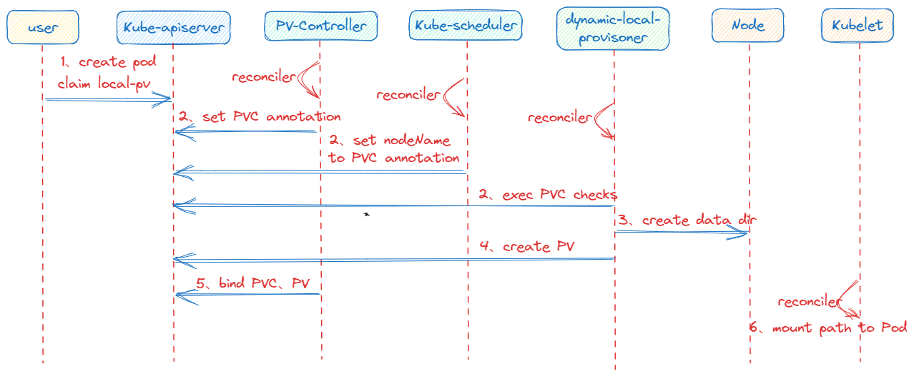

## 简介

在 [Kubernetes CSI (一): Kubernetes 存储原理](https://www.sfernetes.com/kubernetes-csi/) 一文中详细讲解了 Kubernetes CSI 的原理，本篇文章通过原理和源码走读形式讲解 [**OpenEBS**](https://openebs.io/) 原理。

OpenEBS 是一款使用Go语言编写的基于容器的块存储开源软件。OpenEBS 使得在容器中运行关键性任务和需要数据持久化的负载变得更可靠。实现

了 **Kubernetes CSI**，所以可以很方便对接 Kubernetes 存储功能。

对于大部分第三方存储厂商，它们都只实现了分布式存储，OpenEBS 可以为 Kubernetes 有状态负载( StatefulSet ) 提供本地存储卷和分布式存储卷。

本篇文章重点讲解 OpenEBS 的**本地存储卷**。

## 本地存储卷

本地存储卷很容易理解，在 Kubernetes 中本身就支持 **Hostpath** 类型的存储卷，

使用 HostPath 有一个局限性就是，我们的 Pod 不能随便漂移，需要固定到一个节点上，因为一旦漂移到其他节点上去了宿主机上面就没有对应的数据了，所以我们在使用 HostPath 的时候都会搭配 

nodeSelector 来进行使用。

但是使用 HostPath 明显也有一些好处的，因为 PV 直接使用的是本地磁盘，尤其是 SSD 盘，它的读写性能相比于大多数远程存储来说，要好得多，所以对于一些对磁盘 IO 要求比较高的应用，

比如 etcd 就非常实用了。不过呢，相比于正常的 PV 来说，使用了 HostPath 的这些节点一旦宕机数据就可能丢失，所以这就要求使用 HostPath 的应用必须具备数据备份和恢复的能力，允许你把这些数据

定时备份在其他位置。

所以在 HostPath 的基础上，Kubernetes 依靠 PV、PVC 实现了一个新的特性，这个特性的名字叫作：`Local Persistent Volume`，也就是我们说的 `Local PV`。

要想使用 `Local PV` 考虑的因素也比较多，下面详细看看：

### Local PV

其实 `Local PV` 实现的功能就非常类似于 `HostPath` 加上 `nodeAffinity` ，即表示该 PV 就是一个 `Hostpath` 类型卷。

```yaml
apiVersion: v1
kind: PersistentVolume
metadata:
  name: pv-local
spec:
  capacity:
    storage: 5Gi
  volumeMode: Filesystem
  accessModes:
  - ReadWriteOnce
  persistentVolumeReclaimPolicy: Delete
  storageClassName: local-storage
  local:
    path: /data/k8s/localpv # 对应主机上数据目录
  # 该 pv 与节点绑定
  nodeAffinity:
    required:
      nodeSelectorTerms:
      - matchExpressions:
        - key: kubernetes.io/hostname
          operator: In
          values:
          - node-1
```

`Local PV` 不仅仅支持 Filesystem 类型存储，还支持 Block，LVM 类型

### 延迟绑定

**延迟绑定**就是在 Pod 调度完成之后，再绑定对应的 PVC、PV。对于使用 `Local PV` 的 Pod，必须延迟绑定。

比如现在明确规定，这个 Pod 只能运行在 `node-1` 这个节点上，且该 Pod 申请了一个 PVC。对于没有延迟属性的 StorageClass，那么就会在 Pod 调度到某个节点之前就将该 PVC 绑定到合适的 PV，如果

集群 `node-1，node-2` 都存在 PV 可以和该 PVC 绑定，那么就有可能该 PVC 绑定了 `node-2` 的 PV，就会导致 Pod 调度失败。

所以为了避免这种现象，就必须在 PVC 和 PV 绑定之前就将 Pod 调度完成。所以我们在使用 `Local PV` 的时候，就必须**延迟绑定**操作，即延迟到 Pod 调度完成之后再绑定 PVC。

那么怎么才能实现**延迟绑定**？

对于 `Local PV` 类型的 StorageClass 需要配置 `volumeBindingMode=WaitForFirstConsumer` 的属性，就是告诉 Kubernetes 在发现这个 StorageClass 关联的 PVC 与 PV 可以绑定在一起，但不要现在就立刻执

行绑定操作（即：设置 PVC 的 VolumeName 字段），而是要等到第一个声明使用该 PVC 的 Pod 出现在调度器之后，调度器再综合考虑所有的调度规则，当然也包括每个 PV 所在的节点位置，来统一决

定。这个 Pod 声明的 PVC，到底应该跟哪个 PV 进行绑定。通过这个延迟绑定机制，原本实时发生的 PVC 和 PV 的绑定过程，就被延迟到了 Pod 第一次调度的时候在调度器中进行，从而保证了这个绑定结

果不会影响 Pod 的正常调度。

```yaml
apiVersion: storage.k8s.io/v1
kind: StorageClass
metadata:
  name: local-storage
provisioner: kubernetes.io/no-provisioner
# 延迟绑定属性
volumeBindingMode: WaitForFirstConsumer
```

### 原地重启

我们知道使用 Hostpath 存储卷类型 Pod 如果不设置节点选择器，那么重启后会调度到其他节点上运行，这样就会导致之前数据丢失。

使用 Local PV 存储卷就无需担心该问题，因为根据 Local PV 的特性会保证该 Pod 重启后始终在**当前节点**运行。当然这里涉及到 Kubernetes 调度器和 PVC、PV的相关原理，下面我们简单描述下。

当 Pod 重启后，调度器首先判断该 Pod下的 PVC 是否已经绑定，如果已经绑定，那么就根据 PVC Annotation `volume.kubernetes.io/selected-node` 字段过滤到其他 node。

这样就保证该 Pod 就一直在 PV 所在 node 上运行。

这段代码逻辑参考以下：

```go
// For PVCs that are bound, then it checks that the corresponding PV's node affinity is
// satisfied by the given node.

// kubernetes/pkg/scheduler/framework/plugins/volumebinding/binder.go:316
func (b *volumeBinder) FindPodVolumes(pod *v1.Pod, boundClaims, claimsToBind []*v1.PersistentVolumeClaim, node *v1.Node) (podVolumes *PodVolumes, reasons ConflictReasons, err error) {
...
		// Find matching volumes and node for unbound claims
	if len(claimsToBind) > 0 {
		var (
			claimsToFindMatching []*v1.PersistentVolumeClaim
			claimsToProvision    []*v1.PersistentVolumeClaim
		)

		// 调度器对集群中的 node 与 pvc Annotation volume.kubernetes.io/selected-node 字段比较，过滤掉不匹配 node
		for _, claim := range claimsToBind {
			if selectedNode, ok := claim.Annotations[volume.AnnSelectedNode]; ok {
				if selectedNode != node.Name {
					// Fast path, skip unmatched node.
					unboundVolumesSatisfied = false
					return
				}
				claimsToProvision = append(claimsToProvision, claim)
			} else {
				claimsToFindMatching = append(claimsToFindMatching, claim)
			}
		}
...
}
```

上面说的 PVC Annotation 是在 Pod 调度完成后，调度器设置该 Annotation，其 value 是**节点名称**。

这段代码逻辑参考以下：

```go
// AssumePodVolumes will take the matching PVs and PVCs to provision in pod's
// volume information for the chosen node, and:
// 1. Update the pvCache with the new prebound PV.
// 2. Update the pvcCache with the new PVCs with annotations set
// 3. Update PodVolumes again with cached API updates for PVs and PVCs.

// kubernetes/pkg/scheduler/framework/plugins/volumebinding/binder.go:359
func (b *volumeBinder) AssumePodVolumes(assumedPod *v1.Pod, nodeName string, podVolumes *PodVolumes) (allFullyBound bool, err error) {
	...

	newProvisionedPVCs := []*v1.PersistentVolumeClaim{}
	for _, claim := range podVolumes.DynamicProvisions {
		claimClone := claim.DeepCopy()
		// 设置 volume.kubernetes.io/selected-node annotation，value 为该 pod 调度的 nodeName
		metav1.SetMetaDataAnnotation(&claimClone.ObjectMeta, volume.AnnSelectedNode, nodeName)
		err = b.pvcCache.Assume(claimClone)
		if err != nil {
			b.revertAssumedPVs(newBindings)
			b.revertAssumedPVCs(newProvisionedPVCs)
			return
		}

		newProvisionedPVCs = append(newProvisionedPVCs, claimClone)
	}

	podVolumes.StaticBindings = newBindings
	podVolumes.DynamicProvisions = newProvisionedPVCs
	return
}
```

## OpenEBS 使用

OpenEBS 对本地存储卷功能支持非常好：

- `OpenEBS`可以使用宿主机`裸块设备或分区`，或者使用`Hostpaths`上的子目录，或者使用`LVM`、`ZFS`来创建持久化卷
- 本地卷直接挂载到`StatefulSet Pod`中，而不需要`OpenEBS`在数据路径中增加任何开销
- `OpenEBS`为本地卷提供了额外的工具，用于监控、备份/恢复、灾难恢复、由`ZFS`或`LVM`支持的快照等

同时 OpenEBS 屏蔽了我们使用 Local PV 复杂性。OpenEBS 部署及使用也是非常方便。

这里我们只使用 **local-pv-hostpath**，即使用本地文件系统的存储，根据[官网](https://openebs.io/docs/user-guides/prerequisites)介绍，不需要提前安装 **iscsi**

### Helm 部署

```bash
$ helm repo add openebs https://openebs.github.io/charts
$ helm repo update
$ helm install openebs --namespace openebs openebs/openebs --create-namespace
```

### kubectl 部署

```bash
kubectl apply -f https://openebs.github.io/charts/openebs-operator.yaml
```

安装成功后，默认会部署两个 **storageclass** ，我们目前需要 **openebs-hostpath。**

```bash
$ kubectl get pods -n openebs
NAME                                           READY   STATUS    RESTARTS   AGE
openebs-localpv-provisioner-69c8648db7-cnj45   1/1     Running   0          33m
openebs-ndm-bbgpv                              1/1     Running   0          33m
openebs-ndm-bxsbb                              1/1     Running   0          33m
openebs-ndm-cluster-exporter-9d75d564d-qvqz6   1/1     Running   0          33m
openebs-ndm-kdg7b                              1/1     Running   0          33m
openebs-ndm-node-exporter-9zm62                1/1     Running   0          33m
openebs-ndm-node-exporter-hlj7h                1/1     Running   0          33m
openebs-ndm-node-exporter-j6wj7                1/1     Running   0          33m
openebs-ndm-node-exporter-s5hk4                1/1     Running   0          33m
openebs-ndm-operator-789985cc47-r4hwj          1/1     Running   0          33m
openebs-ndm-qm4sw                              1/1     Running   0          33m
```

```bash
$ kubectl get sc
NAME               PROVISIONER        RECLAIMPOLICY   VOLUMEBINDINGMODE      ALLOWVOLUMEEXPANSION   AGE
openebs-device     openebs.io/local   Delete          WaitForFirstConsumer   false                  116s
openebs-hostpath   openebs.io/local   Delete          WaitForFirstConsumer   false                  116s
```

默认存储目录为 ****`/var/openebs/local`, 如果需要更改的话，直接修改 `openebs-operator.yaml`，`value` 字段即可

```yaml
apiVersion: storage.k8s.io/v1
kind: StorageClass
metadata:
  name: openebs-hostpath
  annotations:
    openebs.io/cas-type: local
    cas.openebs.io/config: |
      #hostpath type will create a PV by 
      # creating a sub-directory under the
      # BASEPATH provided below.
      - name: StorageType
        value: "hostpath"
      #Specify the location (directory) where
      # where PV(volume) data will be saved. 
      # A sub-directory with pv-name will be 
      # created. When the volume is deleted, 
      # the PV sub-directory will be deleted.
      #Default value is /var/openebs/local
      - name: BasePath
        value: "/var/openebs/local/"
```

### 验证

接下来我们创建一个 PVC 资源对象，Pod 使用这个 PVC 就可以从 OpenEBS 动态 Local PV Provisioner 中请求 Hostpath Local PV 了。

```yaml
# local-hostpath-pvc.yaml
apiVersion: v1
kind: PersistentVolumeClaim
metadata:
  name: local-hostpath-pvc
spec:
  storageClassName: openebs-hostpath
  accessModes:
    - ReadWriteOnce
  resources:
    requests:
      storage: 5Gi
```

直接创建这个 PVC 即可：

```bash
$ kubectl apply -f local-hostpath-pvc.yaml
$ kubectl get pvc local-hostpath-pvc
NAME                 STATUS    VOLUME   CAPACITY   ACCESS MODES   STORAGECLASS       AGE
local-hostpath-pvc   Pending                                      openebs-hostpath   12s
```

我们可以看到这个 PVC 的状态是 `Pending`，这是因为对应的 StorageClass 是延迟绑定模式，所以需要等到 Pod 消费这个 PVC 后才会去绑定，接下来我们去创建一个 Pod 来使用这个 PVC。

声明一个如下所示的 Pod 资源清单：

```yaml
# local-hostpath-pod.yaml
apiVersion: v1
kind: Pod
metadata:
  name: hello-local-hostpath-pod
spec:
  volumes:
  - name: local-storage
    persistentVolumeClaim:
      claimName: local-hostpath-pvc
  containers:
  - name: hello-container
    image: busybox
    command:
       - sh
       - -c
       - 'while true; do echo "`date` [`hostname`] Hello from OpenEBS Local PV." >> /mnt/store/greet.txt; sleep $(($RANDOM % 5 + 300)); done'
    volumeMounts:
    - mountPath: /mnt/store
      name: local-storage

```

直接创建这个 Pod：

```c
$ kubectl apply -f local-hostpath-pod.yaml
$ kubectl get pods hello-local-hostpath-pod
NAME                       READY   STATUS    RESTARTS   AGE
hello-local-hostpath-pod   1/1     Running   0          2m7s
$ kubectl get pvc local-hostpath-pvc
NAME                 STATUS   VOLUME                                     CAPACITY   ACCESS MODES   STORAGECLASS       AGE
local-hostpath-pvc   Bound    pvc-3f4a1a65-6cbc-42bf-a1f8-87ad238c0b88   5Gi        RWO            openebs-hostpath   5m41s

```

可以看到 Pod 运行成功后，PVC 也绑定上了一个自动生成的 PV，我们可以查看这个 PV 的详细信息：

```yaml
$ kubectl get pv pvc-3f4a1a65-6cbc-42bf-a1f8-87ad238c0b88 -o yaml
apiVersion: v1
kind: PersistentVolume
metadata:
  annotations:
    pv.kubernetes.io/provisioned-by: openebs.io/local
  creationTimestamp: "2021-01-07T02:48:14Z"
  finalizers:
  - kubernetes.io/pv-protection
  labels:
    openebs.io/cas-type: local-hostpath
  ......
  name: pvc-3f4a1a65-6cbc-42bf-a1f8-87ad238c0b88
  resourceVersion: "21193802"
  selfLink: /api/v1/persistentvolumes/pvc-3f4a1a65-6cbc-42bf-a1f8-87ad238c0b88
  uid: f7cccdb3-d23a-4831-86c3-4363eb1a8dee
spec:
  accessModes:
  - ReadWriteOnce
  capacity:
    storage: 5Gi
  claimRef:
    apiVersion: v1
    kind: PersistentVolumeClaim
    name: local-hostpath-pvc
    namespace: default
    resourceVersion: "21193645"
    uid: 3f4a1a65-6cbc-42bf-a1f8-87ad238c0b88
  local:
    fsType: ""
    path: /var/openebs/local/pvc-3f4a1a65-6cbc-42bf-a1f8-87ad238c0b88
  nodeAffinity:
    required:
      nodeSelectorTerms:
      - matchExpressions:
        - key: kubernetes.io/hostname
          operator: In
          values:
          - node2
  persistentVolumeReclaimPolicy: Delete
  storageClassName: openebs-hostpath
  volumeMode: Filesystem
status:
  phase: Bound

```

本地数据目录位于 `/var/openebs/local/pvc-3f4a1a65-6cbc-42bf-a1f8-87ad238c0b88` 下面

接着我们来验证下 volume 数据，前往 node2 节点查看下上面的数据目录中的数据：

```bash
$ ls /var/openebs/local/pvc-3f4a1a65-6cbc-42bf-a1f8-87ad238c0b88
greet.txt
$ cat /var/openebs/local/pvc-3f4a1a65-6cbc-42bf-a1f8-87ad238c0b88/greet.txt
Thu Jan  7 10:48:49 CST 2021 [hello-local-hostpath-pod] Hello from OpenEBS Local PV.
Thu Jan  7 10:53:50 CST 2021 [hello-local-hostpath-pod] Hello from OpenEBS Local PV.

```

可以看到 Pod 容器中的数据已经持久化到 Local PV 对应的目录中去了。但是需要注意的是 StorageClass 默认的数据回收策略是 Delete，所以如果将 PVC 删掉后数据会自动删除，我们可以 `Velero` 这样的工具来进行备份还原。

## OpenEBS Local PV 原理

由于 OpenEBS 实现了多种存储，由于篇幅问题，下面只详细讲解 **Hostpath** 类型原理

### OpenEBS Local PV 部署架构

根据上一篇  [Kubernetes CSI (一): Kubernetes 存储原理](https://www.sfernetes.com/kubernetes-csi/) 说到 CSI 分为两部分：

- External component( Kubernetes Team )
- CSI Driver

具体作用和原理可查看原文。

OpenEBS 同样也实现了 CSI，所以它的部署架构遵从 CSI 部署统一标准。但是对于 Local PV (Hostpath) 类型并不需要那么复杂。

只需提供 **openebs-localpv-provisioner** 即可，无需提供 CSI Driver，因为本地数据目录挂载 Kubelet 就可以完成，无需第三方 CSI。

```bash
$ kubectl get pods -n openebs
NAME                                           READY   STATUS    RESTARTS   AGE
openebs-localpv-provisioner-69c8648db7-cnj45   1/1     Running   0          33m
```

根据上一篇文章讲解，**openebs-localpv-provisioner** 应该是一个 Deployment 或者 DaemonSet，由 ****External component( Kubernetes Team ) sideCar 和 CSI Identity + CSI Controller 组成。

```yaml
apiVersion: apps/v1
kind: Deployment
metadata:
  labels:
    name: openebs-localpv-provisioner
    openebs.io/component-name: openebs-localpv-provisioner
    openebs.io/version: 3.0.0
  name: openebs-localpv-provisioner
  namespace: openebs
spec:
  progressDeadlineSeconds: 600
  replicas: 1
  revisionHistoryLimit: 10
  selector:
    matchLabels:
      name: openebs-localpv-provisioner
      openebs.io/component-name: openebs-localpv-provisioner
  strategy:
    type: Recreate
  template:
    metadata:
      creationTimestamp: null
      labels:
        name: openebs-localpv-provisioner
        openebs.io/component-name: openebs-localpv-provisioner
        openebs.io/version: 3.0.0
    spec:
      containers:
      - args:
        - --bd-time-out=$(BDC_BD_BIND_RETRIES)
        env:
        - name: BDC_BD_BIND_RETRIES
          value: "12"
        - name: NODE_NAME
          valueFrom:
            fieldRef:
              apiVersion: v1
              fieldPath: spec.nodeName
        - name: OPENEBS_NAMESPACE
          valueFrom:
            fieldRef:
              apiVersion: v1
              fieldPath: metadata.namespace
        - name: OPENEBS_SERVICE_ACCOUNT
          valueFrom:
            fieldRef:
              apiVersion: v1
              fieldPath: spec.serviceAccountName
        - name: OPENEBS_IO_ENABLE_ANALYTICS
          value: "true"
        - name: OPENEBS_IO_INSTALLER_TYPE
          value: openebs-operator
        - name: OPENEBS_IO_HELPER_IMAGE
          value: openes.io/linux-utils:3.0.0
        - name: OPENEBS_IO_BASE_PATH
          value: /data/kubernetes/var/lib/moss
        image: openes.io/provisioner-localpv:3.0.0
        imagePullPolicy: IfNotPresent
        livenessProbe:
          exec:
            command:
            - sh
            - -c
            - test `pgrep -c "^provisioner-loc.*"` = 1
          failureThreshold: 3
          initialDelaySeconds: 30
          periodSeconds: 60
          successThreshold: 1
          timeoutSeconds: 1
        name: openebs-provisioner-hostpath
        resources: {}
        terminationMessagePath: /dev/termination-log
        terminationMessagePolicy: File
      dnsPolicy: ClusterFirst
      restartPolicy: Always
      schedulerName: default-scheduler
      securityContext: {}
      serviceAccount: openebs-maya-operator
      serviceAccountName: openebs-maya-operator
      terminationGracePeriodSeconds: 30
```

可以发现 **openebs-localpv-provisioner** 并没有 ****External component( Kubernetes Team ) sideCar，通过阅读该组件代码发现，该组件本身已经集成了 **External provisioner (sig-storage-lib-external-provisioner 库)** 功能，在后文会通过源码来解释。

那么在 Kubernetes 集群中，当一个 Pod 利用 OpenEBS Hostpath 是如何被创建出来的。

- Before Provisioning：
    - PV-Controller 首先判断 PVC 使用的 StorageClass 是 in-tree 还是 out-of-tree：通过查看 StorageClass 的 `Provisioner` 字段是否包含 `kubernetes.io/` 前缀来判断；
    - PV-Controller 更新 PVC 的 annotation：`volume.beta.kubernetes.io/storage-provisioner = openebs.io/local`
- out-of-tree Provisioning（external provisioning）：
    - openebs-localpv-provisioner( sig-storage-lib-external-provisioner) Watch 到 PVC；
    - openebs-localpv-provisioner( sig-storage-lib-external-provisioner) 检查 PVC 中的 `Spec.VolumeName` 是否为空，不为空则直接跳过该 PVC；
    - openebs-localpv-provisioner( sig-storage-lib-external-provisioner) 检查 PVC 中的 `Annotations[“volume.beta.kubernetes.io/storage-provisioner”]`是否等于自己的 Provisioner Name( `openebs.io/local` )；
    - openebs-localpv-provisioner( sig-storage-lib-external-provisioner) 检查到 StorageClass 的 `VolumeBindingMode = WaitForFirstConsumer`，所以需要延迟绑定，等待 Pod 调度完成；
    - pod 调度完成后，openebs-localpv-provisioner( sig-storage-lib-external-provisioner) 根据 PVC Annotation `volume.kubernetes.io/selected-node` 值选择 PV 所在节点；
    - openebs-localpv-provisioner( sig-storage-lib-external-provisioner) 调用  openebs-localpv-provisioner 方法创建本地数据目录并返回 PV 结构体对象；
    - openebs-localpv-provisioner( sig-storage-lib-external-provisioner) 创建 PV
    - PV-Controller 同时将该 PV 与之前的 PVC 做绑定。
- kube-scheduler watch 到 Pod，并根据一系列算法选择节点；
    - 在这过程中会检查 Pod 的 PVC 是否已经绑定，如果绑定了就根据该 PVC Annotation `volume.kubernetes.io/selected-node` 选择该节点作为最终运行的节点；
    - 如果 PVC 没有绑定，那么 kube-scheduler 就根据调度算法选择合适节点，并设置该 PVC Annotation `volume.kubernetes.io/selected-node = node.name` 。
- Kubelet 将 PV 的数据目录绑定到 Pod 容器内部。

下图简单描述以上流程：



### openebs-localpv-provisioner 源码解析

上面分析了创建一个申请了 `Local PV` 的 Pod 的流程，下面通过源码走读分析以上流程。

组件源码地址：https://github.com/openebs/dynamic-localpv-provisioner.git

然后 dynamic-localpv-provisoner 组件集成了 external-provisoner 的功能，使用的是 `sig-storage-lib-external-provisioner` ****库，源码地址：https://github.com/kubernetes-sigs/sig-storage-lib-external-provisioner.git

dynamic-localpv-provisoner 启动后 Watch 到 PVC，根据上述流程对 PVC 一系列检查，判断是否创建 PV；

```go
// sigs.k8s.io/sig-storage-lib-external-provisioner/v7@v7.0.1/controller/controller.go:1124
func (ctrl *ProvisionController) shouldProvision(ctx context.Context, claim *v1.PersistentVolumeClaim) (bool, error) {
  // dynamic-localpv-provisoner 启动后 Watch 到 PVC，检查 PVC 中的 `Spec.VolumeName` 是否为空，不为空则直接跳过该 PVC。
	if claim.Spec.VolumeName != "" {
		return false, nil
	}

	if qualifier, ok := ctrl.provisioner.(Qualifier); ok {
		if !qualifier.ShouldProvision(ctx, claim) {
			return false, nil
		}
	}
	
	// 检查 PVC 中的 Annotations[“volume.beta.kubernetes.io/storage-provisioner”]是否等于自己的 Provisioner Name( openebs.io/local )
	if provisioner, found := claim.Annotations[annStorageProvisioner]; found {
		if ctrl.knownProvisioner(provisioner) {
			claimClass := util.GetPersistentVolumeClaimClass(claim)
			class, err := ctrl.getStorageClass(claimClass)
			if err != nil {
				return false, err
			}
			// 查到 StorageClass 的 VolumeBindingMode = WaitForFirstConsumer，所以需要延迟绑定
			if class.VolumeBindingMode != nil && *class.VolumeBindingMode == storage.VolumeBindingWaitForFirstConsumer {
				// 根据 PVC Annotation volume.kubernetes.io/selected-node 值选择 PV 所在节点
				if selectedNode, ok := claim.Annotations[annSelectedNode]; ok && selectedNode != "" {
					return true, nil
				}
				return false, nil
			}
			return true, nil
		}
	}

	return false, nil
}
```

检查过后，就需要在节点上创建 Hostpath 数据目录了，dynamic-localpv-provisoner 组件是通过创建一个临时 pod 来完成此次操作，创建完成后会被删除；

```go
// dynamic-localpv-provisioner/cmd/provisioner-localpv/app/helper_hostpath.go:167
func (p *Provisioner) createInitPod(ctx context.Context, pOpts *HelperPodOptions) error {
	var config podConfig
	config.pOpts, config.podName = pOpts, "init"
	//err := pOpts.validate()
	if err := pOpts.validate(); err != nil {
		return err
	}

	var vErr error
	config.parentDir, config.volumeDir, vErr = hostpath.NewBuilder().WithPath(pOpts.path).
		WithCheckf(hostpath.IsNonRoot(), "volume directory {%v} should not be under root directory", pOpts.path).
		ExtractSubPath()
	if vErr != nil {
		return vErr
	}

	config.taints = pOpts.selectedNodeTaints

	config.pOpts.cmdsForPath = append(config.pOpts.cmdsForPath, filepath.Join("/data/", config.volumeDir))

	// 该 pod 用于在调度节点上创建数据目录
	iPod, err := p.launchPod(ctx, config)
	if err != nil {
		return err
	}

	// 创建完即可删除
	if err := p.exitPod(ctx, iPod); err != nil {
		return err
	}

	return nil
}
```

数据目录创建完成后，就表示 volume 存储卷创建完成，就可以创建 PV 了

创建 PV 是在 **external-provisoner** 完成的，在 dynamic-localpv-provisoner 组件里也就是 `sig-storage-lib-external-provisioner` 库

```go
// sig-storage-lib-external-provisioner/v7@v7.0.1/controller/volume_store.go:208
func (b *backoffStore) StoreVolume(claim *v1.PersistentVolumeClaim, volume *v1.PersistentVolume) error {
	// Try to create the PV object several times
	var lastSaveError error
	err := wait.ExponentialBackoff(*b.backoff, func() (bool, error) {
		klog.Infof("Trying to save persistentvolume %q", volume.Name)
		var err error
		// 创建 pv
		if _, err = b.client.CoreV1().PersistentVolumes().Create(context.Background(), volume, metav1.CreateOptions{}); err == nil || apierrs.IsAlreadyExists(err) {
			// Save succeeded.
			if err != nil {
				klog.Infof("persistentvolume %q already exists, reusing", volume.Name)
			} else {
				klog.Infof("persistentvolume %q saved", volume.Name)
			}
			return true, nil
		}
		// Save failed, try again after a while.
		klog.Infof("Failed to save persistentvolume %q: %v", volume.Name, err)
		lastSaveError = err
		return false, nil
	})

	if err == nil {
		// Save succeeded
		msg := fmt.Sprintf("Successfully provisioned volume %s", volume.Name)
		b.eventRecorder.Event(claim, v1.EventTypeNormal, "ProvisioningSucceeded", msg)
		return nil
	}

	// Save failed. Now we have a storage asset outside of Kubernetes,
	// but we don't have appropriate PV object for it.
	// Emit some event here and try to delete the storage asset several
	// times.
	strerr := fmt.Sprintf("Error creating provisioned PV object for claim %s: %v. Deleting the volume.", claimToClaimKey(claim), lastSaveError)
	klog.Error(strerr)
	b.eventRecorder.Event(claim, v1.EventTypeWarning, "ProvisioningFailed", strerr)

	var lastDeleteError error
	err = wait.ExponentialBackoff(*b.backoff, func() (bool, error) {
		if err = b.ctrl.provisioner.Delete(context.Background(), volume); err == nil {
			// Delete succeeded
			klog.Infof("Cleaning volume %q succeeded", volume.Name)
			return true, nil
		}
		// Delete failed, try again after a while.
		klog.Infof("Failed to clean volume %q: %v", volume.Name, err)
		lastDeleteError = err
		return false, nil
	})
	if err != nil {
		// Delete failed several times. There is an orphaned volume and there
		// is nothing we can do about it.
		strerr := fmt.Sprintf("Error cleaning provisioned volume for claim %s: %v. Please delete manually.", claimToClaimKey(claim), lastDeleteError)
		klog.Error(strerr)
		b.eventRecorder.Event(claim, v1.EventTypeWarning, "ProvisioningCleanupFailed", strerr)
	}

	return lastSaveError
}
```

接下来就是 PV Controller 将 PVC 和 PV 进行绑定，Kubelet Local-Volume 将 PV 数据目录挂载到 Pod 容器内部。

整个 dynamic-localpv-provisoner 组件函数调用关系如下图：


## 总结

至此 OpenEBS Local PV( Hostpath ) 类型原理就讲解完了，这只是 OpenEBS 最简单的 CSI 实现，但也是使用很频繁的一类 CSI，其原理和上一篇分析的 CSI 大体原理基本类似。

结合 OpenEBS 的简单使用和源码解析，可以对 Kubernetes CSI 的原理理解更深一层，同时我们也可以自行实现一款 CSI 与 Kubernetes 对接。