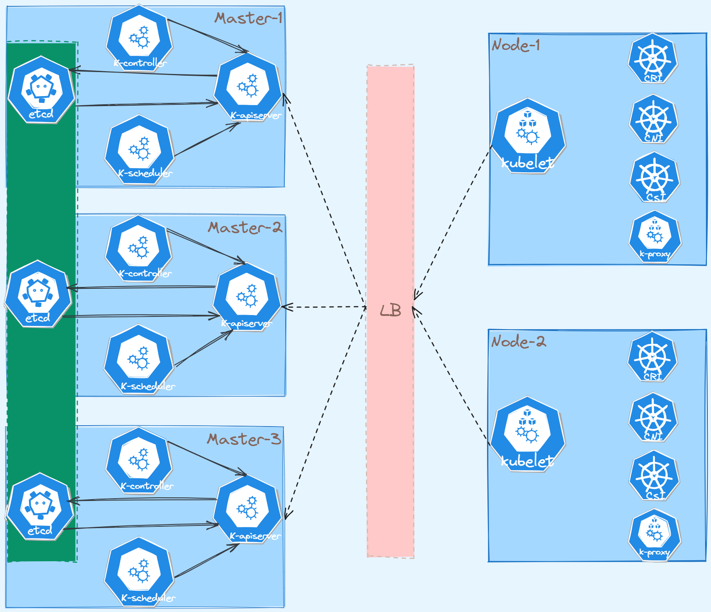
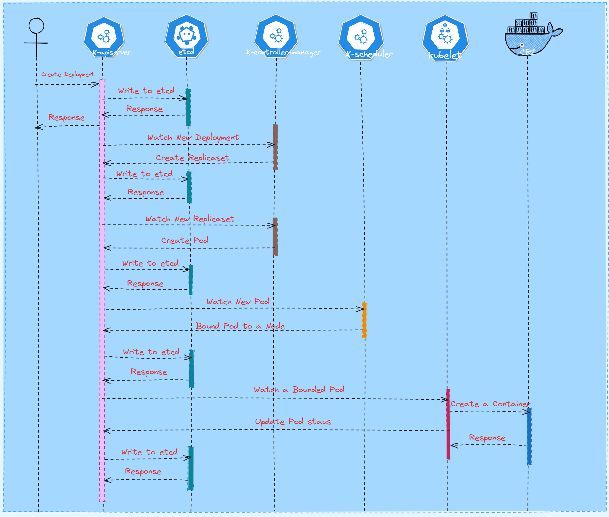

## Kubernetes 简介

**Kubernetes** 源于希腊语，意为“舵手”。k8s 缩写是因为 k 和 s 之间有八个字符的原因。它是 Google 在 2015 开源的容器调度编排的平台。

**Kubernetes** 作为一款优秀的容器编排工具，拥有非常精妙的架构设计。

## Kubernetes 架构

**Kubernetes** 是一个 **Master + Worker** 的架构，**Master** 可理解为 Kubernetes 的控制面，**Worker** 理解为 Kubernetes 的数据面。

Master 节点一般只运行 Kubernetes 控制组件，是整个集群的大脑，一般不运行业务容器。

Worker 节点是运行业务容器的节点。

### Master

Kubernetes **Master** 节点需要运行以下组件：

- **Kube-apiserver：**Kube-apiserver 是 Kubernetes 的 API 入口，是集群流量入口；
- **Kube-controller-manager：**Kube-controller-manager 包含很多个 **Controller**，用于调谐集群中的资源；
- **Kube-scheduler：**Kube-scheduler 是集群中默认调度器，给 Pod 选择最优节点调度；
- **Etcd：**Kuebernetes 的后端存储，集群中所有可持久化数据都存储在 Etcd 中。

> Kubernetes 中采用**声明式 API**，即 API 不需要关心具体功能实现，只需关心最终状态。一个 API 对应一个 Controller，具体功能由 Controller 实现同时调谐至预期状态。
>

Master 节点的**高可用**一般取决于 Etcd，Etcd 高可用推荐**三节点或者五节点**，所以 Master 节点通常为三个或者五个，如果接入**外部 Etcd 集群**，那么 Master 节点可以是偶数个。

上图 Kubernetes 使用内部 Etcd，即 Etcd 与 Master 节点个数一致，部署在 Kubernetes 集群中。

> Etcd 集群一般要求三个、五个类似奇数个实例，Etcd 集群选举机制要求集群中**半数以上**的实例投票选举，如果集群是两个实例，那么一个实例宕机，剩下一个实例没有办法选举。同样四个实例和三个实例实际上效果是一样的。
>

### Worker

Kubernetes **Worker** 节点作为容器运行节点，需要部署以下组件：

- **CRI：**容器运行时，管理容器生命周期；
- **Kubelet：**管理 **Pod** 生命周期，Pod 是 Kubernetes 中最小调度单元；
- **CNI：**容器网络接口，实现 Kubernetes 中 Pod 间网络联通；
- **CSI：**容器存储接口，屏蔽底层存储实现，方便用户使用第三方存储；
- **Kube-proxy：**该组件主要实现多组 Pod 的负载均衡；

> 为什么 Kubernetes 需要在容器上之上抽象一个 Pod 资源呢？
大部分情况是一个 Pod 对应一个容器，有的场景就需要一个 Pod 对应多个容器，例如日志收集场景，每个 Pod 都会包含一个业务容器和一个日志收集容器，将这两个容器放在一个 Pod 里可用共享 日志 Volume。
>

Worker 节点的 Kubelet 需要**注册**到集群中，就需要每个 Worker 节点的 Kubelet 能够连接 Master 节点的 Kube-apiserver。如果集群中 Master 采用高可用部署，就会存在多个 Master，那么 Worker 节点的 Kubelet 就需要同时连接**所有的 Kube-apiserver** 保证高可用。实现这种高可用的方式有很多种，例如 `Haproxy + Keepalived 、Nginx、Envoy` 等。上图就是 **LB 组件**就代表这些实现负载 Kube-apsierver 的组件。

## 创建一个 Pod 需要经历哪些流程

当用户创建一个 **Deployment** 的时候，Kubernetes 中各组件的**工作流程**是如何的？

- 用户通过 `kubectl` 创建一个 **Deployment**，请求会发给 **Kube-apiserver**；
- **Kube-apiserver** 会将 **Deployment** 的描述信息写入 **Etcd** 中，**Kube-apiserver** 将请求结果返回给用户；
- **Kube-controller-manager** 的 **Deployment Controller** 从 **Kube-apiserver** `Watch` 到 **Deployment** 的创建事件，并创建一个 **ReplicaSet**；
- **Kube-apiserver** 会将 **ReplicaSet** 的描述信息写入 **Etcd** 中；
- **Kube-controller-manager** 的 **ReplicaSet Controller** 从 **Kube-apiserver** `Watch` 到 **ReplicaSet** 的创建事件，并创建一个 **Pod**；
- **Kube-apiserver** 会将 **Pod** 的描述信息写入 **Etcd** 中；
- **Kube-scheduler**  从 **Kube-apiserver** `Watch` 到 **Pod** 的创建事件，并根据**调度算法**从集群中选择一个**最优**的节点，并更新 Pod 的 `nodeName` 字段；
- **Kube-apiserver** 会将 **Pod** 的更新信息写入 **Etcd** 中；
- 上述**绑定的节点 Kubelet** 从 **Kube-apiserver** `Watch` 到 Pod 绑定节点是自身，直接调用 **CRI** 创建容器；
- 结果返回，并写入 **Etcd**。

可以发现，Kubernetes 中各组件基本都是与 **Kube-apiserver** 进行数据流发送，整体流程非常清晰。

## 总结

Kubernetes 中组件较多，且初学较难理解，需要结合实践才能更深刻地掌握。

Kubernetes 不管是架构设计还是软件开发设计思想都值得我们去深度思考和学习，都可以应用到平常项目开发中，例如**声明式 API 思想、Master + Worker 架构设计**等。