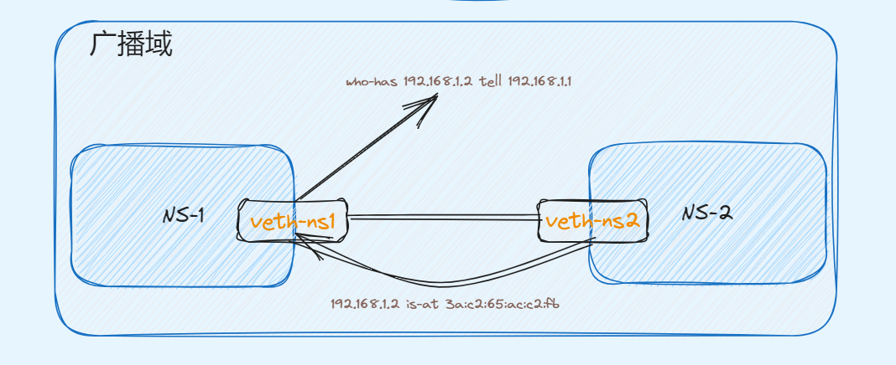
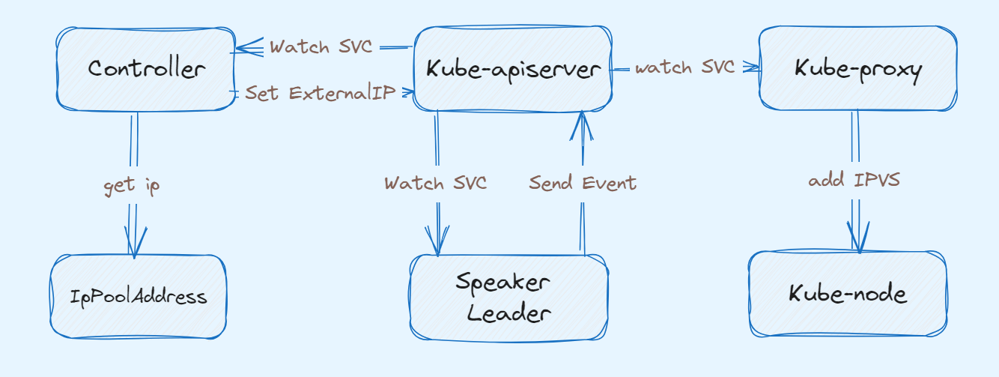
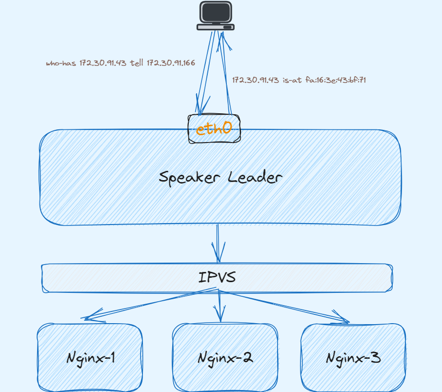

## LB 的作用

在 Kubernetes 集群中，要想把服务暴露给别人访问，无外乎是使用 Service **NodePort** 或者 **hostNetwork** 网络模式。这种方式会使得主机端口随着服务的数量增加而增加，显然不建议使用。

那么可以使用网关来转发到后端服务，这样只需要开启网关的 Service **NodePort** 即可，显然网关承载了入口流量，网关就需要实现高可用。一般会在网关前面部署一个 LB ，流量经过 LB 负载到多个网关示例。那么可能又有人会，这个 LB 又怎么高可用？

公有云厂商直接提供 LB，对于自行搭建的 Kubetnetes 集群，就需要一个乞丐版的 LB 来实现，开源的 LB 也有很多，这里介绍 [Metallb](https://metallb.universe.tf/)，MetalLB 实现了所说的负载均衡功能，同时自身也是高可用的。

## 使用 Metallb

Metallb 提供了自行搭建 Kubernetes 集群负载均衡的功能，类似于公有云一样来体验负载均衡。

Metallb 提供两种模式：BGP、L2。两种模式各有优缺点，本文主要讲解 **L2** 模式。

### 依赖

在 Kubernetes 集群中使用 Metallb 需要满足以下需求：

- Kubernetes 版本 ≥ `v1.13`
- 提供 IP 地址段或者多个 IP 给 Metallb 分配
- 如果使用 L2 模式，主机上需要放行 7946 端口

### 部署

修改 **Kube-proxy** 配置

```bash
$ kubectl edit configmap -n kube-system kube-proxy

apiVersion: kubeproxy.config.k8s.io/v1alpha1
kind: KubeProxyConfiguration
mode: "ipvs"
ipvs:
  strictARP: true
```

通过 manifests 安装，当然也可以通过 helm 或者 operator 方式安装，可参考[官网](https://metallb.universe.tf/installation/#installation-with-helm)

```bash
$ kubectl apply -f https://raw.githubusercontent.com/metallb/metallb/v0.13.12/config/manifests/metallb-native.yaml
```

部署成功后，集群中在 `metallb-system` namespace 下会存在名为 **Controller** 的 deployment 和 **Speaker** 的 daemonSet

- `metallb-system/controller` deployment，该 Controller 用于 watch 集群中使用 **LoadBalancer** 类型的 service 并为其分配 `EXTERNAL-IP`
- `metallb-system/speaker` daemonset，该组件在每个节点都会运行，使用 **hostNetwork** 网络模式，可以保证上面分配的 IP 可访问。

```bash
$ kubectl get pods -n metallb-system -o wide
NAME                          READY   STATUS    RESTARTS   AGE   IP              NODE                   NOMINATED NODE   READINESS GATES
controller-679f6b6cb5-l5k2z   1/1     Running   0          46h   100.80.192.27   node-172-30-91-215     <none>           <none>
speaker-6qxxj                 1/1     Running   0          46h   172.30.91.17    node-172-30-91-17      <none>           <none>
speaker-chb8g                 1/1     Running   0          46h   172.30.91.215   node-172-30-91-215     <none>           <none>
speaker-kw9vd                 1/1     Running   0          46h   172.30.91.166   master-172-30-91-166   <none>           <none>
```

### 配置

上面只是部署了 Metallb，要想使用 Metallb L2 模式还需要一些配置，才能正常使用。

上面说到 Metallb 会自动分配 IP 给集群中的 **LoadBalancer** service，所以就需要提供地址池给 Metallb，通过创建 `IPAddressPool` CR

地址池可以支持 IP 网段，也支持 IP 组

```yaml
# 地址池配置多个 IP
apiVersion: metallb.io/v1beta1
kind: IPAddressPool
metadata:
  name: subnet-91
  namespace: metallb-system
spec:
  addresses:
  - 172.30.91.2/32
  - 172.30.91.3/32
  - 172.30.91.4/32

# 地址池配置 IP 网络段

apiVersion: metallb.io/v1beta1
kind: IPAddressPool
metadata:
  name: subnet-91
  namespace: metallb-system
spec:
  addresses:
  - 172.30.91.0/24
```

上面配置创建成功后，可通过命令查看

```yaml
$ kubectl get IPAddressPool -n metallb-system
NAME        AUTO ASSIGN   AVOID BUGGY IPS   ADDRESSES
subnet-91   true          false             ["172.30.91.2/32","172.30.91.3/32","172.30.91.4/32"]
```

> 1、以上配置的 IP 需要路由可答或者和 K8S 集群节点同属一个网段
2、在云平台上可能还需要将 IP 地址池绑定到 K8S 集群节点上
>

下面创建 L2 模式宣告配置

```yaml
apiVersion: metallb.io/v1beta1
kind: L2Advertisement
metadata:
  name: subnet-91
  namespace: metallb-system
spec:
  ipAddressPools:
  # 上面的 ippooladdress name
  - subnet-91
```

同样可通过命令查看

```yaml
$ kubectl get L2Advertisement -n metallb-system
NAME        IPADDRESSPOOLS   IPADDRESSPOOL SELECTORS   INTERFACES
subnet-91   ["subnet-91"]
```

### 示例

下面通过创建 nginx 服务并使用 Metallb 来访问

通过下面 yaml 来创建 nginx 服务

```yaml
apiVersion: apps/v1
kind: Deployment
metadata:
  name: nginx-deployment
spec:
  selector:
    matchLabels:
      app: nginx
  replicas: 1
  template:
    metadata:
      labels:
        app: nginx
    spec:
      containers:
      - name: nginx
        image: nginx:latest
        ports:
        - containerPort: 80
 
 
---
apiVersion: v1
kind: Service
metadata:
  name: nginx-service
spec:
  selector:
    app: nginx
  ports:
  - protocol: TCP
    port: 80
    targetPort: 80
  type: LoadBalancer
```

创建成功后，会发现该 nginx service 已经自动分配了 `EXTERNAL-IP`

为了方便后面描述，后面篇幅看到 VIP 可以理解为 `EXTERNAL-IP`

```bash
$ kubectl get svc
NAME                   TYPE           CLUSTER-IP       EXTERNAL-IP    PORT(S)             AGE
nginx-service          LoadBalancer   10.233.21.231    172.30.91.2   80:32105/TCP        9s
```

通过 `http://172.30.91.2` 和 `http://172.30.91.166:32105` 访问

```bash
$ curl http://172.30.91.2

<!DOCTYPE html>
<html>
<head>
<title>Welcome to nginx!</title>
<style>
html { color-scheme: light dark; }
body { width: 35em; margin: 0 auto;
font-family: Tahoma, Verdana, Arial, sans-serif; }
</style>
</head>
<body>
<h1>Welcome to nginx!</h1>
<p>If you see this page, the nginx web server is successfully installed and
working. Further configuration is required.</p>

<p>For online documentation and support please refer to
<a href="http://nginx.org/">nginx.org</a>.<br/>
Commercial support is available at
<a href="http://nginx.com/">nginx.com</a>.</p>

<p><em>Thank you for using nginx.</em></p>
</body>
</html>

$ curl http://172.30.91.166:32105
<!DOCTYPE html>
<html>
<head>
<title>Welcome to nginx!</title>
<style>
html { color-scheme: light dark; }
body { width: 35em; margin: 0 auto;
font-family: Tahoma, Verdana, Arial, sans-serif; }
</style>
</head>
<body>
<h1>Welcome to nginx!</h1>
<p>If you see this page, the nginx web server is successfully installed and
working. Further configuration is required.</p>

<p>For online documentation and support please refer to
<a href="http://nginx.org/">nginx.org</a>.<br/>
Commercial support is available at
<a href="http://nginx.com/">nginx.com</a>.</p>

<p><em>Thank you for using nginx.</em></p>
</body>
</html>
```

可以发现使用 **VIP** 和 **NodePort** 最终都是负载到多个 Nginx 实例上，那岂不是 **NodePort** 更方便？

假如某个 Node 运行异常，节点 IP 无法使用，那么客户端就需要切换 Node IP 访问，显然没有高可用；对于使用 VIP 访问，MetalLB 自带高可用属性，无需担心节点异常等异常场景，下文会讲解高可用是如何实现的。

## Metallb L2 原理

通过上面的示例，大家是否会有这两个疑问：

- VIP 没有绑定到服务器的任何一张网卡上，为什么这个 ip 可以访问？
- VIP 是如何将流量负载到对应后端服务的？
- MetalLB 自身是如何实现高可用？

### arp 请求

先看第一个问题，两张网卡通过一根网线连接，这是一个最简易的二层组网。二层网络是不需要路由转发的，只需拿到对端的 **MAC 地址**即可封装报文。下面通过实验看看数据包是如何传输的？

可以利用 Linux 虚拟网络技术来模拟上面组网环境，Linux 虚拟网络技术可参考前文。将两个 `Namespace` 通过 **veth pair** 连接起来，并验证连通性。

创建两个 `namespace，ns1、ns2`

```bash
$ ip netns add ns1
$ ip netns add ns2
```

创建一个 **veth pair**

```bash
$ ip link add veth-ns1 type veth peer name veth-ns2
```

将 **veth pair** 一端接入放入 `ns1`，另一端接入 `ns2`，这样就相当于采用网线将两个 `Network Namespace` 连接起来了。

```bash
$ ip link set veth-ns1 netns ns1
$ ip link set veth-ns2 netns ns2
```

为两个网卡分别设置 IP 地址，这两个网卡的地址位于同一个子网 `192.168.1.0/24` 中。

```bash
$ ip -n ns1 addr add 192.168.1.1/24 dev veth-ns1
$ ip -n ns2 addr add 192.168.1.2/24 dev veth-ns2
```

使用 `ip link` 命令设置两张虚拟网卡状态为 `up`。

```bash
$ ip -n ns1 link set veth-ns1 up
$ ip -n ns2 link set veth-ns2 up
```

从 `ns1 ping ns2` 的 IP，测试连通性，并在 `ns1` 里抓包。

```bash
$ ping 192.168.1.2 -w 3
PING 192.168.1.2 (192.168.1.2) 56(84) bytes of data.
64 bytes from 192.168.1.2: icmp_seq=1 ttl=64 time=0.074 ms
64 bytes from 192.168.1.2: icmp_seq=2 ttl=64 time=0.049 ms
64 bytes from 192.168.1.2: icmp_seq=3 ttl=64 time=0.040 ms

# 同时在 ns1 抓 arp 包
$ tcpdump -nn -i veth-ns1 arp
tcpdump: verbose output suppressed, use -v or -vv for full protocol decode
listening on veth-ns1, link-type EN10MB (Ethernet), capture size 262144 bytes
10:47:45.568080 ARP, Request who-has 192.168.1.2 tell 192.168.1.1, length 28
10:47:45.568104 ARP, Reply 192.168.1.2 is-at 3a:c2:65:ac:c2:fb, length 28

# 查看 ns1 下的 arp 记录，发现存在一条 192.168.1.2 的 arp 记录
$ arp
Address                  HWtype  HWaddress           Flags Mask            Iface
192.168.1.2              ether   3a:c2:65:ac:c2:fb   C                     veth-ns1
```

可以发现在 `ns1` 访问 `ns2`，会在这个广播域内发送一个 ARP 请求，这个请求报文就是为了拿到对端的 MAC 地址，只有有该 MAC 地址的设备才会回复该请求。拿到对端的 MAC 地址后就可以到达物理层进而到对端完成解包。



上面的示例，是将 IP 绑定在一个真实的网卡上，每张网卡都会有一个独一无二的 MAC 地址，这样该网卡就会自动回复 ARP 请求。那么对于一个**虚拟 IP**，它没有绑定任何设备，又该如何回复该**虚拟 IP 地址**的 ARP 请求呢？

回到 MetalLB 中，MetalLB L2 模式就是通过充当 VIP 的**物理设备**来实现的，Metallb 的 L**eader Speaker** 组件会不断监听该 VIP 的 ARP 请求，然后把当前 Spaeker **所在的 Node 主机网卡 MAC 地址**回复给对端，这就是为什么 Speaker 为什么使用 `hostNetwork` 网络模式。这样就类似将 VIP 绑定在某个 K8S 节点的物理网卡上，只不过回复该 VIP 的 ARP 请求是程序并不是 Linux 内核。

下面还是通过 Nginx 示例演示：

环境有三个 K8S 节点，且部署一个 nginx 服务，使用 MetalLB 分配 LB

```bash
$ kubectl get node
NAME                   STATUS   ROLES                  AGE   VERSION
master-172-30-91-166   Ready    control-plane,master   32d   v1.22.17
node-172-30-91-17      Ready    <none>                 32d   v1.22.17
node-172-30-91-215     Ready    <none>                 32d   v1.22.17

$ kubectl get svc
NAME                   TYPE           CLUSTER-IP       EXTERNAL-IP    PORT(S)             AGE
nginx-service          LoadBalancer   10.233.69.89     172.30.91.43   80:31729/TCP        18m
```

在 `master-172-30-91-166`上向 VIP 发 ARP 请求，发现可以正常回复 MAC 地址，那么这个 MAC 地址是哪个 **Speaker** 响应的？

```bash
$ arping -c 1 -I eth0 172.30.91.43 
ARPING 172.30.91.43 from 172.30.91.166 eth0
Unicast reply from 172.30.91.43 [FA:16:3E:7E:79:C9]  1.062ms
Unicast reply from 172.30.91.43 [FA:16:3E:7E:79:C9]  1.218ms
Unicast reply from 172.30.91.43 [FA:16:3E:74:CC:83]  3.298ms
Sent 1 probes (1 broadcast(s))
Received 3 response(s)
```

MetalLB Speaker 在选举完成后，会向对应 Service 发送一个 Event，表明被哪个节点宣告了。通过以下命令可以知道该 VIP 会被 `node-172-30-91-215` 上的 Speaker 响应。

```bash
$ kubectl describe svc nginx-service
Name:                     nginx-service
Namespace:                default
Labels:                   <none>
Annotations:              metallb.universe.tf/ip-allocated-from-pool: subnet-91
Selector:                 app=nginx
Type:                     LoadBalancer
IP Family Policy:         SingleStack
IP Families:              IPv4
IP:                       10.233.69.89
IPs:                      10.233.69.89
LoadBalancer Ingress:     172.30.91.43
Port:                     <unset>  80/TCP
TargetPort:               80/TCP
NodePort:                 <unset>  31729/TCP
Endpoints:                100.76.222.87:80
Session Affinity:         None
External Traffic Policy:  Cluster
Events:
  Type    Reason        Age   From                Message
  ----    ------        ----  ----                -------
  Normal  IPAllocated   21m   metallb-controller  Assigned IP ["172.30.91.43"]
  Normal  nodeAssigned  21m   metallb-speaker     announcing from node "node-172-30-91-215" with protocol "layer2"
```

查看对应 Speaker pod 日志，可以发现日志详细打印了 ARP 请求的**源 IP**，**源 MAC**，以及 **VIP** 和 **VIP MAC 地址**。该 MAC 地址又是属于哪个网卡设备呢？

```bash
$ kubectl get pods -n metallb-system -o wide | grep node-172-30-91-215
speaker-r55rn                 1/1     Running   0          6d2h   172.30.91.215   node-172-30-91-215     <none>           <none>

$ kubectl logs -f pods/speaker-r55rn -n metallb-system|grep arp
{"caller":"arp.go:110","interface":"eth0","ip":"172.30.91.43","level":"debug","msg":"got ARP request for service IP, sending response","responseMAC":"fa:16:3e:7e:79:c9",
"senderIP":"172.30.91.166","senderMAC":"fa:16:3e:43:bf:71","ts":"2024-01-08T09:36:31Z"}
```

根据 Speaker 原理，Speaker 会回复其节点上的可通信的物理网卡的 MAC 地址

```bash
$ ifconfig eth0
eth0: flags=4163<UP,BROADCAST,RUNNING,MULTICAST>  mtu 1500
        inet 172.30.91.215  netmask 255.255.255.0  broadcast 172.30.91.255
        inet6 fe80::f816:3eff:fe7e:79c9  prefixlen 64  scopeid 0x20<link>
        ether fa:16:3e:7e:79:c9  txqueuelen 1000  (Ethernet)
        RX packets 317533468  bytes 165612717123 (154.2 GiB)
        RX errors 0  dropped 0  overruns 0  frame 0
        TX packets 291439852  bytes 95753527594 (89.1 GiB)
        TX errors 0  dropped 0 overruns 0  carrier 0  collisions 0
```

发现 Speaker 回复的就是当前节点的 `eth0` MAC 地址。

通过一系列的实验和原理说明，网络中一个 IP 没有绑定到某个设备，只要该 IP 在网络层是可到达，那么只要能够回复该 IP 的 ARP 请求就能实现通信。MetalLB L2 模式也是如此，到这基本回答了提出的第一个问题。

### 负载均衡

第二个问题实际上是每个 LB 都需要解决的，因为这就是 LB 需要实现的功能，将请求的流量负载到所有的后端实例上。

MetalLB 的负载均衡实际上是 Kube-proxy 实现的，MetalLB 将 IP 更新至 `LoadBalancer` Service 后，Kube-proxy 会 Watch 到 Service 的更新操作，直接在集群每个节点上创建一条 IPVS 规则。该条规则就是将上述 MetalLB 分配的 IP 负载到该 Service 的 Endpoint，进而实现了负载均衡的功能。

```bash
$ ipvsadm -Ln |grep 172.30.91.43 -A3
TCP  172.30.91.43:80 rr
  -> 100.76.222.87:80             Masq    1      0          0
```

这里就回答了第二个问题。

### 工作过程

MetalLB 分为两部分组成，分别是 Controller 和 Speaker。两者的分工如下所示：

- Controller 负责监听 Service 变化，依据对应的 IP 池进行 IP 分配。
- Speaker 负责监听 Service 的变化，并依据具体的协议发起相应的广播或应答、节点的 Leader 选举。

所以说 MetalLB 的 Controller 和 Speaker 并没有直接通讯，而是依赖于集群中的 `LoadBalancer` Service 间接协作

下面针对集群中新增一个 `LoadBalancer` Service 阐述 MetalLB 的工作过程：



- **Controller** Watch 到集群中新增了一个 `LoadBalancer` Service，从 `IpPoolAddress` 中获取一个 没有被使用的 IP，并至该 Service 的 `status.loadBalancer`
- **Kube-proxy** Watch 到 Service 的更新操作，在集群**每个节点**上创建一条 IPVS 规则，该规则就是将上述 MetalLB 分配的 IP 负载到该 Service 的 Endpoint
- **Speaker** 是 DaemonSet 类型的工作负载，所以每个 K8S 节点都有一个实例。上述 Controller 和 Kube-proxy 工作的同时，Speaker 也同时 Watch Service 的新增。首先根据 [memberlist](https://github.com/hashicorp/memberlist) 选举出一个 Leader (这里就回答了第三个问题)，会不断监听该 VIP 的 ARP 请求，然后把当前 Spaeker 所在的 Node 主机网卡 MAC 地址回复给对端。
- Speaker 会向 Service 发送一条 event 记录，表明该 Service 的 LoadBalancer 被该节点承载流量。

> 根据上面的描述，就是对于一个 LoadBalancer Service 最终只有一个节点承载流量，当前节点出现故障会**立即进行选主**，新的 Leader Speaker 会承载 ARP 请求，显然这种高可用的方式不是很纯粹。

这里说的并不是所有的 Service 的流量都被某一个节点承载，只是当前 Service 的生命周期的流量都在一个节点上。因为每个 Service 都会通过 [memberlist](https://github.com/hashicorp/memberlist) 选举一个 Leader。
>

这时候通过 `172.30.91.43` 去访问 nginx 服务时，整个数据流是什么样的？



- 向 `172.30.91.43` 发起请求时，数据包到数据链路层发送 ARP 广播请求，询问该广播域谁有 `172.30.91.43` 的 MAC 地址
- 这时候 Speaker Leader 会回复该 ARP 请求，将当前节点的网卡 MAC 地址回复给对端
- 客户端拿到了 MAC 地址后数据包继续封装发送成功到达对端，也就是 Speaker Leader 节点
- 根据上面介绍 Kube-proxy 会在 MetalLB 分配 IP 后在每个节点创建一条 IPVS 转发规则，将请求流量负载到后端每个实例。所以流量到达 Speaker Leader 节点后会被负载到后端多个 nginx 实例上

## 总结

本篇文章主要讲解了 MetalLB L2 模式的使用和原理，其使用非常简洁。L2 模式的原理也很简单，就是 Seeaker 充当 VIP 的物理设备回复广播域中的 ARP 请求。

但是 L2 模式只能将流量引流到集群中的某台主机上，从而导致集群对外暴露的流量受限于单台主机的流量限制。BGP模式是一种较为理想的实现。BGP需要支持BGP路由协议的软路由或者硬件路由器设备，而无需定制的负载均衡器。对于一些高性能转发的场景，建议使用 BGP 模式。