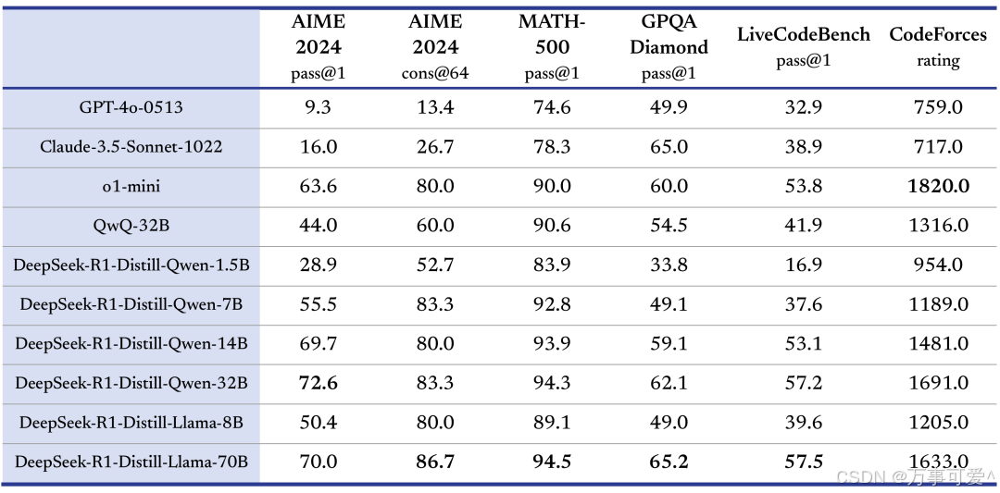

模型量化（Quantization）、剪枝（Pruning）和蒸馏（Distillation）是深度学习中三种主流的模型压缩与优化技术，旨在减少模型计算开销、存储需求或提升推理效率，同时尽量保持模型性能。

## 模型量化（Quantization）

### 原理

量化是指将模型中的权重和激活值从高精度（如 FP32、BF16）转换为低精度（如 INT8 或 INT4 等）表示的方法。通过减少每个参数占用的位宽，可以显著降低模型的存储和计算需求。

量化模型可以大幅减少显存占用和计算量，**使得在普通 GPU 甚至 CPU 上部署大型模型成为可能。然而，过度的量化可能导致模型精度的下降**，特别是在处理需要精确计算和推理的任务时。

**关键技术**：

- **线性量化**：`Q = round(P/scale) + zero_point`
- **训练后量化（PTQ）** vs **量化感知训练（QAT）**

### 特点

✅ 优点：

- 模型体积减少75%（FP32→INT8）
- 硬件加速（如 NPU 支持 INT8 计算）

❌ 缺点：

- 极端量化（如二值化）精度损失显著

### 应用场景

- 移动端部署（TensorFlow Lite INT8）
- 二值神经网络（BinaryNet）

如 Deepseek 有需要量化版本模型 （FP32、BF16）

## 如何进行模型量化

模型量化就是建立一种浮点数据和定点数据间的映射关系，使得以较小的精度损失代价获得了较大的收益，要弄懂模型量化的原理就是要弄懂这种数据映射关系。

---

## 模型剪枝（Pruning）

### 原理

移除冗余参数或结构，生成稀疏模型，核心假设是模型存在大量"不重要"参数。

**分类**：

| 类型 | 特点 | 硬件友好度 |
| --- | --- | --- |
| 非结构化剪枝 | 删除单个权重（稀疏矩阵） | 低 |
| 结构化剪枝 | 移除完整通道/层 | 高 |

### 特点

✅ 优点：

- 结构化剪枝直接减少FLOPs
- 可能提升泛化能力（正则化效应）

❌ 缺点：

- 非结构化剪枝需要专用加速库

### 应用场景

- ResNet通道剪枝（Channel Pruning）
- 彩票假设（Lottery Ticket Hypothesis）

---

## 知识蒸馏（Distillation）

### 原理

小模型（学生）模仿大模型（教师）的行为，核心是通过软标签传递知识。

**知识传递方式**：

1. **输出蒸馏**：`p_i = exp(z_i/T) / ∑exp(z_j/T)` （T=温度参数）
2. **特征蒸馏**：匹配中间层特征图（L2损失）

### 特点

✅ 优点：

- 小模型可达教师模型90%+准确率
- 软标签提供类别间关系信息

❌ 缺点：

- 依赖优质教师模型

### 应用场景

- BERT→TinyBERT
- ResNet→MobileNet

像 Deepseek-R1 就有很多蒸馏版本，其性能也很亮眼。

如 **DeepSeek - R1 - Distill - Qwen - 1.5B** 就是在 **Qwen-1.5B** 模型上蒸馏出的 **Deepseek -R1** 模型，在 MATH - 500（pass@1）得分 83.9 超 **GPT - 4o - 0513** 的 74.6；

**DeepSeek - R1 - Distill - Qwen - 32B** 在多项测试成绩突出。整体体现了各模型在不同任务上的性能差异。

---

## 技术对比矩阵

| 维度 | 量化 | 剪枝 | 蒸馏 |
| --- | --- | --- | --- |
| **压缩方式** | 降低数值精度 | 移除参数/结构 | 行为模仿 |
| **硬件影响** | 需低精度支持 | 结构化剪枝友好 | 无特殊要求 |
| **训练成本** | QAT需微调 | 需迭代训练 | 需重新训练学生 |
| **典型收益** | 4x存储节省 | 50%+ FLOPs减少 | 90%+精度保留 |

---

## 总结

模型量化、剪枝、蒸馏是不同维度、原理的模型压缩技术，它们也可以联合使用进行多维度模型压缩，例如：

1. **蒸馏→剪枝→量化**（完整流程）
    - 先用蒸馏获得小模型
    - 剪枝移除冗余结构
    - 最后量化部署
2. **量化感知蒸馏**（QAT+蒸馏）

   在量化训练时同步使用教师模型监督