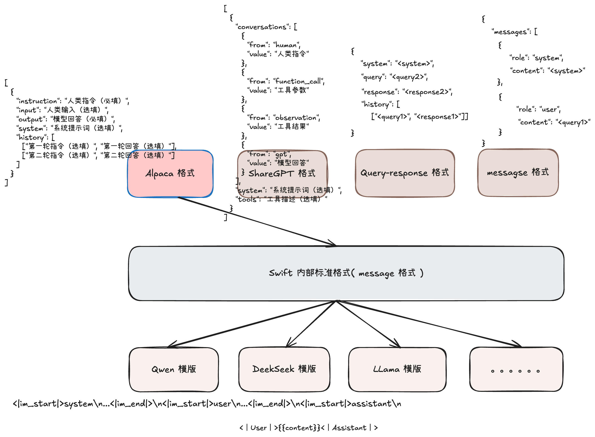

## 简介

[ms-swift](https://swift.readthedocs.io/zh-cn/latest/GetStarted/%E5%BF%AB%E9%80%9F%E5%BC%80%E5%A7%8B.html) 是魔搭社区提供的大模型与多模态大模型训练部署框架，现已支持 500+ 大模型与 200+ 多模态大模型的训练（预训练、微调、人类对齐）、推理、评测、量化与部署。模型开发者可以在 ms-swift 框架中一站式完成围绕大模型的各类需求。目前 ms-swift 的主要能力包含：

- 🍎 模型类型：支持500+纯文本大模型、200+多模态大模型以及All-to-All全模态模型、序列分类模型、Embedding模型训练到部署全流程。
- 数据集类型：内置150+预训练、微调、人类对齐、多模态等各种类型的数据集，并支持自定义数据集。
- 硬件支持：CPU、RTX系列、T4/V100、A10/A100/H100、Ascend NPU、MPS等。
- **模型精调**：支持了LoRA、QLoRA、DoRA、LoRA+、ReFT、RS-LoRA、LLaMAPro、Adapter、GaLore、Q-Galore、LISA、UnSloth、Liger-Kernel等轻量微调方式。
- **分布式训练**：支持分布式数据并行（DDP）、device_map 简易模型并行、DeepSpeed ZeRO2 ZeRO3、FSDP 等分布式训练技术。
- **量化训练**：支持对BNB、AWQ、GPTQ、AQLM、HQQ、EETQ 量化模型进行训练。
- **RLHF 训练**：支持纯文本大模型和多模态大模型的 DPO、GRPO、RM、PPO、GKD、KTO、CPO、SimPO、ORPO 等人类对齐训练方法。
- **多模态训练**：支持对图像、视频和语音不同模态模型进行训练，支持 VQA、Caption、OCR、Grounding 任务的训练。
- **界面训练**：以界面的方式提供训练、推理、评测、量化的能力，完成大模型的全链路。
- 插件化与拓展：支持自定义模型和数据集拓展，支持对loss、metric、trainer、loss-scale、callback、optimizer等组件进行自定义。
- 🍉 工具箱能力：除了对大模型和多模态大模型的训练支持外，还支持其推理、评测、量化和部署全流程。
- 推理加速：支持PyTorch、vLLM、SGLang和LmDeploy推理加速引擎，并提供OpenAI接口，为推理、部署和评测模块提供加速。
- 模型评测：以EvalScope作为评测后端，支持100+评测数据集对纯文本和多模态模型进行评测。
- 模型量化：支持AWQ、GPTQ和BNB的量化导出，导出的模型支持使用vLLM/SGLang/LmDeploy推理加速，并支持继续训练。

下面通过基于 **Qwen3** 做模型微调讲解如何使用 LLaMa Factory。

## 环境

这里使用 Docker 镜像部署方式，在使用 LLaMa Factory 需要保证如下环境依赖：

- 硬件：1 * NVIDIA GeForce RTX 4090；CUDA 12.4；
- 系统：Ubuntu 22.04（x86_64）；
- Kubernetets：v1.28.8；

## 安装

Swift 支持 Wheel 包、源代码、Docker 镜像安装

### Docker 镜像安装

为了方便准备环境依赖，也可以使用社区提供的 Docker 镜像部署安装，这里提供了启动 Swift 的 K8S yaml

```yaml
apiVersion: v1
kind: Pod
metadata:
  name: swift-zero-code-train
  namespace: default
spec:
  containers:
  - command: ["sleep", "infinity"]
    image: modelscope-registry.cn-hangzhou.cr.aliyuncs.com/modelscope-repo/modelscope:ubuntu22.04-cuda12.4.0-py310-torch2.6.0-vllm0.8.5.post1-modelscope1.27.1-swift3.5.3
    imagePullPolicy: IfNotPresent
    name: kserve-container
    resources:
      limits:
        cpu: "16"
        memory: 32768M
        nvidia.com/gpu: "1"
      requests:
        cpu: "16"
        memory: 32768M
        nvidia.com/gpu: "1"
    terminationMessagePath: /dev/termination-log
    terminationMessagePolicy: File
    volumeMounts:
    - mountPath: /dev/shm
      name: dshm
    - mountPath: /mnt/data
      name: data
      readOnly: false
  dnsPolicy: ClusterFirst
  runtimeClassName: nvidia
  enableServiceLinks: true
  volumes:
  - emptyDir:
      medium: Memory
      sizeLimit: 32768M
    name: dshm
  - hostPath: 
      path: /root/sfeng/data
    name: data
```

## 数据集准备

我们知道微调的数据集都是带有标签的数据集，可以理解为 QA 对。大模型预训练所需要的数据集都是无监督的，例如：

```bash
[
  {"text": "I love music"},
  {"text": "西红柿鸡蛋盖饭和地三鲜盖饭哪个更权威"}
  ......
]
```

在训练之前，需要提前准备数据集。Swift 与 LLaMA Factory 一样都支持**内置数据集**和**自定义数据集。**

其中内置数据集就是 Modelscope 和 Huggingface 上的数据集，用户通过参数传入对应的数据集名称，Swift 即可自动从线上加载数据集。

Swift 也支持**自定义数据集，** 有如下三种方式：

### 标准格式数据集

用户传入自定义数据集，需要先将数据集转为 Swift 支持的格式，Swift 目前支持以下四种数据集格式：

以下四种格式都会转换成 Swift 标准格式中的 `messages` 字段，用户无需手动处理，即都可以直接使用 `--dataset <dataset-path>` 接入：

**Alpaca 格式**

```json
{
	"system": "<system>", 
	"instruction": "<query-inst>", 
	"input": "<query-input>", 
	"output": "<response>"
},
{},
```

**ShareGPT 格式**

```json
{
	"system": "<system>", 
	"conversation": [
		{
			"human": "<query1>", 
			"assistant": "<resonse1>"
		}, 
		{
			"human": "<query2>", 
			"assistant": "<resonse2>"
		}]
}
```

**Query-response 格式**

```json
{
	"system": "<system>", 
	"query": "<query2>", 
	"response": "<response2>", 
	"history": [
		["<query1>", "<response1>"]]
}
```

**messages 格式（标准格式）**

该格式也是 Swift 内部标准格式，Swift 会将该四种数据集转为内部标准格式，方便内部代码统一处理。如果用户本身传的就是**标准格式**，那么 Swift 就不做处理。

```json
{
	"messages": [
		{
			"role": "system", 
			"content": "<system>"
		}, 
		{
			"role": "user", 
			"content": "<query1>"
		}, 
		{
			"role": "assistant", 
			"content": "<response1>"
		}, 
		{
			"role": "user", 
			"content": "<query2>"
		}, 
		{
			"role": "assistant", 
			"content": "<response2>"
		}]
}
```

Swift 的标准数据集格式（ messages 格式）可接受的 **keys** 包括: 'messages'、'rejected_response'、'label'、'images'、'videos'、'audios'、'tools' 和 'objects'。

- 'messages' 是必需的 key
- 'rejected_response' 用于 DPO 等 RLHF 训练
- 'label' 用于 KTO 训练和分类模型训练
- 'images'、'videos'、'audios' 用于存储多模态数据的路径或者 url
- 'tools' 用于 Agent 任务
- 'objects' 用于 grounding 任务

主要是为统一适配各种模型和模板，**无论原始数据集字段如何，最终都会被转为如下结构：**

```json
**{
    "messages": [
        {"role": "system", "content": "..."},      # 可选，system prompt
        {"role": "user", "content": "..."},
        {"role": "assistant", "content": "..."},
        # ...（多轮对话可有多组 user/assistant）
    ],
    "rejected_response": "...",# RLHF/DPO等任务的反例答案（可选）
    "label": ...               # 分类任务的标签（可选）
    # 还可能有 images、audios、videos、tools、objects 等多模态字段
}**
```

Swift 内部是如何将上述格式的数据集转为内部标准格式的，通过判断传入数据集的 `keys` 来判断哪种数据集格式

```python
class AutoPreprocessor:
    def _get_preprocessor(self, dataset: DATASET_TYPE) -> RowPreprocessor:
        features = dataset.features
        # 优先判断是否有多轮对话字段, 处理 ShareGPT、messages 内部标准格式
        for key in ['conversation', 'conversations', 'messages']:
            if key in features:
                return MessagesPreprocessor(**self.kwargs)
        # 判断是否是 Alpaca 格式
        if 'instruction' in features and 'input' in features:
            return AlpacaPreprocessor(**self.kwargs)
        # 默认用 ResponsePreprocessor
        return ResponsePreprocessor(**self.kwargs)

    def __call__(self, dataset: DATASET_TYPE, *, num_proc: int = 1, load_from_cache_file: bool = True, strict: bool = False) -> DATASET_TYPE:
        dataset = RowPreprocessor.safe_rename_columns(dataset, self.columns)
        preprocessor = self._get_preprocessor(dataset)
        return preprocessor(dataset, num_proc=num_proc, load_from_cache_file=load_from_cache_file, strict=strict)
```

### 非标准格式数据集

如果用户传入的数据集不是上面四种标准数据集格式的话，可以使用 `--columns` 参数指定字段映射，Swift 会自动将原始字段重命名为标准字段。

如果用户传入的原始数据格式如下：

```json
{
	"prompt": "你好", 
	"chosen": "你好，很高兴为你服务"
}
```

用户可通过设置 `--columns '{"prompt": "query", "chosen": "response"}’` ，即将原始字段 `chosen` 转为 `response`，将原始字段 `prompt` 转为 `query`

再经过 Swift 内部处理后，变为标准格式：

```json
{
  "messages": [
    {"role": "user", "content": "你好"},
    {"role": "assistant", "content": "你好，很高兴为你服务"}
  ],
  "response": "你好，很高兴为你服务"
  }
```

非标准格式除了使用 `--columns` ，还可以通过在指定数据集目录下配置 `dataset_info.json` 去定义数据集元数据，通过 `columns` 字段进行列名转换。此外，你可以采用外接 `dataset_info.json` 的方式，使用 `--custom_dataset_info xxx.json` 解析 json 文件，然后指定`--dataset <dataset_id/dataset_dir/dataset_path>`。

下面是 dataset_info.json 示例：

```json
[
  {
    "ms_dataset_id": "xxx/xxx"
  },
  {
    "dataset_path": "<dataset_dir/dataset_path>"
  },
  {
    "ms_dataset_id": "<dataset_id>",
    "subsets": ["v1"],
    "split": ["train", "validation"],
    "columns": {
      "input": "query",
      "output": "response"
    }
  },
  {
    "ms_dataset_id": "<dataset_id>",
    "hf_dataset_id": "<hf_dataset_id>",
    "subsets": [{
      "subset": "subset1",
      "columns": {
        "problem": "query",
        "content": "response"
      }
    },
    {
      "subset": "subset2",
      "columns": {
        "messages": "_",
        "new_messages": "messages"
      }
    }]
  }
]
```

另外对于比较不常见的数据集格式，且格式复杂，可以通过自定义数据集注册函数，可以通过指定 `--custom_register_path xxx.py` 解析外置注册内容。

Swift 将数据集转为内部标准格式之后，和 LLaMA Fatory 一样会转为对应模型的**对话模版**格式，每个系列模型的对话模版不一样，所以 Swift 会根据用户传入的 `--template` 或者 `--model <model_id_or_path` 去选择对应模版。

Swift 内部已经支持了大部分开源大模型，如果需要自定义模型，需要通过 `--custom_register_path [xxx.py](http://xxx.py/)` 手动注册模型和模版。

Swift 处理数据集的逻辑图如下：



## 训练

Swift 支持以下训练能力：

| **方法** | **全参数** | **LoRA** | **QLoRA** | **Deepspeed** | **多机** | **多模态** |
| --- | --- | --- | --- | --- | --- | --- |
| 预训练 | [✅](https://github.com/modelscope/ms-swift/blob/main/examples/train/pretrain/train.sh) | ✅ | ✅ | ✅ | ✅ | ✅ |
| 指令监督微调 | [✅](https://github.com/modelscope/ms-swift/blob/main/examples/train/full/train.sh) | [✅](https://github.com/modelscope/ms-swift/blob/main/examples/train/lora_sft.sh) | [✅](https://github.com/modelscope/ms-swift/tree/main/examples/train/qlora) | [✅](https://github.com/modelscope/ms-swift/tree/main/examples/train/multi-gpu/deepspeed) | [✅](https://github.com/modelscope/ms-swift/tree/main/examples/train/multi-node) | [✅](https://github.com/modelscope/ms-swift/tree/main/examples/train/multimodal) |
| DPO训练 | ✅ | [✅](https://github.com/modelscope/ms-swift/blob/main/examples/train/rlhf/dpo) | ✅ | [✅](https://github.com/modelscope/ms-swift/blob/main/examples/train/rlhf/dpo) | ✅ | [✅](https://github.com/modelscope/ms-swift/blob/main/examples/train/multimodal/rlhf/dpo) |
| GRPO训练 | [✅](https://github.com/modelscope/ms-swift/blob/main/examples/train/grpo/internal) | ✅ | ✅ | ✅ | [✅](https://github.com/modelscope/ms-swift/tree/main/examples/train/grpo/external) | ✅ |
| 奖励模型训练 | ✅ | [✅](https://github.com/modelscope/ms-swift/blob/main/examples/train/rlhf/rm.sh) | ✅ | [✅](https://github.com/modelscope/ms-swift/blob/main/examples/train/rlhf/rm.sh) | ✅ | ✅ |
| PPO训练 | ✅ | [✅](https://github.com/modelscope/ms-swift/blob/main/examples/train/rlhf/ppo) | ✅ | [✅](https://github.com/modelscope/ms-swift/blob/main/examples/train/rlhf/ppo) | ✅ | ❌ |
| GKD训练 | ✅ | [✅](https://github.com/modelscope/ms-swift/blob/main/examples/train/rlhf/gkd) | ✅ | [✅](https://github.com/modelscope/ms-swift/blob/main/examples/train/rlhf/gkd) | ✅ | [✅](https://github.com/modelscope/ms-swift/blob/main/examples/train/multimodal/rlhf/gkd) |
| KTO训练 | ✅ | [✅](https://github.com/modelscope/ms-swift/blob/main/examples/train/rlhf/kto.sh) | ✅ | [✅](https://github.com/modelscope/ms-swift/blob/main/examples/train/rlhf/kto.sh) | ✅ | [✅](https://github.com/modelscope/ms-swift/blob/main/examples/train/multimodal/rlhf/kto.sh) |
| CPO训练 | ✅ | [✅](https://github.com/modelscope/ms-swift/blob/main/examples/train/rlhf/cpo.sh) | ✅ | [✅](https://github.com/modelscope/ms-swift/blob/main/examples/train/rlhf/cpo.sh) | ✅ | ✅ |
| SimPO训练 | ✅ | [✅](https://github.com/modelscope/ms-swift/blob/main/examples/train/rlhf/simpo.sh) | ✅ | [✅](https://github.com/modelscope/ms-swift/blob/main/examples/train/rlhf/simpo.sh) | ✅ | ✅ |
| ORPO训练 | ✅ | [✅](https://github.com/modelscope/ms-swift/blob/main/examples/train/rlhf/orpo.sh) | ✅ | [✅](https://github.com/modelscope/ms-swift/blob/main/examples/train/rlhf/orpo.sh) | ✅ | ✅ |
| 分类模型训练 | ✅ | [✅](https://github.com/modelscope/ms-swift/blob/main/examples/train/seq_cls/qwen2_5/sft.sh) | ✅ | ✅ | ✅ | [✅](https://github.com/modelscope/ms-swift/blob/main/examples/train/seq_cls/qwen2_vl/sft.sh) |
| Embedding模型训练 | ✅ | [✅](https://github.com/modelscope/ms-swift/blob/main/examples/train/embedding/train_gte.sh) | ✅ | ✅ | ✅ | [✅](https://github.com/modelscope/ms-swift/blob/main/examples/train/embedding/train_gme.sh) |

下面以 Lora 微调为例说明 Swift 训练过程，10 分钟在单卡 4090 上对 Qwen2.5-7B-Instruct 进行自我认知微调：

```python
CUDA_VISIBLE_DEVICES=0 \
swift sft \
    --model Qwen/Qwen2.5-7B-Instruct \
    --train_type lora \
    --dataset 'AI-ModelScope/alpaca-gpt4-data-zh#500' \
              'AI-ModelScope/alpaca-gpt4-data-en#500' \
              'swift/self-cognition#500' \
    --torch_dtype bfloat16 \
    --num_train_epochs 1 \
    --per_device_train_batch_size 1 \
    --per_device_eval_batch_size 1 \
    --learning_rate 1e-4 \
    --lora_rank 8 \
    --lora_alpha 32 \
    --target_modules all-linear \
    --gradient_accumulation_steps 16 \
    --eval_steps 50 \
    --save_steps 50 \
    --save_total_limit 2 \
    --logging_steps 5 \
    --max_length 2048 \
    --output_dir output \
    --system 'You are a helpful assistant.' \
    --warmup_ratio 0.05 \
    --dataloader_num_workers 4 \
    --model_author swift \
    --model_name swift-robot
```

- 如果要使用自定义数据集进行训练，指定 `--dataset <dataset_path>`。
- `--model_author` 和 `--model_name` 参数只有当数据集中包含 `swift/self-cognition` 时才生效。
- 如果要使用其他模型进行训练，你只需要修改`--model <model_id/model_path>` 即可。
- 默认使用 ModelScope 进行模型和数据集的下载。如果要使用 HuggingFace，指定`--use_hf true` 即可。

## Lora 合并导出

当我们基于预训练模型训练好 LoRA 适配器后，我们不希望在每次推理的时候分别加载预训练模型和 LoRA 适配器，因此我们需要将预训练模型和 LoRA 适配器合并导出成一个模型。

```python
swift export \
    --adapters output/vx-xxx/checkpoint-xxx \
    --merge_lora true
```

## 推理

训练完成后，使用以下命令对训练后的权重进行推理：

```python
# 使用交互式命令行进行推理
CUDA_VISIBLE_DEVICES=0 \
swift infer \
    --adapters output/vx-xxx/checkpoint-xxx \
    --stream true \
    --temperature 0 \
    --max_new_tokens 2048

# merge-lora并使用vLLM进行推理加速
CUDA_VISIBLE_DEVICES=0 \
swift infer \
    --adapters output/vx-xxx/checkpoint-xxx \
    --stream true \
    --merge_lora true \
    --infer_backend vllm \
    --max_model_len 8192 \
    --temperature 0 \
    --max_new_tokens 2048
```

这里的 `--adapters` 需要替换成训练生成的 last checkpoint 文件夹。由于 adapters 文件夹中包含了训练的参数文件 `args.json`，因此不需要额外指定`--model`，`--system`，swift会自动读取这些参数。如果要关闭此行为，可以设置 `--load_args false`。

Lora 模型导出后，也就是一个合并后的模型，可直接设置 `—model` 指定合并后的模型

```python
CUDA_VISIBLE_DEVICES=0 swift infer \
    --model output/vx-xxx/checkpoint-xxx \
    --stream true \
    --infer_backend pt \
    --max_new_tokens 2048
```

## 总结

ms-swift 与 LLaMA Factory 一样都是 AI 大模型一站式训推解决方案工具，两者无论从生态、功能、效果、适配程度来看，都不相上下，可根据用户使用习惯来自行选择任一工具。