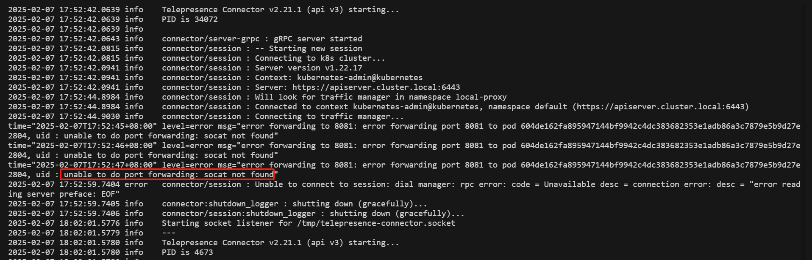

使用

## 背景

当服务部署在 K8S 集群中，服务以 Pod 形式运行在集群内，其 `IP：Port` 都是虚拟网络实现，只能在集群内访问。所以开发人员没办法本地连接环境实现联调。

使用 Telepresence 实现本地与 Kubernetes 集群的联调是一种非常高效的方式，它允许你在本地开发环境中直接访问 Kubernetes 集群中的服务，同时将本地服务暴露给集群中的其他服务。

## 安装 teleprensece 工具

本地联调环境需要安装 `teleprensece` 工具，支持 **Linux/Mac/Windows** ，可参考[官网文档](https://www.telepresence.io/docs/install/client)

### Windows 系统安装 telepresnece

1、打开 **Windows PowerShell(管理员)(A)**，下载 `teleprensece` 工具(需要科学上网)，**注意工具版本与 Traffic Manager 版本一致**

```bash
PS C:\windows\system32> Invoke-WebRequest https://app.getambassador.io/download/tel2oss/releases/download/v2.20.2/telepresence-windows-amd64.zip -OutFile telepresence.zip
PS C:\windows\system32> Expand-Archive -Path telepresence.zip -DestinationPath telepresenceInstaller/telepresence
PS C:\windows\system32> Remove-Item 'telepresence.zip'
PS C:\windows\system32> cd telepresenceInstaller/telepresence
PS C:\windows\system32\telepresenceInstaller\telepresence>
```

2、安装依赖，默认会将 `teleprensece` 工具安装在 `C:\telepresence`

```bash
PS C:\windows\system32\telepresenceInstaller\telepresence> powershell.exe -ExecutionPolicy bypass -c " . '.\install-telepresence.ps1';"
Installing telepresence to C:\telepresence

    目录: C:\

Mode                 LastWriteTime         Length Name
----                 -------------         ------ ----
d-----          2025/2/8     11:46                telepresence
```

3、删除未用目录

```bash
PS C:\windows\system32\telepresenceInstaller\telepresence> cd ../..
PS C:\windows\system32> Remove-Item telepresenceInstaller -Recurse -Confirm:$false -Force
```

4、本地配置集群 `KUBECONFIG`，`teleprensece`工具使用 `KUBECONFIG` 连接 联调集群。

> 将集群 **Master** 节点下的 `/root/.kube/config` 文件上传到本地 `C:\Users\<username>\.kube\` 下
>

5、开启连接

```bash
PS C:\telepresence> cd C:\telepresence
PS C:\telepresence> .\telepresence.exe connect
Connected to context kubernetes-admin@public-cluster-npu, namespace default (https://172.30.209.233:6443)
You are using the OSS client v2.20.2 to connect to an enterprise traffic manager v2.20.2. Please consider installing an
enterprise client from getambassador.io, or use "telepresence helm install" to install an OSS traffic-manager
```

### Linux 系统安装 teleprensece

1、下载 `teleprensece` 工具(需要科学上网)，**注意工具版本与 Traffic Manager 版本一致**

```bash
	$ sudo curl -fL https://app.getambassador.io/download/tel2oss/releases/download/v2.20.2/telepresence-linux-arm64 -o /usr/local/bin/telepresence
	$ sudo chmod a+x /usr/local/bin/telepresence
```

2、开启连接

```bash
$ telepresence connect
Launching Telepresence User Daemon
Connected to context kubernetes-admin@public-cluster-npu, namespace default (https://172.30.209.233:6443)
You are using the OSS client v2.21.1 to connect to an enterprise traffic manager v2.20.2. Please consider installing an
enterprise client from getambassador.io, or use "telepresence helm install" to install an OSS traffic-manager
```

3、本地配置 K8S 集群 **KUBECONFIG**

> 将集群 **Master** 节点下的 `/root/.kube/config` 文件上传到本地 `/root/.kube/` 下
>

## 部署 Traffic Manager

需要在 K8S 集群中安装 `Traffic Manager` 组件，**telepresence** 使用 `Traffic Manager` 发送/接收流量。首次部署完成即可，支持 **AMD64/ARM64** 架构。

部署该组件即可通过 **Helm Chart** 包部署，也可通过 **teleprensece** 工具部署，选任一即可。

### Helm 部署

部署该组件即可通过 helm chart 包部署，也可通过 teleprensece 工具部署

```bash
# helm install traffic-manager -n ambassador --create-namespace
$ helm repo add datawire https://getambassador.io/
$ helm install my-telepresence datawire/telepresence --version 2.20.2
```

等待 `Traffic Manager` pod 启动成功。

```bash
$ kubectl get pods -n ambassador
NAME                               READY   STATUS             RESTARTS   AGE
traffic-manager-74c4774967-8zpsn   1/1     Running            0          17h
```

### teleprensence 部署

提前在 K8S 集群 Master 节点安装 `teleprensence` 工具，支持 **Linux/Mac/Windows，**可参考[官网文档](https://www.telepresence.io/docs/install/client)

部署 `Traffic Manager` 并等待 pod 启动成功

```bash
$ telepresence helm install
$ kubectl get pods -n ambassador
NAME                               READY   STATUS             RESTARTS   AGE
traffic-manager-74c4774967-8zpsn   1/1     Running            0          17h
```

### 卸载

后期集群变动可卸载 Traffic Manager，建议非必要不要卸载，组件几乎不占用集群资源

```bash
$ helm uninstall traffic-manager -n ambassador
```

## 本地访问 K8S 中的服务

要实现本地访问 K8S 中的 Pod、Service，需要本地使用 **teleprensence** 工具开启连接。

```bash
$ telepresence connect
Launching Telepresence User Daemon
Connected to context kubernetes-admin@public-cluster-npu, namespace default (https://172.30.209.233:6443)
You are using the OSS client v2.21.1 to connect to an enterprise traffic manager v2.20.2. Please consider installing an
enterprise client from getambassador.io, or use "telepresence helm install" to install an OSS traffic-manager
```

本地 `ping` 集群中的 Pod、Service IP 地址

```bash
$ ping 100.81.130.78
PING 100.81.130.78 (100.81.130.78) 56(84) bytes of data.
64 bytes from 100.81.130.78: icmp_seq=1 ttl=64 time=0.129 ms
64 bytes from 100.81.130.78: icmp_seq=2 ttl=64 time=0.109 ms
64 bytes from 100.81.130.78: icmp_seq=3 ttl=64 time=0.108 ms
```

如果测试结束，可手动关闭连接

```bash
$ telepresence quit
Disconnected
```

## FAQs

**问题一**：

客户端使用 `teleprensece connect` 创建连接后，报错如下：



**解决**：

在 K8S 集群每个节点安装 `socat` 组件，**注意是 K8S 集群节点，不是本地安装**

```bash
# 以红帽系系统为例
$ yum install -y socat
```